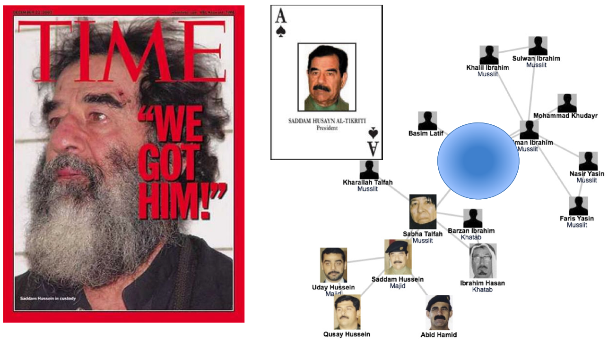

% Análisis de Redes Sociales
% Guillermo Jiménez Díaz (gjimenez@ucm.es); Alberto Díaz (albertodiaz@fdi.ucm.es)
% 1 de octubre de 2014

# Prefacio {-}

Estos son los apuntes de la asignatura Análisis de Redes Sociales, impartida en la Facultad de Informática de la Universidad Complutense de Madrid por los profesores Guillermo Jiménez Díaz y Alberto Díaz, del Departamento de Ingeniería del Software e Inteligencia Artificial.

Este material ha sido desarrollado a partir de distintas fuertes, destacando como referencia principal el libro _Network Science_ de Laszlo Barabasi, el libro _Social and Economic Networks_ de Mathew O. Jackson y el material de la asignatura _Social Network Analysis_ impartido por Lada Adamic a través de Coursera.

# Tema 0: Presentación de la asignatura {-}

## Motivación

### Las redes y la captura de Sadam Husseim

La captura de Saddam Hussein ilustra algunos de los aspectos claves de las redes que estudiaremos en esta asignatura:

* Muestra el poder predictivo de las redes, que permite extraer información clave incluso a los no expertos (los soldados en este caso)
* Resalta la necesidad de diseñar mapas precisos de las redes a estudiar (en muchos casos, el proceso de diseño es muy complicado y costoso)
* Ejemplifica el hecho de que la elección de la red a emplear marca la diferencia (los militares americanos tardaron meses en darse cuenta que la red jerárquica que representaba la organización oficial iraquí era inútil para encontrar a Saddam)
* Destaca la estabilidad de estas redes (la captura de Hussein no se basó en las técnicas clásicas de Inteligencia sino en sus conexiones sociales antes de la invasión, extraídas de viejas fotos de su álbum familiar)

* Predicción de la epidemia de la gripe aviar (H1N1) en 2009
* El apagón de la costa noroeste de EEUU el 14/08/2003

DESARROLAR MAS LOS EJEMPLOS? si, con las fotos

¿Para qué sirve el Análisis de Redes sociales?

* Para entender la estructura y el comportamiento de un sistema complejo.
* Para la extracción de información y predicción.
* Para la detección de vulnerabilidades y posibles fallos en cascada debido a las interconexiones entre nodos (por ejemplo, en una red eléctrica por sobrecarga de una central o en internet, debido a un ataque por denegación de servicio en un router)
* Para hacer mapas de una red
* Para entender cómo la estructura de la red afecta a la robustez de la misma.
* Para conocer los procesos dinámicos que aparecen en ella.

## Sistemas complejos {-}

Generalmente un sistema complejo puede representarse mediante una red que codifica las interacciones entre los componentes del sistema.

Detrás de cada sistema complejo estudiado siempre hay un diagrama de conexiones, una red, que define las interacciones entre sus componentes.
No seremos capaces de entender los sistemas complejos a menos que podamos mapear y comprender las redes que los soportan.
A pesar de las diferencias aparentes en componentes e interacciones, las redes que regulan los distintos sistemas complejos existentes en nuestro mundo son similares, siguen unas leyes comunes y presentan mecanismos reproducibles.

Ejemplos de sistemas complejos representables como redes {-}

* El cerebro humano es una red de neuronas
* La sociedad es una red de conexiones familiares, profesionales y de amistad entre individuos.
* Un sistema de comunicación es un conjunto de dispositivos de comunicación que interaccionan a través de Internet o de enlaces wireless.
* La red eléctrica se compone de generadores y líneas de transmisión entre ellos.
* El comercio y la economía se puede representar como una red de intercambio de bienes y servicios entre personas, empresas y países.
* Internet es una red de páginas enlazadas entre sí.

## La emergencia de las redes y los sistemas complejos

Disponibilidad de Datos:

* Red de Actores de Cine, 1998
* La World Wide Web, 1999
* Red Neuronal del gusano C.Elegans, 1990
* Redes de Citas de Artículos Científicos, 1998
* Genoma Humano, 2001
* Red de Interacciones entre Proteínas, 2001

Universalidad: La arquitectura de las distintas redes que están apareciendo en varios dominios de la ciencia, naturaleza y tecnología es más similar de lo que
podría esperarse en principio.

Necesidad (urgente) de entender la complejidad: Cada vez está más aceptado el hecho de que, a pesar de su dificultad, no podemos permitirnos no entender el
comportamiento de los sistemas complejos. Varios de los avances más significativos para entender la complejidad obtenidos en la última década provienen de la Teoría de Redes.

## Características de la ciencia de las redes y los sistemas complejos

* Interdisciplinaria
* Empírica, basada en datos
* Cuantitativa y Matemática
* Computacional

### El Análisis de Redes Sociales y la Teoría de Grafos

Como veremos más adelante, el Análisis de Redes Sociales (ARS) hace uso de la teoría de grafos matemática, aunque tiene ciertas diferencias:

* El ARS es más empírico que la teoría de grafos.
* El ARS se centra en los datos y en la utilidad de los mismos.
* Usa, al igual que la teoría de grafos, conceptos y modelos matemáticos para describir las propiedades de la red.
* Trabaja con grandes cantidades de información por lo que genera grafos enormes.
 
### Aplicaciones del Análisis de Redes Sociales

* Predicción de epidemias
* Lucha contra el terrorismo
* Economía: recomendaciones y anuncios. Detección de influenciadores, personas con una importante conexión con otras personas, como foco para la propagación de campañas.
* Salud: Medicina y genómica, investigación sobre el cerebro humano y redes neuronales.
* Gestión: estructura de organizaciones, identificación de líderes de opinión, grupos óptimos...

## Objetivo general del curso {-}

En esta asignatura se pretenden enseñar las principales características de las redes, los métodos que se utilizan para identificarlas a partir de datos reales, la detección de grupos y comunidades, así como de individuos influyentes, y los modelos relacionados con el flujo de información a través de una red social.

## Contenidos del curso

1. Introducción.
2. Propiedades básicas de las redes
3. Estudio de la estructura de las redes sociales.
    1. Modelos de redes 
    2. Centralidad
    3. Detección y estructura de comunidades
4. Dinámica en las redes sociales.
    1. Procesos de contagio, difusión y formación de opiniones.

Las clases teóricas se impartirán en el aula 12 los viernes y las clases prácticas en el laboratorio 11 los miércoles. En algunas sesiones prácticas se impartirán seminarios para facilitar la realización de las prácticas.

Las prácticas se realizarán en grupos de 3 o 4 alumnos.

## Evaluación de la asignatura

La evaluación final del curso se compone de dos partes:

### Prácticas (70%)

Las prácticas son **obligatorias** y es necesario que estén **aprobadas** para que sean tenidas en cuenta en la nota final:

* Entregadas en plazo
* Satisfaciendo los requisitos del enunciado
* Obteniendo una nota entre 5 y 10

Serán probalemente 3 o 4 prácticas que se irán ajustando a los conceptos teóricos que se vayan contando en clase.

Las prácticas no entregadas o suspensas se tendrán que volver a entregar en septiembre.

### Proyecto (30%)

El proyeco final consistirá en el análisis de un conjunto de datos real elegido por el alumno. Se realizará con los mismos grupos que las prácticas y será presentado en defensa pública.

El proyecto es obligatorio y debe cumplir los mismos requisitos que las prácticas para poder aprobar la asignatura: entregado en plazo, cumpliendo requisitos enunciado y obteniendo una nota mayor o igual que 5.

<!-- En diciembre se comenzará con un **proyecto final** que consistirá en el diseño de un sistema interactivo de acuerdo a las metodologías y técnicas explicadas en clase. El tema final del proyecto deberá ser aprobado previamente por el profesor. El trabajo será presentado en defensa pública a finales de enero. En caso de superar la defensa los miembros del grupo quedarán exentos de realizar el examen final. Al igual que con las prácticas, es necesario **aprobar** el proyecto para que su nota sea tenida en cuenta en la nota final.

En caso de no presentar el proyecto o no superar la defensa habrá un **examen final** sobre los contenidos teórico-prácticos de la asignatura. Este examen podrá realizarse tanto en la convocatoria de febrero como septiembre. Será necesario **aprobar** el examen para que su nota sea tenida en cuenta en la nota final. -->

## Bibliografía

### Principal 

* [Network Science](http://barabasilab.neu.edu/networksciencebook/). Laszlo Barabasi.
* [Networks, Crowds and Markets](http://www.cs.cornell.edu/home/kleinber/networks-book/). David Easley and Jon Kleinberg, Cambridge University Press. 2010.
* Social and Economic Networks. Matthew O. Jackson. Princeton University Press. 2008.

### Complementaria

* The Structure and Dynamics of Networks. Mark Newman, Albert-László Barabási, and Duncan J. Watts. 2006.
* [Linked: The New Science of Networks](http://barabasilab.com/LinkedBook/index.html). Albert-Laszlo Barabasi, Jennifer Frangos.

