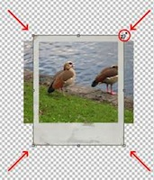
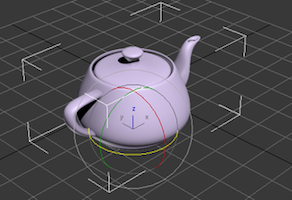
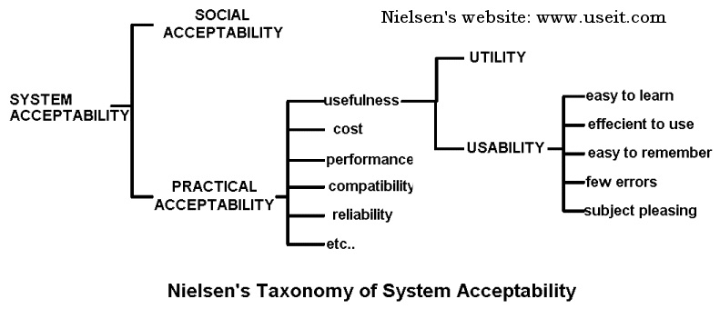

% Análisis de Redes Sociales
% Guillermo Jiménez Díaz (gjimenez@ucm.es); Alberto Díaz (albertodiaz@fdi.ucm.es)
% 1 de octubre de 2014

# Prefacio {-}

Estos son los apuntes de la asignatura Análisis de Redes Sociales, impartida en la Facultad de Informática de la Universidad Complutense de Madrid por los profesores Guillermo Jiménez Díaz y Alberto Díaz, del Departamento de Ingeniería del Software e Inteligencia Artificial.

Este material ha sido desarrollado a partir de distintas fuertes, destacando como referencia principal el libro _Network Science_ de Laszlo Barabasi y el material de la asignatura _Social Network Analysis_ impartido por Lada Adamic a través de Coursera.

\setcounter{section}{1}

# Tema 1: Teoría de Grafos {-}

En este tema haremos un repaso de los principales conceptos de teoría de grafos necesarios para introducirnos en el análisis de las redes sociales. 

## Introducción

TODO: Puentes de Könnigsberg

Euler construyó un grafo para representar y resolver el problema. Esta se puede considerar como la primera representación conocida de un grafo como medio para resolver un problema. De este hecho se pueden sacar dos conclusiones:

* Algunos problemas son más simples de resolver si se representan mediante un grafo.
* Los grafos presentan ciertas propiedades que limitan su comportamiento.

## Redes o grafos

Las redes o grafos se componen de:

* Un conjunto de nodos o vértices.
* Un conjunto de aristas o enlaces que los unen.

Los enlaces pueden ser de dos tipos:

* *Dirigidos*: Tienen una dirección. Si todos los enlaces de un grafo son dirigidos entonces este grafo se conoce como _grafo dirigido o digrafo_. Por ejemplo, un enlace de una página web se representaría como un grafo dirigido.
* *No dirigidos*: Representan relaciones bidireccionales. Si todos los enlaces de un grafo son no dirigidos entonces se le llama _grafo no dirigido_. Pro ejemplo, la relación de estar casados entre dos personas es un enlace no dirigido.

Un sistema se puede representar de diferentes formas dependiendo del conjunto de nodos usados y, sobre todo, de los enlaces que se definan. Un mismo conjunto de nodos puede definir distintos conjuntos de redes.

## Propiedades básicas de los grafos

El número de nodos o vértices de un grafo ($N$) representa el tamaño de la red mientras que el número de aristas o enlaces ($L$) representa en número de interacciones entre los nodos.

El número máximo o total de enlaces ($L_{max}$) es el número de enlaces supuesto que todos los nodos están conectados con todos y se calcula como:

$$L_{max} = \binom{N}{2} = \frac{N(N-1)}{2}$$

En la mayoría de las redes reales se cumple que $L \ll L_{max}$ por lo que se suele decir que estas redes son *dispersas* (_sparse_).

Otra propiedad básica pero bastante importante de los grafos (y que usaremos a menudo a lo largo de la asignatura) es el grado de un nodo $i$ ($k_i$), que es el número de enlaces que tiene $i$ con otros nodos.

En un _grafo no dirigido_, si conocemos el grado de cada uno de sus nodos entonces podemos calcular el número de aristas ($L$) de la siguiente forma:

$$L = \frac{1}{2} \sum_{i=1}^{N}k_i$$

El grado medio ($\langle k \rangle$)de un grafo no dirigido se calcula como:

$$ \langle k \rangle = \frac{1}{n} \sum_{i=1}^{N} k_i = \frac{2L}{N}$$

En un _grafo dirigido_ distinguimos entre grado de entrada ($k_i^{in}$) y grado de salida ($k_i^{out}$). El primero representa el número de enlaces que llegan al nodo mientras que el segundo representa el número de enlaces que salen del nodo. El grado total es la suma de ambos grados ($k_i = k_i^{in}$ + $k_i^{out}$). En este caso, el número de aristas del grafo se puede calcular como:

$$L = \sum_{i=1}^{N}k_i^{in} = \sum_{i=1}^{N}k_i^{out}$$

Y el grado medio ($\langle k \rangle$) será el siguiente:

$$ \langle k^{in} \rangle = \frac{1}{N} \sum_{i=1}^{N}k_i^{in} = \langle k^{out} \rangle = \frac{1}{N} \sum_{i=1}^{N}k_i^{out} = \frac{L}{N}$$

Como se puede ver en la imagen, la interacción persona-ordenador tiene múltiples intereses y actividades:

* Por un lado (parte superior de la figura), se centra en el estudio del usuario, de su contexto, de las tareas que realiza y de las necesidades que tiene. 
* Por otro lado estudia la manera en la que se puede producir la interacción entre el usuario y la máquina. Define y estudia modelos y teorías relacionadas con la interacción. Por un lado se centra en conocer cuál es el proceso mental de los usuarios (Bloque _Human_ en la figura), cómo procesa la información y cuáles son su objetivos para poder proporcionarle experiencias de uso positivas. Así mismo, el HCI se centra (Bloque _Computer_ en la figura ) en las técnicas ya probadas y que se conoce que han sido efectivas que sirven para implementar interfaces y que nos conducen a _buenos diseños_.
* Por último, el HCI estudia metodologías y procesos de desarrollo software (parte inferior de la figura) centrados en conocer al usuario, el desarrollo de prototipos y una constante evaluación empírica por parte del usuario del sistema. Por este motivo, el HCI también se centra en técnicas que sirvan para evaluar y comparar interfaces desde el punto de vista de su uso con usuarios. 

## Historia sobre la Interacción Persona-Ordenador

Desgraciadamente, el interés por la interacción Persona-Ordenador nace a consecuencia de los errores que se producían al interactuar con ciertos dispositivos. Más concretamente, este interés crece durante la Segunda Guerra Mundial en el contexto del diseño de aparatos militares que han de ser operados por humanos (principalmente pantallas y controles de aviones y otra maquinaria bélica).

Tras la Segunda Guerra mundial, estas son las figuras e hitos más destacados en el dominio de la interacción Persona-Ordenador.

### Vannevar Bush

Aunque también es conocido por ser el jefe de la comunidad de científicos responsables de la bomba atómica, la aportación más interesante de Vannevar Bush es su artículo ["As we may think" (1945)](http://biblioweb.sindominio.net/pensamiento/vbush-es.html), en el que Bush insta a los científicos que tanto trabajaron en ayudar a sus respectivas facciones durante la guerra, a investigar y desarrollar nuevos dispositivos que puedan ayudar al resto de las personas en los futuros tiempos de paz. En este artículo  aparecen ideas tan novedosas para la época como las calculadoras personales, minicámaras y "cámaras digitales" que llevaríamos siempre encima (¿no llevamos todos un móvil con cámara actualmente?), la interfaz por voz (dictar el contenido de un documento a una máquina), los sistemas de información y bases de datos, el hipertexto, la interfaz cerebro-computador, etc... Un ejemplo de estas profecías: 

> ... el personal administrativo de una empresa puede colocar en el interior de una máquina de selección varios miles de tarjetas perforadas que contienen los datos de los empleados, establecer un código según una convención acordada y, tras un breve periodo de tiempo, recibir una lista de todos los empleados que, por ejemplo, viven en Trenton y hablan español.

Otra de las príncipales aportaciones de Bush en ese artículo es el [escritorio Memex](http://es.wikipedia.org/wiki/Memex). Aunque nunca fue construído Memex es la idea de un escritorio en el que el usuario almacena todos sus libros y documentos, en forma de microfilm, y que posee una interfaz (palancas y botones) con la que el usuario puede recuperar fácilmente los documentos almacenados. Hay unas pantallas en las que el usuario puede ver el material recuperado y una superficie transparente sobre la que el usuario puede colocar nuevos documentos para ser fotografiados y almacenados en el escritorio. Así mismo puede anotar a mano los documentos que lee. El acceso a los documentos almacenados podría ser mediante índices o por mnemotécnicos (asociativo). Por último, Memex permitiría enlazar dos elementos distintos, dos documentos: el hipertexto.

### ENIAC

Fue construído por Eckert y Mauchly en el año 1946. Ocupaba 167m^2^ se usaba principalmente para el cálculo de trayectorias balísticas.

La interfaz de usuario del ENIAC consistía en operar manualmente con unos 6000 interruptores (lo que hacía una modificación pudiese tardar semanas en realizarse).  

### Compiladores

Grace Murray Hopper desarrolló en 1952  el primer compilador: el **A0**.  Desde el punto de vista de interacción con el computador, la aparición de los lenguajes de alto nivel y de los compiladores suponen una revolución ya que hacen de _interfaz_ sobre los recursos de los que el computador dispone. Como programadores, podemos dar órdenes de alto nivel al computador sin necesitar conocer los detalles específicos de la máquina en la que se va a ejecutar.

> Nota anecdótica: Trabajó durante varios años en el Mark II y algunos le atribuyen la invención del término _bug_ para hablar de un error de programación. 

### Ivan Sutherland

En sus inicios, el trabajo con los ordenadores consistía en el **procesamiento por lotes**.

Durante su doctorado (¡[en Filosofía](http://www.cl.cam.ac.uk/techreports/UCAM-CL-TR-574.pdf)!) en el MIT (1963) desarrolló [Sketchpad](http://youtu.be/USyoT_Ha_bA?t=3m52s), la primera interfaz gráfica de usuario (_graphical user interface_ o _GUI_). La gran novedad es que la comunicación con el computador se realiza mediante manipulación directa: hay una pantalla en la que se muestra lo que dibujamos y hay un "lápiz óptico" con el que realizamos dibujos sobre la pantalla. La entrada o _input_ se realiza directamente sobre la salida o _output_, lo que hace que la interacción sea realmente interactiva. Desdibuja la frontera entre _entrada_ y _salida_ por primera vez.

### Douglas Engelbart 

Es el inventor del ratón (falleció el 2 de julio de 2013). La [presentación pública](http://youtu.be/61oMy7Tr-bM?t=8m18s) del mismo fue en el año 1968. Es el primer dispositivo "apuntador" (_device pointer_). Se componía de dos ruedas con potenciómetros que indicaban cuánto nos habíamos movido con respecto a la última posición registrada. 

En esta conferencia no solo presenta el ratón sino un complejo sistema de información hipertextual multimedia llamado [NLS](http://en.wikipedia.org/wiki/NLS_%28computer_system%29) (oN-Line System):

- Primer dispositivo apuntador externo.
- Hypertexto / hypermedia
- Procesadores de texto
- Videoconferencia y compartición de pantalla.
- Enlazado dinámico de archivos
- Control de versiones (!)
- Editor colaborativo en tiempo real (!!!)

### Alan Kay

Alan Kay comenzó trabajando con Ivan Sutherland en el MIT. Tal vez inspirado por la charla de Engelbart a la que asistió, Alan Kay comienza a trabajar en Dynabook, el primer prototipo de computador personal (1968), muy similar a las tabletas que usamos en la actualidad. Era un prototipo que pretendía ser un ordenador para niños. El software  asociado a este computador era SmallTalk.

Más adelante comienza a trabajar en el PARC (Palo Alto Research Center) de Xerox y, tras diez años de trabajo en 1973, sacan a la luz el primer GUI tal y como los conocemos ahora: [Xerox Star Office Information System](http://www.youtube.com/watch?v=Cn4vC80Pv6Q). Este sistema operativo tiene un entorno de ventanas muy similar a los que estamos acostumbrados a ver en la actualidad e introdujo los principales elementos de los interfaces WIMP:

* **W**indows

    Cada aplicación o documento aparece y se ejecuta de manera independiente en una ventana.

* **I**cons

    Los iconos son representaciones de acciones y recursos del computador.

* **M**enus

    Son una manera alternativa al teclado de indicar las acciones que queremos ejecutar en el computador.

* **P**ointer

    El puntero es una representación en pantalla del dispositivo que el usuario utiliza para seleccionar documentos y realizar acciones.

> [Nota anecdótica](http://youtu.be/KhjVidOFqBo): En el año 1979 un tal Steve Jobs fue invitado a visitar las instalaciones del PARC de Xerox y quedó impresionado con la GUI que allí vio ("en diez minutos supe que todos los computadores funcionarían de ese modo"). Asistió con su equipo de desarrollo a varias demos y unos años más tarde copió y mejoró esta interfaz, creando Lisa (aunque el éxito les llegó un poco después con el Apple II, el primer Macintosh).

> Nota anecdótica: Años después, Apple acusaría a Microsoft de copiar su sistema de ventanas, Microsoft hablaría de su vecino rico Xerox...

### Don Norman

Estuvo trabajando en Apple como Vicepresidente del Grupo de Tecnologías Avanzadas, es cofundador del [Nielsen Norman Group](http://www.nngroup.com/) y actualmente es profesor emérito en la Universidad de California. 

 Es el autor de uno de los libros más influyentes en el campo del diseño y la usabilidad: [The Design of Everyday Things](http://zv4fy5pr5l.search.serialssolutions.com/?ctx_ver=Z39.88-2004&ctx_enc=info%3Aofi%2Fenc%3AUTF-8&rfr_id=info:sid/summon.serialssolutions.com&rft_val_fmt=info:ofi/fmt:kev:mtx:book&rft.genre=book&rft.title=The+Design+of+Everyday+Things&rft.au=Norman%2C+Don&rft.date=2002-09-19&rft.pub=Basic+Books&rft.isbn=0465067107&rft.externalDBID=n%2Fa&rft.externalDocID=904427&paramdict=es-es). En él se acuña términos como la **experiencia de usuario** (del que hablaremos más adelante) o **diseño centrado en el usuario**, en el que habla sobre una forma de diseñar centrada en las necesidades del usuario, dejando de lado otros elementos secundarios. Algunas de las pautas que da (y de las que hablaremos más adelante) son:

 * Simplificar la estructura de las tareas.
 * Hacer las cosas visibles.
 * Hacer "mapeos" comprensibles
 * Utilizar el poder de las restricciones
 * Diseñar aprendiendo de los errores
 * ...

### Ben Shneiderman

En 1982 acuña el concepto de interfaces de [_manipulación directa_](http://en.wikipedia.org/wiki/Direct_manipulation_interface): Aquellas interfaces que representan constantemente los objetos que son manipulados por el usuario y en los que dichas manipulaciones suelen corresponderse con acciones que se realizarían en el mundo físico real. Shneiderman postula que este tipo de manipulación hace aprender a usar el sistema sea mucho más fácil para el usuario. 

La manipulación directa se basa en los siguientes principios:

* Existe una representación visual contínua y permanente de los objetos de datos del sistema.
* El usuario interactúa con la representación visual usando acciones físicas (click, arrastrar, mover, usar anclas para redimensionar...) o pulsando botones asociados a acciones (pulsar un botón para poner texto en negrita).
* El efecto de las acciones es rápido, incremental, reversible y se muestra en todo momento el estado de los objetos y un continuo feedback de lo que ocurre. Esto permite que el usuario cometa menos errores y que pueda realizar las tareas más rápidamente ya que el usuario ve el estado en el que va a quedar el sistema antes de completar la acción que está realizando.

Ejemplos de este tipo de interacción:

* En un editor gráfico, a medida que arrastramos la esquina de una figura ésta se va estirando para cambiar de tamaño.
* En un sistema operativo de ventanas, generalmente vemos en todo momento el estado de una ventana a medida que la vamos arrastrando por el escritorio.
* En una aplicación de modelado 3D, las rotaciones se realizan generalmente arrastrando circunferencias que se dibujan de manera ortogonal al eje sobre el que queremos girar. 

> Nota anecdótica: Ben Shneiderman también se ha destacado en el campo de la visualización de la información, entre otras cosas por la visualización basada en _tree-maps_.

### Jakob Nielsen

Una de las personas más respetadas en el ámbito de la usabilidad y cofundador, junto con Don Norman, del [Nielsen Norman Group](http://www.nngroup.com/). Ha trabajado para Sun e IBM, entre otras. Es uno de los mayores expertos en usabilidad, sobre todo en páginas web, y ha definido lo que se conoce como evaluación heurística de interfaces, una de las técnicas que estudiaremos y que nos ayudan a evaluar la usabilidad de los sistemas interactivos.

### Alan Cooper

Aunque es arquitecto, [Alan Cooper](http://en.wikipedia.org/wiki/Alan_Cooper) ha sido conocido como un gran diseñador de software y programador. Es el padre del Visual Basic y, en el campo que nos interesa, fue muy crítico con el diseño de software. Echaba en falta que durante el diseño no nos preguntáramos _cómo va a interactuar el usuario con el software_.

Tras trabajar en Microsoft fundó su propia consultoría de software donde comenzó con el diseño de software más dirigido al usuario y donde comenzó a establecer metodologías de diseño como el **diseño dirigido por objetivos** y el uso de **personas** como herramientas de diseño. Fue también de los primeros en acuñar el concepto **diseño de interacciones** (_interaction design_).

### Era Post-WIMP

Con la llegada de las PDAs y los smartphones aparecieron ciertas restricciones (restricciones de espacio, dispositivos de entrada...) que obligaron a hacer evolucionar a las técnicas de interacción. Por ejemplo, las pantallas táctiles son interfaces de _manipulación directa_ pero no pueden seguir el modelo descrito anteriomente ya que no hay ventanas, ni punteros...

Un ejemplo de nueva técnica de interacción que fue revolucionaria en su momento fue la rueda del iPod. La rueda disponía de vaios botones para realizar diversas acciones sobre los archivos y, además, nos permitía navegar por las listas de archivos haciéndola girar.

Posteriormente podemos hablar de todas las técnicas de interacción que nacieron con las pantallas táctiles, en las que el usuario es capaz de manipular los objetos tocando la pantalla y realizando gestos con uno o varios dedos (como las rotaciones o acercar/alejar los dedos o _pinching_).

Aunque se hablará de algunas de estas técnicas de interacción en el último capítulo podemos destacar, entre otras, las siguientes:

* Sistemas de realidad virtual
* Interfaces gestuales (Ej. Kinect)
* Interfaces por voz (Ej. Siri)
* Interfaces cerebro-computador...
* 10-foot interfaces (interfaces de usuario para utilizar en pantallas de televisión)

## Usabilidad

[Según el estándar ISO 9241 (parte 11: Orientaciones sobre Usabilidad)](http://www.userfocus.co.uk/resources/iso9241/part11.html), este término se puede definir como:

> la cualidad por la que un producto puede ser usado por un _usuario específico_ para conseguir unos _objetivos específicos_
con eficiencia, efectividad y satisfacción en un _contexto de uso específico_.

Como se puede ver, no es un término que pueda ser usado de manera general para un producto sino que ha de ser entendido dentro de una serie de condiciones: tipo de usuario, objetivos del usuario y contexto del usuario.

Los tres atributos que miden la usabilidad de acuerdo al estándar ISO 9241 son:

* **Efectividad**: Es la precisión y el grado de completitud con la que el usuario es capaz de satisfacer sus objetivos.
* **Eficiencia**: Los recursos y el tiempo empleados en relación con el grado de precisión y completitud con el que se han satisfecho los objetivos.
* **Satisfacción**: Actitud positiva hacia el uso del producto, ausencia de frustración o incomodidad al usarlo.

La usabilidad no existe de manera aislada ni implica la aceptación general de un sistema. Hay otros muchos atributos importantes dentro de un sistema y que, en ciertos momentos, pueden ser más importantes que la usabilidad (por ejemplo, un astronauta valora que su sistema de navegación sea fiable más que que sea usable). Jakob Nielsen contextualiza la usabilidad y la engloba dentro de un marco mayor que mide la aceptación de un sistema:

Nielsen define hasta [5 atributos para la usabilidad](http://www.nngroup.com/articles/usability-101-introduction-to-usability/):

* Facilidad de aprendizaje (_learnability_): Cómo de fácil es para un usuario novato realizar una tarea en el sistema.
* Eficiencia (_Efficiency_): Cómo de rápido puede realizar una tarea un usuario experto.
* Memorabilidad (_Memorability_): Cómo de fácil es recordar cómo se usa un sistema tras haber pasado un tiempo sin usarlo.
* Errores (_Errors_): Cuántos errores comete el usuario, cómo de graves son y cómo de fácil es recuperarse de ellos.
* Satisfacción (_Satisfaction_): Cómo de agradable es usar el sistema desde el punto de vista del usuario.

Aunque Nielsen lo deja fuera, varios autores incluyen la efectividad _effectiveness_ como otro de los atributos básicos de usabilidad. Este atributo se define de manera similar al estándar ISO: cómo de bueno es sistema haciendo lo que se supone para lo que está diseñado.

En posteriores temas desarrollaremos más estos atributos, los transformaremos en heurísticas  y definiremos metodologías de evaluación de la usabilidad de un sistema.

La usabilidad está relacionada con los _buenos diseños_ por lo que, tal y como hablamos en el tema anterior, no tener en cuenta los conceptos de usabilidad a la hora de diseñar un sistema tiene consecuencias: tiempo, dinero (sobre todo el de la empresa que vende el sistema) e, incluso, vidas.

La usabilidad afecta a cómo un usuario percibe un sistema: un sistema _usable_ "vende"; un sistema _no usable_ hace que el usario lo deseche. Pero hay que tener en cuenta que es un criterio subjetivo y que depende del tipo de usuario al que va dirigido. Distintos usuarios valorarán más unos atributos que otros:

* Los usuarios novatos valoran la facilidad de aprendizaje.
* Los usuarios esporádicos valoran la memorabilidad.
* Los usuarios expertos valoran la eficiencia.

## Experiencia de usuario

User Experience (UX) es el conjunto de todas las interacciones que un usuario tiene con un producto. Pretende ir un paso más allá de la usabilidad: no solo se centra en los aspectos objetivos del sistema (su funcionalidad) sino también con todos los demás aspectos relacionados con los sentimientos que genera la interacción con el sistema. El término fue acuñado por Don Norman cuando era el Vicepresidente del Grupo de Tecnologías Avanzadas de Apple ya que consideraba que el término _usabilidad_ no cubría ciertos aspectos relacionados con las emociones que el usuario podía experimentar al interactuar con un producto.

El diseño centrado en la experiencia del usuario va más allá de la usabilidad y tiene en cuenta otros elementos:

* El lenguaje de los contenidos
* El diseño gráfico (colores, símbolos, iconos, texturas...)
* El sonido
* El movimiento (animaciones, ritmo, cambios...)
* El diseño de la información (tipografía, estructura de la información, relación y comprensión por parte del usuario)
* El diseño de la interfaz (elementos gráficos para la manipulación de los datos)
* El diseño de las interacciones (comportamiento y comprensión por parte del usuario)

)](../images/tema01/uxelements.jpg)

La experiencia de usuario habla de hacer que el usuario se sienta agusto con el sistema, que le divierta y que la experiencia de interactuar con él sea excitante. El _fluir_ (o [flow](http://en.wikipedia.org/wiki/Flow_%28psychology%29)) es un concepto de psicología que se está volviendo popular dentro del HCI. Es un estado mental muy intenso en el que el usuario se encuentra completamente concentrado en la tarea en la que está realizando y disfrutando. Algunos diseños pretenden inducir al usuario en esta experiencia de fluir.

En ocasiones, la experiencia de usuario no va de la mano de la usabilidad sino que son opuestas e incluso pueden ser incompatibles. 
Por ejemplo, la mayoría jugadores _hardcore_ de videojuegos disfrutan más con la experiencia de un mando de PlayStation o XBox (que no son fáciles de usar) que con las acciones intuitivas que se pueden realizar con el mando de la Wii o con una Kinect.

La experiencia de usuario puede ir más allá de la interfaz de usuario. Es la relación entre el usuario y el producto completo, la marca. Un ejemplo sería un iPhone: su interfaz, en general, es un ejemplo de usabilidad y buen diseño. Pero la experiencia de usuario va más allá: hay personas que hacen cola cada vez que sale una nueva versión del producto, que suben vídeos a Youtube [mostrando cuando desempaquetan su iPhone](http://www.youtube.com/watch?v=IpFcFypzZlY), las Apple Store tienen una estética muy particular, las _keynotes_ de Apple (sobre todo las del difunto Steve Jobs) son muy comentadas...

.](../images/tema01/iPhone.jpg)

## Ingeniería de usabilidad

Hasta hace unos años, muchos productos digitales (software) presentaban bastantes deficiencias de uso. Por ejemplo, si abrías un documento de Word, trabajabas sobre él, lo guardabas y posteriormente lo imprimías, al intentar cerrar el documento Word te volvía a preguntar si lo querías guardar (¿qué cambios ha realizado el proceso de imprimir para que me pida volver a guardar?). 

El problema real estaba relacionado principalmente con tres razones:

 * Ignorancia sobre el usuario.
  
    Se conocía cuál era el segmento de usuario a los que el producto iba dirigido pero se ignoraba cómo iba a usar el producto o por qué el usuario iba a preferir nuestro producto al de la competencia.
 
* Conflicto de intereses entre cubrir las necesidades del usuario y las prioridades de desarrollo.

    Generalmente el programador y el diseñador de una aplicación eran la misma persona. Un programador puede ser muy bueno haciendo que un código sea eficiente pero es muy probable que no sea la persona más adecuada para tener en cuanta las necesidades del usuario o los temas de negocio relacionados con el producto.

 * Falta de un proceso para comprender las necesidades del usuario.

    Los procesos de desarrollo software (que estudiamos en _Ingeniería del Software_) son procesos ingenieriles que se centran en la viabilidad y la calidad de la tecnología desarrollada pero en la que dejan de lado el conocimiento del usuario. Describen **qué** tareas se han de realizar (casos de uso) y desarrollan procesos para completarlas. Pero no solían tener en cuenta **cómo** se realizan las tareas ni **quién** las realiza ni existían procesos para convertir estas preguntas en conceptos de diseño.

La ingeniería de la usabilidad (o _usability engineering_) es la disciplina que trata de responder a cómo crear software _usable_ (de acuerdo a los criterios de usabilidad que hemos hablado en otro momento). Define un proceso que nos permite comprender a los usuarios y a diseñar sistemas interactivos teniendo en cuenta este conocimiento.

La ingeniería de usabilidad define un proceso de diseño **iterativo** y **centrado en el usuario**. Un esquema del mismo sería el siguiente:

### Conocer al usuario

La primera fase a desarrollar consiste en **conocer al usuario**. 
Es importante comprender al usuario y los requisitos de la tarea que realiza.

El diseño centrado en el usuario parte de las siguientes tres preguntas:

* Quién va a usar el sistema interactivo
* Con qué objetivo va a ser usado
* Cuándo y en qué contexto se va a usar

Conocer al usuario implica identificar los siguientes elementos:

* En qué somos buenos/malos los humanos (que serán los usuarios de nuestro sistema) 
* Cómo podemos ayudarles a hacer una tarea _en la forma en la que actualmente la realizan_
* Qué puede producirles experiencias de calidad

Algunas de las tareas que se realizan en esta fase son:

* Emplear distintas técnicas para conocer al usuario (como la observación o las entrevistas).
* Definir distintas clases de usuarios y esbozar un perfil de cada uno de ellos.
* Identificar los objetivos del usuario.
* Analizar el contexto en el que el usuario trabajará con el sistema así como el software con el que actualmente trabaja, cómo lo usa y para qué se usa.
* Definir escenarios de usuario.

### Diseño iterativo

Este es uno de los procesos más importantes de la ingeniería de la usabilidad y consiste en iterar sobre tres fases: _diseño, implementación y evaluación_.

* Inicialmente diseñamos la interfaz con la que el usuario interactúa con el sistema.
* Posteriormente realizamos una implementación / prototipo de nuestra interfaz.
* A continuación evaluamos (generalmente **con usuarios**) nuestra interfaz.
* Los resultados de la evaluación serán utilizados para rediseñar una nueva interfaz y volver a iterar en el proceso.

Como construir un prototipo completamente operativo en cada iteración es algo muy costoso se suele seguir un modelo en espiral. la dimensión radial de la espiral se corresponde con el coste de cada paso de iteración, es decir, está relacionado con la fidelidad y precisión de los prototipos desarrollados con el resultado final. Como se puede ver, comenzaremos con prototipos baratos y desechables, como prototipos en papel o mockups, y a medida que realicemos más iteraciones, los prototipos serán más fieles al resultado final, como prototipos funcionales o implementados en la tecnología final en la que van a ser usados.

Las evaluaciones se realizan en cada iteración y sobre cada uno de los diseños. Las evaluaciones pueden ser distintas en cada iteración, teniendo en cuenta distintos aspectos de la interfaz. Generalmente estas evaluaciones serán **con usuarios** (experimentos formales, test A/B, experimentos de "pensar en alto"...) aunque también podemos realizar evaluaciones que usen métodos heurísticos (analizar y juzgar le interfaz, en lugar de experimentar con ella).

### Estudios de seguimiento

Son los estudios que se realizan una vez lanzado el producto y que nos ayudan a poder mejorar futuras versiones del producto.

* Cuestionarios
* Estudios de márketing
* Reportes de errores (_Bug reports_)
* Ficheros de logging
* ...

## Diseño guiado por objetivos: Visión general

El [Diseño Guiado por Objetivos](http://www.uie.com/articles/goal_directed_design/) (DGO o _Goal-Directed Desing_) es un modelo o aproximación que permite implementar la ingeniería de usabilidad. Existen otros modelos, como el [UE Lifecycle](http://drdeb.vineyard.net/djmacasestudy.pdf) de Deborah Mayhew o el Modelo de IBM de proceso de diseño centrado en usuario (User-Centred Design-Process Model of IBM). Nos centraremos en la primera ya que es una de las más modernas y utilizadas en la actualidad.

El DGO es una metodología propuesta por Alan Cooper a partir de su experiencia en el diseño centrado en el usuario. El DGO se basa en diseñar software a partir del conocimiento de los objetivos que un usuario persigue al utilizar un sistema. A diferencia de otras metodologías, se centra en los **objetivos** y no en las **tareas**.

* El objetivo de un sistema es el propósito por el que lo usamos.
* Las tareas son las distintas formas en las que conseguimos objetivos.

Las tareas **no** son objetivos. Las tareas son un medio para alcanzar un fin y los objetivos son el fin en sí mismo. Las primeras suelen cambiar con la tecnología. Un ejemplo. El _objetivo_ de venir a la facultad a clase se alcanzaba:

* Realizando la tarea de venir a caballo hace unos siglos.
* Realizando la tarea de tomar el transporte público en la actualidad.
* Realizando la tarea de usar el teletransportador en el futuro.

Como veremos en posteriores lecciones hay distintos tipos de objetivos de usuario:

* De experiencia : Expresan qué quiere sentir el usuario con un producto.
* Finales: Expresan cuál es la motivación que conduce a un usuario a realizar una tarea con un producto.
* Vitales: Expresan aspiraciones del usuario, sus deseos y motivaciones. Son objetivos que van más allá del producto y que pretenden explicar la relación a largo plazo entre el usuario y el producto.

Uno de los elementos principales del DGO son las **personas**, entendidas como usuarios arquetípicos, es decir, una representación de un grupo de usuarios de nuestro sistema. Es un modelo de comportamiento de un usuario imaginario, no real, de un usuario pero que tiene unas características muy concretas. Los atributos de la _persona_ se extraen de los datos de entrevistas y la observación de usuarios reales. A pesar de ser un modelo de diseño se suelen representar como individuos.

Una [_persona_](http://www.interaction-design.org/encyclopedia/personas.html#heading_An_example_persona_html_pages_12414) se caracteriza por sus objetivos y los patrones de comportamiento que siguen al usar un producto.

)](../images/tema01/persona.jpg)

Una vez definidas las _personas_ el DGO propone usarlas para definir **escenarios**. Los escenarios son las narraciones que explican cómo  una _persona_ interactúa con el sistema para alcanzar un objetivo. Los escenarios, junto con las personas, sirven para validar los diseños intermedios a medida que avanza el diseño del sistema.

Las _personas_ y los escenarios sirven para definir los **requisitos** de diseño, es decir, las necesidades de la persona en un escenario, qué información y qué capacidades requiere nuestra interfaz para que una _persona_ alcance un objetivo. En Cooper se ha definido un proceso que detalla unos pasos concretos para definir los requisitos y que estudiaremos en próximos temas.

Una vez definidos los requisitos se pasa a la fase conocida como el **Framework de diseño**. Son una serie de directrices que, unidas a los requisitos y escenarios definidos en las fases anteriores, sirven para definir un boceto de los diseños de interfaces. 

El framework de diseño se divide en:

* El framework de interacción: Define el flujo, el comportamiento y la organización de la información en el producto. Generalmente usa prototipos en papel para esbozar el diseño de la interacción.
* El framework visual: Define el lenguaje visual del sistema. Está basado en estudios del lenguaje visual.
* El framework de diseño industrial. Definen el diseño físico del sistema. Está relacionado con el hardware sobre el que se va a ejecutar el sistema y las restricciones que éste impone (un móvil, un dispositivo médico, de un avión...)

Una vez que se ha conseguido un framework de diseño siguiendo estas pautas se pasa a la fase de **refinamiento**, que consiste en crear una interfaz concreta a partir de los bocetos desarrollados en la fase anterior utilizando una serie de patrones y principios de diseño conocidos. Se utilizan los mismos procesos descritos en la fase anterior pero esta vez yendo a un nivel de detalle mucho más concreto.

Estas dos últimas fases se pueden iterar varias veces y suelen sufrir **validaciones** con usuarios. Aunque los diseños realizados son constantemente validados usando las _personas_ y escenarios definidos inicialmente, los test de usabilidad sirven para que usuarios reales interactúen y validen el sistema. Como ya se verá más adelante, hay distintos tipos de validaciones, como las sesiones de feedback de usuarios y los test de usabilidad.

### Nota final{.unnumbered}

Este tema corresponde a los apuntes de la asignatura Desarrollo de Sistemas Interactivos, impartida en la Facultad de Informática de la Universidad Complutense de Madrid por los profesores Guillermo Jiménez Díaz y Pablo Moreno Ger, del Departamento de Ingeniería del Software e Inteligencia Artificial.

Este material ha sido desarrollado a partir de distintas fuertes, destacando como referencia principal las notas de la asignatura _Human Computer Interaction_ del Prof. Keith Andrews de la  Universidad Tecnológica de Graz, el material de la asignatura _Human Computer Interaction_ impartido por Scott Klemmer a través de Coursera y los libro _About Face 3: The Essentials of Interaction Design_ de Alan Cooper y _Interaction Design. Beyond Human Computer Interaction_ de Rogers, Sharp y Preece.