% Desarrollo de Sistemas Interactivos
% Pablo Moreno Ger (pablom@fdi.ucm.es); Guillermo Jiménez Díaz (gjimenez@ucm.es)
% Curso 2013 - 2014

\setcounter{section}{2}

# Tema 2: Modelos y Metáforas de interacción {-}

En este tema vamos a cubrir distintos principios abstractos de diseño de interfaces. El objetivo principal del tema es entender los mecanismos que permiten a los usuarios entender un programa e interactuar con el mismo. Esto es especialmente relevante, dado que la mayor parte de los problemas de usabilidad surgen precisamente cuando la interfaz no permite a los usuarios entender el funcionamiento pretendido por el diseñador del programa.

El tema cubre los siguientes apartados:

- Modelos mentales e interacción
    
- Reduciendo distancias: abstracción

- Paradigmas de diseño de interfaces

- Principios de diseño de interfaces

## Modelos mentales e interacción

En esta sección vamos a discutir cómo perciben los usuarios el funcionamiento de los sistemas (con el concepto de _modelo mental_) y las implicaciones que esto tiene desde el punto de vista del ciclo de la interacción.

También veremos las fuentes habituales de conflicto (brechas, errores de traducción mental y limitaciones de la memoria).

### Percepción del funcionamiento de un sistema

#### Concepto de modelo mental{.unnumbered}

Un modelo de un sistema es una forma de describir cómo funciona dicho sistema. 

Cuando un usuario emplea tecnología, lo habitual es que no comprenda los detalles de su funcionamiento. Lo que suele ocurrir es que el usuario formula su propio modelo mental de cómo funciona la tecnología.

Un ejemplo típico es el de la corriente eléctrica: un usuario medio piensa en la electricidad como un fluido, que sale del enchufe y llega a los aparatos dándoles energía. La realidad es muy distinta: la corriente no _fluye_ desde los enchufes, sino que cambia de dirección continuamente generando diferencias de potencial eléctrico.

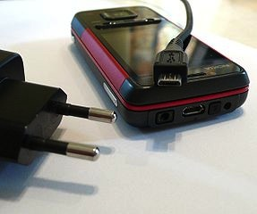

Este modelo mental es perfectamente válido para el usuario, y no le impide emplear la energía eléctrica.

En otros casos, si el modelo del usuario y el modelo tecnológico no coinciden, se produce _fricción cognitiva_.

Por ejemplo, en la siguiente figura encontramos los controles de un frigorífico. 

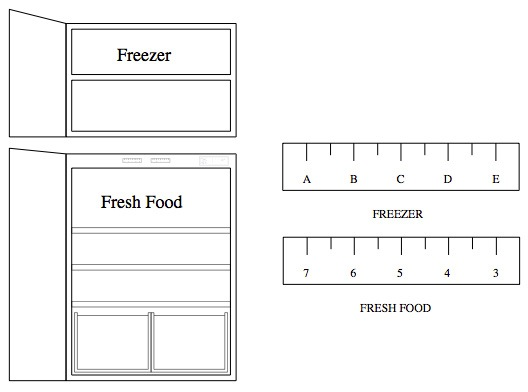

El modelo mental del usuario considera que hay un control para la temperatura del frigorífico y otro para el congelador. Pero en realidad hay un único control de potencia y un selector de cuánta potencia se envía al congelador.

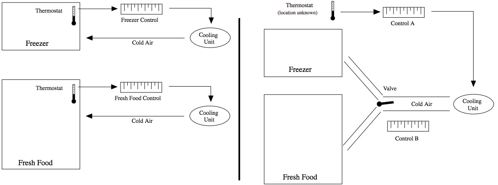

Éste es el principal problema de la mayoría de las interfaces desarrolladas: los modelos mentales de los ingenieros son avanzados y próximos a la implementación, pero los de los usuarios no suelen coincidir.

#### Modelos mentales en sistemas interactivos{.unnumbered}

Frente a otras tecnologías, los sistemas interactivos son únicos, dado que la interacción es más compleja, y existe una capa bien definida entre el modelo mental y el modelo tecnológico. Existen por tanto tres modelos diferenciados:

- El modelo tecnológico, también llamado modelo del sistema o modelo de implementación: representa lo que internamente hace un sistema, lo que hace la tecnología, los puntos de función, subprogramas principales, etc.
- El modelo representado, también llamado modelo manifiesto o de interfaz: El usuario no interactúa con el sistema directamente llamando a subprogramas o cambiando variables. En su lugar, la interfaz ofrece el modelo representado, el modelo que el sistema ofrece al usuario y que actúa de puente entre el modelo mental del usuario y el modelo tecnológico.
- El modelo mental del usuario, también llamado modelo conceptual: Es el modelo sobre cómo piensa el usuario que el sistema funciona. El usuario no conoce qué hace la tecnología, por lo que establece _conjeturas_ que pueden ser incorrectas. Más incorrectas cuanto menos sepa de tecnología el usuario, y siempre mucho más simples que la realidad.

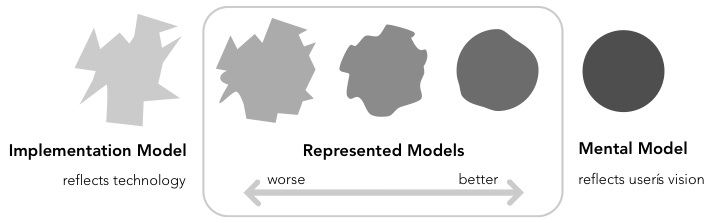

El modelo representado puede ser muy diferente al modelo tecnológico que oculta. De esta forma se ocultan los detalles técnicos del sistema que son innecesarios para el usuario. Esto es muy similar a lo que se hace en la programación orientada a objetos: definimos interfaces para ocultar la implementación concreta de los métodos.

A modo de ejemplo podemos ver la herramienta de variaciones de Photoshop. Lo que el sistema hace internamente al variar el color es tratar con matrices de píxeles sobre las que hace variaciones de sus componentes CMYK, y a menudo las herramientas de edición ofrecen _sliders_ para seleccionar la intensidad de cada canal (cyan, magenta, amarillo y negro). Ése es un modelo muy próximo al modelo tecnológico. En cambio, la interfaz de Photoshop está más próxima al modelo del usuario: En la imagen se ve cómo podemos cambiar la tonalidad de una imagen (más verde, más magenta, más claro, más oscuro...) pulsando sobre las distintas imágenes que aparecen en la interfaz.

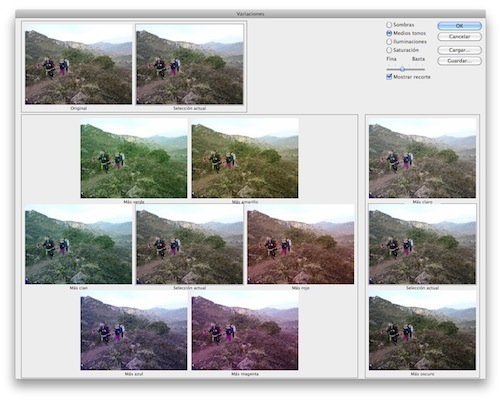

Si el modelo representado es próximo al modelo mental del usuario, la interfaz resulta sencilla de usar. Si el modelo representado es próximo al modelo tecnológico, se produce _fricción cognitiva_ al no coincidir el comportamiento del sistema con el comportamiento esperado por el usuario.

> Las interfaces de usuario bien diseñadas representan modelos de funcionamiento próximos al usuario para reducir la _fricción cognitiva_.

Para desarrollar sistemas con modelos representados próximos al del usuario, es importante entender cómo los usuarios perciben los sistemas y cómo interactúan con ellos.

### Percepción e interacción

#### Ciclo de interacción{.unnumbered}

Donald Norman definió el ciclo de la interacción  según las siguientes etapas:

- El usuario tiene un objetivo
- Formula una intención de acción para alcanzar el objetivo
- Ejecuta la acción
- Percibe la reacción y el estado del sistema
- Interpreta el estado del sistema
- Evalúa el estado del sistema en relación con el objetivo

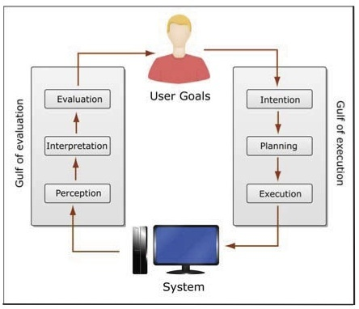

Las brechas o _gulfs_ se producen cuando los usuarios perciben que _el sistema no se comporta como debe_, es decir, cuando el modelo conceptual del usuario no concuerda con el modelo representado. De acuerdo al ciclo de interacción descrito anteriormente, la ruptura se puede producir en dos puntos: esto es lo que se conoce como brechas de evaluación y ejecución (o [_Gulf of evaluation and execution_](http://www.interaction-design.org/encyclopedia/gulf_of_evaluation_and_gulf_of_execution.html))
 
* La brecha de ejecución está relacionada con las acciones que el sistema proporciona para las intenciones que tiene el usuario. El **problema de disponibilidad** consiste en que la acción que pretende realizar el usuario (la intención) no se corresponde con las acciones que permite el sistema. Puede ser que el sistema no proporcione ciertas acciones esperadas por el usuario o las proporciona, pero no de una manera directa (lo que implica un esfuerzo extra por parte del usuario)
* La brecha de evaluación está relacionada con lo que el usuario percibe y es interpretable de acuerdo a sus intenciones. Representa el esfuerzo que la persona ha de hacer para interpretar el estado del sistema y determinar si sus intenciones han sido satisfechas (y en qué medida). Aquí podemos hablar de dos problemas distintos:

    * **Problema de percepción**: Después de realizar la acción, el sistema no cambia de estado como se espera.
    * **Problema de interpretación**: El estado del sistema no se corresponde con lo que percibe el usuario.

<!-- postmortem: deberíamos añadir ejemplos de los gulf -->

#### Errores en el ciclo de interacción{.unnumbered}

Cuando falla la interacción, es importante entender qué ha causado el problema. Por eso, distinguimos distintos tipos de errores:

* **Error (_mistake_).** El usuario realiza una acción equivocada. Suele suceder porque el modelo mental del usuario es distinto del modelo de comportamiento del sistema, generalmente debido a que nos basamos en experiencias pasadas y en deducciones. Interpretamos la situación en la que nos encontramos actualmente y la emparejamos incorrectamente con una solución ya conocida.

* **Descuido (_slip_).** El usuario entiende el sistema y el objetivo, y formula correctamente la intención de acción pero luego realiza la acción equivocada. Se suelen deber a acciones que realizamos de manera mecánica, por problemas de atención o limitaciones físicas. Generalmente se producen debido a la similitud entre acciones, a cuando dos elementos están físicamente cerca, a acciones que internamente nos llevan a ejecutar otras acciones, a que se nos olvida completar una acción, a cambios en el aspecto entre versiones o dispositivos, etc. 

Ejemplo de descuido: En Excel para Mac, si quiero acceder a las propiedades de la celda pulso `Cmd+1`. Sin embargo, para salir de cualquier aplicación en Mac se pulsa `Cmd+Q`. Esto hace que en ocasiones cierre la aplicación Excel sin querer. No es un error como tal sino que el problema se debe a que las dos combinaciones de teclas son muy similares (1 y Q están próximas en el teclados). 

> Es el mismo fenómeno que el caso de los aviones discutido en la introducción de la asignatura con el diseño del B-17.

Los diseños iniciales de los sistemas a menudo asumen que los usuarios no cometen errores. Y una vez que observamos que los usuarios _sí_ comenten errores, muchas aplicaciones informáticas compensan pidiendo confirmaciones para evitar los descuidos. Sin embargo, la mayoría de las veces los usuarios realmente desean ejecutar la acción que acaban de invocar, por lo que las confirmaciones resultan frustrantes. Una solución mejor sería el hecho de que las acciones fuesen reversibles (se pudiesen deshacer).

Algunas pautas para diseñar teniendo en cuenta los errores son:

* Entender la causa del error y hacer diseños que minimicen esta causa.
* Dar la posibilidad de deshacer acciones y hacer más complejas aquéllas que no se puedan deshacer.
* Hacer más fácil que se descubran errores y dar facilidades para arreglarlos.
* Cambiar la actitud hacia los errores. Ante un error, no asumir directamente que es un error humano si en realidad puede ser el resultado de una interfaz inadecuada.

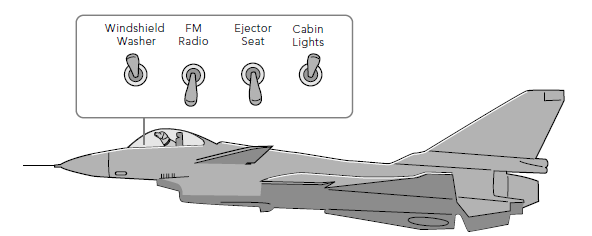

#### La interfaz como lenguaje de traducción{.unnumbered}

Abowd y Dale interpretan el modelo de Norman y plantean que existen cuatro componentes en el ciclo de interacción sobre los que se ejecuta el modelo de Norman.

- Usuario
- Sistema
- Entrada
- Salida

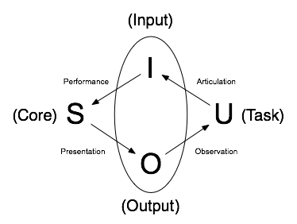

El usuario tiene su modelo y su lenguaje de comunicación, mientras que el sistema tiene los suyos. La entrada y salida del sistema es el mecanismo de traducción entre ambos.

Desde esta perspectiva, los errores se producen cuando las traducciones no se realizan correctamente:

- La intención formulada por el usuario no se puede traducir en acciones de la interfaz.
- Las acciones de la interfaz no se traducen en los cambios del sistema esperados.
- El cambio de estado del sistema no se traduce correctamente para que lo interprete el usuario.
- El estado actual del sistema no se traduce correctamente para que lo entienda el usuario y pueda formular futuras acciones.

### Memoria de trabajo

Aparte de los errores de interacción descritos en el apartado anterior, el principal reto a la hora de interactuar con una aplicación lo define el modelo de funcionamiento de la memoria humana.

#### Funcionamiento de la memoria{.unnumbered}

Se distinguen dos tipos de memoria:

* La **memoria de trabajo** o de corto plazo: es la parte de la memoria en la que se producen los procesos mentales. Tiene pequeña capacidad pero nos permite recuperar información rápidamente. [Un "discutible" resultado de un estudio](http://www.psych.utoronto.ca/users/peterson/psy430s2001/Miller%20GA%20Magical%20Seven%20Psych%20Review%201955.pdf) dice que en la memoria de trabajo solo caben 7+/-2 elementos (muy pequeña) aunque el usuario puede aumentarla mediante reglas mnemotécnicas. Además, la información que ponemos en la memoria de trabajo solo suele durar unos pocos segundos y requiere concentración para retener esta información. Cualquier distracción puede hacer que desaparezca la información de la memoria de trabajo.

> Nota anecdótica: El [Simon](http://es.wikipedia.org/wiki/Simon_%28juego%29) es un juego que pone a prueba la memoria de trabajo. Consiste en ir recordando una secuencia de tamaño ascendente de luces y sonidos. ¿Cuál es el tamaño máximo de tu memoria de trabajo cuando estás concentrado?

<!--
~~~ {.nota}
Hacer un juego parecido con ellos en clase para que entiendan el concepto (formamos una secuencia incremental de elementos {1,2,3,4}, a ver hasta dónde llegamos). Da un grito, di "¿qué es eso que hay en la ventana?" enmedio de la secuencia para distraerles y comprobar que la memoria es frágil.
~~~
-->

* La **memoria a largo plazo**: es la parte donde está toda esa cantidad ingente de información que guardamos. Es una parte bastante desconocida ya que, aparentemente, los recuerdos no se borran sino que se vuelven inaccesibles. Para guardar elementos en la memoria a largo plazo se supone que el entrenamiento por repetición no es tan efectivo como el entrenamiento por creación de asociaciones y mnemotécnicos, que ayudan a acceder más fácilmente a esos elementos de la memoria. Para acceder a ese conocimiento solemos utilizar relaciones y explicaciones. Incluso, en ocasiones, añadimos elementos a nuestro mundo exterior para acceder a ese conocimiento (Ej. Para no olvidarme que tengo que llamar a alguien me cambio el anillo de mano o me pongo una alarma en el móvil).

> Nota anecdótica: En el libro [Hannibal](http://books.google.es/books?id=xN1IrjLyOCwC&pg=PT206&lpg=PT206&dq=hannibal+palacio+interior&source=bl&ots=ta7rl5MqhQ&sig=t4oEO_yyeCInBAZPvd0NrBIatCM&hl=es&sa=X&ei=XCNVUsjeIMabtQbK54C4Cw&ved=0CDoQ6AEwAQ#v=onepage&q=hannibal%20palacio%20interior&f=false) (no en la película ni en la serie) se detalla cómo Hannibal Lecter guarda sus recuerdos e información importante en una representación de un gran palacio (lo que se conoce como [palacios de la memoria](http://www.mnemotecnia.es/articulosdoc.php?ref=LosPalaciosDeLaMemoria)). Él sabe que para conseguir la dirección de Starling tiene que subir la escalera, ir al salón de las Direcciones, tercer gabinete a la derecha...

#### Implicaciones en diseño de interfaces{.unnumbered}

Desde el punto de vista del usuario hay que entender que su memoria de trabajo es pequeña y que desaparece rápidamente, por lo que no hay que sobrecargarla con demasiada información.

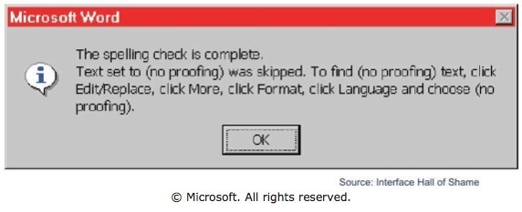

También hay que tener en cuenta que la memoria asociativa permite que el usuario aprenda más fácilmente a usar una herramienta por lo que la interfaz tiene que presentar conexiones fáciles entre los elementos que aparecen en ella y las acciones que se realizan con cada uno de esos elementos.

La memoria trabaja con pequeños elementos denominados _chunks_. Son elementos que nos permiten activar zonas de la memoria a largo plazo y traerlos a la memoria de trabajo. Permiten mantener más información en la memoria de trabajo. Por ejemplo, los números de teléfono se suelen dar en _chunks_, no en cifras. Incluso se puede recordar el patrón de las pulsaciones o la palabra que forman para recordarlos más fácilmente.

Los _chunks_ están relacionados con el _reconocimiento_ (o _recognition_), es decir, con recordar con la ayuda de una pista visual. El reconocimiento resulta más fácil que la _evocación_ (o _recall_), que consiste en recordar algo sin ayuda de nada exterior. Por tanto, una interfaz será más fácil de aprender y fomentará su memorabilidad si tenemos en cuenta cómo funciona la memoria.

El conocimiento necesario para realizar una tarea no tiene por qué ser completo. Realmente, para realizar una tarea basta con que este conocimiento esté distribuido entre el conocimiento de la persona y la información del mundo:

- Una parte debe de estar en la memoria del usuario (su conocimiento)
- Otra parte debe de estar en el mundo (en nuestro caso, en elementos de la interfaz).

> En la próxima sección, describiremos los mecanismos que podemos emplear para ayudar a reducir los problemas de interacción y para descargar parte de la carga cognitiva del usuario.

**Reflexión:** ¿Alguna vez has intentado ayudar a alguien a configurar/arreglar alguna cosa de su ordenador por teléfono? Aunque sepas manejarte perfectamente por la configuración del sistema operativo, si no tienes un ordenador delante resulta complicado recordar cómo se hace cada tarea. En cambio, si tienes el ordenador delante, resulta mucho más obvio dónde está ubicada cada cosa y puedes guiar mejor. _Esto se debe a que parte de tu conocimiento del sistema operativo no está en tu cabeza, sino en la interfaz._

## Reduciendo distancias: abstracción

Como hemos visto, las principales limitaciones a la hora de interactuar con un sistema provienen de las limitaciones de los usuarios a la hora de comprender el funcionamiento interno del sistema y a la reducida capacidad de los humanos para recordar grandes listas de cosas.

En esta sección vamos a ver cómo las interfaces nos permiten trasladar parte del conocimiento necesario a los elementos de la interfaz.

### Potencialidades o _affordances_

Los elementos de las interfaces ayudan al usuario a no tener que recordar datos ofreciendo **potencialidades** (del inglés, _affordances_).

> _Las potencialidades son el rango de acciones por parte de un usuario que son físicamente posibles sobre un artefacto._

- Potencialidades percibidas: Son las acciones que el usuario identifica como posibles.
- Potencialidades reales: Son las acciones realmente posibles.

Obviamente, ambos tipos de potencialidades deberían ser iguales:

- Si el usuario no percibe todas las potencialidades posibles, la interfaz no es intuitiva.
- Si el usuario percibe potencialidades incorrectas, la interfaz es confusa.

#### Potencialidades en mundo real{.unnumbered}

La apariencia de los objetos nos indica cómo usarlas:

- Una silla permite (y sugiere) la posibilidad de sentarnos.
- Picaportes para girar
- Ranuras para insertar objetos
- Botones para pulsar
- Palancas para empujar

**Ejemplo:** Puertas y potencialidades (Fuente: HCI. Course Notes. Keith Andrews)

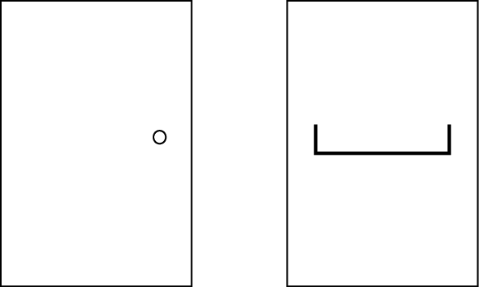

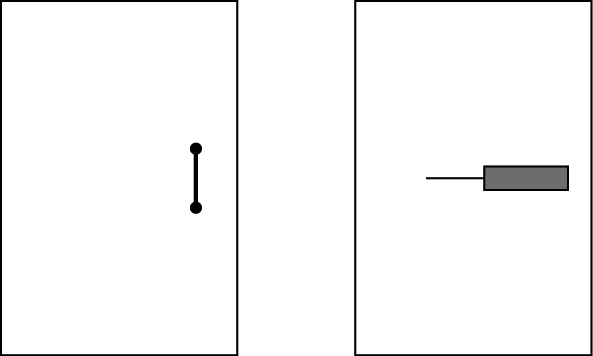

#### Potencialidades en el mundo digital{.unnumbered}

Los dispositivos digitales cuentan con un primer conjunto de potencialidades físicas:

- Los teclados permiten teclear
- El ratón permite apuntar.
- El trackpad permite apuntar (mediante desplazamiento).
- Los botones del ratón permiten pulsar.
- Las pantallas permiten tocar (aunque no siempre ha sido así).

También hay algunas potencialidades menos obvias pero posibles:

- El trackpad permite pulsar.
- El ratón Magic Mouse permite apuntar de dos formas distintas. 
- Las pantallas de algunas tabletas permiten apuntar.

#### Potencialidades en interfaces de manipulación directa{.unnumbered}

Las interfaces de manipulación directa (vistas en el tema 1) resultan más fáciles de usar debido a sus potencialidades. La representación visual del objeto nos indica las acciones que podemos realizar sobre el mismo, reduciendo así la _carga cognitiva_ asociada al manejo de los objetos.

Por ejemplo, para mover un archivo de una carpeta a otra, vemos dos contenedores (las carpetas, con su potencialidad para contener objetos) y el archivo dentro de una de ellas (como un objeto con la potencialidad de ser arrastrado).  La carga cognitiva del usuario se limita a encontrar las dos carpetas, ubicar la representación del archivo en la carpeta de origen y arrastrarlo a donde desea que esté.

En contraste, un sistema operativo de consola sólo ofrece la potencialidad de teclear comandos. Por tanto, para mover un archivo el usuario debe llegar hasta el directorio de origen (adentrándose en el sistema de carpetas mediante comandos _cd_), escribir un comando para mover el archivo (_mv_) y teclear como parámetros el nombre completo del archivo (posiblemente largo y complejo) y la ruta completa del directorio de destino (que debe conocer de memoria).

### Restricciones

Las restricciones son lo contrario de las potencialidades y juegan también un papel fundamental. Las restricciones reducen el número de acciones posibles, lo que _simplifica el modelo de interacción_. Cuando se implementan bien, facilitan la interacción.

Cuando las potencialidades y restricciones están bien planteadas, el modelo conceptual es claro y la interacción resulta posible.

Las restricciones con las que podemos manipular el modelo de interacción son las siguientes:

* **Restricciones naturales o físicas**: Son las más comunes y se basan en las propiedades de un elemento para limitar las acciones que se pueden realizar sobre él.
* **Restricciones semánticas**:  Se basan en nuestro conocimiento del mundo y de la situación en la que nos estamos desenvolviendo
* **Restricciones culturales**: convenciones artificiales que gobiernan nuestro comportamiento y que se pueden aplicar a los sistemas (Ej. rojo es peligro, parar; verde significa continuar).
* **Restricciones lógicas**: Se basan en la lógica existente entre los elementos, su organización y su estructura dentro de un todo (Ej. Dos interruptores indican que hay dos luces que podemos encender/apagar). Generalmente están asociadas a los mapeos naturales, de los que hablaremos más adelante.

Veamos un ejemplo: tenemos un total de 12 piezas de Lego para montar la moto de policía que aparece en la figura. Podemos montarla fácilmente sin necesidad de instrucciones ya que:

* Las restricciones físicas hacen que muchas de las piezas solo encajen en un sitio (ninguna de las ruedas traseras se puedan poner en la pieza de la delantera, la pieza negra solo puede ir atrás, los "ganchos" solo encajan en la pieza negra...)
* Las restricciones semánticas hacen que pongamos al motorista mirando hacia delante.
* Las restricciones culturales hacen que pongamos la luz amarilla delante y la luz roja detrás.
* Las restricciones lógicas hacen que usemos todas las piezas para montar la moto (no puede quedar ninguna ficha sin usar) y que _dos_ luces azules se relacionen con _dos_ piezas blancas.

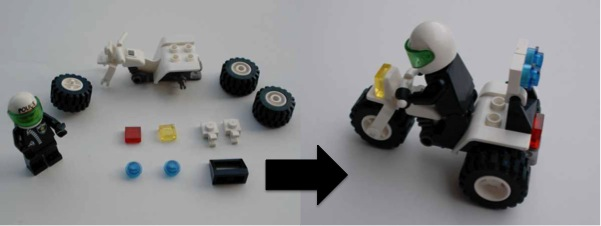

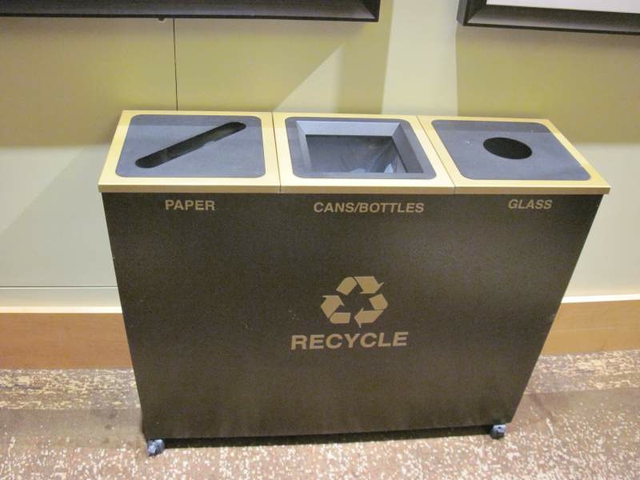

### Mapeos o _Mappings_

El _mapeo_ (del inglés _mapping_, también traducible por _cartografiar_) consiste en relacionar los controles con sus efectos en el sistema.

Existen diversas formas de mapeo en los objetos cotidianos:

- En un volante, giramos en el sentido de las agujas del reloj para girar a la derecha, y en el contrario para girar a la izquierda.

- En los controles de reproducción de un video, mapeamos la posición de los controles con la dirección a la que afectan.

#### Mapeos en el mundo real{.unnumbered}

Ya hemos hablado del caso de los hornos (adaptado de _The Design of Everyday Things_):

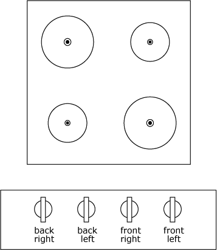

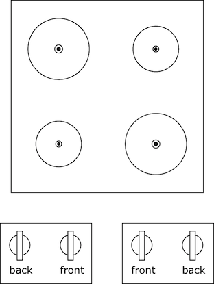

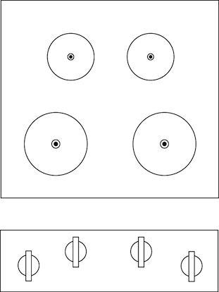

Otro escenario muy habitual para los mapeos en el mundo real son los interruptores de la luz. 

En el ejemplo de la foto, el interruptor de la izquierda enciende la habitación desde la que está tomada la foto, y el de la derecha enciende el pasillo.

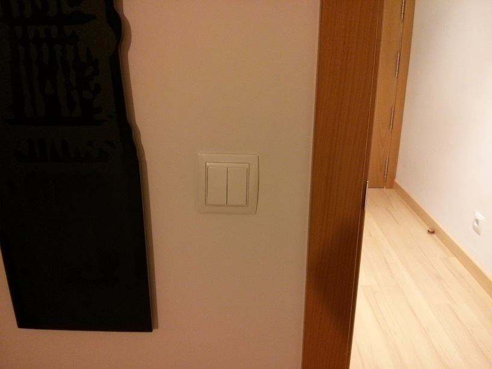

\pagebreak

#### Mapeos en diseño de interfaces{.unnumbered}

Las interfaces a menudo usan referentes espaciales para algunas opciones de configuración. Esto incluye tanto el establecimiento de agrupaciones lógicas como la distribución espacial de las mismas.

**Caso de estudio:** Microsoft Word 2007

* Las barras de comandos de elementos se agrupan por niveles de relación entre sus elementos (_ribbon_, grupos, opciones).
* Los controles de los márgenes se ubican junto a los márgenes de la página, actuando directamente sobre los mismos.
* Las barras de scroll vertical y horizontal se colocan respectivamente en vertical y horizontal.

Similarmente, las hojas de cálculo nos permiten hacer operaciones sobre conjuntos de datos complejos mediante un mapeo bidimensional (ver Figura 21 en la próxima página).

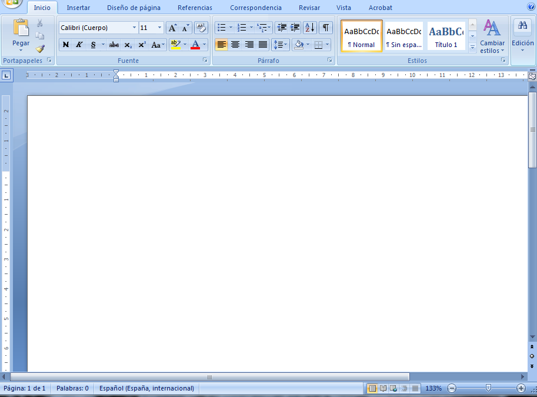

#### Otro ejemplo de mapeo {-}

[Página de J.K. Rowling](http://www.jkrowling.com/es_ES/). 

Ver los post más antiguos implica ir hacia atrás en el tiempo, lo que implica desplazarse hacia la izquierda. 

Es natural pero inconsistente con nuestra manera general de leer un blog. De hecho, la primera vez que entramos a la web necesitamos _instrucciones_ de cómo se maneja (ver Figuras 22 y 23 en páginas siguientes).

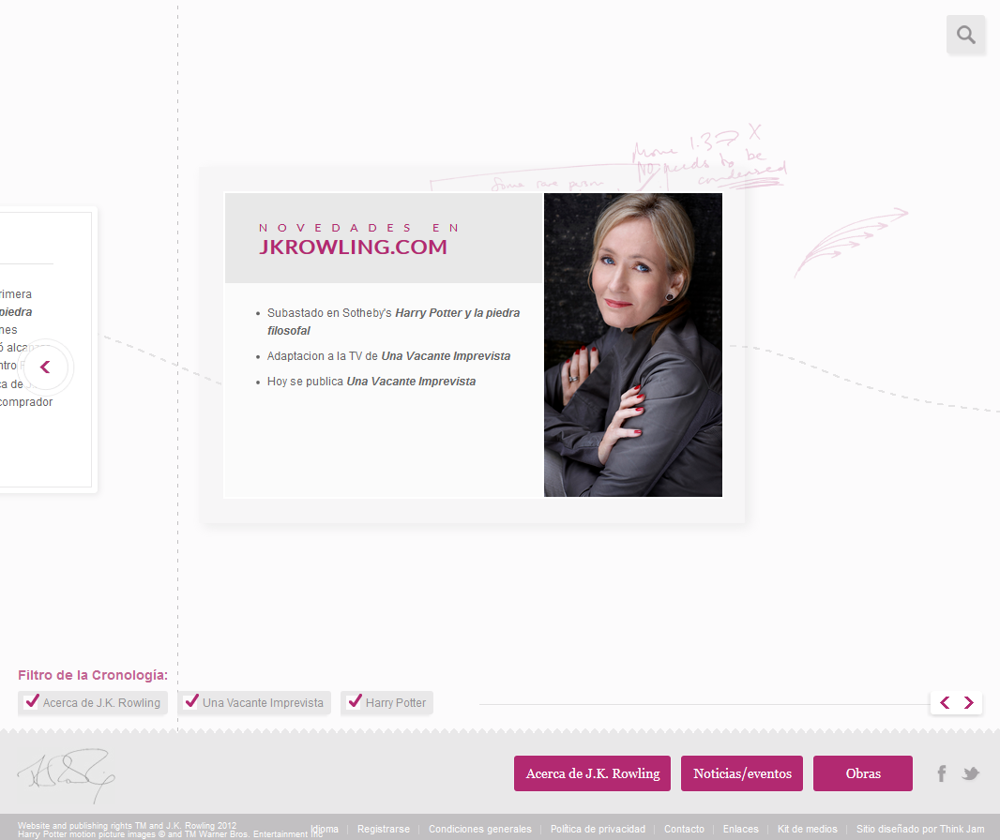

## Paradigmas de diseño de interfaces

Como hemos discutido en la sección anterior, el diseño de interfaces consiste en plantear los controles, potencialidades, restricciones y mapeos necesarios para permitir la traducción entre el modelo tecnológico y el modelo mental del usuario.

A la hora de plantear potencialidades y restricciones en el diseño de interacción, Alan Cooper distingue tres paradigmas de diseño de interfaces más habituales: 

- Diseño basado en la implementación: El modelo representado es muy próximo al modelo tecnológico.

- Diseño basado en metáforas: El modelo representado emplea metáforas del mundo real para guiar al usuario al interactuar con el sistema.

- Diseño basado en _expresiones_ o _idioms_: El modelo representado se basa en un lenguaje de interacción independiente del mundo físico, pero sencillo de aprender y próximo al modelo mental del usuario.

Como veremos a lo largo del tema, los mejores diseños y patrones son aquellos que combinan en su justa medida el diseño basado en metáforas y el diseño basado en expresiones.

### Diseño basado en la implementación

Los primeros programas, y una gran mayoría de los pequeños programas que existen hoy en día, siguen el paradigma del diseño basado en la implementación.

Esto consiste en que la interfaz del programa se basa en recopilar todas la funcionalidades que ofrece el programa, usando distintos mecanismos de agrupación más o menos sofisticados

Un diseño basado en la implementación típicamente:

- Expone detalles de la implementación interna.
- Ofrece botones o controles para todas las funcionalidades.
- Resulta satisfactorio para el ingeniero-programador.

El diseño basado en la implementación ejemplifica el principal problema del que hablamos en este curso: cuando los programadores crean interfaces, las crean siguiendo sus propios modelos conceptuales, muy influidos por su formación como programador y por su conocimiento interno del programa.

Por tanto, las potencialidades son múltiples, pero muy genéricas, y además apenas se plantean restricciones. Los diseños como el de la figura 24 son útiles para los programadores, y también para algunos usuarios muy avanzados, que conocen la tecnología y disfrutan de la sensación de control sobre el programa.

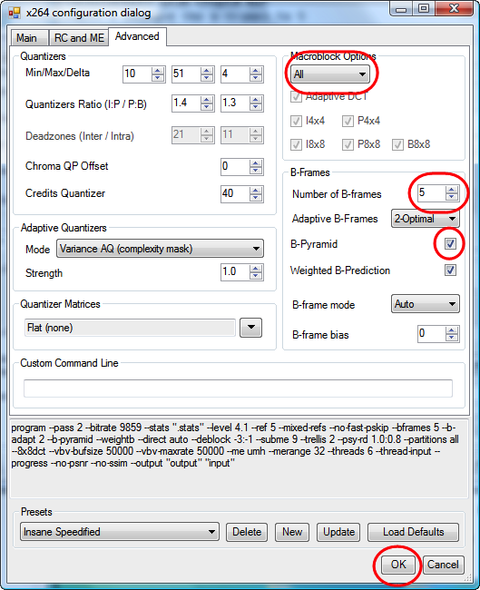

Pero la mayoría de los usuarios no trabajan así, sino que tienen determinados objetivos específicos y lo que quieren es que el programa les facilite la tarea. 

Por ejemplo, el programa [Handbrake](http://handbrake.fr/) tiene también menús guiados por la tecnología, pero para ver las opciones avanzadas hay que activarlas previamente. Para la mayoría de los usuarios, la interacción se centra en la parte de la derecha, en la que el usuario dice dónde quiere ver el vídeo y todo lo demás se configura automáticamente.

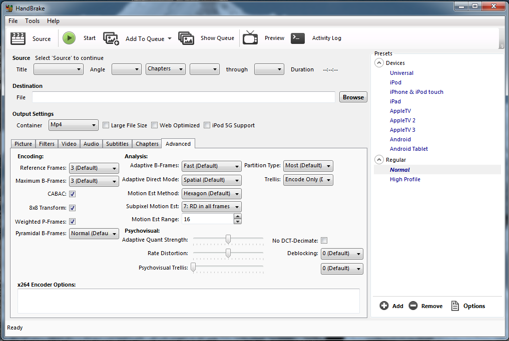

### Diseño basado en metáforas

El diseño basado en metáforas se basa en replicar actividades del mundo real, dado que así resulta más fácil alinear los objetivos del usuario con la funcionalidad del programa

Para ello, se usa un lenguaje visual o basado en iconos que permitan al usuario relacionar las acciones del programa con su conocimiento del mundo.

Muchos de los sistemas con los que interactuamos a diario emplean metáforas para definir la interacción.

#### El Escritorio:{-}

Durante muchos años, ha sido la metáfora central de los sitemas de ventanas. Es un punto de almacenamiento específico dentro del sistema de archivos (En WinXP C:\\Documents and settings\\Usuario\\Desktop), pero se usa como ventana principal. Como en una mesa de trabajo, en el escritorio podemos encontrar objetos interactivos (accesos directos a aplicaciones) y los documentos con los que estamos trabajando.

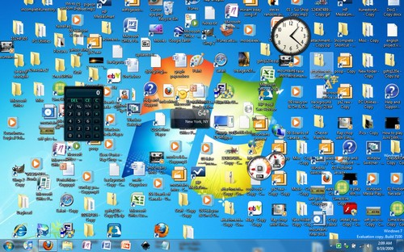

Entre las posibles interfaces del futuro, a menudo se habla de escritorios que llevan la metáfora al extremo, como Bumptop, que nunca llegó a cuajar.

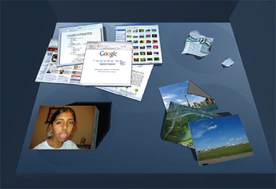

#### El sistema de archivos:{-}
A la hora de gestionar los datos, el propio lenguaje nos sugiere la metáfora. Trabajamos con _ficheros_ que _archivamos_ en _carpetas_.

En realidad, el sistema de archivos es una metáfora parcial, ya que en el mundo físico las carpetas no se guardan dentro de otras carpetas.

#### Papelera de reciclaje:{-}

La papelera de reciclaje es una metáfora similar a la del escritorio en la que borramos los elementos _tirándolos a la papelera_.

La metáfora es útil por dos motivos: Representa el concepto de _eliminar un archivo_ de forma razonable para el usuario, y además ofrece un nivel de protección contra borrados accidentales.

> **Nota anecdótica**: En sistemas OSX antiguos, para expulsar un CD o desmontar una unidad, había que arrastrar el icono de la unidad a la papelera de reciclaje, anulando la metáfora y generando _fricción cognitiva_

#### Calendarios: {-}
Todas las aplicaciones de calendario se basan en la metáfora de las agendas y de los calendarios de pared.

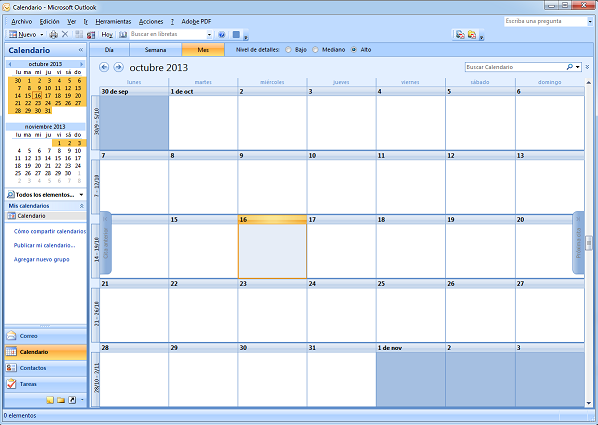

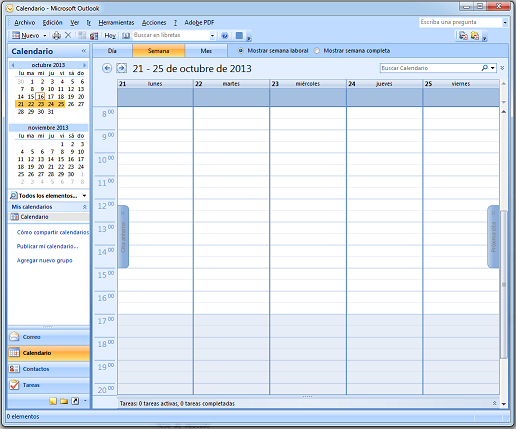

#### Directorio de contactos:{-}
Los directorios de contactos también se suelen basar en metáforas, siendo la más habitual un clásico en el mundo de los negocios: los archivos de tarjetas de visita.

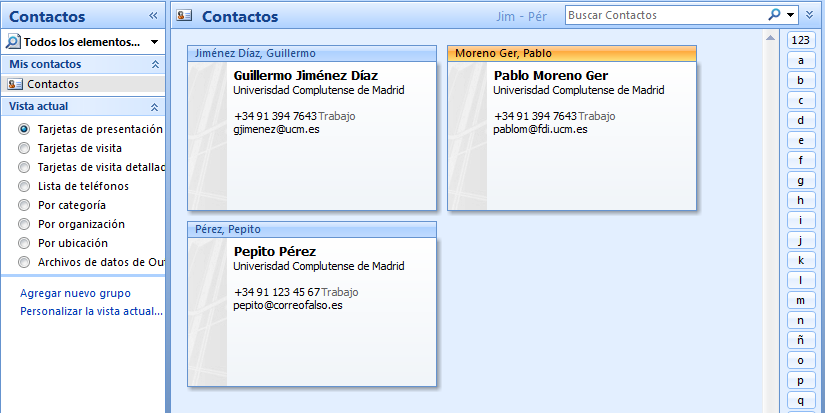

### Abuso de metáforas{-} 

Las metáforas ayudan al usuario, pero también pueden ser una limitación.

> _Si nos limitamos a copiar el mundo físico, no conseguiremos ganar eficacia_

Por ejemplo, muchas empresas de decoración reproducen versiones digitales de sus catálogos basadas en Flash, con una metáfora intensa centrada en el catálogo físico. Es bastante típico que estos catalogos no permitan ni siquiera hacer búsquedas.

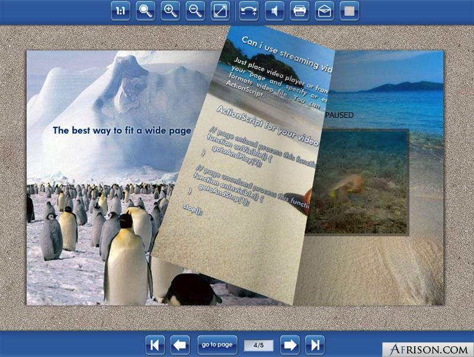

### Eskeumorfismo {-}

Muy relacionado con el concepto de metáfora, el eskeumorfismo consiste en imitar materiales y adornos en medios distintos a los originales.

**Eskeumorfismo digital:** El eskeumorfismo, es una tendencia en el diseño actual que hace que los diseños digitales se parezcan a sus homónimos no digitales. Trata de crear un vínculo más fuerte y un sentimiento entre el usuario y la aplicación. 

Apple ha sido hasta hace poco el máximo proponente del Eskeumorfismo, como podemos ver en las siguientes imágenes:

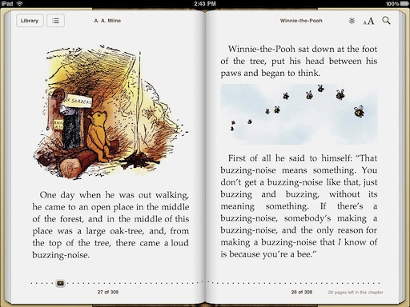

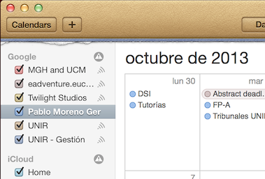

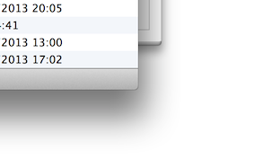

\newpage

#### Pros y contras del skeuomorfismo{-}

* __Pro__: Los usuarios novatos se encuentran con interfaces muy similares a cosas del mundo real lo que hace que se pierda en parte el "miedo tecnológico". Además, al imitar también el comportamiento del objeto real el usuario conoce inmediatamente cómo interactuar con él.

* __Pro__: A menudo, el resultado es vistoso y ofrece una guía de diseño visual consistente para los diseñadores gráficos.

* __Contra__: Esta similitud con el mundo real se puede volver en contra de la propia aplicación. Ejemplo: una agenda con aspecto de cuero puede ser una interfaz poco vistosa para un joven que, incluso, seguramente no haya conocido este tipo de agendas.

* __Contra__: La imitación del mundo real puede limitar la funcionalidad del sistema (al igual que con otros tipos de metáforas). Por ejemplo, la vista mensual de algunas aplicaciones de calendario limita la posibilidad de tener vistas que ocupan varias semanas de distintos meses (y esta funcionalidad, desde el punto de vista del software, es posible).

> Lectura recomendada: [Skeuomorphism o el arte de imitar la realidad](http://abreelojo.com/diseno-comunicacion-y-moda/en-la-red/skeuomorphism-o-el-arte-de-imitar-la-realidad/)

### Diseño plano frente a eskeumorfismo{-}

En el extremo contrario al eskeumorfismo, hay una importante tendencia actual hacia el _diseño plano_, cuyo máximo exponente es la nueva interfaz de Windows 8. 

Windows 8 pretende diseñar interfaces caracterizadas por la simplicidad, con formas limpias y funcionales. El diseño plano elimina la profundidad de los iconos: no hay más sombras, biseles ni reflejos que dan un efecto 3D. Utilizan formas geométricas básicas (círculos, triángulos, cuadrados...) para que los objetos parezcan simples visualmente.

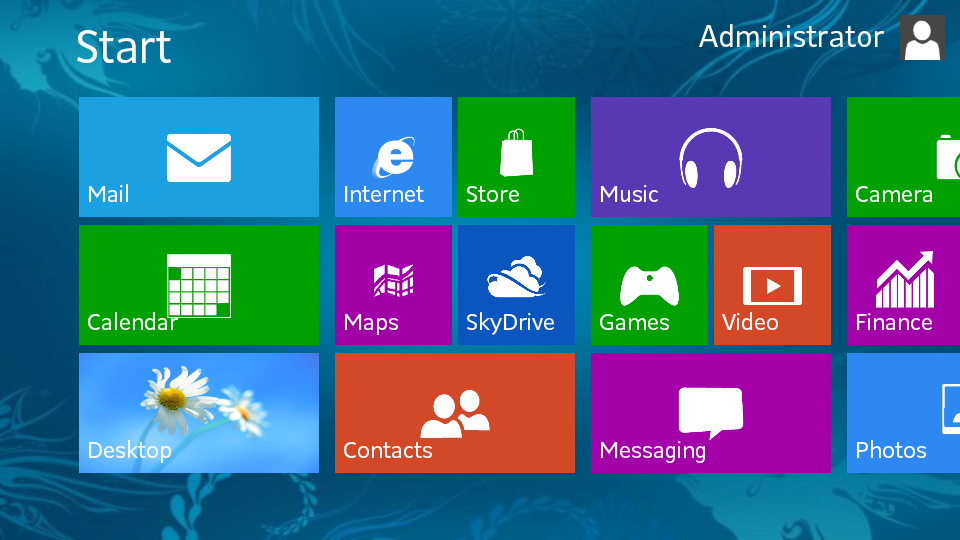

La tipografía utilizada pasa a ser clara y simple, los mensajes son cortos y los colores empleados suelen ser planos y desaturados (no hay colores brillantes). Se eliminan los gradientes y las texturas.

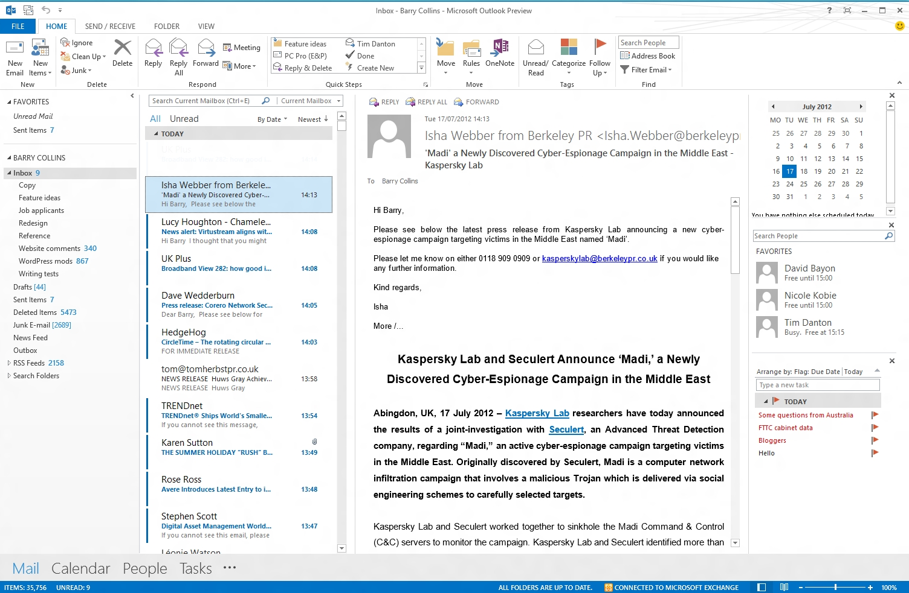

Otro de los grandes proponentes del diseño plano es Google, que ha ido cambiando el diseño de sus distintos servicios hacia interfaces de diseño plano. El uso de los espacios en blanco en este tipo de diseño es muy importante, y de hecho GMail permite configurar cuánto espacio en blanco se usa en la interfaz:

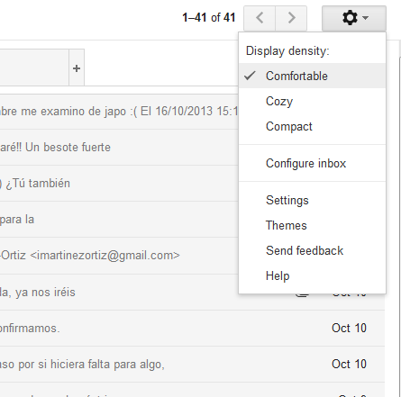

La tendencia hacia el diseño plano es clara: incluso Apple ha cambiado de rumbo para abandonar el Esmeumorfismo y acercarse al diseño plano:

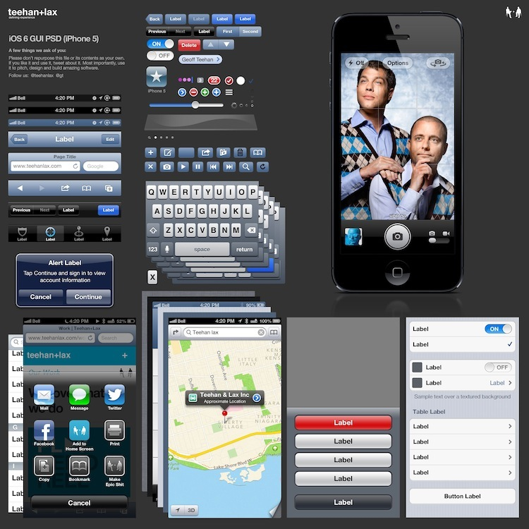

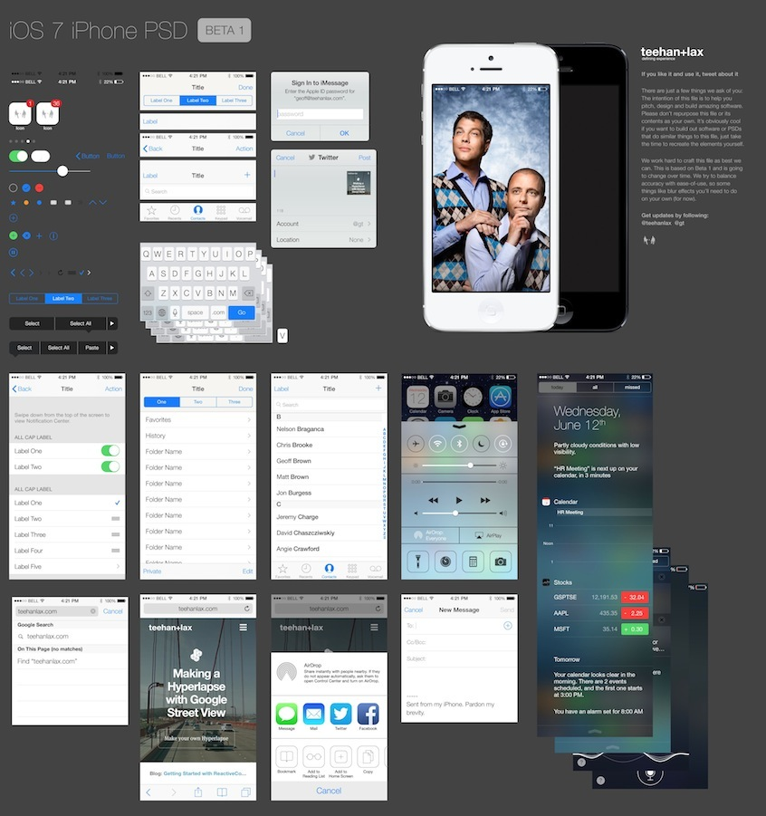

> Lectura recomendada: [Flat Design – The Next Step Forward in the Evolution of Web Design](http://speckyboy.com/2013/09/09/flat-design-evolution/)

\pagebreak

### Diseño basado en _expresiones_

¿Qué es una expresión? En lenguaje natural son frases hechas, con o sin origen comprensible (del inglés _idiom_):

- _Mola mazo_
- _Tirar de la cadena_
   
En diseño de interfaces una expresión es: 

- Una primitiva de interacción simple
- No metafórica
- Fácil de aprender, fácil de extrapolar

Las expresiones son modelos de interacción simples, pero no metafóricos. La idea es construir un lenguaje visual y de interacción basado en operaciones sencillas fáciles de aprender y de extrapolar.

El ejemplo por antonomasia de expresión sería el ratón: no es metafórico, es simple, es fácil de aprender y fácil de extrapolar.

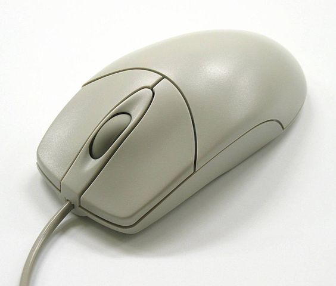

Otras expresiones relacionadas con el ratón serían el doble click, el uso de click derecho para operaciones contextuales o el scroll con dos dedos o el "pellizco" sobre un _trackpad_. En particular, el scroll con dos dedos no es metafórico y no es evidente a primera vista. Pero una vez que se aprende a usar, se convierte en intuitivo.

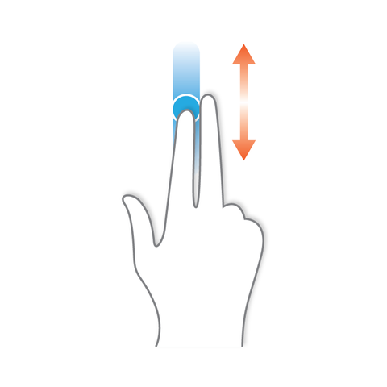

Otros ejemplos de expresiones:

- Listas desplegables (ComboBox)
- Botones de radio (para selecciones excluyentes)
- Interacción con programas residentes en la barra de notificaciones

### Expresiones y primitivas simples {-}

El éxito de las interfaces gráficas no es el hecho de que proponen un lenguaje visual, sino en que es un lenguaje visual basado en expresiones primitivas simples.

- En un sistema de consola, el usuario necesita conocer un conjunto signficativo de expresiones (comandos, rutas, conexión de flujos, etc.).
- En un sistema gráfico, las expresiones son muchas menos (apuntar, pinchar, arrastrar, teclear texto).

Los sistemas exitosos se construyen combinando conjuntos muy pequeños de expresiones primitivas, que se agrupan en expresiones compuestas y dan lugar a expresiones de alto nivel consistentes entre sí, tal y como aparece en la Figura 47.

Como vimos en el tema anterior, las interfaces visuales WIMP han compartido el mismo conjunto de primitivas simples desde los primeros ensayos de Xerox. Esto permite a los usuarios interiorizar el lenguaje de los entornos visuales y moverse de uno a otro con relativa facilidad.

### Expresiones en sistemas táctiles {-}

Los nuevos dispositivos táctiles han obligado a los diseñadores a volver a pensar un nuevo conjunto de primitivas simples:

- Ya no existe la posibilidad de señalar.
- No hay dos formas de pulsar (en Android, long-press).
- Los primeros ordenadores táctiles de Microsoft incorporaban un sistema de proximidad para señalar (pero ya no lo hacen).
- Android incluye como primitiva "Volver atrás". iOS incluye como primitiva única "Voler al principio" (aunque los desarrolladores luego añaden operaciones de volver atrás en sus aplicaciones).

### Metáforas vs. expresiones {-}

Los mejores resultados se obtienen cuando las interfaces combinan aspectos metafóricos con expresiones no metafóricas que aumentan la potencia del sistema.

#### Caso de estudio: El sistema de ficheros{.unnumbered}

- Metáforas
    - Carpetas ordenadas
    - Archivos en carpetas
    - Mover archivos de una carpeta a otra

- Expresiones 
    - Copiar archivos
    - Carpetas dentro de carpetas
    - Arrastrar (_drag_) para copiar/mover archivos.

#### Caso de estudio: Interacción con pantallas táctiles{.unnumbered}

- Metáforas:
    - _Pinch-to-zoom_
    - Scroll inverso (o natural)
    - Inercia en scroll

- Expresiones
    - Pulsación larga
    - Efecto _bounce_ (iOS)
    - Halo azul (Android)

El efecto _bounce_ de iOS para marcar el fin de una lista ha sido copiado en múltiples aplicaciones, pero está [patentado por Apple](http://www.google.com/patents?id=n7WxAAAAEBAJ&zoom=4&pg=PA1#v=onepage&q&f=false). En cambio, en los dispositivos Android, el final de una lista se indica con un halo (generalmente azul, pero configurable mediante _themes_).

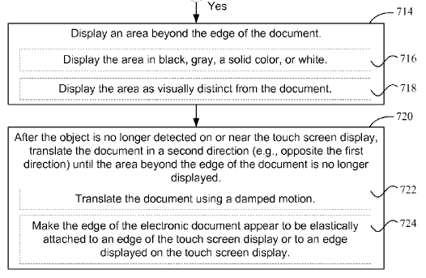

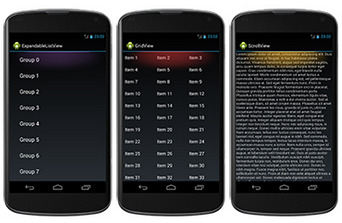

\pagebreak

## Principios de diseño

Todos los elementos vistos hasta ahora en el tema son conceptos abstractos, y el reto está en aplicarlos correctamente. En esta sección del tema nos centraremos en cómo traducir estos conceptos abstractos en principios de diseño generalizables.

### Principio de proximidad

Cuando los elementos están próximos, el cerebro interpreta que están relacionados. 

Esto supone que podemos sugerir patrones de operación agrupando los elementos visualmente. 

Desde el punto de vista del diseño de interfaces, esto tiene dos consecuencias principales:

* Al agrupar elementos similares entre sí, conseguimos que el usuario sepa que están relacionados, lo cual a su vez facilita el aprendizaje.

* Al agrupar elementos similares entre sí, el usuario puede relacionarlos mentalmente y recordarlos como grupo (_chunk_), lo cual mejora la memorabilidad.

El _ribbon_ de las aplicaciones de Microsoft Office (ya visto en la sección 2.2) es un ejemplo magnifico de proximidad, con los elementos agrupados en capas (pestañas, grupos dentro de las pestañas, uniones visuales dentro de los grupos).

Por otro lado, podemos explotar la proximidad de dos formas:

* Agrupar los controles relacionados, que ofrecen funcionalidades alternativas para un paso en un proceso.

* Agrupar los controles que representan secuencias de acciones, de modo que tengamos grupos para relacionar procesos.

Por ejemplo, la interfaz de _Handbrake_ usa agrupaciones para indicar operaciones relacionadas, y también para indicar secuencias.

#### Proximidad y _cierre_ {-}

Cuando usamos proximidades visuales para sugerir secuencias, es recomendable aprovechar la tendencia del cerebro a identificar patrones secuenciales, con planteamiento, desarrollo y _cierre_. El ejemplo de _Handbrake_ usa bien la proximidad para indicar secuencias, pero para cerrar la secuencia (_start_) es necesario volver arriba, lo que rompe la percepción de la secuencia y confunde al usuario.

### Proximidad y la Ley de Fitt {-}

Cuando agrupamos para indicar secuencias, así como cuando separamos para mejorar la claridad, es importante tener en cuenta la _Ley de Fitt_.

> _El coste en tiempo para activar un control es proporcional a la distancia a la que se encuentra e inversamente proporcional a su tamaño._

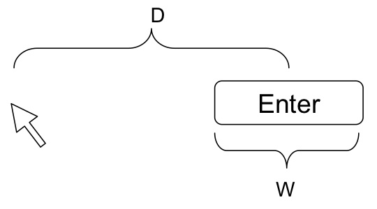

En la medida de lo posible, hay que evitar grandes desplazamientos para activar un control de tamaño pequeño.

Consecuencias de la Ley de Fitt:

- Los movimientos pueden ser cortos y precisos o largos e imprecisos.
- Desplazarse a un elemento pequeño ubicado a mucha distancia es costoso.
- Los bordes y las esquinas son más fáciles de apuntar.

> **Ejemplo:** Apple fuerza a que todos los menús estén en la barra superior no por consistencia, sino para que sea más rápido llegar a ellos.

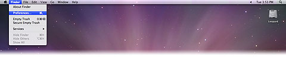

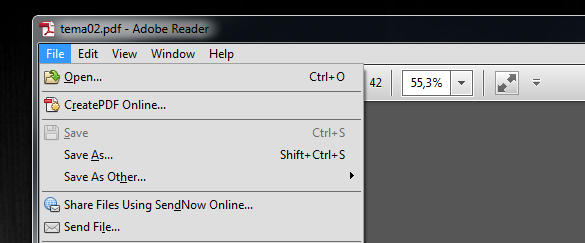

> **Ejemplo** Microsoft movió en Windows 7 el comando de "Mostrar escritorio" desde la mitad de la barra de acceso rápido (difícil de señalar) hacia una esquina de la pantalla (más rápida).

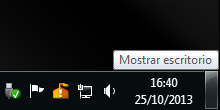

#### Corolario a la ley de Fitt {-}

La ley de Fitt se relaciona con cómo procesa el cerebro la operación de apuntar: cuanto más lejos está el destino, las órdenes de movimiento a la mano se envían con menor precisión (primando la velocidad). A medida que nos acercamos al objeto, el cerebro reduce la velocidad del movimiento, aumenta la precisión y corrige los errores de la trayectoria anterior.

Una consecuencia interesante de este efecto son los problemas con los movimientos en forma de _tunel_ (e.g. obligar al usuario a mover el ratón en línea recta), ya que obligan a un movimiento continuo y preciso (y por tanto difícil y lento).

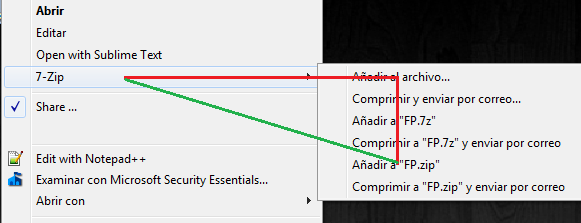

El caso más típico de túneles eran los primeros submenús (y algunos de los modernos). El desplazamiento horizontal (marcado en rojo) resulta muy complicado, y muchos usuarios tienen problemas de interacción con este tipo de menús. Microsoft lo evita permitiendo recorrer la línea verde si el movimiento dura menos de 500ms. En Ubuntu la solución es más sofisticada: en lugar de un límite de tiempo, el submenú se mantiene siempre que el movimiento relativo del ratón sea siempre "hacia abajo y hacia la derecha", y se elimina si el cursor se desplaza hacia la izquierda.

### Principio de consistencia

El principio básico de la consistencia es que _los usuarios aprenden más fácilmente los conceptos que son consistentes con su conocimiento previo_.

Dentro de este principio, podemos distinguir dos tipos de consistencia:

### Consistencia interna{-}

La consistencia interna consiste en garantizar que:

> _Todos los controles con funcionalidad similar deberían tener una apariencia similar._

También es importante el principio simétrico:

> _Todos los controles que tienen una apariencia similar deberían exhibir un comportamiento similar._

Estos dos conceptos son importantes pues facilitan que el usuario perciba las _potencialidades_ de los elementos de la interfaz.

Por otro lado, otro aspecto que a menudo se ignora es precisamente el principio inverso, que también es muy relevante:

> _Los controles que hacen cosas muy distintas entre sí, deberían tener apariencias distintas entre si._

Este concepto es fundamental para comunicar adecuadamente las _potencialidades_ y las _restricciones_ de los elementos de la interfaz.

### Consistencia externa{-}

También de gran importancia, la consistencia externa se centra en desarrollar aplicaciones que son consistentes con las expresiones habituales dentro de un sistema específico.

Principalmente se centra en:

- Mantener las expresiones principales del sistema (clicks, pulsaciones, menús contextuales, etc.).
- Emplear los mismos atajos de teclado.
- Emplear los mismos elementos visuales.
- Emplear los mismos procedimientos.

Para muchas partes del proceso, las plataformas ofrecen estándares específicos que es importante seguir:

- [Apple Human Interface Guidelines](https://developer.apple.com/library/mac/documentation/userexperience/conceptual/applehiguidelines/Intro/Intro.html)
- [Windows User Experiencie Interaction Guidelines](http://msdn.microsoft.com/en-us/windows/desktop/aa511258.aspx)
- [Java Look and Feel Design Guidelines](http://www.oracle.com/technetwork/java/jlf-135985.html)

Las guías tienden a ser muy específicas, sobre todo en el caso de Microsoft y Apple:

> En Windows, toda aplicación debe tener un menú _Archivo_, con un comando _Salir_ (no quitar, ni cerrar, ni apagar). En OSX, el menú tiene que llamarse igual que la aplicación y el comando es (_Quit nombre_).

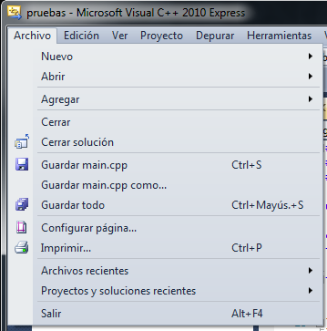

La consistencia externa es importante para la _memorabilidad_, la _facilidad de aprendizaje_ y el planteamiento adecuado de las _potencialidades_ y las _restricciones_.

#### Pérdida de consistencia externa: Los atajos de teclado {-}

Los atajos de teclado en Windows originalmente eran consistentes. Aparte de los omnipresentes Copiar y Pegar (Ctrl+C, Ctrl+V) el resto de atajos también lo eran: Seleccionar todo (Ctrl+A), Guardar (Ctrl+S), etc. El resto de programas ofrecen consistencia externa replicando estos mismos atajos de teclado. Pero luego Microsoft optó por _traducir_ los atajos de teclado a los idiomas locales. Así, a día de hoy para seleccionar todo el contenido en Windows u Office usamos Ctrl+E, y en el resto de aplicaciones usamos el original de Microsoft internacional: Ctrl+A.

#### Consistencia externa e innovación{-}

Cuando violamos la consistencia externa, se produce fricción. Pero si aplicamos como principio _nunca modificar la consistencia externa_, entonces no podemos innovar ni mejorar procesos preestablecidos. Cuando se genera una innovación en la interacción y rompemos la consistencia con el conocimiento previo que el usuario tiene es imprescindible que esa nueva interacción _sea mejor que lo que ya hay_. 

**Ejemplo:** ¿Cómo reimplementarías la operación de deshacer en una pantalla táctil? ¿Mediante un menú? ¿Mediante un botón? ¿Mediante un gesto? ¿Cuál es más consistente? ¿Cuál sería más intuitiva?

<!-- El propósito es discutir en clase el diseño de Paper para iPad, donde deshacer se invoca girando dos dedos en el sentido contrario a las agujas del reloj, y rehacer girándolos en el sentido de las agujas del reloj. Es mucho más intuitivo, pero no es consistente. De hecho, la metáfora que usan no es la "deshacer" sino la de "rebobinar" (GJD: Me has leido el pensamiento :-) ) 
-->

### Principio de visibilidad y feedback 

El principio de visibilidad tiene que ver con cómo la interfaz emplea distintos mecanismos para transmitir su estado actual y las acciones posibles (o recomendables) en un determinado momento.

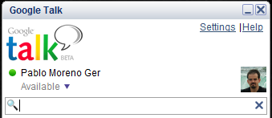

Las interfaces deben modificar su apariencia, comportamiento y reacciones de forma adecuada para indicar su estado, para así conseguir evitar las _brechas de evaluación_ (que se producen cuando la interfaz no representa adecuadamente el estado del sistema) y reducir las _brechas de ejecución_ (que se producen cuando el usuario no consigue realizar una acción determinada).

### Dirigir la atención{-}

A la hora de aportar feedback y de llamar la atención, podemos tener en cuenta distintos principios visuales:

* Tipografía: Se pueden usar distintos tamaños y tipos de letra para dirigir la atención del usuario.
* Opacidad: Los elementos 100% opacos atraen la atención, mientras que los semi-transparentes pasan más desapercibidos.
* Tono: Los colores brillantes sugieren controles activos y atráen la atención. Los colores apagados y grises sugieren controles inactivos o información poco relevante.
* Relieve: Los elementos con apariencia de relieve sugieren elementos con los que interactuar, mientras que los elementos "hundidos" sugieren controles que están activados.

### Feedback visual{-}

Dentro del principio de visibilidad, se incluye la importancia de aportar feedback para cada acción que realiza el usuario. Esto permite que el usuario sienta que el sistema responde adecuadamente y pueda interactuar de forma fluida.

Esto es especialmente importante cuando la respuesta esperada por el usuario puede tardar en producirse, por ser computacionalmente compleja o por estar sujeta a las latencias de la red. En caso de que la aplicación no pueda responder de inmediato, debería mostrar claramente que la orden se ha recibido y está siendo procesada. De lo contrario, se producen problemas de _brecha de evaluación_.

> **Nota anecdótica:** El ejemplo más claro de problemas por falta de respuesta inmediata es un clásico en comercio electrónico. Al pagar un servicio y pulsar en confirmar, en ocasiones el sistema no responde de forma inmediata. El usuario se queda preguntándose si habrá pinchado bien o no. Si no ha pinchado bien, debería pinchar de nuevo. Si sí ha pinchado bien, puede ser que al pinchar de nuevo su pedido se procese dos veces. Por fortuna, la mayoría de los sistemas de comercio electrónico modernos deshabilitan el botón de enviar y aportan feedback visual nada más pulsarlo, pero hace unos años esto no era así.

\newpage

### Tiempos de reacción {-}

Para evitar estos problemas, lo más importante es nunca permitir que el usuario se pregunte si la aplicación sigue funcionando como debe, siempre debería ser evidente el estado. Según la duración esperada de la tarea, podemos emplear distintas técnicas:

* Menos de 100 ms: La reacción del sistema parecerá instantánea, no es necesario ningún feedback adicional.
* Menos de 1 segundo: Si la aplicación tarda hasta un segundo en responder, el usuario percibe una disrupción. No hace falta un feedback complejo, pero una mínima reacción del sistema puede ayudar a tapar el problema. Ejemplo: si hemos pulsado un botón, podemos hacer que vuelva a elevarse, usar un efecto de transición entre dos pantallas o añadir un efecto de sonido (feedback sonoro).
* Entre 1 y 5 segundos: Representa un retardo significativo. El sistema debería cambiar de estado visiblemente mucho antes. El recurso más habitual es cambiar el cursor (reloj de arena, círculo que da vueltas...). En el ejemplo de comercio electrónico, el botón debería quedar deshabilitado inmediatamente.
* Más de 5 segundos: El retardo es relevante, suficiente para que el usuario pueda querer cambiar de tarea o arrepentirse de su decisión. Si dejamos simplemente el cursor ocupado, el usuario empieza a preguntarse si la aplicación se ha quedado colgada. El recurso más habitual es una barra de progreso.

Cuando mostramos barras de progreso, existen dos principios que a menudo se violan:

* El proceso siempre debería ser cancelable (relacionado con el principio de control explicado más abajo).
* Debería facilitarse al usuario feedback sobre la duración esperada.

> A la hora de estimar el tiempo restante, el usuario no necesita saber los minutos y segundos con precisión, sino el _orden de magnitud_. Es suficiente con hacerle saber si es cuestión de _segundos_, de _minutos_, de _horas_, de _días_... Y que sea cierto, obviamente.

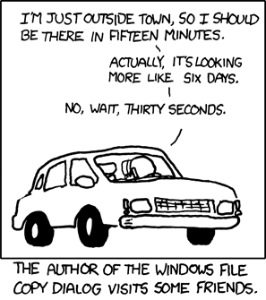

### Visibilidad progresiva y jerarquía {-}

Cuando un sistema ofrece múltiples funcionalidades, organizar la interfaz es un reto significativo. En lugar de ofrecer todas las funciones disponibles a la vez (mostrando todas las _potencialidades_), el sistema debería ofrecer únicamente las que son relevantes en un determinado momento.

Un ejemplo típico serían las interfaces que deshabilitan las acciones de menú que no son aplicables en un determinado momento.

Aún así, si el número de _potencialidades_ (con o sin _restricciones_) es demasiado elevado, resulta conveniente establecer jerarquías visuales que permitan al usuario centrarse en un conjunto a la vez.

Ejemplos de visibilidad progresiva y jerarquía:

* El _ribbon_ de Office: ya hemos visto que agrupa los comandos por grupos, y además ofrece un mecanismos de cambio de grupo (los elementos o pestañas del _ribbon_).
* Menús anidados: En las aplicaciones con menús (de la barra de menús o contextuales) podemos hacer que los comandos relacionados aparezcan agrupados.
* Pestañas: Para grandes conjuntos de opciones, una de las abstracciones más habituales es el uso de pestañas.

Una técnica que generalmente se emplea para diseñar interfaces jerárquicas son la ordenación de tarjetas y los diagramas de afinidad. La ordenación de tarjetas es un método de evaluación que consiste en presentar a un grupo de usuarios un conjunto de funcionalidades (representadas por tarjetas) relacionadas con un sistema interactivo. El trabajo del usuario consiste en agrupar las tarjetas que, de acuerdo a su modelo mental, deberían ir juntas. El análisis de los resultados de los usuarios conduce a la creación de un diagrama de afinidad, una representación gráfica de los grupos de tareas que se han detectado. Como aparece en la imagen, se suelen usar postit de color para agrupar tareas afines y se pueden añadir marcas a estos postit para indicar otros elementos de afinidad.

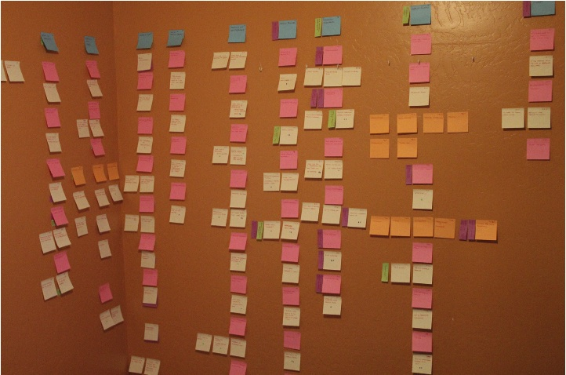

### Otras formas de feedback {-}

Hay que tener en cuenta que el feedback visual no es el único tipo y que hay que tener en cuenta otras formas de feedback.

#### Feedback sonoro.{-}

En la mayoría de los casos, se emplea para acentuar un evento visual, haciéndolo más evidente y apelando a múltiples sentidos. En una aplicación de escritorio o en una web, el feedback sonoro se emplea para llamar la atención sobre eventos importantes (la entrada de un mensaje, conexión de un dispositivo, etc.). La tendencia es hacia evitar abusar del feedback sonoro.

> **Nota anecdótica:** En versiones anteriores de windows, se usaba mucho más feedback sonoro que ahora, con efectos de sonido para prácticamente todas las acciones de interfaz (abrir carpeta, seleccionar archivo, maximizar, etc.). El motivo principal era compensar los tiempos de reacción del sistema, que solían oscilar entre 200ms y 1s.

Por tanto, hoy en día el feedback sonoro se aplica principalmente en situaciones especiales:

- Cuando se produce un evento que no se puede mostrar visualmente. Generalmente se usan para indicar que un proceso ha ido bien o que, por el contrario, se ha producido un error (Ej. [_Chime_ de Mac](http://www.youtube.com/watch?v=gjWHqCsNsMc) o el código de pitidos de las placas base). 
- Avisar de eventos _asíncronos_ y avisar de errores graves (Ej. ha llegado un mensaje). Es necesario tener cuidado con su uso ya que pueden ser molestos y el usuario puede terminar ignorándolos.
- Interacción con móviles: las pantallas táctiles tienen retardos de procesamiento. Esto, unido a la falta de precisión, se compensa empleando feedback sonoro que confirma la recepción del comando.

#### Feedback _háptico_ {-}

El feedback háptico es el que recibe mediante el sentido del tacto, generalmente como forma de transmitir sensaciones complementarias.

Se usa principalmente en:

- Pantallas táctiles, para emular la sensación de haber pulsado un botón físico (y para compensar los problemas de falta de responsividad).
- Dispositivos señaladores: La Wii de Nintendo emplea feedback háptico cuando señalamos sobre un objeto interactivo, para ayudar al cerebro en la tarea de apuntar.
- Palancas, joysticks y volantes: Generan feedbak háptico para contribuir a la sensación de que se está manipulando directamente un objeto físico.
- Gamepads: Emplean feedback háptico para dar sensación de que el mando es una prolongación del elemento que controla en el juego (coche, personaje, etc.).

<!-- Apuntar en la Wii es muy problemático. Es una metáfora de apuntar, pero no se apunta realmente, ya que la barra no puede distinguir y traducir el tamaño de la televisión (sólo conoce la distancia y el desplazamiento). Para ayudar a la traducción espacial, el mando vibra levemente cada vez que pasa por encima de un elemento interactivo. -->

### Principio de Gestión del estado visible 

Los principios anteriores se centraban en hacer visible el conjunto de acciones disponibles y la responsividad del sistema. El tercer pilar para que el usuario pueda mantenerse en sintonía con el sistema es permitir al usuario establecer flujos mentales mientras interactúa con la aplicación.

Para conseguir esto, necesitamos aportar información sobre el estado de los distintos elementos del sistema:

#### Estado de la navegación{-}

Consiste en permitir al usuario recordar en qué zona de la aplicación o recorrido de un proceso se encuentra. Esto sirve tanto para facilitar la comprensión del proceso como para ayudar al usuario a saltar a otra sección si se considera oportuno.

Algunos recursos típicos:

* Migas de pan en sitios web
* Jerarquía de opciones en forma de árbol
* Pestañas resaltadas (para recordar en qué pestaña estoy)

#### Estado del modelo{-}

La interfaz debe sugerir el estado interno en el que se encuentra la aplicación. Algunas de las piezas típicas de información que el usuario necesita poder saber con facilidad son:

* Las propiedades del objeto seleccionado (por ejemplo, cuando hemos seleccionado un archivo en el sistema de ficheros).
* El estado general del sistema (recursos disponibles, operaciones posibles).
* El resultado de la última operación.

Debido a la consistencia de las aplicaciones WIMP de los últimos años, los usuarios tienden a esperar que la información del estado interno del sistema se muestre en la parte inferior de la interfaz (barra de estado, barra de tareas activas, etc.).

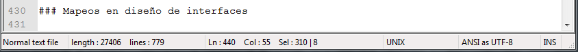

#### Estado de la interfaz{-}

La propia interfaz debe ofrecer información sobre el estado actual, que es una pista fundamental para entender las acciones disponibles. Algunos ejemplos típicos son:

* Indicar claramente qué elementos están activos y cuáles no.
* Indicar qué objetos están actualmente seleccionados.
* Cambios en el cursor durante una operación de _Drag & Drop_ (para indicar que estamos arrastrando y también para sugerir el resultado de soltar el objeto en un determinado lugar).

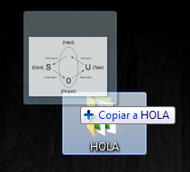

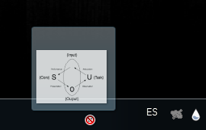

### Principio de libertad y control del usuario

En última instancia, el usuario debe sentirse en control del proceso. Deber sentir que puede explorar la interfaz cómodamente (sin miedo a romper nada) y que es él quien controla al programa y no al revés.

> _Paradójicamente, el resto de principios de diseño de los que hemos hablado consisten precisamente en guiar al usuario. La clave está en llevar al usuario a donde queremos sin hacerle sentir que no es él quién controla el proceso._

La forma más sencilla de violar el control es interrumpiendo al usuario con confirmaciones, avisos o mensajes de error. En lugar de interrumpir al usuario, es preferible ofrecerle más control y permitirle _vetar_ acciones, lo cual requiere permitir al usuario:

* Cancelar una operación en marcha.
* Deshacer la última acción realizada.

Existen muchos otros principios que también contribuyen a la sensación de control:

**Reducir la _fricción cognitiva_ tratando de anticipar los modelos mentales del usuario**. Si el sistema se comporta como espera el usuario, el usuario siente que está controlando al sistema.

**Permitir a los usuarios dirigir, no establecer conversaciones.** Consiste en reducir el número de interacciones y cuadros de diálogo. Las herramientas del día a día no piden confirmaciones ni ofrecen subopciones, simplemente obedecen a los comandos recibidos. Y por supuesto no riñen a sus usuarios cuando las usan mal.

**Ofrecer al usuario las herramientas que necesita.** Es muy delicado y difícil de conseguir: como hemos visto anteriormente, no vale con ofrecer todas las herramientas a la vez. Si hay demasiadas, el usuario tendrá que parar a buscar la opción que necesita, y entonces se rompe la sensación de control.

**Evitar diálogos y ventanas modales.** Los diálogos y ventanas modales (que bloquean la ejecución del proceso padre) roban el control al usuario, es preferible buscar otras formas de informar.

**Ofrecer manipulación directa e interacción gráfica.** Siempre que se pueda, permitir al usuario pinchar, arrastrar o señalar. Mejor dejarle arrastrar el margen que preguntar cuántos centímetros debería haber desde el borde.

**Ofrecer opciones, no hacer preguntas.** Una barra de herramientas ofrece opciones de interacción, mientras que un diálogo representa una pregunta. Siempre es preferible la primera.

Como ejercicio final, y como muestra de lo delicado que es encontrar el equilibrio entre guiar al usuario y asegurarse de que tiene el control, proponemos los siguientes patrones de interacción como casos de estudio para discutir en clase.

* Wizards

<!-- 
Wizards are the conventional pattern for software installation. In a wizard, the system controls the dialog – it dictates the steps, the ordering of the steps, and what it asks for at each step.
Imagine a travel agent who’s asking you a series of questions, and refuses to listen to what you say if it’s not relevant to the question they asked. That’s a wizard. Contrast that with the center stage pattern, which lays out data objects in the main section of the window, and gives the user a set of tools for operating on the objects. In this case, the user controls the dialog, deciding which objects to select and which tools to pick up. Wizards clearly restrict the user’s freedom, but for complex, infrequently-done tasks (like installation), the tradeoff is often worth it. Note, however, that a good wizard has two key features: a Back button (for backing out of errors) and a Cancel button (for vetoing the operation entirely). So even though the wizard pattern puts the system in control of the details, the user still has
supervisory control.
-->

* Deshacer

<!--
La implementación de deshacer no es tan evidente como podría parecer. Por ejemplo, en un sistema de edición de texto, ¿deshacemos cada caracter escrito? ¿o agrupamos por frases? ¿se puede deshacer (y por tanto rehacer) una seleccción de texto?

En un sistema de edición de fotos: ¿se puede deshacer la acción de seleccionar un objeto? ¿y si es una selección delicada? ¿se puede deshacer _parte_ de una acción de selección?

En un sistema con paneles (como photoshop u office en OSX...): ¿se puede deshacer la acción de mover un panel a otro sitio? (generalmente no, y parece razonable). ¿se puede deshacer la acción de **cerrar** un panel? (generalmente tampoco, y esto sí parece razonable).

En PowerPoint se pueden deshacer los últimos 20 comandos. Pero si estamos colocando una imagen con precisión (usando las teclas de dirección) cada pulsación es una acción: si lo último que has hecho es mover una foto 25 pulsaciones a la derecha, la operación no se puede deshacer.
-->

* Papelera en Windows y OSX

<!--
La papelera de OSX confía plenamente en el usuario (control absoluto): la operación de sacar un elemento consiste en arrastrarlo fuera de la papelera. En cambio, en Windows se da una opción adicional (la más visible por defecto) de devolver al punto original.

¿Cuál es más flexible? ¿Cuál da más control al usuario? ¿Y si he borrado algo importante de un sitio que no recuerdo (e.g. un archivo de sistema)?
-->

* Atajos de teclado

<!--
Los usuarios más avanzados necesitan formas más rápidas de ejecutar ciertas acciones, a diferencia de los usuarios más novatos. Los atajos de teclado o _shortcuts_ nos ayudan a movernos y a utilizar de una manera más rápida un sistema sin perjudicar a los usuarios novatos, que podrán seguir utilizando los menús. Proporciona flexibildad (usuarios novatos y expertos se sienten cómodos con la herramienta)

Ej. ¿Cuántos utilizáis las teclas rápidas de Eclipse/Visual Studio...?
-->

* Alertas sobre eventos del sistema

<!-- 
Informativas para el ingenerio, le aportan control (para él, más conocimiento de lo que está sucediendo implica más control.

En cambio, al usuario naive le quitan control porque interrumpen su actividad (e.g. type mismatch).

-->

### Nota final{.unnumbered}

Este tema corresponde a los apuntes de la asignatura Desarrollo de Sistemas Interactivos, impartida en la Facultad de Informática de la Universidad Complutense de Madrid por los profesores Guillermo Jiménez Díaz y Pablo Moreno Ger, del Departamento de Ingeniería del Software e Inteligencia Artificial.

Este material ha sido desarrollado a partir de distintas fuertes, destacando como referencia principal las notas de la asignatura _Human Computer Interaction_ del Prof. Keith Andrews de la  Universidad Tecnológica de Graz, el material de la asignatura _Human Computer Interaction_ impartido por Scott Klemmer a través de Coursera y los libro _About Face 3: The Essentials of Interaction Design_ de Alan Cooper, _Interaction Design. Beyond Human Computer Interaction_ de Rogers, Sharp y Preece, User-centered Design de Travis Lowdermilk, _The Design of everyday things_ de Donald Norman y las notas del curso Usability and Ubiquity de Susan Lysecky (Universidad de Arizona).

