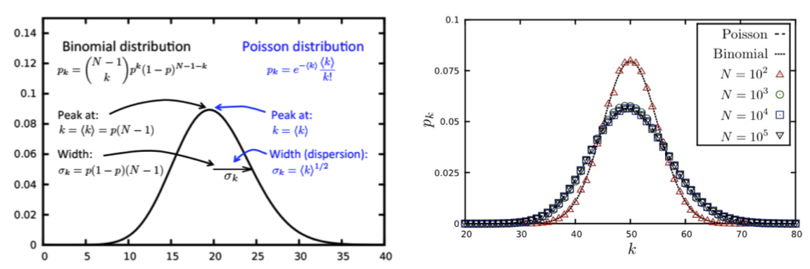
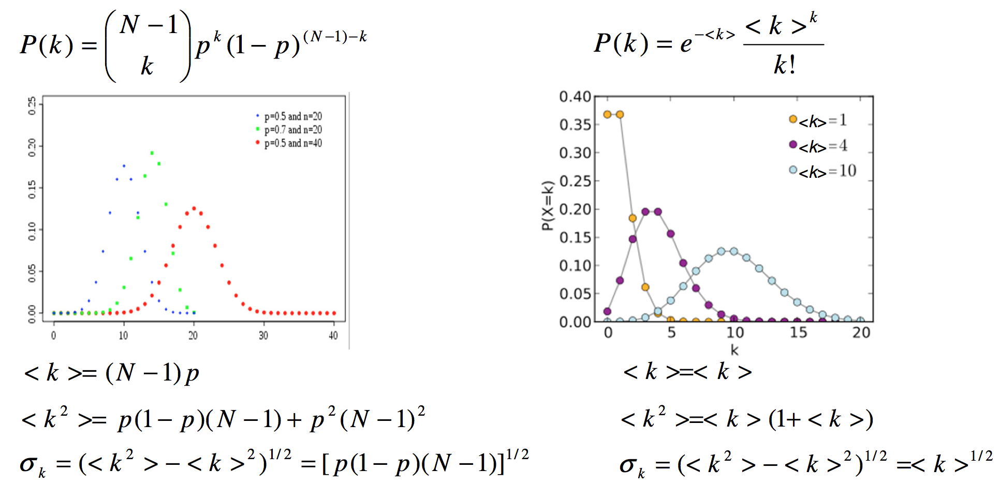
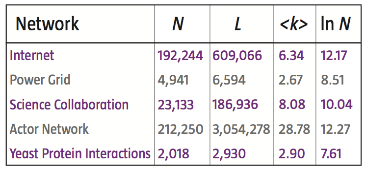
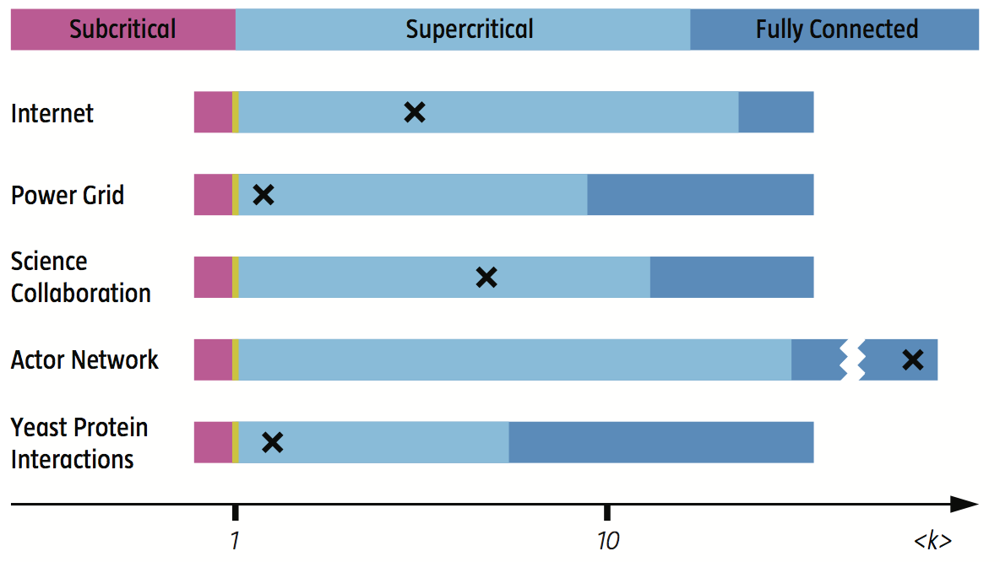
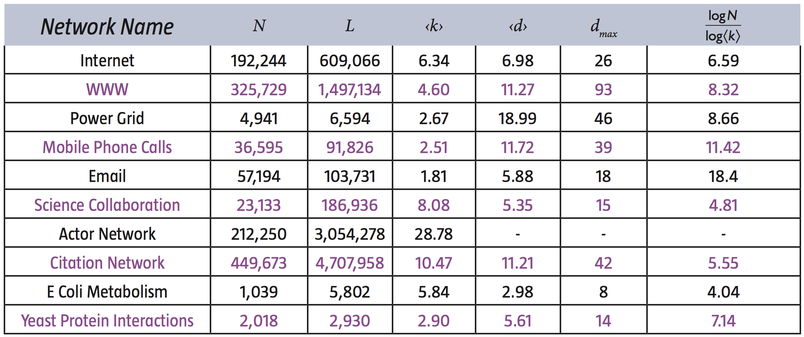
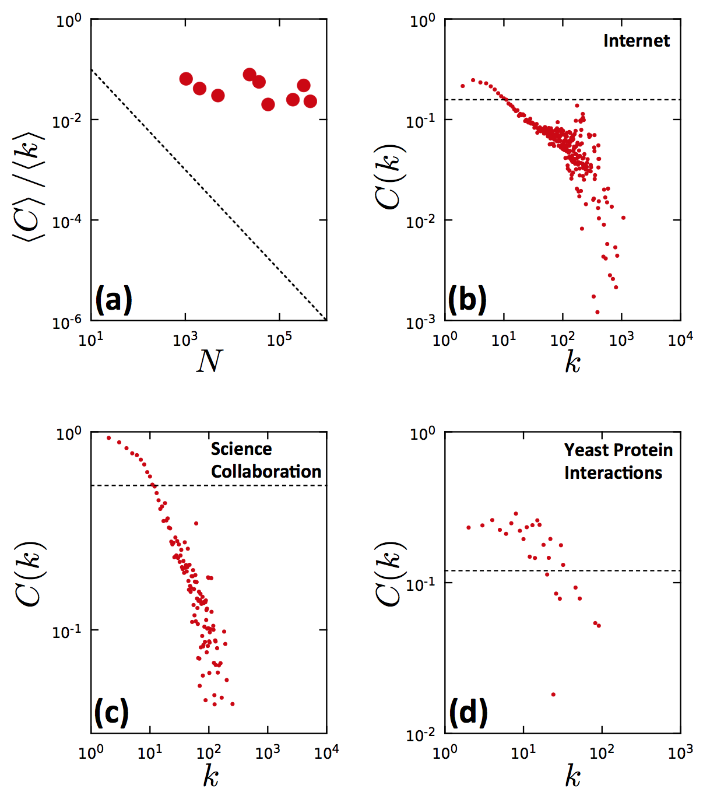
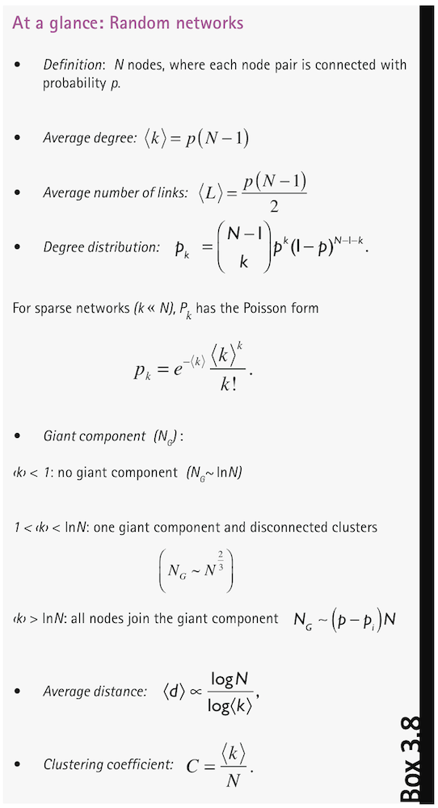

% Análisis de Redes Sociales
% Guillermo Jiménez Díaz (gjimenez@ucm.es); Alberto Díaz (albertodiaz@fdi.ucm.es)
% 15 de octubre de 2014

# Prefacio {-}

Estos son los apuntes de la asignatura Análisis de Redes Sociales, impartida en la Facultad de Informática de la Universidad Complutense de Madrid por los profesores Guillermo Jiménez Díaz y Alberto Díaz, del Departamento de Ingeniería del Software e Inteligencia Artificial.

Este material ha sido desarrollado a partir de distintas fuertes, destacando como referencia principal el libro _Network Science_ de Laszlo Barabasi, el material de la asignatura _Social Network Analysis_, impartido por Lada Adamic a través de Coursera, y las transparencias de la asignatura Redes y Sistemas Complejos, creadas por Óscar Cordón García de la Universidad de Granada.

\setcounter{section}{2}

# Tema 2: Modelos de redes: El modelo de red aleatoria {-}

Los datos relativos a una red nos permiten calcular algunas de las propiedades vistas hasta ahora. Sin embargo, muchas de las redes reales son demasiado complejas por lo que es recomendable aproximarlas mediante un modelo que las simplifique.

Un **modelo** es una representación simple de un sistema complejo del que podemos extraer y derivar propiedades matemáticamente. Por tanto, mediante un modelo que se aproxime a una red real podremos extraer y derivar propiedades de la misma. Además, los modelos nos ayudan a entender cómo y por qué se han formado las redes tal y como son ahora y extraer resultados de las mismas.

En este y en sucesivos capítulos estudiaremos algunos de los modelos más conocidos de redes sociales. El primero de ellos es el **modelo de red aleatoria**.

## Modelo de Red Aleatoria: algoritmo de construcción

Una red aleatoria es una red en la que cada uno de los enlaces entre dos nodos se ha creado siguiendo un proceso completamente aleatorio. De manera más matemática podemos decir que una red aleatoria es una red que tiene $N$ nodos donde cada nodo puede estar conectado con otro con una probabilidad $p$. Se representa como $G(N,p)$ y se construye siguiendo el siguiente algoritmo:

> 1. Crear N nodos aislados
> 2. Seleccionar un par de nodos y generar un número aleatorio entre 0 y 1. Si es menor o igual que $p$ entonces añadimos un enlace entre ellos. En otro caso, los dejamos desconectados.
> 3. Repetir el paso 2 para los $\frac{N(N-1)}{2}$ pares de nodos de la red.

El modelo de red aleatoria también se conoce como el modelo de Erdös-Renyi en honor de los dos matemáticos húngaros que las estudiaron inicialmente y que proporcionaron gran cantidad de información sobre las propiedades contenidas en este tipo de redes.

El modelo de red aleatoria también puede caracterizarse como $G(N, L)$, donde $L$ es el número de enlaces de la red. En este caso, la red se forma seleccionando aleatoriamente 2 nodos y, si no existe un enlace entre ellos, se añade. Este proceso se repite hasta conseguir un total de $L$ enlaces. Esta forma de caracterizar la red se usa menos.

## Número de enlaces

Las redes aleatorias $G(N, p)$ tienen un número variable de enlaces ($L$). Sin embargo, usando probabilidades básicas podemos calcular la probabilidad de que la red tenga exactamente $L$ enlaces.

Para aproximar este cálculo se utiliza la _distribución binomial_ que describe el número de éxitos ($x$) que se pueden conseguir en la realización de $n$ experimentos independientes donde la probabilidad de acierto es $p$ y la de fracaso, $1-p$.

$$ B(n, x, p) \to p_x = \binom{n}{x}p^x(1-p)^{n-x}$$ 

De esta función de distribución nos interesan las siguientes métricas:

* Media de la distribución: $\langle x \rangle = \sum_{x=1}^{N}x \cdot p_x = n \cdot p$
* Varianza de la distribución: $\sigma _x ^2= p \cdot (1-p) \cdot n$
* Desviación estándar de la distribución: $\sigma _x = [p \cdot (1-p) \cdot n]^{\frac{1}{2}}$

De acuerdo a esto podemos representar la probabilidad de una red $G(N, p)$ de tener exactamente $L$ enlaces como:

$$ p_L = B(L_{max}, L, p) \to p_L = \binom{L_{max}}{L} p^L(1-p)^{L_{max}-L} $$

De acuerdo a esto podemos calcular el número medio de enlaces esperados en $G(N,p)$ como:

$$ \langle L \rangle = p \cdot L_{max} = p \cdot \binom{N}{2} = p \cdot \frac{N(N-1)}{2}$$

Por tanto, el grado medio de esta red[^1] es:

$$ \langle k \rangle = \frac{2 \langle L \rangle }{N}  = p \cdot (N-1)$$ 

De acuerdo a esto, una de las primeras características que podemos extraer de las redes aleatorias es que cuanto mayor sea $p$ mayor es el grado medio y, por tanto, más densa se vuelve la red.

[^1]: Si la red se representa como $G(L,p)$ entonces ya sabemos el número exacto de enlaces por lo que $\langle k \rangle = \frac{2L}{N}$.

## Distribución del grado de los nodos

Al igual que antes, podemos representar la distribución del grado de los nodos como una binomial.

$$ p_k = B(N-1, k, p) \to p_k = \binom{N-1}{k} p^k(1-p)^{N-1-k}$$

* El grado medio será: $\langle k \rangle = (N-1) \cdot p$
* La varianza de $k$ será: $\sigma _k ^2 = p \cdot (1-p) \cdot (N-1)$
* La desviación estándar de $k$ será: $\sigma _k = [p \cdot (1-p) \cdot (N-1)]^{\frac{1}{2}}$

Sin embargo, sabemos que la mayoría de las redes reales son dispersas, lo que implica que $\langle k \rangle \ll N$. En este caso, la distribución de grados de los nodos se aproxima mejor usando una _distribución de Poisson_:

$$ P(x, \lambda) \to p_x = e^{-\lambda} \cdot \frac{\lambda ^x}{x!}$$

En esta distribución sabemos que:

* Media de la distribución: $\langle x \rangle = \lambda$
* Varianza de la distribución: $\sigma _x ^2= \lambda $
* Desviación estándar: $\sigma _x = \lambda ^{\frac{1}{2}} $

Podemos ver visualmente las diferencias entre la distribución binomial y la Poisson:

Vemos que ambas distribuciones tienen propiedades comunes:

* Tienen un pico en $\langle x \rangle$ de modo que si modificamos $p$ entonces el pico se desplaza hacia la derecha.
* Cuanto más densa es la distribución entonces más ancha es la distribución.

Las principales ventajas de la Poisson frente a la binomial son que las principales propiedades tienen una forma más simple y que la Poisson no depende de $N$.

Si estamos seguros de que tenemos una red en la que $N\gg k$ y aproximamos su distribución de grados mediante una Poisson entonces se cumple que:

$$p_k = P(k, \langle k \rangle) \to p_k = e^{-\langle k \rangle}\cdot \frac{\langle k \rangle ^k}{k!}$$

De modo que:

* Varianza de $k$: $\sigma _x ^2= \langle k \rangle $
* Desviación estándar de $k$: $\sigma _x = \langle k \rangle ^{\frac{1}{2}}$

La siguiente figura resume las diferencias entre una y otra función de distribución:

De acuerdo a la distribución de Poisson podemos sacar las siguientes propiedades de las redes aleatorias dispersas:

*  La distribución de grados no depende de $N$ por lo que dos redes con igual $\langle k \rangle$ y distinto tamaño $N$ tienen funciones de distribución de grado indistinguibles.
*  La mayoría de los nodos tienen un grado entorno a la media ($\langle k \rangle$) y los nodos de mayor grado tienen solo unos pocos más que la media.
*  Las redes aleatorias no tienen **concentradores o hubs**: nodos con conectividad o grado muy alto ya que la probabilidad de tener nodos con grado muy alto es extremadamente baja.

Por ejemplo, en una red con $\langle k \rangle = 1000$ se puede calcular que $\sigma _x = 31,62$ por lo que los nodos tienen entre 970 y 1030 enlaces. También podemos realizar aproximaciones[^2] para calcular el grado máximo y mínimo, que quedaría en $k_{max}=1185$ y $k_{min}=816$.

[^2]: Los cálculos para aproximar el máximo y el mínimo se pueden consultar en el libro "Network Science", cap 3, pp 72.

Más adelante veremos que este modelo de red aleatoria no se ajusta correctamente al compararlo con algunas redes reales por lo que será necesario modificarlo.

## Evolución de una red aleatoria

La creación de una red aleatoria parte de un conjunto de nodos aislados que se van uniendo aleatoriamente. Si simulamos el algoritmo de creación podemos ver cómo varía el grado medio de la red y cómo aparece un componente gigante cuyo tamaño va variando a medida que se modifica dicho grado medio. En la siguiente figura podemos ver la evolución del tamaño del componente gigante con respecto al grado medio de la red ($\langle k \rangle$). En lugar de observar solo el número de nodos del componente ($N_G$) vamos a tener en cuenta el porcentaje del mismo con respecto al número total de nodos de la red ($\frac{N_G}{N}$).

Se puede ver que partimos de nodos aislados y que a partir de $\langle k \rangle = 1$ el valor de $\frac{N_G}{N}$ comienza a crecer rápidamente, lo que implica que comienza la aparición de un componente gigante.

Con respecto a la probabilidad $p$ podemos sacar las siguientes conclusiones:

* Si $p=0$ entonces $\langle k \rangle = 0$, $N_G = 1$ y $\frac{N_G}{N} \sim 0$.
* Si $p=1$ entonces $\langle k \rangle = N-1$, $N_G = N$ y $\frac{N_G}{N} = 1$.
* La aparición del componente gigante aparece cuando $\langle k \rangle=1$
* De lo anterior se deriva que cuantos más nodos tenga la red $N$, menor $p$ es necesario para crear un componente gigante.

Observando la evolución de la red podemos diferenciar 4 etapas con sus características propias:

* **Etapa subcrítica**

    Se produce cuando $0 < \langle k \rangle < 1 \to p < \frac{1}{N}$. Durante esta etapa se crean pares de enlaces. Según incrementa el grado medio algunos de estos pares crean pequeños grupos, tan pequeños que $\frac{N_G}{N} \sim 0$. En general, la mayoría de los grupos pequeños tienen un tamaño parecido (no hay un componente gigante definido). El tamaño del componente más grande es $N_G \sim ln N$.

* **Punto crítico**

    Se produce cuando $\langle k \rangle = 1 \to p= \frac{1}{N}$. En este momento hay un gran número de componentes de pequeño tamaño cuya distribución sigue una función de ley potencial o _power-law_, las cuales se caracterizan por tener una larga cola. En este momento aparece el componente gigante, cuyo tamaño es $N_G \sim N^{\frac{2}{3}}$.

* **Etapa supercrítica**

    Se produce cuando $\langle k \rangle > 1 \to p > \frac{1}{N}$. El componente gigante crece según nos alejamos del punto crítico. Su tamaño es $\frac{N_G}{N} \sim \langle k \rangle -1 \to N_G \sim (p-p_c)\cdot N$, donde $p_c = \frac{1}{N}$. En este momento se puede considerar realmente que el componente gigante tiene una proporción significativa de los nodos de la red. Siguen existiendo componentes aislados que conviven con el componente gigante.

* **Etapa conectada**

    Se produce cuando $\langle k \rangle \ge ln N \to p \ge \frac{ln N}{N}$. Cuando $p$ es lo suficientemente grande el componente gigante absorbe todos los nodos y componentes de la red, lo que implica que $N_G \sim N$. En este momento toda la red es conexa.

Como resultados importantes podemos destacar que:

* Si $\langle k \rangle > 1$ entonces la red puede comenzar a considerarse como tal (existe un componente gigante)
* Si $\langle k \rangle \sim ln N$ entonces todos los componentes son absorbidos, creando una red global conectada.

### Redes reales frente a redes aleatorias

Si suponemos que las redes reales siguen el modelo de red aleatoria entonces se cumplirán las propiedades vistas anteriormente. Vamos a observar los datos de una serie de redes reales tomadas del libro de Barabasi (cap. 3, pág 60):

De acuerdo a estos datos todas estas redes cumplen que $\langle k \rangle > 1$ por lo que tienen un componente gigante. Sin embargo se aprecia que en la mayoría de ellas (salvo en la red de actores) no se cumple que $\langle k \rangle \sim ln N$ por lo que deberíamos suponer que se encuentran en la fase supercrítica y que, por tanto, existen nodos y componentes aislados. Si las redes reales se modelan de acuerdo al modelo de Erdös-Renyi entonces deberían existir nodos desconectados del componente gigante. Como ejemplo, en el caso de la red Internet, esto supondría que existen subredes que no están conectados a la red global. Si esto fuese así, ¿cómo los alcanzaríamos?. Estamos ante la evidencia de que tal vez este modelo no es del todo válido para muchas redes reales.

## Propiedades de los caminos en redes aleatorias

En una red aleatoria de grado $\langle k \rangle$ se cumple que cualquier nodo de la red tiene, _en media_:

* $\langle k \rangle$ nodos a distancia 1 ($d=1$)
* $\langle k \rangle^2$ nodos a distancia 2 ($d=2$)
* ...
* $\langle k \rangle^d$ nodos a distancia d 

Según eso, el número de nodos a distancia $d$ ($N(d)$) se puede calcular como:

$$N(d) =1+\langle k \rangle+\langle k \rangle^2+\dots=\frac{\langle k \rangle^{d+1}-1}{\langle k \rangle-1}$$

Si suponemos que $\langle k \rangle \gg 1$ entonces podemos estimar que el diámetro ($d_{max}$) de la red es:

$$d_{max} \propto \frac{log N}{log \langle k \rangle}$$

En la mayoría de los casos se puede considerar que esta misma fórmula aproxima la _longitud media de los caminos_ de la red ($\langle d \rangle$) es:

$$\langle d \rangle \propto \frac{log N}{log \langle k \rangle}$$

Esto implica que:

* La longitud media de los caminos de la red va a ser varios órdenes de magnitud más pequeño que $N$ (ya que $log N \ll N$).
* Cuanto más densa sea la red (mayor $\langle k \rangle$), menor es la distancia entre los nodos.

Estas conclusiones se resumen en lo que se conoce como la propiedad de **los pequeños mundos** o _small worlds_: la distancia entre dos nodos cualquiera de la red es sorprendentemente corta. Este fenómeno también se conoce como el de _los 6 grados de separación_. Indica que si eligiésemos al azar dos personas del planeta, por muy lejos que estuviesen, estarían a 6 "conocidos" de distancia entre sí.

Este fenómeno se sugirió por primera vez en una historia de un escritor y periodista húngaro, Frigyes Karinthy, en 1929, en el que explicaba cómo era capaz de unir a un premio Nobel con él mismo contando los "apretones de manos" (_handshake_) entre personas:

> Look, Selma Lagerlöf just won the Nobel Prize for Literature, thus she is bound to know King Gustav of Sweden. After all he is the one who handed her the Prize, as required by tradition. King Gustav, to be sure, is a passionate tennis player, who always participates in international tournaments. He is known to have played Mr. Kehrling, whom he must therefore know for sure, and as it happens I myself know Mr. Kehrling quite well.
> 
> The worker knows the manager in the shop, who knows Ford; Ford is on friendly terms with the general director of Hearst Publications, who last year became good friends with Arpad Pasztor, someone I not only know, but to the best of my knowledge a good friend of mine. So I could easily ask him to send a telegram via the general director telling Ford that he should talk to the manager and have the worker in the shop quickly hammer together a car for me, as I happen to need one.

El primer experimento que trataba de demostrar este fenómeno fue propuesto por Stanley Milgram y se realizó en 1967. En él se proponía hacer llegar una carta a un par de personas de Boston y Sharon, a base de que una persona cualquiera (desde cualquier punto de Estado Unidos) fuese enviando la carta a aquellos familiares, amigos o conocidos que más se "acercaran" a la persona objetivo. Estas eran las instrucciones originales:

> HOW TO TAKE PART IN THIS STUDY
> 
> 1. ADD YOUR NAME TO THE ROSTER AT THE BOTTOM OF THIS SHEET, so that the next person who receives this letter will know who it came from.
> 2. DETACH ONE POSTCARD. FILL IT AND RETURN IT TO HARVARD UNIVERSITY. No stamp is needed. The postcard is very important. It allows us to keep track of the progress of the folder as it moves toward the target person.
> 3. IF YOU KNOW THE TARGET PERSON ON A PERSONAL BASIS, MAIL THIS FOLDER DIRECTLY TO HIM (HER). Do this only if you have previously met the target person and know each other on a first name basis. 
> 4. IF YOU DO NOT KNOW THE TARGET PERSON ON A PERSONAL BASIS, DO NOT TRY TO CONTACT HIM DIRECTLY. INSTEAD, MAIL THIS FOLDER (POST CARDS AND ALL) TO A PERSONAL ACQUAINTANCE WHO IS MORE LIKELY THAN YOU TO KNOW THE TARGET PERSON. You may send the folder to a friend, relative or acquaintance, but it must be someone you know on a first name basis.

Se enviaron 296 cartas. La primera llegó en pocos días, pasando sólo por 2 enlaces. Al final llegaron 64 con un máximo de 12 intermediarios. La mediana de intermediarios fueron entre 5,5 y 6, por lo que de ahí viene la idea de los 6 grados de separación (aunque el nombre proviene de una obra de teatro).

En posteriores temas hablaremos más de otros modelos que detallan este  fenómeno y de su importancia en el análisis de redes sociales.

En las redes reales este número "6" se reduce drásticamente. Por ejemplo, si calculamos la longitud media en Facebook que, de acuerdo a los datos de mayo de 2011, tenía 721 millones de usuarios y 68.000 millones de relaciones (simétricas) de amistad:

$$
\langle d \rangle = \frac{log N}{log \langle k \rangle} \simeq 3.90
$$

La siguiente tabla resume el cálculo de las distancias medias de redes reales de acuerdo al modelo de redes aleatorias:

 

## Coeficiente de agrupamiento

Para calcular el coeficiente local de agrupamiento $C_i$ necesitamos estimar cuál es el número de enlaces entre los vecinos de un nodo. Recordemos que la probabilidad de que haya un enlace entre dos nodos en una red aleatoria es $p$ y que, para un nodo $i$, hay $\frac{k_i(k_i-1)}{2}$ posibles enlaces entre sus $k_i$ vecinos. Según esto, el valor estimado de enlaces de los vecinos $L_i$ es:

$$ \langle L_i \rangle = p \cdot \frac{k_i(k_i-1)}{2}$$

De acuerdo a esto, el coeficiente $C_i$ se calcula como:

$$
C_i = \langle C \rangle = \frac{2 \cdot \langle L_i \rangle }{k_i(k_i-1)} = p = \frac{\langle k \rangle}{N}
$$

De este cálculo se pueden extraer dos predicciones:

* Para un $\langle k \rangle$ fijo, el coeficiente de agrupamiento decrece cuanto mayor es el tamaño de la red ($N$). Este coeficiente decrecerá a razón de $\frac{1}{N}$.
* El coeficiente de agrupamiento de un nodo es independiente de su grado.

Sin embargo, si usamos los datos conocidos de las redes reales nos encontramos con que para muchas de ellas no se cumplen ninguna de las dos predicciones, tal y como podemos ver en la siguiente Figura:

En la gráfica (a) se puede ver que, aunque tenemos redes con distinto tamaño, $C_i$ no decrece a razón de $\frac{1}{N}$ (línea punteada). Así mismo, las gráficas (b, c, d) muestran que $C_i$ _sí_ depende del grado de los nodos. De nuevo nos encontramos con propiedades que las redes reales incumplen, lo que nos hacen plantearnos si realmente son redes aleatorias.

## Resumen

En resumen, aunque parecía que el modelo de redes aleatorias podía ser válido para modelar las redes reales vemos que, en realidad, las redes reales incumplen algunas de sus propiedades. En realidad, esta afirmación tiene cierto sentido ya que nos hace pensar que hay algún tipo de regla u orden que afecta a la estructura de algunas redes reales.

A modo de resumen, estas son las propiedades violadas por las redes aleatorias:

* **Distribución de grados**

    Aunque la distribución de grados se puede aproximar a una función de Poisson (cuando $k \ll N$) en una red aleatoria, esta distribución no explica la existencia del gran número de nodos altamente conectados que aparecen en las redes reales.

* **Conectividad**
    
    El modelo de redes aleatorias predice que si $1 < \langle k \rangle < ln N$ entonces la red presenta grupos aislados. Sin embargo, muchas redes como Internet no cumplen que $\langle k \rangle > ln N$ y, sin embargo, no están fragmentadas.
    
* **Coeficiente de agrupamiento**

    Según el modelo de red aleatoria, el coeficiente local de agrupamiento es independiente del grado del nodo sobre el que se calcula. Además, el coeficiente de agrupamiento depende del tamaño de la red en relación $\frac{1}{N}$. Sin embargo hemos visto que las redes reales no cumplen ninguna de estas dos propiedades.

Lo que sí que han demostrado que cumplen las redes reales de acuerdo a lo predicho por el modelo de red aleatoria es la **propiedad de los pequeños mundos**:

> En un sistema complejo hay un camino de longitud _corta_  entre cualquier par de nodos de la red que lo modela.

