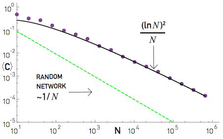
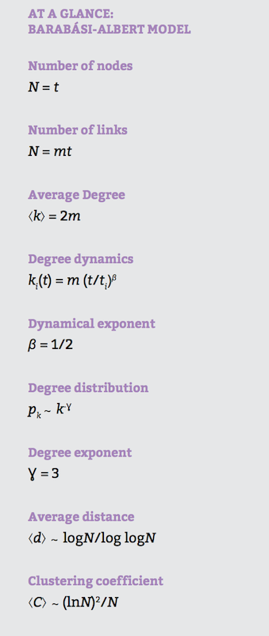

% Análisis de Redes Sociales
% Guillermo Jiménez Díaz (gjimenez@ucm.es); Alberto Díaz (albertodiaz@fdi.ucm.es)
% 24 de octubre de 2014

# Prefacio {-}

Estos son los apuntes de la asignatura Análisis de Redes Sociales, impartida en la Facultad de Informática de la Universidad Complutense de Madrid por los profesores Guillermo Jiménez Díaz y Alberto Díaz, del Departamento de Ingeniería del Software e Inteligencia Artificial.

Este material ha sido desarrollado a partir de distintas fuertes, destacando como referencia principal el libro _Network Science_ de Laszlo Barabasi, el material de la asignatura _Social Network Analysis_, impartido por Lada Adamic a través de Coursera, y las transparencias de la asignatura Redes y Sistemas Complejos, creadas por Óscar Cordón García de la Universidad de Granada.

Este obra está bajo una [licencia de Creative Commons Reconocimiento-NoComercial-CompartirIgual 4.0 Internacional](http://creativecommons.org/licenses/by-nc-sa/4.0/).

\setcounter{section}{4}

# Tema 4: Modelos de crecimiento {-}

Tras haber visto los dos temas anteriores en los que hablábamos del modelo de red aleatoria y las redes libres de escala nos pueden surgir estas preguntas:

* ¿Por qué el modelo aleatorio no reproduce hubs ni sigue una distribución de ley potencial?
* ¿Por qué la mayoría de los sistema reales complejos convergen a una topología de red libre de escala?

Para entender esta información estructural es necesario entender el mecanismo responsable de que aparezca la propiedad libre de escala. Por tanto, en este tema dejaremos un poco de lado los modelos de la topología de la red para centrarnos en algunos **modelos de crecimiento y evolución de los sistemas complejos**.

## Los modelos de evolución influyen en la topología de la red

El modelo de evolución de una red aleatoria es muy sencillo:

* Partimos de un conjunto fijo de nodos $N$.
* Creamos aleatoriamente enlaces entre los nodos.

Este modelo de evolución crea una red con una determinada topología (ya estudiada en el tema 2).

La intuición nos puede hacer pensar que si modificamos el modelo de evolución la red generada puede ser diferente. Para ello vamos a comenzar con unos modelos simples de evolución[^1] a partir del modelo aleatorio:

[^1]: Estos modelos simples pueden verse en NetLogo usando el archivo `Modelos de Evolución Simples` que está en el Campus Virtual.

### Modelo de presentación

Es un modelo similar al modelo aleatorio pero en el que aumentamos la probabilidad de los nodos que están enlazados al nodo al que se quiere añadir un nuevo enlace. A modo de ejemplo, si suponemos que estamos en una red social, este modelo dice que la probabilidad de que me presenten (y me enlace) a un amigo de un amigo es mayor que la probabilidad de que me presenten a un desconocido.

En este caso vemos que, en lugar de un único componente conexo, aparecen distintas componentes conexas, grupos de "amigos".

### Modelo geográfico estático

Este modelo tiene en cuenta la distancia a la que se encuentran los nodos. Cada nodo se conectará directamente a los $k$ nodos más cercanos.

En este caso, la topología de la red depende de la configuración espacial inicial de los nodos. Dependiendo de ésta, podemos conseguir redes muy distintas.

### Modelo de encuentros aleatorios

Es un modelo similar al anterior pero, en este caso, los nodos se mueven aleatoriamente y dos nodos se unen si chocan. Cada nodo tiene un número máximo de enlaces.

Al igual que antes, la topología de la red depende de la configuración espacial inicial de los nodos. Sin embargo, este modelo permite que nodos alejados entre sí puedan llegar a unirse si se mueven lo suficiente. Al igual que antes, la topología de la red es muy variable.

En resumen, vemos que la forma en la que se crea una red tiene cierta influencia en la topología final de la misma.

## Ingredientes para la creación de una red libre de escala

En 1999, los investigadores Barabasi y Albert destacaron dos supuestos que no eran tenidos en cuenta en el modelo de red aleatoria pero que existían en las redes reales:

* **La red crece a lo largo del tiempo.**
    
    Las redes reales se expanden mediante la adición de nuevos nodos y nuevos enlaces. Recordemos que el modelo de red aleatoria supone un número fijo de nodos $N$ inicial y que este modelo crea enlaces nuevos pero no modifica el número de nodos existentes. En las redes reales, el número de nodos no es fijo sino que crece con el tiempo. Por ejemplo, en 2001, la WWW tenía un nodo (la página inicialmente creada por Tim Berners-Lee) mientras que en la actualidad está en torno a los 1000 millones.

* **Los nodos nuevos prefieren conectarse a los nodos más conectados.**
    
    Cuando un nuevo nodo llega a la red en ella ya existen enlaces por lo que cada nodo puede decidir a quién conectarse en función del número de enlaces que otro nodo ya tiene. Sin embargo, el modelo de red aleatoria asume que la probabilidad de conectarse a otro nodo es la misma para todos los nodos (es completamente aleatoria). Esta preferencia existente en las redes reales de conectarse con los nodos con más conexiones se conoce como **conexión preferencial** o _preferential attachment_. Por ejemplo, en la WWW solemos tener más información de las páginas con más enlaces (Facebook, Google...) por lo si creamos nuestra propia web es muy probable que nos conectemos a una de ellas en lugar de a otra menos conocida.

La conexión preferencial es un concepto antiguo y conocido por muy distintos nombres:

* Un matemático húngaro lo referencia por primera vez en 1923 y lo llama el _proceso Polya_.
* En estadística es conocido como el _proceso Yule_.
* En 1923, Gibrart lo denomina _crecimiento proporcional_.
* En 1955, Simon lo usa para demostrar la naturaleza de la cola ancha de algunas distribuciones como el tamaño de las ciudades o el número de citas.
* En 1965, Price, basándose en el anterior trabajo, lo denomina _ventaja acumulativa_ (lo veremos más adelante).
* En sociología se conoce como el _efecto Matthew_.
* El término de _conexión preferencial_ es acuñado por Barabasi y Albert en 1999.

## Modelo de Price

El primer modelo que tiene en cuenta estos dos ingredientes para modelar su evolución es el modelo de Price (1965). Este modelo fue usado por este investigador para explicar la cola ancha que presenta la distribución de citas de los artículos de investigación. Un artículo de investigación (también conocido como _paper_) es un documento publicado que siempre ha de tener un mínimo número de citas bibliográficas o referencias a otros artículos que ya han sido publicados anteriormente y que sirven como soporte a ciertas ideas que se presentan en dicho artículo.

Este modelo es el siguiente:

- Cada artículo nuevo tiene $m$ citas. En términos de una red esto implica que cada vez que añadamos un nodo al modelo, este tendrá $m$ enlaces a otros nodos ya existentes en la red.
- Un artículo nuevo cita a otro ya publicado con un probabilidad proporcional al número de citas que este último tiene. En términos de una red, la probabilidad de enlazarse a un nodo depende del grado de este nodo.
- El modelo necesita hacer una suposición y es que todos los artículos tienen al menos una cita. Por tanto, la probabilidad de enlazarse a un nodo no va a ser proporcional a $k$ sino a $k+1$.

El estudio y la simulación de este modelo demostró que las redes generadas siguiendo este modelo tienen una distribución de grados que sigue una ley potencial con exponente $\gamma = 2 + \frac{1}{m}$.

## Modelo de Barabasi-Albert

Este modelo fue usado para modelar la distribución de los nodos de la WWW. En este caso, el modelo de Barabasi-Albert sigue las siguientes etapas:

* Partimos de una distribución inicial aleatoria de $m_0$ nodos y todos los nodos tienen al menos un enlace.
* La red evoluciona realizando los dos siguientes pasos.

    1. En cada momento de tiempo $t$ se añade un nuevo nodo a la red con $m \leq m_0$ enlaces que se conectarán a $m$ nodos ya existentes en la red.
    2. La probabilidad de que uno de los enlaces del nuevo nodo se conecte a un nodo ya existente $i$ depende del grado de dicho nodo $k_i$. Esta probabilidad se puede representar como:
    
    $$ \pi (k) = \frac{k_i}{\sum_{j \neq i}k_j}$$

    Donde el denominador representa la suma de los grados de todos los demás nodos que están presentes en la red en ese momento.

De acuerdo a este modelo, tras $t$ pasos tenemos que la red se compone de $N=m_0+t$ nodos y de $L=m_0+mt$ enlaces.

A este modelo se le conoce también como modelo libre de escala ya que genera redes cuya distribución de grados sigue una ley potencial con exponente $\gamma = 3$.

### Limitaciones del modelo

Este modelo no especifica:

- Cuál es la configuración inicial de los $m_0$ nodos.
- Si los $m$ enlaces se unen uno a uno (procesos independientes) o simultáneamente.
- No contempla la existencia de ciclos (enlaces sobre sí mismo).

Por tanto hay variantes de este modelo (como el _linearized chord diagram_) que intentan tener en cuenta algunas de estos supuestos.

Por otro lado, este modelo presenta otras limitaciones:

* El modelo de Barabasi-Albert estima un exponente $\gamma = 3$. Sin embargo hemos visto que en la mayoría de las redes reales este exponente oscila entre 2 y 5.
* El modelo genera redes no dirigidas aunque algunas de las redes reales que modelo son dirigidas (como la de citas de artículos o la WWW)
* El modelo no permite enlaces entre nodos ya presentes en la red (colo los permite en el momento en el que el nodo entra en la red).
* El modelo no tiene en cuenta la desaparición de nodos.
* El modelo no tiene en cuenta que algunas características intrínsecas de algunos nodos pueden hacer que la conexión preferencial varíe. Esto se debe a que el modelo es una simplificación que considera a todos los nodos por igual (sin ninguna característica adicional).

A lo largo de los últimos años se han desarrollado otros modelos que intentan abordar estas limitaciones. Sin embargo, no los vamos a tratar en este tema[^2].

[^2]: Para más información sobre estos modelos se puede consultar el capítulo 6 del libro de Barabasi.

A partir de ahora vamos a estudiar en detalle este modelo para entender y justificar por qué genera una red libre de escala.

## Evolución de los grados de los nodos

Para estudiar la distribución de grados generada por este tipo de redes hay que tener en cuenta que el grado $k_i$ de un nodo $i$ es dependiente del tiempo, es decir, depende del momento en el que $i$ entró en la red. También hay que tener en cuenta que el número de nodos también es dependiente del tiempo por lo que el número de nodos que hay en un momento $t$ lo definiremos como $N(t)$.

De acuerdo a esto podemos definir la tasa a la que un nodo adquiere nuevos enlaces (velocidad a la que aumenta su grado) como:

$$\frac{dk_i}{dt}=m \cdot \pi (k_i) = m \cdot \frac{k_i}{\sum_{j \neq i}^{k_j}}$$

Se puede calcular que $\sum_{j \neq i}^{k_j} = 2mt - m$ por lo que la velocidad a la que aumenta el grado de un nodo es:

$$\frac{dk_i}{dt}=m \cdot \pi (k_i) = m \cdot \frac{k_i}{2mt - m} = \frac{k_i}{2t-1}$$

Para valores de $t$ muy grandes podemos obviar el término $-1$ del denominador, por lo que:

$$\frac{dk_i}{dt} = \frac{1}{2} \cdot \frac{k_i}{t}$$

Para conocer cuál es el número de enlaces que tiene un nodo desde su nacimiento hasta el tiempo $t$ entonces tenemos que hacer la integral de la anterior función (teniendo en cuenta que $k_i (t_i) = m$):

$$k_i(t) = m \cdot \Big( \frac{t}{t_i}\Big)^\beta \text{  donde }\beta = \frac{1}{2}$$

El exponente $\beta$ se conoce como el exponente de la dinámica de la red. Las conclusiones que podemos sacar de esta fórmula son las siguientes:

* El grado de cada nodo de la red crece siguiendo una ley potencial de acuerdo al exponente de la dinámica de la red.
* El crecimiento del grado de los nodos es sublineal ya que cada nuevo nodo tiene un mayor número de nodos a los que conectarse y, por lo tanto, cada nodo tiene que competir con un mayor número de nodos para conseguir enlaces.
* Los hubs aparecen debido al efecto _"rich get richer"_: los nuevos nodos prefieren a los nodos con mayor grado. Pero los hubs no son más grandes porque crezcan más rápidamente sino porque aparecieron antes. Esto en marketing se conoce como el fenómeno _"first-mover advantage"_.
* La tasa de crecimiento de un nodo es:

    $$k_i(t) =\frac{m}{2} \cdot \frac{1}{\sqrt{t_i t}}$$

    Esto implica que los nodos más viejos adquieren más enlaces que los más jóvenes (ya que tienen menor $t_i$), es decir, tienen ventaja sobre los nodos nuevos. Además, la tasa con la que un nodo adquiere enlaces decrece con el tiempo a razón de $\sqrt{t}$. Este hecho se ve claramente en la siguiente gráfica:

## Distribución de grados

A partir de la tasa de crecimiento podemos extraer cuál es la distribución de grados de estas redes. Según el formalismo continuo, la probabilidad de que un nodo tenga un grado menor que $k$ es:

$$P(k_i(t) < k) = P(t_i > \frac{m^{\frac{t}{\beta}}\cdot t}{k^{\frac{1}{\beta}}})$$

La probabilidad de que un nodo llegue en el tiempo $t_i$:

$$p(t_i) = \frac{1}{m_0+t}$$

Si sustituimos en la primera:

$$P(k) = P(t_ \leq \frac{m^{\frac{t}{\beta}}}{k^{\frac{1}{\beta}}}) = 1 - \frac{m^{\frac{t}{\beta}}\cdot t}{k^{\frac{1}{\beta}}(m_0+t)}$$

Esto es una distribución acumulada por lo que si hacemos la derivada de la función obtenemos que:

$$p(k) = \frac{\partial P(k_i(t)<k)}{\partial k} = \frac{2m^{\frac{1}{\beta}\cdot t}}{m_0 + t} \cdot \frac{1}{k^{\frac{t}{\beta}+1}}$$

Cuando $t \gg m_0$ entonces:

$$p(k) \sim 2\cdot m^{\frac{1}{\beta}}\cdot k^{-\frac{1}{\beta} +1}$$

O lo que es equivalente:
 
$$p(k)\sim 2\cdot m^{\frac{1}{\beta}}\cdot k^{-\gamma} \text{   donde } \gamma = \frac{1}{\beta} +1$$

Con esto queda de mostrado que **las redes creadas siguiendo el modelo de Barabasi-Albert tienen una distribución de grados que siguen una ley potencial** con un exponente $\gamma =3$

Mediante otros formalismos y técnicas que quedan fuera de las explicaciones de este capítulo (pero que se pueden consultar en el capítulo 5 del libro de Barabasi) podemos calcular el valor de probabilidad exacto:

$$p_k = \frac{2m(m+1)}{k(k+1)(k+2)}$$

De esta fórmula destacamos las siguientes conclusiones:

* La distribución de grados es independiente del tiempo. Esta conclusión es muy importante ya que nos ayuda a entender por qué redes reales de distinta antigüedad y distinto tamaño compartan la misma propiedad de ser libres de escala.
* El modelo de Barabasi-Albert genera una distribución de grados de ley potencial prediciendo $\gamma =3$. Además este exponente es independiente de $m$ y de $m_0$, lo que da una idea de la universalidad del modelo.

## ¿Son los dos ingredientes imprescindibles?

Hemos dicho que para generar una red libre de escala necesitamos que la red esté en crecimiento ($N(t)$) y que haya conexión preferencial. Vamos a probar que es necesario ambos y que no podemos prescindir de ninguno de los dos.

### Sin enlace preferencial

El modelo de Barabasi-Albert sin enlace preferencial quedaría como sigue:

* Comenzamos con $m_0$ nodos
* Añadimos un nuevo nodo a la red con $m$ enlaces.
* La probabilidad de que el nuevo nodo se una otro es aleatoria:

$$\pi(k_i) = \frac{1}{m_0 +t-1}$$

Para este modelo se cumple que:

$$k(t) = \cdot ln \Big( e \frac{m_0+t+1}{m_0+t_i+1}\Big)$$

$$p_k = \frac{e}{m}\cdot exp \Big(-\frac{k}{m}\Big)$$

Como se puede ver, $k(t)$ crece de manera logarítmica, mucho más lenta que una ley potencial y $p_k$ sigue una exponencial por lo que no permite la existencia de hubs, algo que, como ya vimos, es esperable en una red libre de escala.

### Sin crecimiento

Si eliminamos el crecimiento el modelo de Barabasi-Albert queda como sigue:

* Empezamos con $N$ nodos.
* En cada momento $t$ seleccionamos un nodo aleaatoriamente y decidimos que se conecta al nodo $i$ presente en la red con probabilidad:

    $$ \pi (k) = \frac{k_i}{\sum_{j \neq i}k_j}$$

Aunque $N$ permanece constante, $L$ crece linealmente por lo que:

$$k_i(t) \approx \frac{2}{N}t$$

Al principio la red se parece a la generada por el modelo de Barabasi-Albert. Sin embargo, a medida que crece, el grado $k_i(t)$ converge a $\langle k \rangle$. Con el tiempo, la red se satura y se convierte en un grafo completo con $\langle k \rangle = N-1$

## Diámetro

El diámetro de una red creada usando el modelo de Barabasi-Albert tiene la siguiente forma:

$$d_{max} = \frac{logN}{log\;log N}$$

Como ya hemos visto en otras ocasiones, podemos estimar la misma fórmula para la distancia media ($\langle d \rangle$) de la red.

Como conclusión a esto podemos destacar que las distancias en el modelo de Barabasi-Albert crecen más lentamente que $logN$ por lo que crecen más lentamente que en el modelo aleatorio. Esto es especialmente notable en redes grandes ($N\gg10^4$).

## Coeficiente de agrupamiento

El coeficiente de agrupamiento de una red creada siguiendo el modelo de Barabasi-Albert es:

$$C = \frac{m-1}{8}\cdot \frac{(lnN)^2}{N}$$

Aquí se ve que el coeficiente de agrupamiento tiene una dependencia del tamaño de la red muy diferente al $\frac{1}{N}$ obtenido con el modelo de red aleatoria. En este caso, el coeficiente de agrupamiento decae más lentamente por lo que la red obtenida siguiendo el modelo tiene un mayor agrupamiento local que la red aleatoria equivalente.

## Resumen de los modelos de crecimiento

En este tema hemos podido ver que para entender la topología de la red es necesario describir cómo se ha formado la red. Hemos descrito un par de modelos de crecimiento, el de Price y del modelo de Barabasi-Albert, los cuales generan redes que cumplen la propiedad de ser libres de escala.

Hemos visto que estos modelos se caracterizan por tener crecimiento (el número de nodos crece con el tiempo) y por tener conexiones preferenciales (los nodos con mayor grado son preferidos a los nodos de menor grado). De acuerdo a esto podemos definir la siguiente ley:

> Las redes cuya distribución de grados sigue una ley potencial y que presentan hubs son consecuencia de un proceso de crecimiento y de conexión preferencial

