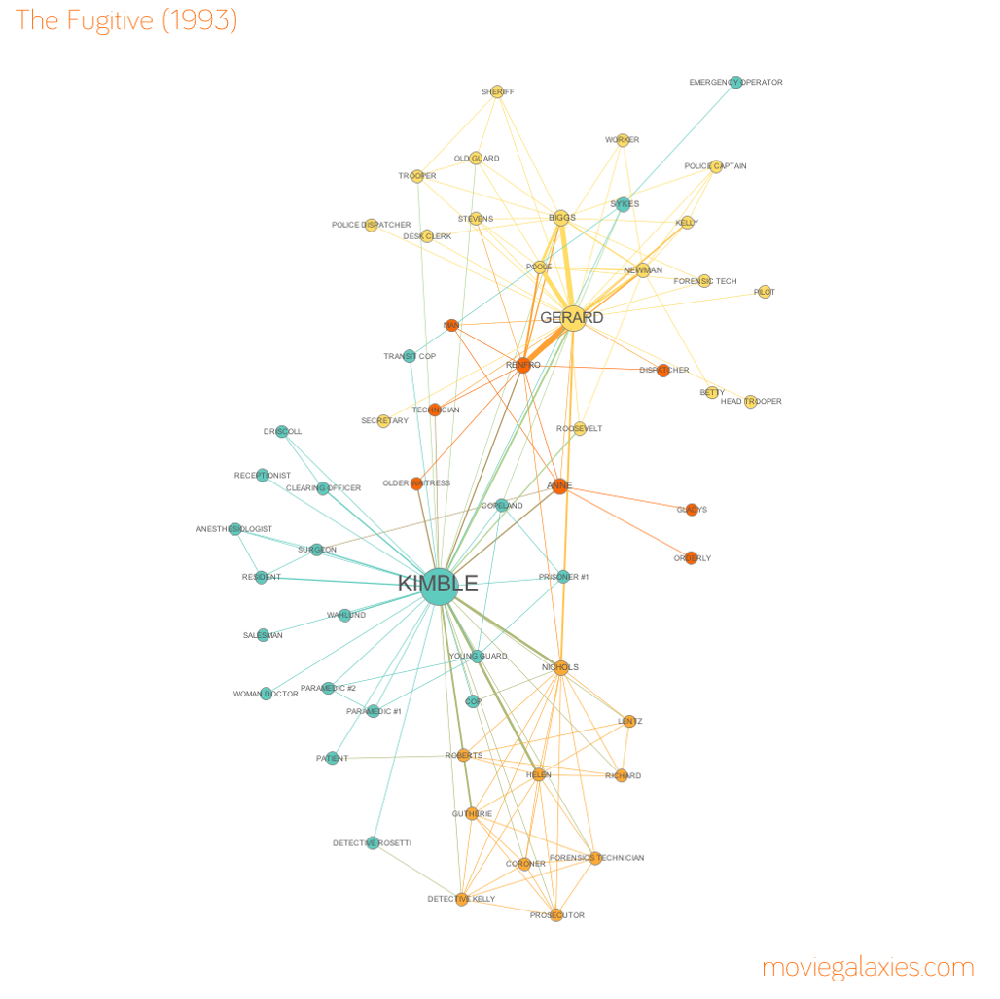

% Análisis de Redes Sociales
% Guillermo Jiménez Díaz (gjimenez@ucm.es); Alberto Díaz (albertodiaz@fdi.ucm.es)
% 27 de octubre de 2014

# Prefacio {-}

Estos son los apuntes de la asignatura Análisis de Redes Sociales, impartida en la Facultad de Informática de la Universidad Complutense de Madrid por los profesores Guillermo Jiménez Díaz y Alberto Díaz, del Departamento de Ingeniería del Software e Inteligencia Artificial.

Este material ha sido desarrollado a partir de distintas fuertes, destacando como referencia principal el libro _Network Science_ de Laszlo Barabasi, el material de la asignatura _Social Network Analysis_, impartido por Lada Adamic a través de Coursera, y las transparencias de la asignatura Redes y Sistemas Complejos, creadas por Óscar Cordón García de la Universidad de Granada.

Este obra está bajo una [licencia de Creative Commons Reconocimiento-NoComercial-CompartirIgual 4.0 Internacional](http://creativecommons.org/licenses/by-nc-sa/4.0/).

\setcounter{section}{5}

# Tema 5: Centralidad {-}

## Concepto de centralidad

Los nodos con una "posición más central" (una mayor centralidad) tienen un acceso más fácil y rápido a los demás nodos de la red y una mayor capacidad para ejercer un control del flujo entre ellos.

### Ejemplos de grafos de actores en películas

En los siguientes grafos se representan relaciones entre los actores que aparecen en distintas películas analizando los guiones. Se incluye una arista entre dos actores si un actor interacciona con otro actor en un punto concreto de la película.

<!-- PONER FIGURAS -->

Han sido extraídas de la web [moviegalaxies.com](http://moviegalaxies.com)

## Medidas

Para analizar la estructura de las redes sociales existen 2 tipos de medidas:

### Medidas locales (a nivel de nodos).

* Todas estas medidas están basadas en el concepto general de centralidad (redes no dirigidas) o prestigio (redes dirigidas).
* La centralidad es una medida general de la posición de un nodo en la estructura global de la red social.
* Estas medidas se usan para identificar los nodos claves de una red.
* Muestran como las relaciones se concentran en unos pocos nodos (individuos), dando una idea de su poder social.

<!-- DUDA: Ejemplos Nada? -->

### Medidas globales (a nivel de red)

* Proporcionan información más compacta que permite evaluar la estructura global de la red.
* Proporcionan información sobre propiedades importantes de los fenónemos sociales subyacentes.
* Algunas de estas medidas las hemos utilizado en temas anteriores: diámetro, distancia media, grado medio, densidad, coeficiente de clustering.

## Medidas locales de centralidad

Existen varias medidas distintas de centralidad:

* Grado
* Intermediación (betweenness)
* Cercanía (closeness)
* Excentricidad
* Centralidad de vector propio
* Coeficiente de clustering

## Centralidad de grado

Mide el número de enlaces con otros nodos.
Hay que distinguir entre grafos dirigidos y no dirigidos.

### Grafos no dirigidos.

Centralidad de grado de un nodo: número de enlaces que lo conectan con otros.

$C_D(N) = k_N$

$C_D(N)$ se define en el intervalo {0, g-1}, siendo g el número de nodos de la componenente conexa.

<!-- PINTAR GRAFO CON EJEMPLO -->

Interpretación:
*Los nodos con más enlaces son más centrales.
*En una red social de personas con relaciones de amistad, los individuos con más amigos son más centrales.
*Sólo mide la importancia con respecto a los vecinos más cercanos.
*Se asume que las conexiones de los vecinos no importan, sólo importa lo que se pueda hacer directamente con los vecinos. 

### Grafos dirigidos.

En grafos dirigidos, se define el prestigio de entrada (in-degree), denominado Soporte, y el prestigio de salida (out-degree), denominado Influencia:

Soporte = $P_D^{in} = k_N^{in}$

Influencia = ($P_D^{out} = k_N^{out}$)

Ambos se definen en el intervalo {0, g-1} 

<!-- PINTAR GRAFO CON EJEMPLO -->

Interpretación Soporte:
*Los nodos con muchos enlaces de entrada son prominentes.
*La idea básica es que muchos nodos procuran tener enlaces directos a ellos, por lo que se puede considerar como una medida de su importancia.

Interpretación Influencia:
*Los nodos que tienen muchas conexiones directas de salida con otros son influyentes.
*Pueden transferir información rápidamente a muchos otros nodos.

Comercio de petróleo y derivados, 1998. Fuente: NBER-United Nations Trade Data.
Cada nodo es un país y hay un enlace entre el exportador y el importador.

¿Qué países importan de muchos otros?
¿Arabía Saudí, Japón, Iraq, USA, Venezuela?
<!-- Respuesta: Japan y USA -->

Comercio de petróleo y derivados, 1998. Fuente: NBER-United Nations Trade Data.
Cada nodo es un país y hay un enlace entre el exportador y el importador.
El grosor de la arista indica el volumen exportado.

¿Qué país exporta a pocos países pero lo hace en gran cantidad?
¿Arabía Saudí, Japón, Iraq, USA, Venezuela?
<!-- Respuesta: Venezuela -->

### Normalización del grado

Es habitual normalizar los valores de las centralidades de grado ($C_D(N)$, $P_D^{in}$, $P_D^{out}$) diviéndolas por su valor máximo g-1 (siendo g el número de nodos de la componente conexa donde está el nodo).

<!-- PINTAR EJEMPLOS UGR O LADA -->

<!-- ¿FREEMAN FORMULA FOR CENTRALIZATION DE LADA? NO -->

### Problemas del grado como medida de centralidad

El grado es una medida adecuada para evaluar la centralidad de un nodo en una red social pero desde una perspectiva muy local:
* mide la importancia y la influencia del nodo con respecto a sus vecinos más cercanos,
* pero tiene una limitación importante: no tiene en cuenta la estructura global de la red.

<!-- EXPLICAR SOBRE EJEMPLOS ANTERIORES -->

<!-- ¿DISCUSIÓN SOBRE INTERMEDIACIÓN DE LADA? NO -->

## Intermediación

La intermediación es una medida pensada para capturar como de central es un nodo desde el punto de vista de cuantos caminos que conectan nodos pasan por él.

$C_B(i) = \sum_{j<k}\frac{g_{jk}(i)}{g_{jk}}$

donde $g_jk$ es el número de caminos mínimos que conectan los nodos j y k, y $g_jk(i)$ es el número de esos caminos que incluyen al nodo i.

$C_B(i)$ se define en el intervalo {0, (g-1)*(g-2)} en redes dirigidas y en {0, (g-1)*(g-2)/2} en no dirigidas.

Interpretación:
* Un nodo tiene una posición más favorable (mayor intermediación) en la medida en que dicho nodo esté situado en los caminos geodésicos (caminos más cortos) de todos los demás.
* En otras palabras, cuanto más caminos geodésicos pasen por un nodo más central será.

Es habitual considerar la medida normalizada:

$C_B^{'}(i) = \frac{C_B(i)}{(g-1)(g-2)/2}$

donde el denominador representa el número de pares de nodos excluyendo el propio nodo i.

Los nodos con una intermediación alta ocupan roles críticos en la estructura de una red, puesto que suelen ocupar una posición que les permite trabajar como interfaces entre subgrupos de nodos fuertemente unidos.

Son elementos vitales en la conexión entre distintas regiones de una red.

<!-- PINTAR EJEMPLOS NADA. -->
<!-- NO ENTIENDO ALGUNOS CÁLCULOS -->

<!-- FIGURA EJEMPLOS GRADOS VS INTERMEDIACIÓN OSCAR CORDÓN

Grado. $C_D$. Max = 17.
Nodo 1. $C_D = 6$.
Nodo 2. $C_D = 6$.

Intermediación. $C_B$. Max = 17*16/2 = 136.
Nodo 1. $C_B = 70.0$.
Nodo 2. $C_B = 96.5$.
-->

* Encontrar un nodo con un valor alto de intermediación pero con un grado bajo

* Encontrar un nodo con un valor bajo de intermediación pero con un grado alto

## Cercanía

Esta medida da importancia a la facilidad de acceso al resto de la red, a que se pueda llegar al resto de los nodos de la red con pocos saltos, o dicho de otra forma que la distancia al resto de los nodos de la red sea pequeña.

En esta medida no se tiene en cuenta ni tener muchos vecinos directos ni estar situado entre otros nodos. Se le da importancia a estar "en medio" de la red.

La suma de las distancias geodésicas (distancias de los caminos mínimos) de un nodo de la red a todos los demás es la lejanía de un nodo al resto.
La inversa de dicha suma es la medida de cercanía.

Centralidad de cercanía: $C_C(i) = 1 / \sum_{g}d(i,j)$

Centralidad de cercanía normalizada: $C_C^{'}(i) = C_C(i)/g-1$

Si hay varias componentes conexas puede haber distancias infinitas, se puedecalcular la centralidad de cercanía como la suma de las inversas de las distancias.

<!-- PINTAR EJEMPLOS NADA -->

* Encontrar un nodo con grado relativamente alto pero con un valor de cercanía bajo

### Cercanía en redes dirigidas

Se pueden definir dos medidas de cercanía distintas considerando sólo los enlaces de entrada o de salida:

* Cercanía de entrada (p.ej.: prestigio en redes de citación)

* Cercanía de salida (alcance de la influencia de un nodo)