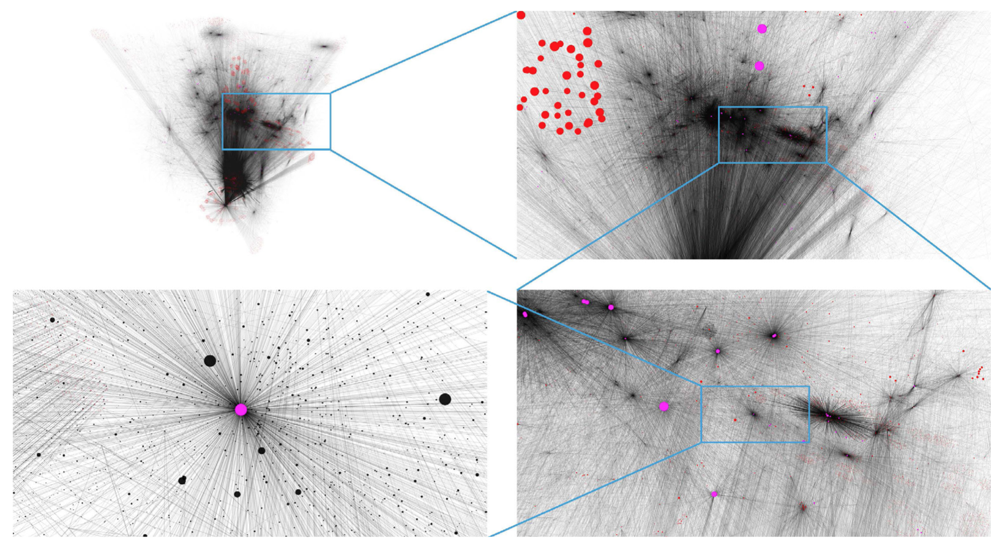
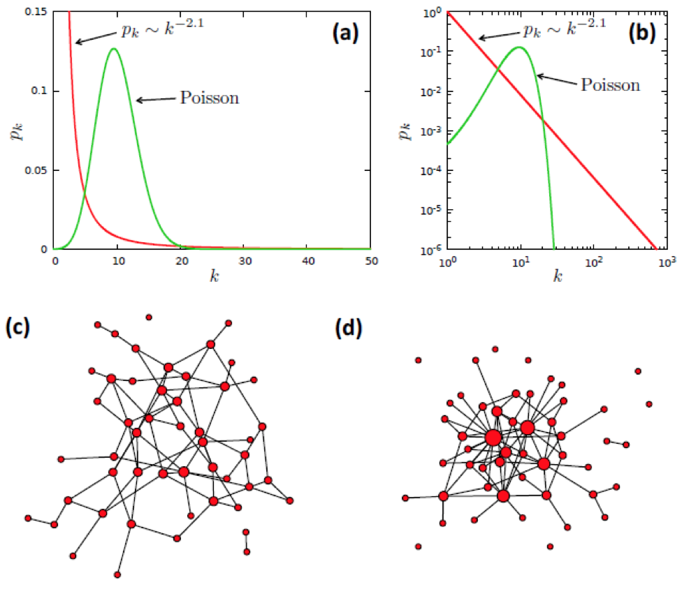
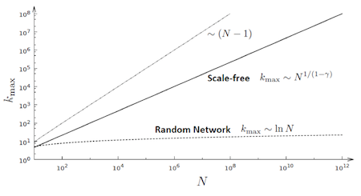
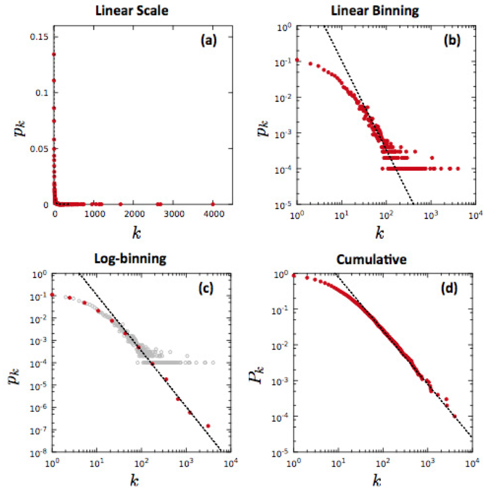
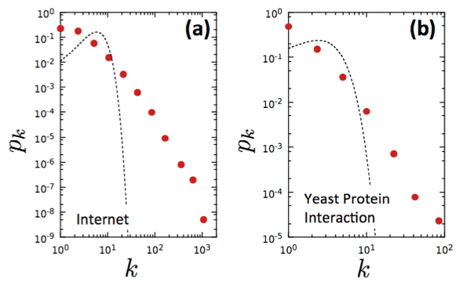
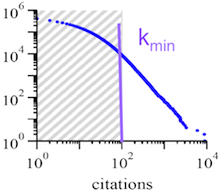
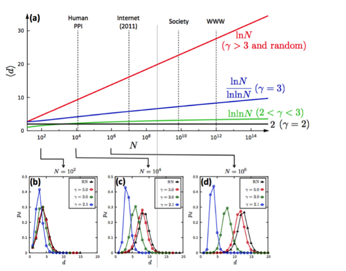
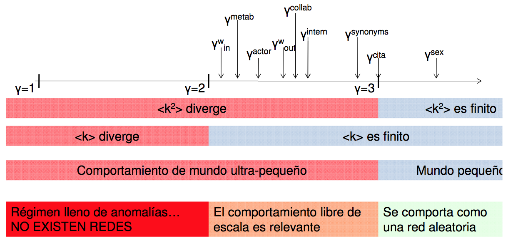
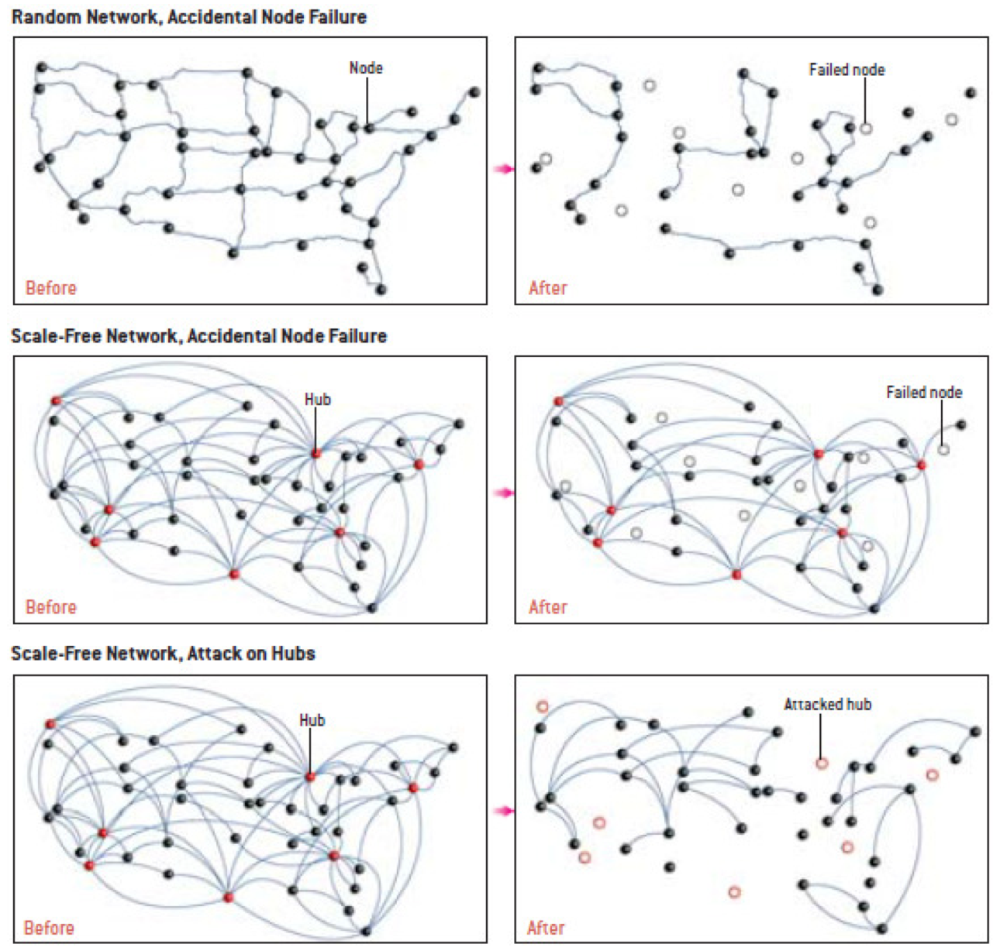

% Análisis de Redes Sociales
% Guillermo Jiménez Díaz (gjimenez@ucm.es); Alberto Díaz (albertodiaz@fdi.ucm.es)
% Curso 2016-17

# Prefacio {-}

Estos son los apuntes de la asignatura Análisis de Redes Sociales, impartida en la Facultad de Informática de la Universidad Complutense de Madrid por los profesores Guillermo Jiménez Díaz y Alberto Díaz, del Departamento de Ingeniería del Software e Inteligencia Artificial.

Este material ha sido desarrollado a partir de distintas fuertes, destacando como referencia principal el libro _Network Science_ de Laszlo Barabasi, el material de la asignatura _Social Network Analysis_, impartido por Lada Adamic a través de Coursera, y las transparencias de la asignatura Redes y Sistemas Complejos, creadas por Óscar Cordón García de la Universidad de Granada.

Este obra está bajo una [licencia de Creative Commons Reconocimiento-NoComercial-CompartirIgual 4.0 Internacional](http://creativecommons.org/licenses/by-nc-sa/4.0/).

\setcounter{chapter}{6}

# Tema 6: Redes libres de escala {-}

Tal y como hemos visto en el capítulo anterior el modelo de Erdös-Renyi o de red aleatoria presenta algunas propiedades que no se cumplen en las redes reales. De entre ellas destacamos que el modelo de redes aleatoria falla en cuanto a la distribución de grados, ya que no contempla la existencia de hubs o concentradores, nodos con un grado mucho mayor que el resto de nodos de la red.

En este tema vamos a estudiar un nuevo modelo de red que se ajusta mucho mejor a las redes reales, conocido como **redes libres de escala**.

## La WWW: el primer mapa de red no aleatoria

En 1999 un grupo de investigadores realizó el primer mapa de una porción de la WWW con el objetivo de verificar las propiedades de los modelos de red aleatoria en este sistema complejo de páginas y enlaces. Hasta aquel momento había razones suficientes para suponer que esta red seguía este modelo de red aleatoria. Compusieron el mapa del dominio `nd.edu`, con un total de 300000 documentos (nodos) y 1,5 millones de enlaces[^1].

[^1]: En <http://commoncrawl.org/> podéis descargar datasets más actuales, similares a este. De hecho, en [este blog](www.bigdatanews.com/profiles/blogs/big-data-set-3-5-billion-web-pages-made-available-for-all-of-us) ofrecen un dataset similar del año 2012, ya convertido en grafo, con ¡3500 millones de nodos y 128.000 millones de enlaces! 

Aunque a primera vista parecía que este mapa cumplía esa aleatoriedad predicha por el modelo, se pudo observar que, conviviendo con un gran número de nodos de grado pequeño, existían nodos con un número excepcional de enlaces: **los hubs o concentradores**. Recordemos que estos nodos son extremadamente improbables en las redes aleatorias por lo que este estudio dio lugar a replantearse que tal vez este modelo no era el que servía para modelar esta red. Así mismo, como veremos más adelante, se observó que estos hubs aparecen en otras muchas redes reales.

El análisis de los datos de la WWW muestra que la distribución de grados no se asemeja a la distribución de Poisson que predice el modelo de redes aleatorias sino que dicha distribución se asemeja más a una **ley potencial** o _power law_. Esta distribución se caracteriza por tener una cola mucho más ancha que una exponencial. La diferencia entre una y otra es mucho más clara si las representamos en una escala logarítmica (Figura \ref{fig:loglog}).

De acuerdo a esto, la distribución de grados en la WWW se puede representar como:

$$p_k \sim k^{-\gamma} \to log\: p_k \sim -\gamma \cdot log\: k$$

Como la WWW es una red dirigida podemos distinguir entre la distribución de grados de entrada y la distribución de grados de salida:

$$p_{k_{in}} \sim k^{-\gamma_{in}} \;\;\; p_{k_{out}} \sim k^{-\gamma_{out}}$$

De acuerdo a los datos usados por Barabasi y Albert se pudo estimar que $\gamma_{in} \approx 2,1$ mientras que $\gamma_{in} \approx 2,45$.

Lo realmente interesante de este estudio no fueron los datos resultantes obtenidos sino la gran diferencia entre la distribución esperada (una Poisson) y la distribución final obtenida (una ley potencial). En la Figura \ref{fig:poisson-pot} se observa claramente estas diferencias obtenidas:

Esto dio a entender que esta red real no se comportaba de acuerdo al modelo de red aleatoria sino que era "otro tipo de red".

## Redes libres de escala

Una **red libre de escala** es una red cuya distribución de grados sigue una ley potencial. Esta distribución se caracteriza por tener una larga cola. Para esta distribución se pueden emplear dos formulaciones distintas aunque las propiedades de la red son independientes del formalismo empleado.

El primer informe relacionado con una función de ley potencial fue realizado por Pareto (conocido por la ley 80/20), donde destacaba que durante el siglo XIX, el 80% del dinero en Italia estaba en manos de solo un 20% de la población.

### Formalismo discreto

En este caso consideramos que el grado de un nodo es siempre un entero positivo ($K=0,1,2\dots$). De acuerdo a esto, la probabilidad de que un nodo aleatorio tenga grado $k$ se puede expresar como:

$$p_k = C \cdot k^{-\gamma}$$

La constante C se puede calcular teniendo en cuenta que $\sum_{k=1}^{\infty}{p_k} = 1$:

$$C = \frac{1}{\sum_{k=1}^{\infty}{k^{-\gamma}}} = \frac{1}{\varsigma(\gamma)}$$

donde $\varsigma(\gamma)$ es la función Zeta de Riemann.

Para valores de $k>0$ se cumple que la función de distribución es:

$$p_k = \frac{k^{-\gamma}}{\varsigma(\gamma)}$$

Los nodos aislado ($k=0$) tienen que tratarse de manera independiente.

### Formalismo continuo

En este formalismo consideramos que $k$ puede tomar cualquier valor real positivo. En este caso:

$$p(k) = C \cdot k^{-\gamma}$$

La constante C se puede calcular teniendo en cuenta que $\int_{k_{min}}^{\infty}{p(k)dk} = 1$:

$$C = \frac{1}{\int_{k_{min}}^{\infty}{k^{-\gamma}dk}} = (\gamma -1)\cdot k_{min}^{\gamma -1}$$

De acuerdo a esto, la función de distribución según el formalismo continuo es:

$$p(k)= (\gamma -1)\cdot k_{min}^{\gamma -1}\cdot k^{\gamma -1}$$

Donde $k_{min}$ es el menor grado de la red (o función de distribución). En este caso, la función de distribución se ha de interpretar como la probabilidad de que un nodo tenga un grado entre dos valores $k_1$ y $k_2$:

$$\int_{k_1}^{k_2}{p(k)dk}$$

## Hubs en las redes libres de escala

La principal diferencia entre la función de distribución en una red aleatoria frente a la de una red libre de escala es la cola de la distribución. La principal implicación de esta cola es que las redes libres de escala contemplan la existencia de **hubs**, algo poco probable en una red aleatoria (Figura \ref{fig:dist}).

Analizando las distribuciones de grados de ambas redes más en detalle podemos ver que:

* La red libre de escala presenta una probabilidad de la existencia de nodos con un $k$ pequeño mayor que en una red aleatoria (donde la probabilidad de estos nodos es casi nula).
* La red aleatoria tiene una mayor probabilidad de tener nodos con un grado $k \sim \langle k \rangle$ que la red libre de escala (ya que la función de distribución de la primera está por encima de la segunda)
* La red libre de escala presenta una mayor probabilidad de que existan nodos con $k$ muy alto. De hecho, la probabilidad de que existan hubs en una red libre de escala es varios órdenes de magnitud mayor que en una red aleatoria (aunque este hecho no se aprecia en la escala lineal podemos verlo claramente reflejado en la escala logarítmica)

A modo de ejemplo, si usamos los datos de la WWW y suponemos que es una red aleatoria (donde hemos calculado que $\langle k \rangle = 4,6$):

* La probabilidad de que un nodo tenga 100 enlaces es $p_{aleatoria}(100)=10^{-30}$.
* Sin embargo, suponiendo que es una red libre de escala esta probabilidad desciende a $p_{libre-escala}(100)=10^{-4}$.

Para cualquier $p_k$ podemos calcular el máximo grado esperado $k_{max}$, es decir, el grado del mayor hub existente en la red:

* Si suponemos que tenemos una red aleatoria **con una distribución de grados $p_k$ exponencial** entonces tenemos que:
    $$p_k = C \cdot e^{-\lambda k}: \;\; k_{max}= k_{min} + \frac{lnN}{\lambda}$$
    El tamaño del hub más grande ($k_{max}$) depende de $lnN$, que es una función que crece suavemente, por lo que hay muy poca diferencia entre $k_{min}$ y $k_{max}$. Esto implica que no hay hubs.

* Si suponemos que tenemos una red aleatoria **con una distribución de grados $p_k$ que sigue una Poisson** entonces tenemos que la dependencia de $k_{max}$ es aún más suave por lo que hay aún menor diferencia entre $k_{min}$ y $k_{max}$.
* Si suponemos que tenemos una red libre de escala y, por tanto, **con una distribución de grados $p_k$ de ley potencial** entonces tenemos que:
    $$p(k) = C \cdot k^{-\gamma}:\;\; k_{max}\sim k_{min} \cdot N^{\frac{1}{\gamma -1}}$$
    En este caso, el tamaño del hub mayor depende de $N$. Esto implica que cuanto mayor es la red mayor es el grado del hub más grande.

De nuevo, si tomamos los datos de una muestra de la WWW con $N=3\cdot10^5$ nodos:

$$k_{max}\approx 13 \;\;\text{ si la red es aleatoria}$$

$$k_{max}\approx 85000 \;\;\text{ si la red es libre de escala}$$

Podemos ver gráficamente esta dependencia:

A modo de resumen podemos decir que las redes aleatorias están "acotadas", en el sentido de que todos sus nodos tienen un grado similar y la existencia de hubs es muy improbable. En cambio, las redes libres de escala no están "acotadas" (son libres, de ahí su nombre como veremos en la próxima sección) y se espera que existan hubs junto con nodos de grado muy pequeño. Además hemos visto que el tamaño de la red influye en el tamaño de los hubs. Más gráficamente podemos comparar la red de carreteras de EEUU (una red aleatoria) frente a la red de tráfico aéreo del mismo país (red libre de escala). Como veremos más adelante, el tipo de red afecta a las distancias y a la forma en la que se navega por ellas.

### Origen del término

El término "libre de escala" está relacionado con los momentos de la distribución de probabilidad de grados.

$$\langle k^n \rangle = \sum_{k_{min}}^{\infty}{k^np_k}=\int_{k_{min}}^{\infty}{k^np(k)dk}$$

Recordemos que:

* n=1: El primer momento es el grado medio ($\langle k \rangle$).
* n=2: el segundo momento es la varianza ($\sigma^2 = \langle k^2 \rangle - \langle k \rangle^2$), la cual mide la dispersión de los grados. Su raíz cuadrada es la desviación típica ($\sigma$)
* n=3: el tercer momento $\langle k^3 \rangle$ determina la asimetría, es decir, cómo de simétrica es p_k alrededor de la  media (si la función es simétrica entonces $\langle k^3 \rangle=0$)

En una red libre de escala el momento n-ésimo es:

$$\langle k^n \rangle = \int_{k_{min}}^{k_{max}}{k^np(k)dk} = C \frac{k_{max}^{n-\gamma+1} - k_{min}^{n-\gamma+1}}{n-\gamma + 1}$$

Como ya hemos deducido anteriormente, $k_{max}$ crece con el tamaño de la red por lo que analizaremos su comportamiento en el límite $k_{max} \to \infty$:

$$\langle k^n \rangle = \frac{(\gamma -1)}{(n-\gamma- 1)} k_{min}^{\gamma-1} \Big[ k^{n-\gamma+1}\Big]_{k_{min}}^\infty$$

De aquí se deduce que:

* Si $n-\gamma+1 \leq 0$ entonces el momento está acotado, por lo que todos los momentos en los que $n \leq \gamma+1$ son finitos.
* Si $n-\gamma+1 > 0$ entonces el momento tiende a infinito según la red crece, por lo que todos los momentos en los que $n > \gamma+1$ divergen.

El uso de los datos de distintas redes reales (Figura \ref{fig:tablaReales}) muestra que el exponente del grado $\gamma$ tiene un valor entre 2 y 3. Según lo anterior se deduce que el primer momento ($\langle k \rangle$) es finito pero que la varianza (segundo momento o $\langle k^2 \rangle$) y el resto de momentos tienden a infinito. Si esto es así entonces resulta que los valores medios no tienen realmente sentido ya que hay fluctuaciones demasiado grandes. La escala interna (la media) no tiene sentido por lo que es una red "libre de escala".

Más adelante estudiaremos más en detalle la implicación del valor del exponente $\gamma$.

## Universalidad en las redes libres de escala

Aunque hemos dicho que la primera red en la que se vio la propiedad de ser libre de escala fue la WWW, realmente existe un trabajo anterior de 1965 en el que Price ya constata esta propiedad en las redes científicas. Sin embargo fue el estudio de Barabasi sobre la WWW la que le dio este nombre. Tras el estudio de esta red real (WWW) se comprobó que no era un caso aislado sino que existen un gran número de redes que cumplen la propiedad de ser libres de escala. En 1999 se estudian, además de la WWW, la red de Internet (la red física de routers) y la de actores, observando esta misma propiedad. Posteriormente se continúa su estudio en múltiples redes biológicas, tecnológicas y sociales: redes de interacción entre proteínas, comunidades virtuales, redes metabólicas, circuitos eléctricos, etc. Algunas de las últimas en ser estudiadas y presentar también esta propiedad fueron Twitter (2010) y Facebook (2011).

En todas ellas se ha observado que hay diferencias de varios órdenes de magnitud entre los nodos con menor y mayor grado. Una observación más detallada muestra que:

* Los exponentes $\gamma$ de las funciones de distribución de grados son similares independientemente del dominio de la red.
* La mayoría de los exponentes varían entre 2 y 3.
* Las redes estudiadas muestran características comunes

Sin embargo hay que recalcar que **no todas las redes son libres de escala**. Si nos fijamos en la tabla de la Figura \ref{fig:tablaReales} vemos que algunas redes como la de  la red eléctrica (_Power grid_) no cumplen la propiedad de ser libre de escala. Otras redes que tampoco son libres de escala son las redes existentes en materiales (enlaces atómicos que conforman estructuras cristalinas y amorfas) o en la red neuronal del gusano _C.elegans_.

Generalmente, esta propiedad no aparece en redes en las que existe una limitación en el número de enlaces que un nodo puede tener (como la red eléctrica o la estructura atómica).

### Identificación de las redes libres de escala

Ante cualquier nueva red estudiada deberíamos verificar si cumple la propiedad de ser libre de escala. Para esto deberíamos hacer lo siguiente:

#### Representar gráficamente la distribución de grados. {-}

Dada una red real de $N$ nodos tendremos que calcular el grado de cada nodo y calcular los distintos $N_k$ (número de nodos con grado $k$) para todos los valores de $k$ que encontremos en la red. Con ello calcularemos los distintos $p_k = \frac{N_k}{N}$ y lo representaremos gráficamente de tal modo que el eje de abcisas (X) representa los valores de $k$ y el eje de ordenadas (Y) representa el valor $p_k$. Como ya hemos dicho, una representación lineal puede que comprima el grafo por lo que es recomendable usar una escala logarítmica. Una escala logarítmica pura (log $p_k$ en función de log $k$) suele ser difícil de leer por lo que se puede usar una escala logarítmico-aritmética con potencias de 10 (si $log(1000)=3$ entonces en el eje escribimos $10^3$).

La representación en escala logarítmica se conoce como _linear binning_. El problema de esta gráfica es que aparecen mesetas (_plateau_) para los valores de $k$ grandes. Esto se debe a que solo hay 0 ($N_k=0$) o 1 ($N_k=1$) nodos para cada uno de estos grados. Los primeros no se representan (si $N_k=0 \to p_k=0$) pero los segundos crean mesetas en el valor $p_k = \frac{1}{N}$. Esto puede hacer que no se pueda estimar correctamente el exponente.

Una alternativa es hacer lo que se conoce como un _log-binning_. En lugar de contar los $k$ de uno en uno, los agrupamos por cubos (o _bins_) de tamaño variable:

* $b_0 = 1$: contiene los nodos con $k=1$
* $b_1 = 2$: contiene los nodos con $k \in \{2, 3\}$
* $b_2 = 4$: contiene los nodos con $k \in \{4, 5, 6, 7\}$
* En general, $b_n = 2^n$ y contiene los nodos con $k \in \{2^n, 2^n+1, \dots, 2^{n+1}-1\}$

En este caso, en la gráfica representaremos $p_{\langle k_n \rangle} = \frac{N_n}{b_n}$, donde $\langle k_n \rangle$ es el grado medio del cubo n-ésimo, $N_n$ es el número de nodos en el cubo n-ésimo y $b_n$ es el tamaño del cubo.

Esta representación palía parcialmente el problema anterior pero siguen apareciendo mesetas.

La última alternativa es mostrar la distribución acumulada:

$$p_x = \sum_{q=k}^{\infty}P_q$$

Si $p_k$ sigue una distribución de ley potencial entonces:

$$p_x \sim k^{-\gamma+1}$$

Esta distribución elimina las mesetas y nos permite estimar más fácilmente el exponente de la distribución.

#### Comprobar que la distribución sigue realmente una ley potencial. {-}

Una vez que hemos representado la distribución necesitamos comprobar que realmente sigue una ley potencial por lo que dibujaremos en las gráficas las distribuciones de Poisson o exponenciales equivalentes (usando el valor $\langle k \rangle$ de la red) para ver que realmente son distintas.

Algunas distribuciones solo presentan la propiedad de ley potencial en la cola por lo que hay que estimar el valor inicial ($k_{min}$) a partir del cual la distribución de grados exhibe esa propiedad de ley potencial. Recordemos que $k_{min}>0$ ya que $k^{-\gamma} = \infty$ para $k=0$.

#### Calcular el valor del exponente de la función {-}

Una forma sencilla de aproximar el valor del exponente es buscando la línea recta que se ajusta al gráfico logarítmico. Esto puede introducir cierto error por lo que se pueden usar otras técnicas más precisas que quedan fuera de los objetivos de este curso (pero que se pueden consultar en el anexo 4.C del capítulo 4 del libro de Barabasi).

## Propiedad de los mundos ultra-pequeños

La existencia de hubs en las redes libres de escala modifica las distancias dentro de la red con respecto al modelo aleatorio. Intuitivamente, y volviendo al ejemplo del transporte, podemos ver que si vamos por carretera de una ciudad a otra en EEUU pasaremos por muchas ciudades (red aleatoria) mientras que la red aeroportuaria crea hubs (como el aeropuerto de Chicago) que reducen el número de saltos que tenemos que dar entre aeropuertos para ir de una ciudad a otra.

Para demostrar esta idea tendremos que probar que las distancias en una red libre de escala es menor que las distancias en una red aleatoria. Si estudiamos el valor de la distancia media ($\langle d \rangle$) en función del valor del exponente $\gamma$ diferenciamos 4 regímenes (recordemos que $k_{max}\sim k_{min} \cdot N^{\frac{1}{\gamma -1}}$):

* $\langle d \rangle \sim const \text{ si }\gamma=2$
    El grado (o tamaño) del mayor hub es $k_{max}\sim N$. La mayoría de los nodos están conectados a él por lo que la distancia media es independiente del tamaño de la red.

* $\langle d \rangle \sim \frac{lnlnN}{ln(\gamma-1)} \text{ si }2<\gamma <3$
    Esto es lo que se conoce como **mundo ultra-pequeño**: la distancia media se incrementa en un orden menor que el logaritmo cuando el tamaño de la red aumenta. Recordemos que la distancia media en una red aleatoria aumenta en orden logarítmico cuando el tamaño de la red aumenta. Esto se debe a que la gran mayoría de los caminos pasan a través de unos pocos hubs, lo que reduce la distancia entre nodos.
    
    A modo de ejemplo, la red que conforma la población mundial tiene un tamaño de $N \approx 7\cdot 10^9$. Si consideramos que la red es aleatoria entonces $lnN = 22.6$. Sin embargo, si consideramos que es una red libre de escala entonces $lnlnN=3.12$.
* $\langle d \rangle \sim \frac{lnN}{lnlnN} \text{ si }\gamma =3$
    Este resultado representa un punto crítico. En este caso, <!--el segundo momento de la distribución ($\langle k^2 \rangle$) no diverge y--> las distancias vuelven a tener una dependencia logarítmica, similar a las de una red aleatoria (aunque levemente suavizadas).
* $\langle d \rangle \sim lnN \text{ si }\gamma >3$
    En este caso, <!-- el segundo momento de la distribución ($\langle k^2 \rangle$) --> es finito y la red se comporta como una red aleatoria. A pesar de este comportamiento en esta red siguen existiendo hubs, aunque estos no influyen significativamente en las distancias.

En resumen, las redes libres de escala en general reducen la distancia media de la red y modifican la dependencia de $\langle d \rangle$ con respecto al tamaño de la red. Cuando menor es el exponente $\gamma$ menor es la distancia entre nodos (y menor es la dependencia de $N$, si tiene un valor entre 2 y 3).

## Regímenes de las redes libres de escala

Como se puede ver, el valor del exponente $\gamma$ influye en algunas propiedades de las redes libres de escala. De acuerdo a los valores que puede tomar distinguimos 3 regímenes.

### Régimen anómalo {-}

Se produce cuando $\gamma \leq 2$. En este régimen casi no existen redes y sus propiedades son bastante anómalas. Por ejemplo, nos encontramos que el tamaño del mayor hub es mayor que el tamaño de la red $N$. Esto es algo que solo se puede producir cuando los hubs tienen ciclos o hay múltiples enlaces entre nodos. En este régimen tanto el primer como el segundo momento divergen.

### Régimen libre de escala {-}

Se produce cuando $2<\gamma <3$. En este caso, la propiedad libre de escala es manifiesta (el primer momento es finito pero el segundo momento diverge) y el tamaño de los hubs crece con el tamaño de la red. En este régimen se cumple la propiedad del mundo ultra-pequeño, de modo que las distancias son menores que en una red aleatoria.

### Régimen  de red aleatoria {-}

Se produce cuando $\gamma \geq 3$. Las redes libres de escala que se encuentran en este régimen son prácticamente indistinguibles de las aleatorias de igual tamaño. Cuanto mayor es el exponente, más pequeños y menos numerosos son los hubs. Además, implica que el tamaño del hub más grande ($k_{max}$) ha de ser entre $10^2 - 10^3$ veces mayor que el menor nodo ($k_{min}$), lo que implica que el tamaño ha de ser enorme. Por ejemplo, para $\gamma=5$ y una relación de $10^3$ entre la tamaño del mayor y del menos nodo necesitamos que $N \approx 10^{12}$.

$$k_{max}\sim k_{min} \cdot N^{\frac{1}{\gamma -1}};\;N=\Big(\frac{k_{max}}{k_{min}}\Big)^{5-1} \approx 10^{12}$$

Aunque estas redes no son muy frecuentes realmente existen. Ej: Red de llamadas móviles donde $N=4.6\cdot 10^6$ y $\gamma = 8.4$.

## Propiedades adicionales de las redes libres de escala

Debido a las divergencias que presentan las redes libres de escala se puede ver que estas redes son bastante robustas a fallos aleatorios y tienen un comportamiento anómalo con respecto a la propagación de virus.

**Desde el punto de vista de la robustez** (Figura \ref{fig:robustez}), las redes libres de escala son mucho más tolerantes a fallos accidentales (o aleatorios) que las redes aleatorias. Mientras que la eliminación aleatoria de algunos nodos en las segundas puede romper la red en múltiples componentes conexas, las redes libres de escala suelen permanecer conectadas tras la misma eliminación aleatoria de nodos. Sin embargo, las redes libres de escala son extremadamente vulnerables si se eliminan sus hubs, ya que en ese caso sí se produce la fractura del sistema.

**Desde el punto de vista de la propagación de virus** nos encontramos que en una red libre de escala (como puede ser la WWW) es prácticamente imposible erradicar un virus ya que las distancias cortas permiten la rápida propagación del mismo, evitando el aislamiento. Esto se puede utilizar también en el sentido opuesto ya que, si inmunizamos o vacunamos a los hubs frente a un virus entonces estaremos reduciendo su propagación.

> Por ejemplo, los profesores de esta Universidad tenemos campañas de vacunación contra la gripe (nos vacunan gratuitamente), no porque "seamos más importantes" y quieran que no nos contagiemos sino porque somos hubs en la transmisión de la enfermedad (cada día estamos conectados a varias decenas de alumnos).

## Resumen de las redes libres de escala

La distribución de grados $p_k$ nos ha ayudado a distinguir entre dos tipos de redes:

* Las redes "acotadas" son las que su distribución de grados decrece exponencialmente (o más rápido) a medida que crece $k$. Estas funciones de distribución suelen ser la exponencial, la gaussiana o la de Poisson, entre otras. Las redes aleatorias son un ejemplo de estas redes. Carecen de hubs y de nodos con grado muy bajo por lo que todos los nodos tienen un grado más o menos similar. Algunos ejemplos de redes reales que se comportan de esta forma son las redes de carreteras, las redes eléctricas y las redes atómicas, entre otras.
* Las redes "no acotadas" o libres de escala son aquellas cuya distribución de grados sigue una ley potencial. En estas redes existen (y se espera que existan) nodos de grado muy alto (hubs), conviviendo con nodos de grado varios órdenes de magnitud menor. El grado de los nodos no está acotado por lo que no se puede expresar con las funciones vistas anteriormente. Algunos ejemplos de redes reales que se comporten de esta forma son la WWW, las redes de interacción de proteínas, las redes de investigación, etc.
 
Como hemos podido ver, muchas de las redes reales presentan la propiedad de ser libres de escala. Los hubs son posibles en estas redes y afectan significativamente a las propiedades de la red. En particular, estas redes pueden presentar la propiedad de los mundos ultra-pequeños, ya que reducen las distancias entre nodos aún más que en las redes aleatorias.

Finalmente, podemos ver que las redes reales cumplen otra nueva ley que es la **propiedad libre de escala**:

> Muchas redes reales presentan distribuciones de cola ancha. Esto implica que nodos de grado bajo conviven con nodos con un grado excepcionalmente grande: los hubs.

