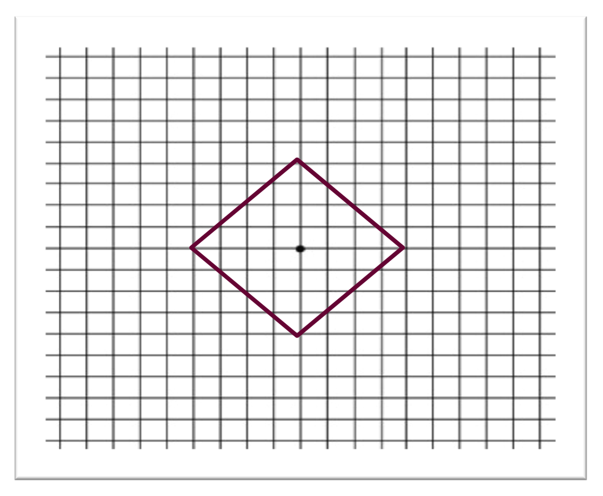

% Análisis de Redes Sociales
% Guillermo Jiménez Díaz (gjimenez@ucm.es); Alberto Díaz (albertodiaz@fdi.ucm.es)
% 28 de noviembre de 2014

# Prefacio {-}

Estos son los apuntes de la asignatura Análisis de Redes Sociales, impartida en la Facultad de Informática de la Universidad Complutense de Madrid por los profesores Guillermo Jiménez Díaz y Alberto Díaz, del Departamento de Ingeniería del Software e Inteligencia Artificial.

Este material ha sido desarrollado a partir de distintas fuertes, destacando como referencia principal el libro _Network Science_ de Laszlo Barabasi, el material de la asignatura _Social Network Analysis_, impartido por Lada Adamic a través de Coursera, y las transparencias de la asignatura Redes y Sistemas Complejos, creadas por Óscar Cordón García de la Universidad de Granada.

Este obra está bajo una [licencia de Creative Commons Reconocimiento-NoComercial-CompartirIgual 4.0 Internacional](http://creativecommons.org/licenses/by-nc-sa/4.0/).

\setcounter{section}{7}

# Tema 7: Mundos Pequeños {-}

Hemos visto que tanto el modelo de red aleatoria como los modelos de redes libres de escala cumplen la propiedad de **los pequeños mundos** o _small worlds_: la distancia entre dos nodos cualquiera de la red es sorprendentemente corta.

Sin embargo hay un hecho que se nos escapa y que habéis podido observar en la realización de las prácticas con vuestras propias redes sociales: en general, las redes sociales reales tienen un coeficiente de agrupamiento mucho mayor que las redes aleatorias (y que las libres de escala) a pesar de que la distancia media sigue siendo especialmente corta. Esto se debe al hecho de que en estas redes tendemos a agruparnos (los amigos de mis amigos son también mis amigos). Este hecho también se ha observado en otras redes reales, tal y como se puede ver en la siguiente tabla[^1].

[^1]: Puedes ver una tabla más completa en Albert, R., & Barabási, A. L. (2002). Statistical mechanics of complex networks. [Reviews of modern physics](http://journals.aps.org/rmp/abstract/10.1103/RevModPhys.74.47), 74(1), 47.

En este tema vamos a analizar este fenómeno y estudiaremos el modelo de Watts-Strogatz, el cual da una posible solución a este problema.

## Estructura y aleatoriedad

Recordemos que la el experimento de Milgram, descrito en el tema 2, fue la primera prueba de la propiedad de los pequeños mundos. Aunque se realizó en los años 60 y el número de 6 era extremadamente pequeño hubo estudios que se preguntaron si este número era, en verdad, tan pequeño como cabía suponer.

Como primera aproximación vamos a suponer que tenemos una red en el que el número de conocidos de cada individuo es constante. Según Pool y Kochen[^2] este número puede variar entre 500 y 1500. Si suponemos una estructura en forma de árbol tenemos que:

- Un individuo tiene 500 vecinos potenciales de primer grado
- $500^2$ = 250.000 vecinos potenciales para el segundo grado
- $500^3$ = 125.000.000 vecinos potenciales para el tercer grado

Es decir, existe un **crecimiento exponencial** de la red. El número de vecinos que tendríamos a distancia $d$ sería:

$$N(d) =1+\langle k \rangle+\langle k \rangle^2+\dots=\frac{\langle k \rangle^{d+1}-1}{\langle k \rangle-1} \sim \langle k \rangle^d$$

Esto implicaría que podríamos alcanzar a toda la población mundial como mucho en 4 pasos. En este caso, la distancia media $\langle k \rangle$ sería la predicha por una red aleatoria:

$$d_{max} \propto \frac{log N}{log \langle k \rangle}$$

[^2]: de Sola Pool, I., & Kochen, M. (1979). Contacts and influence. [Social networks](http://deepblue.lib.umich.edu/handle/2027.42/23764), 1(1), 5-51.

Sin embargo, tal y como hemos dicho al principio, tenemos que tener en cuenta que en las redes reales abundan los triángulos o **tripletes conectados** (_tradic closure_), es decir, que algunos de los enlaces no conectan con nuevas personas sino que conectan con amigos de mis amigos, reduciendo el número de personas a las que se puede alcanzar en cada paso y, por tanto, alargando los caminos mínimos. Gráficamente lo podríamos representar como en esta figura.

El caso extremo sería una red completamente _cliquish_, en la que todos los subgrafos estuviesen completamente conectados. En este caso, todos los amigos de mis amigos serían mis amigos y la distancia con ellos sería 1. Sin embargo, como no se permitiría ningún enlace fuera del clique la distancia con cualquier otro individuo de la red sería infinito.

Una forma de representar una red donde el coeficiente de agrupamiento es alto es mediante una cuadrícula bidimensional en la que unos nodos están conectados con otros como en la imagen:

En este caso, el número de nodos a distancia $d$ es polinomial:

$$N(d) = \sum_{x=1}^{d}4x = 2d(d+1)\sim d^2$$

Lo que implicaría que las distancias entre nodos sería, en general, muy grande.

Si nos preguntamos si puede una red con una estructura local muy fuerte ser a la vez un mundo pequeño, la respuesta es claramente sí, ya que esta es la forma en la que se comportan las redes sociales. Esta claro que, entonces, las redes reales están en un punto intermedio entre una red aleatoria y una red localmente estructurada. El modelo de Watts-Strogatz intenta precisamente modelar este hecho.

## Modelo de Watts-Strogatz

En 1998, los investigadores Duncan Watts y Steve Strogatz proponen un modelo basado en dos ideas básicas de las redes sociales:

- La homofilia o tendencia a conectarnos con otros que son como nosotros. Está directamente relacionado con los tripletes conectados ya que si dos personas en una red social tienen una persona en común, es muy probable que estas dos personas se conviertan en comunes o amigos (cerramos el triángulo).
- Los lazos débiles o _weak ties_, que son los enlaces a conocidos que nos conectan con partes de la red que, de otra forma, estarían muy lejos para nosotros.

La homofilia crea triángulos mientras que los lazos débiles producen "atajos" dentro de la estructura localmente fuerte.

El modelo de Watts- Strogatz permite generar redes con esta estructura de la siguiente manera:

1. Construimos una red en forma de retículo en anillo con $N$ nodos, cada uno con $\langle k \rangle$ vecinos y con $L=N \cdot \langle k \rangle /2$ enlaces.
2. Reasignamos cada uno de los enlaces con probabilidad $p$ de modo que no se pueden crear auntoenlaces ni enlaces múltiples. Una posible forma de hacerlo es, siguiendo el sentido horario, reasignar los $\langle k \rangle /2$ enlaces que hay a la derecha de cada nodo para los $N$ nodos.

Una variación a este modelo consiste en añadir enlaces aleatorios con probabilidad p, manteniendo el retículo inicial. Los resultados que describiremos a continuación son similares para ambas variantes.

Podemos ver que $p$ afecta a la estructura de la red. Dependiendo de $p$ (que, como siempre, toma valores entre 0 y 1) tendremos:

- Redes localmente estructuradas (p=0): Un mundo fuertemente agrupado y con distancias largas.
$$ \langle d \rangle =\frac{N}{2 \langle k \rangle}\text{;  } \langle C \rangle = \frac{3}{4}$$

- Redes completamente aleatorias (p=1). Mundo pequeño (distancias cortas) y con débil agrupamiento.

$$ \langle d \rangle =\frac{lnN}{ln \langle k \rangle}\text{;  } \langle C \rangle = \frac{\langle k \rangle}{N}$$

Lo que más nos interesa es entender qué pasa en medio de ambos extremos.

## Resumen

En este tema hemos podido ver que para entender la topología de la red es necesario describir cómo se ha formado la red. Hemos descrito un par de modelos de crecimiento, el de Price y del modelo de Barabasi-Albert, los cuales generan redes que cumplen la propiedad de ser libres de escala.

Hemos visto que estos modelos se caracterizan por tener crecimiento (el número de nodos crece con el tiempo) y por tener conexiones preferenciales (los nodos con mayor grado son preferidos a los nodos de menor grado). De acuerdo a esto podemos definir la siguiente ley:

> Las redes cuya distribución de grados sigue una ley potencial y que presentan hubs son consecuencia de un proceso de crecimiento y de conexión preferencial

