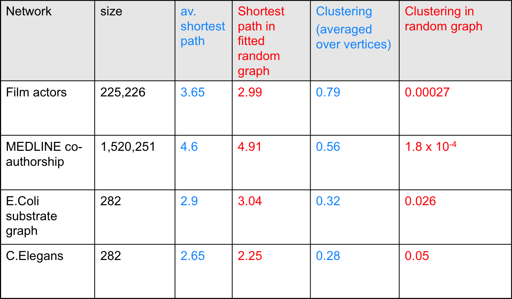
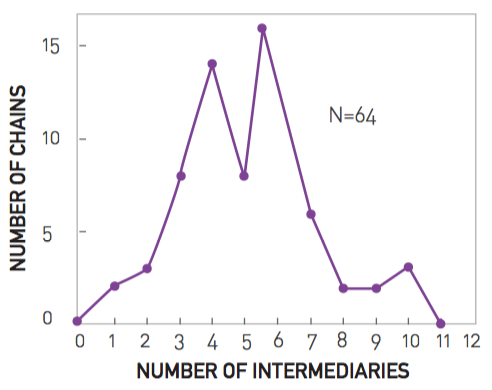
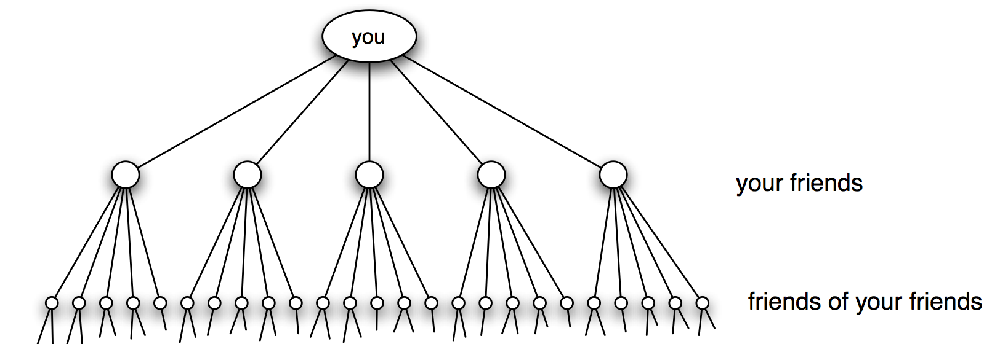
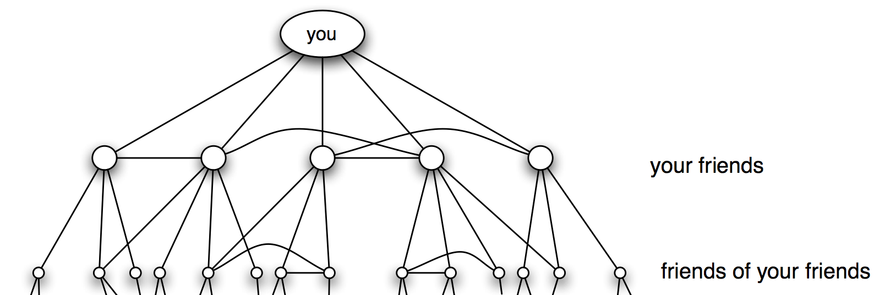
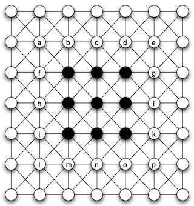
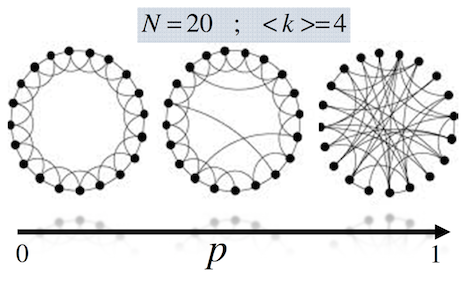
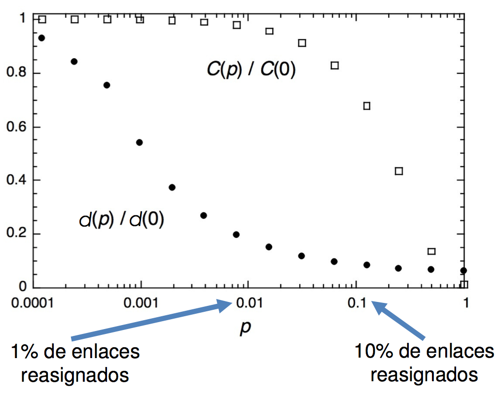

% Análisis de Redes Sociales
% Guillermo Jiménez Díaz (gjimenez@ucm.es); Alberto Díaz (albertodiaz@fdi.ucm.es)
% Curso 2016-17

# Prefacio {-}

Estos son los apuntes de la asignatura Análisis de Redes Sociales, impartida en la Facultad de Informática de la Universidad Complutense de Madrid por los profesores Guillermo Jiménez Díaz y Alberto Díaz, del Departamento de Ingeniería del Software e Inteligencia Artificial.

Este material ha sido desarrollado a partir de distintas fuertes, destacando como referencia principal el libro _Network Science_ de Laszlo Barabasi, el material de la asignatura _Social Network Analysis_, impartido por Lada Adamic a través de Coursera, y las transparencias de la asignatura Redes y Sistemas Complejos, creadas por Óscar Cordón García de la Universidad de Granada.

Este obra está bajo una [licencia de Creative Commons Reconocimiento-NoComercial-CompartirIgual 4.0 Internacional](http://creativecommons.org/licenses/by-nc-sa/4.0/).

\setcounter{chapter}{8}

# Tema 8: Mundos Pequeños {-}

Hemos visto que tanto el modelo de red aleatoria como los modelos de redes libres de escala cumplen la propiedad de **los pequeños mundos** o _small worlds_: la distancia entre dos nodos cualquiera de la red es sorprendentemente corta.

Sin embargo hay un hecho que se nos escapa: en general, las redes sociales reales tienen un coeficiente de agrupamiento mucho mayor que las redes aleatorias (y que las libres de escala) a pesar de que la distancia media sigue siendo especialmente corta. Esto se debe al hecho de que en estas redes tendemos a agruparnos (los amigos de mis amigos son también mis amigos). Este hecho también se ha observado en otras redes reales, tal y como se puede ver en la siguiente tabla[^1].

[^1]: Puedes ver una tabla más completa en Albert, R., & Barabási, A. L. (2002). Statistical mechanics of complex networks. [Reviews of modern physics](http://journals.aps.org/rmp/abstract/10.1103/RevModPhys.74.47), 74(1), 47.

En este tema vamos a analizar este fenómeno y estudiaremos el modelo de Watts-Strogatz, el cual da una posible solución a este problema.

## Los 6 grados de separación

Como ya hemos visto hasta ahora, la propiedad de **los pequeños mundos** o _small worlds_ sugiere que la distancia entre dos nodos cualquiera de la red es sorprendentemente corta. 

Este fenómeno se sugirió por primera vez en una historia de un escritor y periodista húngaro, Frigyes Karinthy, en 1929, en el que explicaba cómo era capaz de unir a un premio Nobel con él mismo contando los "apretones de manos" (_handshakes_) entre personas:

> Look, Selma Lagerlöf just won the Nobel Prize for Literature, thus she is bound to know King Gustav of Sweden. After all he is the one who handed her the Prize, as required by tradition. King Gustav, to be sure, is a passionate tennis player, who always participates in international tournaments. He is known to have played Mr. Kehrling, whom he must therefore know for sure, and as it happens I myself know Mr. Kehrling quite well.
> 
> The worker knows the manager in the shop, who knows Ford; Ford is on friendly terms with the general director of Hearst Publications, who last year became good friends with Arpad Pasztor, someone I not only know, but to the best of my knowledge a good friend of mine. So I could easily ask him to send a telegram via the general director telling Ford that he should talk to the manager and have the worker in the shop quickly hammer together a car for me, as I happen to need one.

Este fenómeno también se conoce como el de _los 6 grados de separación_. Indica que si eligiésemos al azar dos personas del planeta, por muy lejos que estuviesen, estarían a 6 "conocidos" de distancia entre sí. Esta frase se debe a un estudio realizado por Stanley Milgram realizado en 1967. En él se proponía hacer llegar una carta a un par de personas de Boston y Sharon (Massachusetts), a base de que una persona cualquiera (desde cualquier punto de Estado Unidos) fuese enviando la carta a aquellos familiares, amigos o conocidos que más se "acercaran" a la persona objetivo. Estas eran las instrucciones originales:

> HOW TO TAKE PART IN THIS STUDY
> 
> 1. ADD YOUR NAME TO THE ROSTER AT THE BOTTOM OF THIS SHEET, so that the next person who receives this letter will know who it came from.
> 2. DETACH ONE POSTCARD. FILL IT AND RETURN IT TO HARVARD UNIVERSITY. No stamp is needed. The postcard is very important. It allows us to keep track of the progress of the folder as it moves toward the target person.
> 3. IF YOU KNOW THE TARGET PERSON ON A PERSONAL BASIS, MAIL THIS FOLDER DIRECTLY TO HIM (HER). Do this only if you have previously met the target person and know each other on a first name basis. 
> 4. IF YOU DO NOT KNOW THE TARGET PERSON ON A PERSONAL BASIS, DO NOT TRY TO CONTACT HIM DIRECTLY. INSTEAD, MAIL THIS FOLDER (POST CARDS AND ALL) TO A PERSONAL ACQUAINTANCE WHO IS MORE LIKELY THAN YOU TO KNOW THE TARGET PERSON. You may send the folder to a friend, relative or acquaintance, but it must be someone you know on a first name basis.

Se enviaron 296 cartas. La primera llegó en pocos días, pasando sólo por 2 enlaces. Al final llegaron 64 con un máximo de 12 intermediarios. La mediana de intermediarios fueron entre 5,5 y 6, por lo que de ahí viene la idea de los 6 grados de separación (aunque el nombre proviene de una obra de teatro).

## Estructura y aleatoriedad

El experimento de Milgram fue la primera prueba de la propiedad de los pequeños mundos. Aunque se realizó en los años 60 y el número de 6 era extremadamente pequeño hubo estudios que se preguntaron si este número era, en verdad, tan pequeño como cabía suponer.

Como primera aproximación vamos a suponer que tenemos una red en el que el número de conocidos de cada individuo es constante. Según Pool y Kochen[^2] este número puede variar entre 500 y 1500. Si suponemos una estructura en forma de árbol tenemos que:

- Un individuo tiene 500 vecinos potenciales de primer grado
- $500^2$ = 250.000 vecinos potenciales para el segundo grado
- $500^3$ = 125.000.000 vecinos potenciales para el tercer grado

Es decir, existe un **crecimiento exponencial** de la red. El número de vecinos que tendríamos a distancia $d$ sería:

$$N(d) =1+\langle k \rangle+\langle k \rangle^2+\dots=\frac{\langle k \rangle^{d+1}-1}{\langle k \rangle-1} \sim \langle k \rangle^d$$

Esto implicaría que podríamos alcanzar a toda la población mundial como mucho en 4 pasos. En este caso, la distancia media $\langle k \rangle$ sería la predicha por una red aleatoria:

$$d_{max} \propto \frac{log N}{log \langle k \rangle}$$

[^2]: de Sola Pool, I., & Kochen, M. (1979). Contacts and influence. [Social networks](http://deepblue.lib.umich.edu/handle/2027.42/23764), 1(1), 5-51.

Sin embargo, tenemos que tener en cuenta que en las redes reales abundan los triángulos o **tripletes conectados** (_tradic closure_), es decir, que algunos de los enlaces no conectan con nuevas personas sino que conectan con amigos de mis amigos, reduciendo el número de personas a las que se puede alcanzar en cada paso y, por tanto, alargando los caminos mínimos. Gráficamente lo podríamos representar como en esta figura.

El caso extremo sería una red completamente _cliquish_ o _localmente estructurada_, en la que todos los subgrafos estuviesen completamente conectados. En este caso, todos los amigos de mis amigos serían mis amigos y la distancia con ellos sería 1. Sin embargo, como no se permitiría ningún enlace fuera del clique la distancia con cualquier otro individuo de la red sería infinito.

Una forma de representar una red donde el coeficiente de agrupamiento es alto es mediante una cuadrícula bidimensional en la que unos nodos están conectados con otros como en la Figura \ref{fig:cuadricula}.

En este caso, el número de nodos a distancia $d$ es polinomial:

$$N(d) = \sum_{x=1}^{d}8x = 4d(d+1)\sim d^2$$

Lo que implicaría que las distancias entre nodos sería, en general, muy grande.

Si nos preguntamos si puede una red con una estructura local muy fuerte ser a la vez un mundo pequeño, la respuesta es claramente sí, ya que esta es la forma en la que se comportan las redes sociales. Esta claro que, entonces, las redes reales están en un punto intermedio entre una red aleatoria y una red localmente estructurada. El modelo de Watts-Strogatz intenta precisamente modelar este hecho.

## Modelo de Watts-Strogatz

En 1998, los investigadores Duncan Watts y Steve Strogatz proponen un modelo basado en dos ideas básicas de las redes sociales:

- La homofilia o tendencia a conectarnos con otros que son como nosotros. Está directamente relacionado con los tripletes conectados ya que si dos personas en una red social tienen una persona en común, es muy probable que estas dos personas se conviertan en comunes o amigos (cerramos el triángulo).
- Los lazos débiles o _weak ties_, que son los enlaces a conocidos que nos conectan con partes de la red que, de otra forma, estarían muy lejos para nosotros.

La homofilia crea triángulos mientras que los lazos débiles producen "atajos" dentro de la estructura localmente fuerte.

El modelo de Watts- Strogatz permite generar redes con esta estructura de la siguiente manera:

1. Construimos una red en forma de retículo en anillo con $N$ nodos, cada uno con $\langle k \rangle$ vecinos y con $L=N \cdot \langle k \rangle /2$ enlaces.
2. Reasignamos cada uno de los enlaces con probabilidad $p$ de modo que no se pueden crear autoenlaces ni enlaces múltiples. Una posible forma de hacerlo es, siguiendo el sentido horario, reasignar los $\langle k \rangle /2$ enlaces que hay a la derecha de cada nodo para los $N$ nodos.

<!-- Tienes una simulación del modelo en <http://www.ladamic.com/netlearn/NetLogo4/SmallWorldWS.html>.
 -->
Una variación a este modelo consiste en añadir enlaces aleatorios con probabilidad p, manteniendo el retículo inicial. Los resultados que describiremos a continuación son similares para ambas variantes.

Podemos ver que $p$ afecta a la estructura de la red. Dependiendo de $p$ (que, como siempre, toma valores entre 0 y 1) tendremos:

- Redes localmente estructuradas (p=0): Un mundo fuertemente agrupado y con distancias largas.
$$ \langle d \rangle =\frac{N}{2 \langle k \rangle}\text{;  } \langle C \rangle = \frac{3}{4}$$

- Redes completamente aleatorias (p=1). Mundo pequeño (distancias cortas) y con débil agrupamiento.

$$ \langle d \rangle =\frac{lnN}{ln \langle k \rangle}\text{;  } \langle C \rangle = \frac{\langle k \rangle}{N}$$

Lo que más nos interesa es entender qué pasa en medio de ambos extremos.

### Estudio del modelo

Para analizar el modelo se realizó un estudio de la evolución del coeficiente de agrupamiento y de la distancia media para distintos valores de $p$, comparándolos con los valores iniciales. El resultado conseguido se puede ver en la gráfica de la Figura \ref{fig:evol-cagrup}.

* Como se puede ver, hay una reducción muy rápida de la distancia media debida a la aparición de esos enlaces aleatorios, que hacen de atajos dentro de la red.
* El coeficiente de agrupamiento, sin embargo, se reduce mucho más suavemente a medida que aparecen estos enlaces aleatorios.

Lo más llamativo de este resultado es que solo unos pocos enlaces aleatorios bastan para reducir la distancia media, conservando la estructura local prácticamente intacta. En el gráfico se puede ver que una aleatoriedad del 1% (p=0.01) es suficiente para reducir drásticamente la distancia media. Sin embargo, el coeficiente de agrupamiento comienza a decrecer en torno a una aleatoriedad del 10% (p=0.1).

### Debilidades del modelo

Aunque este modelo cumple el comportamiento previsto ya que tiene en cuenta el alto coeficiente de agrupamiento observado en las redes reales junto con la propiedad de mundos pequeños, tiene también algunas debilidades:

- No presenta una distribución realista de los grados ya que, como las redes aleatorias, no tiene en cuenta la existencia de hubs.
- Los enlaces largos (los atajos) son menos frecuentes que los cortos. En el mundo real esto no tiene por qué ser así. Podemos pensar, por ejemplo, en las redes aeroportuarias.
- No se tiene en cuenta otras propiedades de las redes reales como las estructuras jerárquicas o los grupos.

Existen otros modelos más complejos en los que la probabilidad por la que se unen dos nodos dependen de la distancia entre dichos nodos, de la estructura organizativa o usando funciones que pretenden optimizar unas determinadas características de la red (como la distancia media frente a la distancia física entre los nodos). Sea como fuere, estos modelos generan redes que siguen cumpliendo la propiedad de los pequeños mundos y de la estructura local y, en algunos casos, generan redes más parecidas a las reales ya que presentan hubs. El estudio de estos modelos queda fuera del temario de la asignatura pero si se desea conocer algo más al respecto es conveniente leer los siguientes artículos:

- Kleinberg, J. (2000, May). [The small-world phenomenon: An algorithmic perspective](http://www.google.es/url?sa=t&rct=j&q=&esrc=s&source=web&cd=1&cad=rja&uact=8&ved=0CDYQFjAA&url=http%3A%2F%2Fwww.cs.cornell.edu%2Fhome%2Fkleinber%2Fswn.pdf&ei=K0h3VMjlC8rZas2egegC&usg=AFQjCNFUVXfxJsFEFh-rpDV9cklRbm6UiA&sig2=2J5Tjfps_piM9y5OOFdSeA&bvm=bv.80642063,d.d2s). In Proceedings of the thirty-second annual ACM symposium on Theory of computing (pp. 163-170). ACM.
- Kleinberg, J. (2002). [Small-world phenomena and the dynamics of information](https://www.google.es/url?sa=t&rct=j&q=&esrc=s&source=web&cd=1&cad=rja&uact=8&ved=0CCgQFjAA&url=https%3A%2F%2Fwww.cs.cornell.edu%2Fhome%2Fkleinber%2Fnips14.pdf&ei=VUh3VPXqCsrZas2egegC&usg=AFQjCNFmiN7cLoDO7gS3OIKGlCZ-wTbpPg&sig2=t4rmeLjx3yB2LclF0PVN-g&bvm=bv.80642063,d.d2s). Advances in neural information processing systems, 1, 431-438.
- Watts, D. J., Dodds, P. S., & Newman, M. E. (2002). Identity and search in social networks. science, 296(5571), 1302-1305.
- Mathias, N., & Gopal, V. (2001). [Small worlds: How and why](http://journals.aps.org/pre/abstract/10.1103/PhysRevE.63.021117). Physical Review E, 63(2), 021117.
- Gastner, M. T., & Newman, M. E. (2006). [The spatial structure of networks](http://www.google.es/url?sa=t&rct=j&q=&esrc=s&source=web&cd=1&cad=rja&uact=8&ved=0CCgQFjAA&url=http%3A%2F%2Fwww.stat.berkeley.edu%2F~aldous%2F206-SNET%2FPapers%2Fgaster_newman_2004.pdf&ei=i0l3VPv5Fc_TaMr7gogB&usg=AFQjCNHAD90sancHiM4m8sitHIS0anA0bg&sig2=7cDXRbyaL2UqHStnlymtXw&bvm=bv.80642063,d.d2s). The European Physical Journal B-Condensed Matter and Complex Systems, 49(2), 247-252.