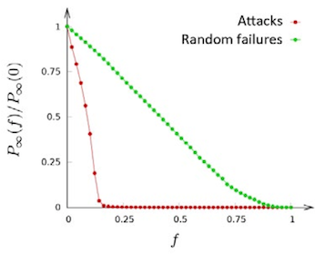
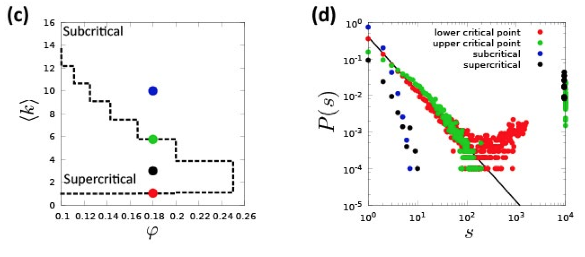
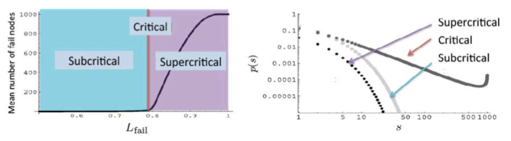

% Análisis de Redes Sociales
% Guillermo Jiménez Díaz (gjimenez@ucm.es); Alberto Díaz (albertodiaz@fdi.ucm.es)
% 9 de enero de 2015

# Prefacio {-}

Estos son los apuntes de la asignatura Análisis de Redes Sociales, impartida en la Facultad de Informática de la Universidad Complutense de Madrid por los profesores Guillermo Jiménez Díaz y Alberto Díaz, del Departamento de Ingeniería del Software e Inteligencia Artificial.

Este material ha sido desarrollado a partir de distintas fuertes, destacando como referencia principal el libro _Network Science_ de Laszlo Barabasi, el material de la asignatura _Social Network Analysis_, impartido por Lada Adamic a través de Coursera, y las transparencias de la asignatura Redes y Sistemas Complejos, creadas por Óscar Cordón García de la Universidad de Granada.

Este obra está bajo una [licencia de Creative Commons Reconocimiento-NoComercial-CompartirIgual 4.0 Internacional](http://creativecommons.org/licenses/by-nc-sa/4.0/).

\setcounter{section}{9}

# Tema 9: Robustez de las redes {-}

El fallo de un componente sencillo en un sistema complejo puede provocar un error o un fallo general de todo el sistema. Sin embargo, muchos sistemas naturales y sociales tienen la capacidad de permanecer inmutables aunque varios de sus componentes fallen. En la mayoría de estos sistemas, la robustez se consigue gracias a densas interconexiones entre los componentes.

En este tema veremos el rol de las redes con el fin de asegurar la robustez de un sistema complejo. Veremos que la estructura de la red es una de las características básicas que hay que entender para conocer la robustez del sistema y para conocer sus debilidades en caso de ataques premeditados. Así mismo, estudiaremos los comportamientos de fallo en cascada y las leyes que lo gobiernan.

## Robustez, errores y ataques

La robustez implica entender cómo se va a comportar una red en caso de que eliminemos nodos de la misma. En particular, vamos a fijarnos en la red desde dos puntos de vista distintos:

- **Fragmentación de la red**, es decir, cómo se rompe la red en comunidades aisladas a medida que eliminamos nodos.
- **Tolerancia a errores**, es decir, cómo de largas pasan a ser las distancias en la red a medida que eliminamos nodos.

Así mismo, estudiaremos la robustez con respecto a **errores** y **ataques**. Los _errores_ hacen que se eliminen nodos de manera aleatoria. Sin embargo, los _ataques_ consisten en la eliminación de nodos seleccionándolos de una manera deliberada.

## Robustez en redes aleatorias

Primeramente vamos a estudiar cómo se comporta la robustez en una red aleatoria. Para ello vamos a estudiar un tipo muy particular de redes aleatorias relacionadas con la _Teoría de la Percolación_ (Percolation theory).

### Teoría de la percolación

Suponemos que tenemos una cuadrícula y que en cada intersección podemos poner un nodo. Dos nodos estarán conectados si están en intersecciones adyacentes. Podemos construir una red aleatoria a partir de esta cuadrícula decidiendo si ponemos o no un nodo en cada intersección con probabilidad $p$.

La teoría de la percolación explica, entre otras cosas, el tamaño medio de los clusters y el tamaño del cluster mayor suponiendo que vamos añadiendo nodos de manera aleatoria. En la siguiente figura podemos ver que, tal y como vimos en las redes aleatorias, existe un valor crítico $p_c$[^1] a partir del cual emerge un componente gigante al que pertenecerán la mayoría de los nodos.

[^1]: En las redes aleatorias se cumplía cuando $\langle k \rangle \approx 1 \to p_c = \frac{1}{N}$

### Fragmentación de la red
 
Podemos estudiar la robustez de esta red aleatoria usando, a la inversa, la teoría de la percolación. Si partimos de una cuadrícula en la que en todas las intersecciones hay nodos y eliminamos los nodos con una determinada probabilidad $f$ podemos observar que, al igual que durante la creación, existe una probabilidad umbral $f_c$ que nos permite distinguir tres fases:

- Si $0<f<f_c$ entonces continuamos teniendo un componente gigante en la red.
- Si $f=f_c$ entonces el componente gigante comienza a desvanecerse y la red se empieza a fragmentar.
- Si $f>f_c$ entonces la red queda completamente rota en muchos clusters pequeños.

A modo de conclusión podemos afirmar que la fragmentación de la red debido a fallos no es un proceso gradual. Inicialmente, la eliminación de una pequeña fracción de nodos no afecta a la integridad de la red. Sin embargo, existe un punto crítico a partir del cual la red se rompe abruptamente en pequeños grupos de nodos desconectados.

Se han hecho estudios que han hecho un cálculo aproximado de este umbral crítico $f_c$[^2] dando como resultado:

$$f_c = 1- \frac{1}{\frac{\langle k^2 \rangle}{\langle k \rangle}-1}$$

Para una red aleatoria, en la que el segundo momento es conocido, podemos decir que este umbral es:

$$f_c^{ER} = 1- \frac{1}{\langle k \rangle}$$

Esto implica que cuanto más densa sea la red, mayor es el umbral $f_c$, por lo que más robusta es la red.

[^2]: Para conocer más sobre cómo se calcula este umbral, revisar el Tema 8 (pp 10-11 y Temas avanzados B y C) del libro _Network Science_ de Barabasi.

### Tolerancia a errores

Para comprender la tolerancia a errores de una red aleatoria vamos a estudiar cómo evoluciona el diámetro de la red a medida que eliminamos nodos de manera aleatoria. Para ello calculamos el diámetro de la red a medida que aumentamos $f$.

En la figura podemos observar que el diámetro de la red crece de manera monótona para valores muy pequeños de $f$. Esto se debe a que, como la mayoría de los nodos tienen aproximadamente el mismo grado, todos contribuyen aproximadamente de la misma forma al diámetro de la red, por lo que la desaparición de cualquiera de ellos hace que las distancias vayan creciendo. Además, en el momento en el que alcancemos $f_c$ el diámetro divergirá ya que romperemos el componente gigante.

### Comportamiento frente a ataques

Ahora queremos observar el comportamiento de la red en caso de que no se produzcan errores sino ataques, es decir, se decida deliberadamente qué nodos de la red queremos eliminar en cada momento. Una forma sencilla de simular un ataque es eliminar los nodos en orden decreciente de su grado $k$, es decir, primero eliminamos el de mayor grado, luego el siguiente de mayor grado, etc.

Desde el punto de vista de la fragmentación podemos observar que la red evoluciona de la misma forma ya sea por errores o por ataques. Esto se debe a que todos los nodos tienen un grado similar por lo que un ataque deliberado no es más efectivo que los errores aleatorios en el caso de una red aleatoria.

En cuanto al diámetro de la red observamos el mismo comportamiento viendo la figura de la sección anterior: el ataque a los nodos de mayor grado sigue haciendo que la distancia crezca de manera monótona y no se ve diferencia apreciable con respecto a la tolerancia a errores.

A modo de resumen podemos decir que las redes aleatorias son resistentes a ataques y que su resistencia es similar para errores aleatorios que para ataques.

## Robustez en redes libres de escala 

Lo visto hasta ahora para redes aleatorias no es válido para las redes libres de escala, principalmente debido a la distribución de grados tan diferente que hay entre una y otra red. A continuación veremos cómo se comportan las redes libres de escala en cuanto a robustez.

### Fragmentación de la red

Las simulaciones con datos reales (Internet) y con redes creadas a partir del modelo de Barabasi-Albert (estudiado en el tema 4) demuestran que la teoría de la percolación no es aplicable a este tipo de redes. En realidad se ha observado que el umbral $f_c$ a partir del cual se rompe el componente gigante y la red queda rota en pequeños clusters es cercano a 1. Esto implica que las redes libres de escala son extremadamente robustas a errores aleatorios. Desde el punto de vista de Internet, esta conclusión nos dice que sería necesario que prácticamente todos los routers existentes fallasen para que esta gran red quedase fragmentada.

Matemáticamente podemos verificar este resultado con la aproximación del umbral $f_c$ mostrada anteriormente:

$$f_c = 1- \frac{1}{\frac{\langle k^2 \rangle}{\langle k \rangle}-1}$$

Tal y como vimos en anteriores temas, para redes libres de escala con $\gamma<3$ y $N\to \infty$ el segundo momento diverge por lo que $f_c$ converge a 1. Esto confirma que es necesario eliminar casi todos los nodos de este tipo de red para que se produzca una ruptura en la red. 

Aunque este umbral se calcula para redes en las que $N\to \infty$, en las redes reales de gran tamaño el cálculo se aproxima bastante bien a la realidad. Por ejemplo, usando los datos de Internet en los que $\langle k \rangle = 6,34$ y $\sigma=14,14$:

$$\langle k^2 \rangle = \sigma^2 + \langle k \rangle^2 = 240,1296$$

$$\frac{\langle k^2 \rangle}{\langle k \rangle} = 37,8753$$

$$f_c = 1-\frac{1}{\frac{\langle k^2 \rangle}{\langle k \rangle}-1} = 0,9728$$

Esto implica que sería necesario eliminar aleatoriamente el 97% de los routers para provocar una ruptura de la red. Esto implica que deberían fallar unos 220000 routers (que son aproximadamente el 97% de esta red de $N=228263$). Esta es una de las razones por lo que esta red es tan segura a fallos.

Esta propiedad se debe a que los hubs son mucho menos abundantes que los nodos con menor grado, por lo que los errores aleatorios eliminarán, con mayor probabilidad, uno de estos nodos con grado pequeño antes que un hub. Estos pequeños nodos contribuyen poco en mantener la integridad de la red. 

### Tolerancia a errores

Desde el punto de vista del diámetro de la red, las conclusiones son bastante similares: el diámetro permanece prácticamente inalterable ante errores aleatorios en la red. Al igual que antes, esto se debe a que los hubs son los grandes responsables de que las distancias dentro de la red sean cortas y un error aleatorio tiene una baja probabilidad de afecta a estos hubs, lo que mantiene las distancias prácticamente inalterables.

### Comportamiento frente a ataques

Los resultados vistos hasta ahora son bien distintos en el caso de que se produzcan ataques. Tal y como vimos en una sección anterior, podemos simular los ataques eliminando los nodos en orden decreciente de grado. Esto hace que los primeros nodos eliminados en un ataque a una red libre de escala son los hubs, haciendo que la red se fragmente rápidamente con unos pocos nodos eliminados.

Se puede ver que el umbral $f_c$ cae drásticamente en el caso de producirse ataques, siendo extremadamente bajo. Esto implica que es suficiente atacar solo una pequeña fracción de nodos para romper la red en pequeños grupos. Esta debilidad son malas noticias para una red como Internet pero es una buena noticia desde el punto de vista de la medicina, ya que muestran la vulnerabilidad de algunas bacterias a eliminar algunas de sus proteínas "hub".

Desde el punto de vista del diámetro de la red, vemos que el ataque a los nodos con mayor grado produce un gran incremento en las distancias. En la gráfica que aparece en la sección anterior podemos observar que un ataque sobre solo un 5% de los nodos de la red hace que el diámetro de la misma se duplique. Esto demuestra la importancia de los hubs en la reducción de distancias dentro de este tipo de red.

A modo de resumen podemos ver las simulaciones realizadas sobre distintas redes reales para observar su tolerancia a ataques y a errores.

## Fallos en cascada

Hasta ahora hemos asumido que cada nodo puede ser eliminado de manera independiente sin afectar a otros nodos. Sin embargo, en la realidad suele ocurrir que la eliminación de un nodo provoca una sobrecarga en sus vecinos, lo que puede inducir al fallo de estos, produciéndose lo que se conoce como __fallos en cascada__.

Un ejemplo claro es la red eléctrica, formada por generadores, subestaciones y cableado. El fallo de una línea con una alta carga de electricidad hace que dicha electricidad se distribuya a líneas y subestaciones vecinas que, si no son capaces de aceptar dicha carga, caerán y redistribuirán su carga entre las vecinas... produciendo un efecto dominó o fallo en cascada.

Algo similar ocurre con el sistema financiero, en el que el estallido de la burbuja inmobiliaria en 2008 provocó la caída de algunas entidades financieras como Lehman Brothers, que hicieron caer a aseguradoras como AIG o a compañías hipotecarias como Fannie Mae o Freddie Mac, que hicieron caer a otras empresas... produciendo una crisis financiera a escala mundial.

Todos estos ejemplos tienen una serie de características comunes:

- Comienzan con un fallo de impacto limitado y local dentro de la red.
- Este fallo se propaga a través de los enlaces, provocando fallos adicionales.

Se han hecho modelos y simulaciones de fallos en cascada en distintos sistemas, como la red eléctrica, cascadas de información en Twitter o terremotos y en todos ellos se ha podido ver que el impacto del fallo suele ser relativamente bajo, siguiendo una distribución de ley potencial:

$$p(s) \sim s^{-\alpha}$$

Siendo $s$ el tamaño del fallo y $\alpha \in [1,6; 2]$ en la red eléctrica, $\alpha \simeq 1,75$ en las cascadas de información en Twitter y $\alpha \simeq 1,67$ para el impacto de los terremotos. Esto implica que los impactos de estos fallos en cascada suelen ser generalmente bajos pero que existe la posibilidad de que algunos de estos fallos tengan un impacto a nivel global dentro de la red.

### Modelos de fallo en cascada

Para predecir el comportamiento de una red ante un fallo se suelen utilizar modelos y simulaciones que nos ayuden a predecir el proceso de propagación del fallo. Existen múltiples modelos, cada uno de ellos con mayor nivel de fidelidad de acuerdo a la red concreta que quieren modelar. Sin embargo, la mayoría de estos modelos tienen una serie de elementos comunes:

- Los sistemas se caracterizan como redes por lo que existe un flujo entre nodos (de información en Twitter, de electricidad en la red eléctrica...).
- Cada componente tiene una regla local de fallo que determina cuándo va a intervenir en la propagación de la cascada.
- Cada sistema tiene un mecanismo para redistribuir el flujo a otros nodos cuando se produce el fallo de un componente.

### Modelo de propagación de fallos {-}

Es un modelo sencillo, propuesto por Duncan Watts[^3] y usado tanto en propagación de información como de errores. Cada nodo se representa como un agente que puede estar en dos estados: 0 (activo) o 1 (inactivo o fallo). Así mismo, cada agente se caracteriza por un umbral de fallo $\phi$ que indica la fracción de vecinos que han de fallar para que él falle.

[^3]: Watts, D. J. (2002). "[A simple model of global cascades on random networks](http://www.google.es/url?sa=t&rct=j&q=&esrc=s&source=web&cd=1&cad=rja&uact=8&ved=0CCQQFjAA&url=http%3A%2F%2Fwww.stat.berkeley.edu%2F~aldous%2F260-FMIE%2FPapers%2Fwatts.pdf&ei=B4OmVPq2IsP_UrCdgagL&usg=AFQjCNFgSrblbVwt7zOuCx5DENWoUg59XQ&sig2=ZlCRpDQ2trOY3GV_3ByRRQ&bvm=bv.82001339,d.d24)". Proceedings of the National Academy of Sciences 99 (9): 5766–5720

La simulación consiste en lo siguiente:

1. Inicialmente todos los nodos empiezan en el estado 0.
2. En t=0 hacemos que una pequeña fracción de agentes cambien su estado a 1.
3. En los siguientes pasos de tiempo, se selecciona aleatoriamente un agente y actualizamos su estado:
    
    1. Si este agente está en el estado 0 y si al menos un fracción $\phi$ de vecinos está en el estado 1 entonces este nodo falla (cambia al estado 1).
    2. En otro caso, el agente permanece en su estado.

Como se puede ver, este modelo es muy similar a los modelos de propagación vistos en temas anteriores.

Este modelo ha sido estudiado en redes aleatorias de acuerdo a dos métricas:

- La probabilidad de que una cascada global surja a partir del fallo de un nodo.
- La distribución del tamaño esperado de la cascada.

Ambas dependen del grado medio $\langle k \rangle$ y del umbral de fallo $\phi$ de los nodos. Las simulaciones muestran 3 etapas o regímenes:

* __Regimen Subcrítico__: Si $\langle k \rangle$ es alto, el cambio en el estado de un nodo prácticamente no afecta a otros nodos, independientemente del umbral de fallo que presenten. En este caso la cascada suele morir rápidamente y el tamaño de la misma sigue una distribución exponencial.
* __Regimen Supercrítico__: Si $\langle k \rangle$ es bajo entonces es probable que sus vecinos sobrepasen el umbral, produciendo una cascada global. En este caso, la más mínima perturbación suele generar un fallo en cascada.
* __Regimen Crítico__: En el límite entre los regímenes anteriores nos encontramos con que los fallos en cascada pueden tener un tamaño diferente. Las simulaciones muestran que el tamaño de la cascada en una red aleatoria sigue una distribución de ley potencial con $\alpha = \frac{3}{2}$. 

### Modelo de sobrecarga {-}

Este modelo[^4] está pensado para simular los fallos en las redes eléctricas. Asume que cada nodo tiene una capacidad inicial y que cada fallo afecta a la capacidad de cada uno de los nodos de la red, es decir, un fallo no solo afecta de manera local (a sus vecinos) sino que afecta de una manera mucho más global.

[^4]: Dobson, I., Carreras, B. A., Lynch, V. E., & Newman, D. E. (2007). [Complex systems analysis of series of blackouts: Cascading failure, critical points, and self-organization](http://scitation.aip.org/content/aip/journal/chaos/17/2/10.1063/1.2737822). Chaos: An Interdisciplinary Journal of Nonlinear Science, 17(2), 026103.

Este modelo se puede simular de la siguiente forma:

1. Partimos de una red de $N$ nodos en los que cada uno tiene un límite de carga $L^{fail}$. Cada nodo $i$ comienza con una carga inicial $L_i$ asignada aleatoriamente en el intervalo $[L_{min}, L_{max}]$.
2. En $t=0$ añadimos una carga $D$ a cada uno de los nodos.
3. Si algún nodo falla, éste distribuye a todos los nodos una carga adicional $P>0$. Esto puede provocar que, nuevamente, otros nodos fallen y distribuyan una nueva carga adicional $P$.

Ya que la sobrecarga se distribuye entre todos los nodos de la red podemos ver que este modelo es independiente de la estructura de la red. En este modelo también se pueden distinguir tres regímenes:

* __Regimen Subcrítico__: Si la carga inicial media $L$ está por debajo de un determinado umbral entonces la perturbación no afecta a la red y no se detectan cascadas globales.
* __Regimen Supercrítico__: Si la carga inicial media $L$ está por encima de un determinado umbral entonces la perturbación se propagará. Es este caso, la distribución del tamaño de la cascada sigue una bimodal que muestra la coexistencia de cascadas muy pequeñas o muy grandes.
* __Regimen Crítico__: En el límite entre los regímenes anteriores nos encontramos con que los fallos en cascada pueden tener un tamaño diferente. Las simulaciones muestran que, al igual que en el modelo anterior, el tamaño de la cascada sigue una distribución de ley potencial con $\alpha = \frac{3}{2}$. 

Un modelo más avanzado de sobrecarga que tiene en cuenta la estructura de la red ya que mide la eficiencia de las líneas de distribución de alto voltaje y que distingue entre tres tipos distintos de nodos (generadores, subestaciones de transmisión y de distribución) se puede ver en [Modeling cascading failures in the North American power grid](http://link.springer.com/article/10.1140%2Fepjb%2Fe2005-00237-9?LI=true)
R. Kinney, P. Crucitti, R. Albert, and V. Latora, Eur. Phys. B, 2005.

### Modelo ramificado

El modelo ramificado o _branching model_ es un modelo muy simple que sirve para resolver analíticamente la distribución del tamaño de la cascada. Representa en forma de árbol las características básicas de un fenómeno en cascada a partir de los datos históricos de dicha cascada. En la raíz se coloca el nodo cuyo fallo ocasiona la posible cascada. Posteriormente, en las ramas colocamos los nodos cuyo fallo se produjo como consecuencia del fallo de su nodo padre.

Si no se usa un histórico se puede modelar de la siguiente forma:

1. Partimos de un nodo activo.
2. En cada paso $t$ cada nodo activo produce $k$ hijos, donde $k$ se selecciona aleatoriamente de una distribución $p_k$.
3. Si $k=0$ la rama muere y no se producirán nuevas propagaciones por dicha rama.
4. Si $k>0$ entonces se generarán $k$ nodos activos, representados como hijos del último nodo activo.

El tamaño de la cascada será el número de nodos del árbol cuando no quede ningún nodo activo. Este modelo también predice tres regímenes dependientes del valor de $\langle k \rangle$ para la función de distribución $p_k$:

* __Regimen Subcrítico__: Si $\langle k \rangle<1$ en media cada nodo tendrá menos de un hijo por lo que el árbol morirá rápidamente. El tamaño del árbol sigue una distribución exponencial.
* __Regimen Supercrítico__: Si $\langle k \rangle>1$ entonces en media cada nodo tendrá más de un elemento y el árbol crecerá indefinidamente, lo que se interpreta como una cascada global.
* __Regimen Crítico__: Si $\langle k \rangle=1$ entonces cada nodo tiene en media un hijo, lo que implica que algunos árboles serán muy grandes pero otros morirán rápidamente. Las simulaciones muestran que, al igual que en el modelo anterior, el tamaño de la cascada sigue una distribución de ley potencial. 

En este caso, el modelo sí se puede resolver analíticamente para predecir el tamaño de la cascada en función de la distribución $p_k$:

- Si $p_k$ está acotada, es decir, sigue una binomial o una exponencial, entonces $\alpha = \frac{3}{2}$ es el exponente de la distribución de ley potencial.
- Si $p_k$ es libre de escala entonces depende del exponente $\gamma$:

    1. Para $\gamma \ge 3$ se sigue cumpliendo que  $\alpha = \frac{3}{2}$.
    2. Para $2<\gamma<3$ entonces $\alpha = \frac{\gamma}{\gamma-1}$.

Como se puede ver, sea cual sea el modelo se puede observar que existe un exponente universal y que se predice la existencia de un punto crítico en el que el tamaño de la cascada sigue una ley potencial. Este punto separa dos regiones bien diferenciadas:

- Una subcrítica en la que todas las perturbaciones mueren rápidamente.
- Una supercrítica en la que la mayoría de las perturbaciones se propagan a todo el sistema.
