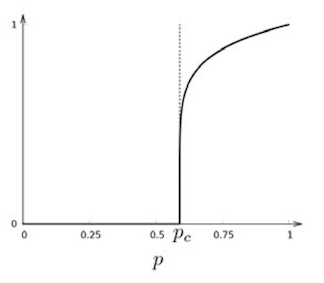
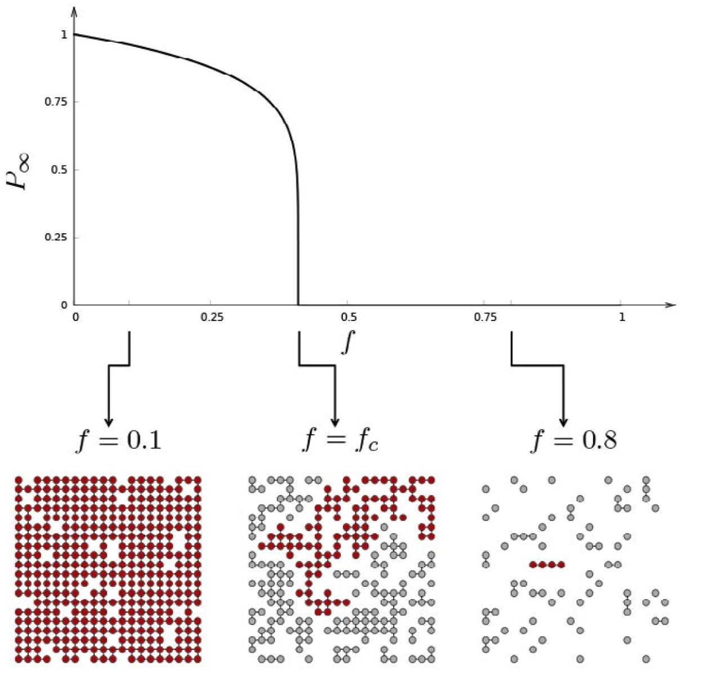
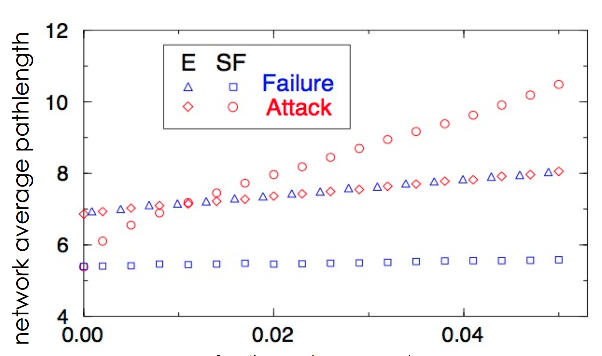

% Análisis de Redes Sociales
% Guillermo Jiménez Díaz (gjimenez@ucm.es); Alberto Díaz (albertodiaz@fdi.ucm.es)
% 9 de enero de 2015

# Prefacio {-}

Estos son los apuntes de la asignatura Análisis de Redes Sociales, impartida en la Facultad de Informática de la Universidad Complutense de Madrid por los profesores Guillermo Jiménez Díaz y Alberto Díaz, del Departamento de Ingeniería del Software e Inteligencia Artificial.

Este material ha sido desarrollado a partir de distintas fuertes, destacando como referencia principal el libro _Network Science_ de Laszlo Barabasi, el material de la asignatura _Social Network Analysis_, impartido por Lada Adamic a través de Coursera, y las transparencias de la asignatura Redes y Sistemas Complejos, creadas por Óscar Cordón García de la Universidad de Granada.

Este obra está bajo una [licencia de Creative Commons Reconocimiento-NoComercial-CompartirIgual 4.0 Internacional](http://creativecommons.org/licenses/by-nc-sa/4.0/).

\setcounter{section}{9}

# Tema 9: Robustez de las redes {-}

El fallo de un componente sencillo en un sistema complejo puede provocar un error o un fallo general de todo el sistema. Sin embargo, muchos sistemas naturales y sociales tienen la capacidad de permanecer inmutables aunque varios de sus componentes fallen. En la mayoría de estos sistemas, la robustez se consigue gracias a densas interconexiones entre los componentes.

En este tema veremos el rol de las redes con el fin de asegurar la robustez de un sistema complejo. Veremos que la estructura de la red es una de las características básicas que hay que entender para conocer la robustez del sistema y para conocer sus debilidades en caso de ataques premeditados. Así mismo, estudiaremos los comportamientos de fallo en cascada y las leyes que lo gobiernan.

## Robustez, errores y ataques

La robustez implica entender cómo se va a comportar una red en caso de que eliminemos nodos de la misma. En particular, vamos a fijarnos en la red desde dos puntos de vista distintos:

- **Fragmentación de la red**, es decir, cómo se rompe la red en comunidades aisladas a medida que eliminamos nodos.
- **Tolerancia a errores**, es decir, cómo de largas pasan a ser las distancias en la red a medida que eliminamos nodos.

Así mismo, estudiaremos la robustez con respecto a **errores** y **ataques**. Los _errores_ hacen que se eliminen nodos de manera aleatoria. Sin embargo, los _ataques_ consisten en la eliminación de nodos seleccionándolos de una manera deliberada.

## Robustez en redes aleatorias

Primeramente vamos a estudiar cómo se comporta la robustez en una red aleatoria. Para ello vamos a estudiar un tipo muy particular de redes aleatorias relacionadas con la _Teoría de la Percolación_ (Percolation theory).

### Teoría de la percolación

Suponemos que tenemos una cuadrícula y que en cada intersección podemos poner un nodo. Dos nodos estarán conectados si están en intersecciones adyacentes. Podemos construir una red aleatoria a partir de esta cuadrícula decidiendo si ponemos o no un nodo en cada intersección con probabilidad $p$.

La teoría de la percolación explica, entre otras cosas, el tamaño medio de los clusters y el tamaño del cluster mayor suponiendo que vamos añadiendo nodos de manera aleatoria. En la siguiente figura podemos ver que, tal y como vimos en las redes aleatorias, existe un valor crítico $p_c$[^1] a partir del cual emerge un componente gigante al que pertenecerán la mayoría de los nodos.

[^1]: En las redes aleatorias se cumplía cuando $\langle k \rangle \approx 1 \to p_c = \frac{1}{N}$

### Fragmentación de la red
 
Podemos estudiar la robustez de esta red aleatoria usando, a la inversa, la teoría de la percolación. Si partimos de una cuadrícula en la que en todas las intersecciones hay nodos y eliminamos los nodos con una determinada probabilidad $f$ podemos observar que, al igual que durante la creación, existe una probabilidad umbral $f_c$ que nos permite distinguir tres fases:

- Si $0<f<f_c$ entonces continuamos teniendo un componente gigante en la red.
- Si $f=f_c$ entonces el componente gigante comienza a desvanecerse y la red se empieza a fragmentar.
- Si $f>f_c$ entonces la red queda completamente rota en muchos clusters pequeños.

A modo de conclusión podemos afirmar que la fragmentación de la red debido a fallos no es un proceso gradual. Inicialmente, la eliminación de una pequeña fracción de nodos no afecta a la integridad de la red. Sin embargo, existe un punto crítico a partir del cual la red se rompe abruptamente en pequeños grupos de nodos desconectados.

Se han hecho estudios que han hecho un cálculo aproximado de este umbral crítico $f_c$, dando como resultado:

$$f_c = 1- \frac{1}{\frac{\langle k^2 \rangle}{\langle k \rangle}-1}$$

Para una red aleatoria, en la que el segundo momento es conocido, podemos decir que este umbral es:

$$f_c^{ER} = 1- \frac{1}{\langle k \rangle}$$

### Tolerancia a errores

Para comprender la tolerancia a errores de una red aleatoria vamos a estudiar cómo evoluciona el diámetro de la red a medida que eliminamos nodos de manera aleatoria. Para ello calculamos el diámetro de la red a medida que aumentamos $f$.

En la figura podemos observar que el diámetro de la red crece de manera monótona para valores muy pequeños de $f$. Esto se debe a que, como la mayoría de los nodos tienen aproximadamente el mismo grado, todos contribuyen aproximadamente de la misma forma al diámetro de la red, por lo que la desaparición de cualquiera de ellos hace que las distancias vayan creciendo. Además, en el momento en el que alcancemos $f_c$ el diámetro divergirá ya que romperemos el componente gigante.

### Comportamiento frente a ataques

Ahora queremos observar el comportamiento de la red en caso de que no se produzcan errores sino ataques, es decir, se decida deliberadamente qué nodos de la red queremos eliminar en cada momento. Una forma sencilla de simular un ataque es eliminar los nodos en orden decreciente de su grado $k$, es decir, primero eliminamos el de mayor grado, luego el siguiente de mayor grado, etc.

Desde el punto de vista de la fragmentación podemos observar que la red evoluciona de la misma forma ya sea por errores o por ataques. Esto se debe a que todos los nodos tienen un grado similar por lo que un ataque deliberado no es más efectivo que los errores aleatorios en el caso de una red aleatoria.

En cuanto al diámetro de la red observamos el mismo comportamiento viendo la figura de la sección anterior: el ataque a los nodos de mayor grado sigue haciendo que la distancia crezca de manera monótona y no se ve diferencia apreciable con respecto a la tolerancia a errores.

A modo de resumen podemos decir que las redes aleatorias son resistentes a ataques y que su resistencia es similar para errores aleatorios que para ataques.

## Robustez en redes libres de escala 

### Fragmentación de la red

### Tolerancia a errores

### Comportamiento frente a ataques

