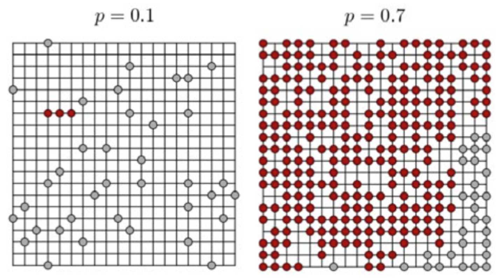

% Análisis de Redes Sociales
% Guillermo Jiménez Díaz (gjimenez@ucm.es); Alberto Díaz (albertodiaz@fdi.ucm.es)
% 9 de enero de 2015

# Prefacio {-}

Estos son los apuntes de la asignatura Análisis de Redes Sociales, impartida en la Facultad de Informática de la Universidad Complutense de Madrid por los profesores Guillermo Jiménez Díaz y Alberto Díaz, del Departamento de Ingeniería del Software e Inteligencia Artificial.

Este material ha sido desarrollado a partir de distintas fuertes, destacando como referencia principal el libro _Network Science_ de Laszlo Barabasi, el material de la asignatura _Social Network Analysis_, impartido por Lada Adamic a través de Coursera, y las transparencias de la asignatura Redes y Sistemas Complejos, creadas por Óscar Cordón García de la Universidad de Granada.

Este obra está bajo una [licencia de Creative Commons Reconocimiento-NoComercial-CompartirIgual 4.0 Internacional](http://creativecommons.org/licenses/by-nc-sa/4.0/).

\setcounter{section}{9}

# Tema 9: Robustez de las redes {-}

El fallo de un componente sencillo en un sistema complejo puede provocar un error o un fallo general de todo el sistema. Sin embargo, muchos sistemas naturales y sociales tienen la capacidad de permanecer inmutables aunque varios de sus componentes fallen. En la mayoría de estos sistemas, la robustez se consigue gracias a densas interconexiones entre los componentes.

En este tema veremos el rol de las redes con el fin de asegurar la robustez de un sistema complejo. Veremos que la estructura de la red es una de las características básicas que hay que entender para conocer la robustez del sistema y para conocer sus debilidades en caso de ataques premeditados. Así mismo, estudiaremos los comportamientos de fallo en cascada y las leyes que lo gobiernan.

## Robustez, errores y ataques

La robustez implica entender cómo se va a comportar una red en caso de que eliminemos nodos de la misma. En particular, vamos a fijarnos en la red desde dos puntos de vista distintos:

- **Fragmentación de la red**, es decir, cómo se rompe la red en comunidades aisladas a medida que eliminamos nodos.
- **Tolerancia a errores**, es decir, cómo de largas pasan a ser las distancias en la red a medida que eliminamos nodos.

Así mismo, estudiaremos la robustez con respecto a **errores** y **ataques**. Los _errores_ hacen que se eliminen nodos de manera aleatoria. Sin embargo, los _ataques_ consisten en la eliminación de nodos seleccionándolos de una manera deliberada.

## Robustez en redes aleatorias

Primeramente vamos a estudiar cómo se comporta la robustez en una red aleatoria. Para ello vamos a estudiar un tipo muy particular de redes aleatorias relacionadas con la _Teoría de la Percolación_ (Percolation theory). Suponemos que tenemos una cuadrícula y que en cada intersección podemos poner un nodo. Dos nodos estarán conectados si están en intersecciones adyacentes. Podemos construir una red aleatoria a partir de esta cuadrícula decidiendo si ponemos o no un nodo en cada intersección con probabilidad $p$.

La teoría de la percolación explica, entre otras cosas, el tamaño medio de los clusters y el tamaño del cluster mayor suponiendo que vamos añadiendo nodos de manera aleatoria. En la siguiente figura podemos ver que, tal y como vimos en las redes aleatorias, existe un valor crítico $p_c$[^1] a partir del cual emerge un componente gigante al que pertenecerán la mayoría de los nodos.

[^1]: En las redes aleatorias se cumplía cuando $\langle k \rangle \approx 1 \to p_c = \frac{1}{N}$
 

