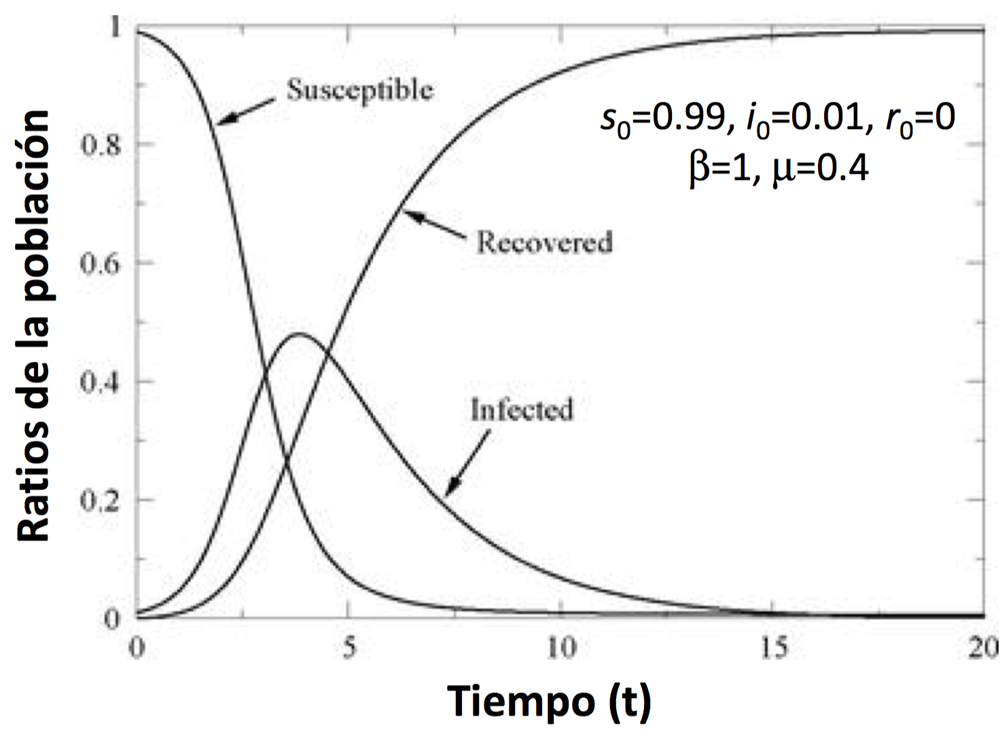
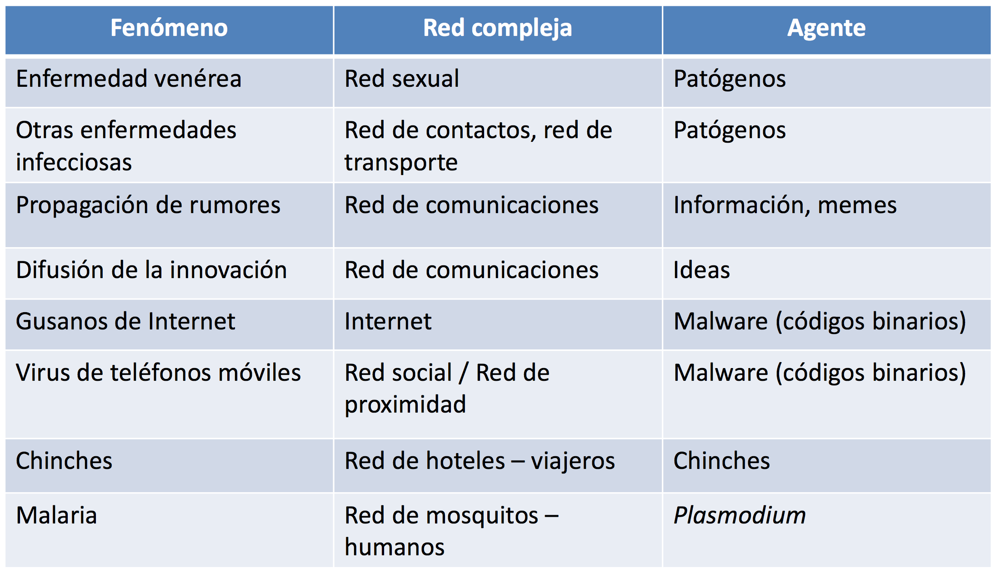
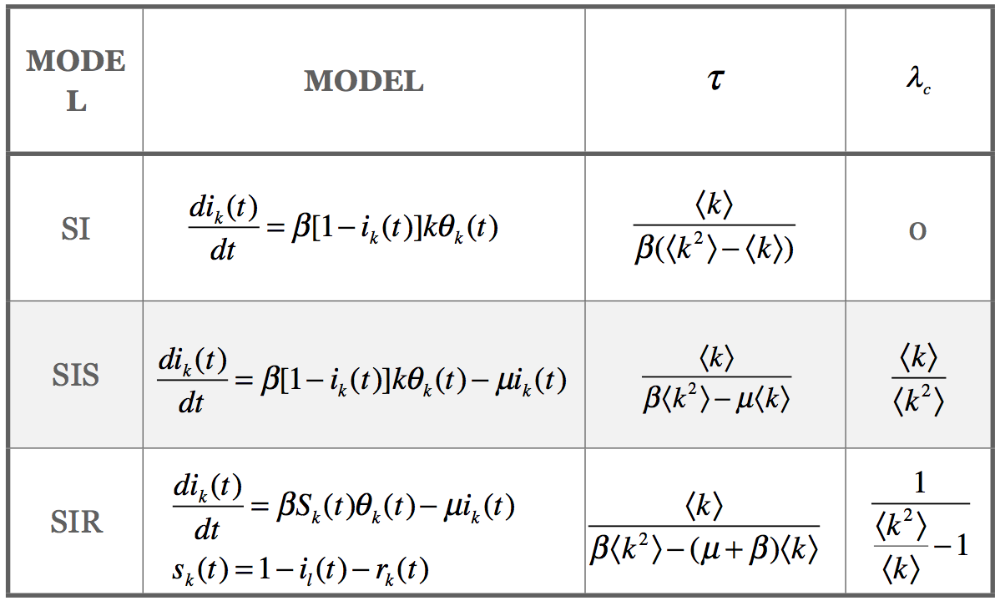
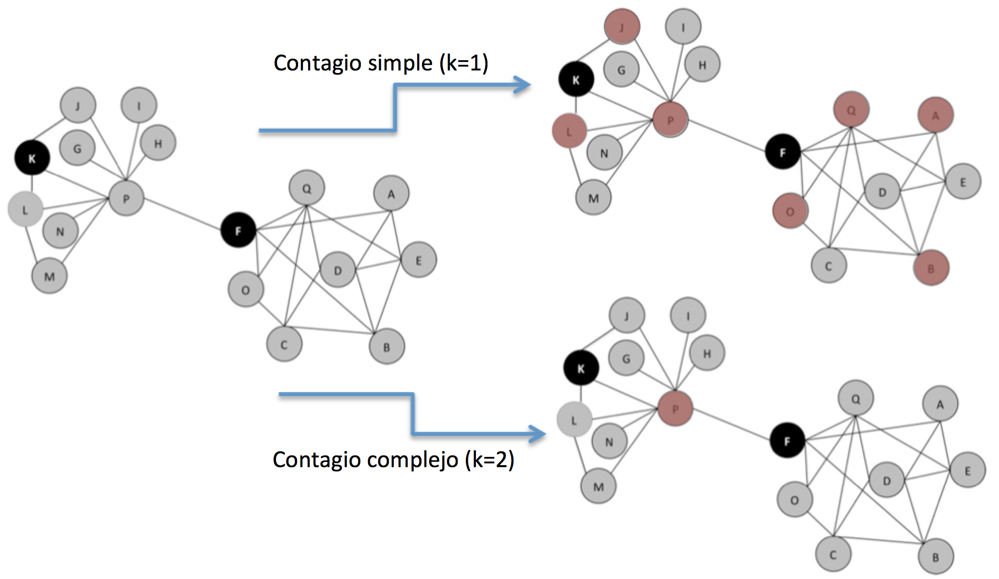
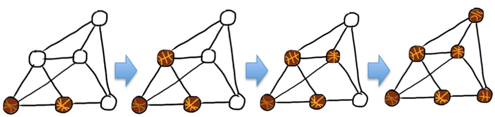
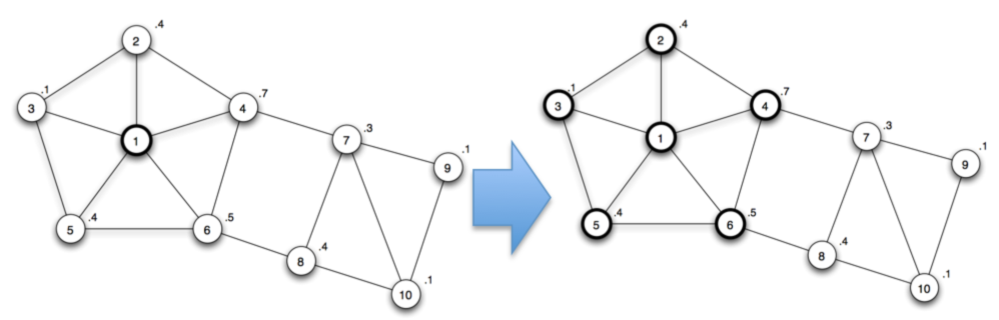
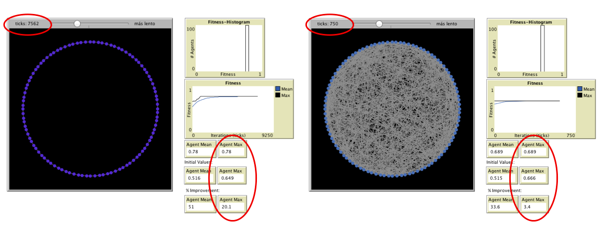

% Análisis de Redes Sociales
% Guillermo Jiménez Díaz (gjimenez@ucm.es); Alberto Díaz (albertodiaz@fdi.ucm.es)
% 4 de diciembre de 2015

# Prefacio {-}

Estos son los apuntes de la asignatura Análisis de Redes Sociales, impartida en la Facultad de Informática de la Universidad Complutense de Madrid por los profesores Guillermo Jiménez Díaz y Alberto Díaz, del Departamento de Ingeniería del Software e Inteligencia Artificial.

Este material ha sido desarrollado a partir de distintas fuertes, destacando como referencia principal el libro _Network Science_ de Laszlo Barabasi, el material de la asignatura _Social Network Analysis_, impartido por Lada Adamic a través de Coursera, y las transparencias de la asignatura Redes y Sistemas Complejos, creadas por Óscar Cordón García de la Universidad de Granada.

Para este capítulo se ha utilizado, adicionalmente, material de los libros _Analyzing the Social Web_ de Jennifer Goldbeck (capítulo 10) y _Networks, Crowds, and Markets_ de Easley y Kleinberg (capítulos 19 y 21).

Este obra está bajo una [licencia de Creative Commons Reconocimiento-NoComercial-CompartirIgual 4.0 Internacional](http://creativecommons.org/licenses/by-nc-sa/4.0/).

\setcounter{chapter}{9}

# Tema 9: Propagación y Difusión en redes {-}

Las conexiones presentes en la redes permiten modelar la propagación de todo tipo de elementos entre sus nodos: enfermedades, vídeos virales, rumores, virus informáticos, productos, anuncios, información... En general, la mayoría de estos modelos de propagación son similares independientemente de lo que se pretenda propagar.

Existe desde hace muchos años un estudio intenso en la propagación de enfermedades. El conocimiento de cómo se propagan a través de una red de individuos nos puede servir para entender cómo se puede propagar cualquier otro tipo de información en dicha red. Por este motivo, en este tema vamos a hablar los modelos fundamentales de propagación y vamos a estudiar como aplicarlos a las redes, analizando cómo la estructura de la misma afecta enormemente a estos fenómenos de propagación.

## Modelos de contagio simple

La epidemiología es la ciencia que estudia la salud y control de enfermedades en una población, así como la predicción de expansión de dichas enfermedades. El modelo general epidemiológico se basa en dos hipótesis: 

- **Modelo compartimental**: cada individuo puede estar en un determinado estado dependiendo de en qué fase se la enfermedad se encuentra. El modelo más simple, que será el que usemos, supone 3 estados:
    - **Susceptible (S)**: El individuo está sano y puede ser infectado.
    - **Infectado (I)**: El individuo está infectado y puede contagiar a otros individuos.
    - **Recuperado (R)**: El individuo estuvo contagiado pero se ha recuperado y no puede volver a ser contagiado. También se utiliza para modelar los individuos que no han superado la enfermedad y que han muerto a causa de ella.
    
    Existen otros modelos en los que se usan otros estados adicionales, como el _inmune_ (no ha sido infectado y no se puede infectar) o el _latente_ (ha sido contagiado pero aún no está infectado y, por tanto, aún no es contagioso).

- **Mezcla homogénea**: Cualquier individuo tiene la misma probabilidad de entrar en contacto con un individuo infectado. Esta hipótesis puede interpretarse como que la red de contactos está modelada mediante una red aleatoria aunque, realmente, elimina la necesidad de conocer los contactos de los individuos y se puede asumir que cualquiera puede infectar a cualquiera.

Los modelos generados a partir de estas hipótesis observan el comportamiento (los cambios de estado) de los individuos a lo largo del tiempo para predecir el alcance y la velocidad de propagación de la enfermedad, entre otras. A continuación vamos a estudiar la dinámica de los modelos de propagación  clásicos, que combinan las letras del modelo compartimental.

### Modelo SI

Es el modelo más sencillo, en el que un individuo susceptible puede quedar infectado pero, una vez infectado, no se puede recuperar. Un ejemplo de este tipo es el virus del VIH (o los zombies).

En este modelo suponemos que cada individuo tiene $\langle k \rangle$ contactos (enlaces) y que en cada instante de tiempo la enfermedad se propaga con una tasa de contagio $\delta$, que representa la probabilidad de que un individuo infectado transmita la enfermedad a uno susceptible.

Para entender la dinámica del modelo vamos a definir los siguientes parámetros.

- $N$ es el tamaño de la población y es $N = S(t) + I(t)$, donde $S(t)$ (número de individuos que están en el estado susceptible en el tiempo $t$) e $I(t)$ (número de individuos que están en el estado infectado en el tiempo $t$).
- En lugar de manejar valores absolutos vamos a manejar las proporciones o _ratios_ de individuos susceptibles e infectados. De este modo $s(t) = s = \frac{S(t)}{N}$ representa la proporción de individuos susceptibles de la población mientras que $i(t) = i = \frac{I(t)}{N}$.
- $\beta$ es la tasa de transmisión que incluye el grado medio de cada individuo, esto es, $\beta = \delta \cdot \langle k \rangle$.

La ecuación diferencial que modela la tasa a la que varía el número de infectados es:

$$\frac{di}{dt} = i \cdot \beta  \cdot s = i \cdot \beta \cdot (1-i)$$

En cada momento de tiempo, la proporción de infectados es la cantidad de infectados $i$ más la proporción de individuos susceptibles que pueden ser infectados $\beta \cdot s$.

Si resolvemos esta ecuación nos queda que:

$$i = \frac{i_0exp(\beta t)}{1-i_0+i_0exp(\beta t)}$$

donde $i_0$ representa a la tasa de infectados en el instante $t=0$. De la representación gráfica de esta función extraemos las siguientes conclusiones:

- Inicialmente el número de infectados crece exponencialmente.
- A medida que el número de infectados se hace mayor, hay menos individuos susceptibles por lo que el crecimiento de infectados se ralentiza y la infección termina cuando todos están infectados ($i(t \to \infty)= 1$).

El _tiempo característico_ $\tau$ es el tiempo que tarda la enfermedad en alcanzar al $\frac{1}{e}$ (aprox. el 36%) de la población. Para el modelo SI:

$$
\tau = \frac{1}{\beta}
$$

Se puede ver que el tiempo característico es la inversa de la tasa de transmisión. Esto implica que aumentar la densidad de enlaces ($\langle k \rangle$) o la velocidad de propagación original ($\delta$) aumenta la tasa de transmisión y, por tanto, reduce el tiempo característico.

### Modelo SIS

Es similar al anterior salvo en que, en este modelo, los individuos infectados se pueden recuperar, volviendo al estado susceptible. Un ejemplo de este modelo es el resfriado común.

Para este modelo necesitamos, además de los parámetros del anterior, la tasa de recuperación $\mu$, que representa la proporción de infectados que se recuperan y pasan al estado susceptible en cada instante de tiempo.

En este caso, la ecuación diferencial que modela la tasa a la que varía el número de infectados es:

$$\frac{di}{dt} = i \cdot \beta  \cdot s - \mu \cdot i=  i \cdot \beta \cdot (1-i) - \mu \cdot i$$

En cada momento de tiempo, la proporción de infectados es la cantidad de infectados $i$ más la proporción de individuos susceptibles que pueden ser infectados $\beta \cdot s$ menos la proporción de individuos infectados que se pueden recuperar $\mu \cdot i$.

La resolución de esta ecuación nos da el siguiente resultado:

$$i = \Big(1- \frac{\mu}{\beta}\Big) \frac{C \cdot e^{(\beta - \mu)t}}{1 + C \cdot e ^{(\beta -\mu)t}}$$

$$C= \frac{\beta \cdot i_0}{\beta - \mu - \beta \cdot i_0}$$

En este caso, las conclusiones que podemos extraer de la representación gráfica de la función son las siguientes:

- Como la recuperación es posible, el sistema alcanza un _estado endémico_ en el que la tasa de infectados es constante:

$$i(\infty) = 1 - \frac{\beta}{\mu}$$

En este estado endémico, la proporción de infectados no varía con el tiempo y sólo se produce cuando la tasa de recuperación es inferior a la tasa de transmisión ($\mu < \beta$)

- En caso de que la tasa de recuperación sea mayor que la tasa de transmisión ($\mu > \beta$) entonces llegado a un determinado punto la proporción de infectados comienza a decrecer exponencialmente, alcanzado un estado libre de enfermedad, en la que todos los individuos se han recuperado y no hay infectados.

En este modelo, el _tiempo característico_ $\tau$ es:
$$
\tau = \frac{1}{\mu (R_0 - 1)}
$$

$R_0$ es el ritmo reproductivo básico, que representa el número promedio de individuos susceptibles que serán infectados por un individuo infectado en una población completamente susceptible:

$$R_0 = \frac{\beta}{\mu}$$

Tal y como hemos visto antes:
- Si $R_0<1$ entonces $\tau<0$ y la enfermedad termina desapareciendo de la población.
- Si $R_0>0$ entonces $\tau>0$ y la enfermedad se propagará, alcanzando el estado endémico. Cuanto mayor sea $R_0$, más rápido es el proceso de propagación de la enfermedad.
 
El ritmo reproductivo básico es uno de los primeros parámetros que los epidemiólogos calculan, ya que es representa la gravedad de la enfermedad a la que se enfrentan. Por ejemplo, el sarampión (que se contagia por el aire) tiene un $R_0= 12-18$, la difteria (que se propaga por la saliva) tiene un $R_0 = 6-7$ mientras que la gripe tiene un $R_0 = 2-3$.

)](../images/tema09/ritmoReprodBasico.png)

### Modelo SIR

En este modelo, los individuos infectados no vuelven a ser susceptibles sino que desarrollan una inmunidad a la enfermedad (o mueren) y pasan a un estado recuperado[^1] en el que no afectan al modelo de propagación: no pueden ser infectados ni pueden infectar a otros. 

[^1]: En inglés, el estado es _removed_, que es más adecuado para describir el proceso.

En este modelo $\mu$ representa la tasa de recuperación que, a diferencia del anterior, es la tasa de individuos infectados que pasan al estado recuperado. Para este modelo, la población es la suma de los infectados, susceptibles y recuperados($R(t)$), por lo que la proporción de infectados es $i = 1-s-r$.

Las ecuaciones diferenciales de este modelo son las siguientes:

$$\frac{di}{dt} = \beta \cdot i \cdot s - \mu \cdot i \text{;  }\frac{ds}{dt} = -\beta \cdot i \cdot s\text{;  }\frac{dr}{dt} = \mu \cdot i$$

En este caso el cálculo es más complejo pero podemos llegar a la siguiente representación gráfica de las tres funciones:

- Cuando $\beta>\mu$ la proporción de infectados crece hasta un pico máximo y luego decrece hasta valer 0.
- La proporción de susceptibles decrece de forma monótona. Aunque satura, no llega nunca a 0 ya que cuando $i \to 0$ ya no hay individuos que puedan infectar. Esto implica que los individuos que se mantienen susceptibles hasta fases avanzadas pueden no llegar a infectarse nunca.
- La proporción de recuperados crece de manera monótona. De manera similar a los susceptibles, la proporción de recuperados nunca llega a valer 1. Su valor asintótico representa el número de individuos afectados y se calcula como:

$$r = 1- s_0 \cdot e^{-\beta \frac{r}{\mu}}$$

Las condiciones iniciales más habituales son:

$$i_0 = \frac{c}{N}\text{;  }s_0 = 1- \frac{c}{N}\text{;  }r_0 = 0$$

### Comportamientos importantes de los modelos epidemiológicos

Existen principalmente dos comportamientos destacables en estos modelos:

#### Comportamiento temprano.{-}

Es el patrón de comportamiento en las fases iniciales. Es importante para saber cuánto tiempo tenemos para el desarrollo de vacunas e intervenciones médicas. La mejor forma de detener o contener la epidemia en esta fase es mediante vacunación temprana o la cuarentena.

En todos los modelos el número de infectados en la fase temprana es bajo pero crece exponencialmente. Generalmente, el modelo SI es el más relevante para describir este comportamiento.

#### Comportamiento tardío. {-}

Es el patrón de comportamiento en las fases más avanzadas de la epidemia (cuando $t \to \infty$). Permite predecir el alcance, número de infectados, etc.

En este caso, cada modelo realiza una predicción distinta:

- En el modelo SI todos terminan infectados.
- En el modelo SIS se alcanza un estado endémico en el que una proporción de la población queda infectada ($R_0>1$) o en el que la enfermedad desaparece ($R_0<1$)
- En el modelo SIR todos terminan recuperados (en el estado susceptible o recuperado, pero no infectados)

En resumen, las características básicas de los modelos epidemiológicos son los siguientes:

Tal y como hemos indicado, estos modelos no tienen en cuenta la red de contactos ya que suponen que hay una mezcla homogénea. Realmente, las epidemias se propagan a través de los contactos de las personas, es decir, a través de los enlaces de su red social. Por tanto, hay que tener en cuenta el papel de la red en el proceso epidémico. Tal y como veremos a continuación, la estructura de la red modificará el comportamiento de estos modelos simples.

## Modelos de contagio basados en redes

Los modelos de contagio basados en redes se comportan de manera similar a los vistos hasta ahora salvo que solo se tendrán en cuenta los contactos definidos por la red, en lugar de suponer que cualquier individuo puede estar en contacto con cualquier otro.

En los modelos basados en redes, $\beta$ es el __ratio de transmisión__ y representará la probabilidad de contagio de un nodo infectado a otro susceptible que esté en contacto con él (hay un enlace entre los dos nodos).

En general, la simulación de estos procesos suele ser más sencilla que la resolución analítica de los modelos en redes complejas. Por ejemplo, una forma sencilla de simular un proceso de contagio simple sería la siguiente:

1. Definimos una red de $N$ nodos y $L$ enlaces. Inicialmente todos los nodos están en el estado S.
2. En $t_0$ ponemos una pequeña fracción $i_0$ de nodos (o solo 1), en el estado I.
3. En cada paso de tiempo, hacemos que cada uno de los nodos en el estado I[^3] propague la infección a cada uno de sus vecinos en estado S con probabilidad $\beta$ (al igual que en los modelos de red aleatoria o Barabasi-Albert, generamos un número aleatorio $a$ y propagamos si $a<\beta$).
4. En caso de utilizar un modelo SIR o SIS, haremos que los nodos en estado I puedan pasar al estado R (o S, dependiendo del modelo), con una probabilidad $\mu$.

[^3]: Desde el punto de vista de implementación, es recomendable tener en listas separadas los nodos infectados y los susceptibles (y recuperados) no tener que procesar todos los nodos (solo los infectados) y así optimizar el proceso de simulación.

Existen alternativas más complejas (y más realistas), basadas en técnicas de modelado social o modelado basado en agentes, en los que cada individuo (nodo) se modela como un agente que puede incluir sus propias características individuales y que pueden generar comportamientos emergentes. Se pueden incluir procesos estocásticos de actualización de estados que simulan eventos aleatorios que pueden ocurrir en los procesos dinámicos. 

Dependiendo del fenómeno de difusión que queramos simular tendremos que decidir qué red tendremos que modelar. Como ejemplo podemos ver que redes se usan para modelar distintos fenómenos en la siguiente tabla:

La estructura de la red, su evolución a lo largo del tiempo y su uso están interrelacionados y se deben estudiar conjuntamente. La topología de la red va a influir en el proceso de contagio o difusión:

* ¿A qué estado convergen los nodos?
* ¿Cuánto se tarda en llegar a dicho estado?
* ¿Cómo se puede inmunizar un sistema complejo con una topología de red concreta?

Antes de entrar en los detalles más analíticos de los procesos de difusión vamos a utilizar los modelos que conocemos hasta ahora y las simulaciones en NetLogo para observar el comportamiento de las epidemias teniendo en cuenta la estructura de la red.

### Redes aleatorias

Vamos a simular un modelo SI en una red aleatoria. Si utilizamos el simulador de [Difusión en una red aleatoria](http://www.ladamic.com/netlearn/NetLogo501/ERDiffusion.html)[^2] podemos ver la influencia de la densidad de la red en los procesos de contagio.

Como se puede ver en la simulación, la densidad de la red afecta a la velocidad de infección y al número de individuos infectados: a mayor densidad, mayor es el número de individuos infectados y mayor es la velocidad de propagación.

Además, se puede ver que si partimos de un único nodo, sólo se infectarán los nodos que pertenecen a la misma componente conexa. Recordemos algunas redes reales tienen una componente gigante y muchas componentes pequeñas por lo que la epidemia se extiende en mayor o menor medida dependiendo de la localización del nodo inicial. La probabilidad de que un nodo pertenezca a la componente gigante se $\frac{N_G}{N}$.

[^2]: Todos los modelos de NetLogo que se ven en este tema están disponibles en el Campus Virtual.

### Redes libres de escala

A continuación simularemos un modelo SI en una red libre de escala creada siguiendo el modelo de Barabasi-Albert. Si recordamos, para que se presente la propiedad de ser libre de escala es necesario que exista enlace preferencial. Por este motivo vamos a ver el efecto de la existencia de enlace preferencial en estas redes. Para ello usaremos el simulador de [Difusión en una red libre de escala](http://www.ladamic.com/netlearn/NetLogo501/BADiffusion.html).

En este caso podemos observar que el enlace preferencial favorece el contagio. Esto se debe a que el enlace preferencial posibilita la existencia de Hubs, que son los responsables de ayudar a difundir más rápidamente la infección. 

### Redes de Watts-Strogatz

En este caso simularemos un modelo SI en una red creada siguiendo el modelo de Watts-Strogatz para estudiar la influencia de los "atajos" o enlaces débiles en el contagio sobre esta red. Para ello vamos a usar el simulador [Difusión en un mundo pequeño](http://www.ladamic.com/netlearn/NetLogo4/SmallWorldDiffusionSIS.html) y modificaremos la probabilidad de reasignación de enlaces $p$ para ver su efecto en la propagación.

Podemos observar que los enlaces débiles provocan que aumente la velocidad de la infección ya que, en el mismo tiempo, se aprecia un mayor número de nodos infectados.

### Soluciones analíticas

Podemos estudiar de manera analítica el comportamiento temprano y tardío de los modelos de contagio SI y SIR en redes complejas. Para ello es necesario hacer una aproximación conocida como la __aproximación por bloques de grados__: distinguimos distintos bloques de nodos basados en el grado que tienen y asumimos que todos los nodos en el mismo bloque (y, por tanto, con el mismo grado) son estadísticamente equivalentes. Podemos representarlo gráficamente con la siguiente figura:

De esta forma definimos la fracción de nodos con grado $k$ infectados como:

$$i_k  = \frac{I_k}{N_k}$$

La suma de los diferentes $i_k$ para todos los grados dan la fracción total de nodos infectados $i$.

#### Modelo SI {-}

De acuerdo a lo anterior, definimos la ecuación diferencial para el modelo SI que modela la tasa de infectados para cada grado $k$ por separado:

$$\frac{di_k}{dt} = \beta (1-i_k(t))k \Theta_k(t)$$

En este caso:

- El grado medio ha sido sustituido por el grado real $k$
- $\Theta_k(t)$ es una función de densidad que representa la fracción de vecinos que están infectados para un nodo de grado $k$.
- Necesitaremos definir $k_{max}$ ecuaciones.

La función de densidad podemos aproximarla de la siguiente forma:

$$\Theta_k(t) \approx \Theta(t) = \frac{\sum_{k'}(k'-1)\cdot P(k') \cdot i_{k'}(t)}{\langle k \rangle}$$

Durante el comportamiento temprano, es decir, cuando $i$ es pequeño podemos aproximarlo de la siguiente forma:

$$\frac{di_k}{dt} = \beta k i_0 \frac{\langle k \rangle-1}{\langle k \rangle} e^{t/\tau}$$

Y podemos obtener la fracción de nodos infectados de grado $k$ y el total de nodos infectados:

$$i_k = i_0 (1+ \frac{k \langle k \rangle -1}{\langle k^2 \rangle - \langle k \rangle}(e^{t/\tau}-1))$$

$$i = i_0 (1+ \frac{\langle k \rangle^2 - \langle k \rangle}{\langle k^2 \rangle - \langle k \rangle}(e^{t/\tau}-1))$$

$\tau$ representa el periodo de incubación, que es la cantidad de tiempo que requiere la epidemia para crecer. Cuando menor es $\tau$, más rápido se propaga la enfermedad. Según las ecuaciones anteriores se puede calcular de la siguiente forma:

$$\tau = \frac{\langle k \rangle}{\beta(\langle k^2 \rangle - \langle k \rangle)}$$

De estas ecuaciones podemos obtener las siguientes conclusiones:

- Cuanto mayor sea el grado de un nodo mayor es la probabilidad de que ese nodo sea infectado. 
- El periodo de incubación depende de la estructura de la red y de los momentos de primer y segundo orden de la distribución de grados ($\langle k \rangle$ y $\langle k^2 \rangle$), respectivamente.
- En una red aleatoria el periodo de incubación depende de la densidad de la red, de modo que la epidemia se propaga más rápido cuanto más densa sea ésta (mayor $\langle k \rangle$).

$$\tau_{ER} = \frac{1}{\beta(\langle k \rangle)} \text{ ya que } \langle k^2 \rangle = \langle k \rangle (\langle k \rangle - 1)$$

- En una red libre de escala los momentos dependen de $\gamma$, de modo que si $\gamma \geq 3$ ambos momentos son finitos y el contagio se comporta de manera similar a la red aleatoria.
- Sin embargo, si $\gamma < 3$ en una red libre de escala entonces $\langle k^2 \rangle$ diverge y $\tau \to 0$, lo que implica que el periodo de incubación característico desaparece y la epidemia es instantánea. Esto se debe a que los hubs son los primeros nodos en infectarse y, dada su alta conectividad, infectan más rápidamente a la mayoría de los nodos.

#### Modelos SIS  {-}

En los modelos con recuperación la ecuación diferencial de la tasa de infectados de grado $k$ es algo distinta:

$$\frac{di_k}{dt} = \beta (1-i_k(t))k \Theta_k(t) _ \mu \cdot i_k(t)$$

Donde vemos que aparece la tasa de recuperación $\mu$. Esto hace que el periodo de incubación $\tau$ sea algo distinto:

$$\tau^{SIS} = \frac{\langle k \rangle}{\beta \langle k^2 \rangle - \mu \langle k \rangle}$$

Para un tamaño suficientemente grande de $\mu$ el tiempo característico se hace negativo e $i_k$ decrece exponencialmente. Sin embargo, depende de la topología de la red. En lugar de solo $\mu$ vamos a tener en cuenta el ritmo reproductivo básico $\lambda = \frac{\beta}{\mu}$, que es representativo de la enfermedad (o de lo que queremos difundir) y que cuanto mayor sea más probable es que la enfermedad se propague. Sin embargo, ¿cuál es el mínimo valor necesario para que se propague la enfermedad? Esto es lo que se conoce como el **umbral epidemiológico** ($\lambda_C$)y también dependerá de la estructura de la red.

- Para una red aleatoria tenemos que el umbral epidemiológico es:

$$\lambda_C = \frac{1}{\langle k \rangle +1}$$

Esto implica que siempre va a ser distinto de cero y que, dependiendo del valor de $\lambda$, podemos conseguir que la epidemia alcance un estado endémico (si $\lambda > \lambda_C$) o que la epidemia desaparezca (si $\lambda < \lambda_C$).

- Para una red libre de escala tenemos que el umbral epidemiológico es:

$$\lambda_C = \frac{\langle k \rangle}{\langle k^2 \rangle}$$

Esto implica que para $\gamma < 3$ el segundo momento diverge y, por tanto, el umbral epidemiológico desaparece. Esto implica que incluso las enfermedades que son difíciles de transmitir se pueden propagar en una red libre de escala. De nuevo, esto es consecuencia de los hubs: en el momento en el que la enfermedad infecta un hub puede pasar a un número muy grande de nodos, de modo que persiste en la población.

Para el modelo SIR los resultados son similares. En la siguiente tabla se resumen las principales conclusiones extraídas:

## Modelos de contagio complejo

Hasta ahora hemos estudiado modelos de contagio simple, en los que el contagio se produce uno a uno, es decir, basta con que un vecino de un determinado nodo esté infectado para que se pueda quedar infectado. Sin embargo, en algunos procesos como el contagio social o inducir a comprar un producto, no basta con que uno de mis vecinos tenga una determinada "opinión" para cambiar la mía sino que es necesario sea una fracción de mis vecinos. Esto es lo que se conoce como contagio complejo o **contagio basado en umbrales**.

Existen principalmente dos formas de definir el contagio basado en umbrales:

- Mediante un umbral $k$ que define el número de vecinos que han de estar infectados para que un nodo quede infectado. El modelo de contagio simple es un modelo basado en este tipo de umbral con $k=1$.
- Mediante una proporción $p$ que define el porcentaje de vecinos que han de estar infectados para que un nodo quede infectado.

En este caso, la propagación se comporta de una manera bastante distinta que depende principalmente de:

- La estructura de la red.
- El valor del umbral utilizado.
- La elección de los nodos inicialmente infectados.

A modo de ejemplo podemos ver la diferencia entre un contagio simple y uno complejo en un solo paso de simulación en la figura que aparece a continuación. Como se puede ver, el contagio simple se propaga de una manera mucho más rápida. Además, el contagio simple permite llegar a toda la red (en la Figura, en $t=2$ todos los nodos estarían contagiados). Sin embargo, el contagio complejo es mucho más lento y puede verse detenido rápidamente debido a la falta de conexiones (en la Figura, en $t=2$ solo J sería infectado y la infección se detendría).

Podemos ver también que los modelos de contagio complejos se comportan de manera distinta en los modelos de redes vistos:

- En una red de mundo pequeño (Watts-Strogatz) los enlaces débiles o atajos ya no funcionan como medio para aumentar la velocidad de propagación. Podemos ver este comportamiento en la simulación del modelo de contagio complejo en una red de mundo pequeño que hemos dejado en el Campus Virtual.
- En una red libre de escala, los hubs pierden importancia en la velocidad de propagación ya que, aunque llegan a muchos nodos, solo ellos no son capaces de propagar la enfermedad.
- En una red aleatoria la propagación depende muy decisivamente de los nodos inicialmente infectados.

## Modelos de difusión de opinión en redes

Aunque el modelo de contagio complejo basado en umbrales puede ser adecuado para algunos procesos de difusión, existen otros modelos más adecuados para modelar los procesos de difusión de opinión en redes.

Los modelos basados en _efectos de beneficio directo_ se basan en que la adopción de una opinión se ve reforzada por el beneficio que se consigue por la adopción de dicha opinión. Además, estos beneficios son mayores cuantos más vecinos adopten esa misma opinión.

### Juego de coordinación en redes

Este modelo se puede simular mediante el __juego de coordinación en una red__. En este modelo, cada nodo tiene que elegir entre dos posibles opciones (que llamaremos A y B) y existe un beneficio si dos nodos conectados eligen la misma opción. De una manera más formal definimos el modelo de la siguiente forma:

- Si dos nodos eligen la opción A entonces obtienen un beneficio de valor $a>0$.
- Si dos nodos eligen la opción B entonces obtienen un beneficio de valor $b>0$
- $p$ es la fracción de vecinos que adoptan la opción A, mientras que $(1-p)$ es la fracción de vecinos que adoptan la opción B.
- Para un nodo de grado $k$ podemos decir que este nodo adopta la opción A si:

$$p \cdot k \cdot a \geq (1-p) \cdot k \cdot b$$

Esto se puede convertir en un modelo de difusión basado en umbrales, donde el umbral $q$ tiene el valor:

$$q = \frac{b}{a+b}$$

Es decir, si tenemos una proporción de $q$ vecinos que han adoptado la opción A entonces elegiremos la opción A. En otro caso, nos es más beneficioso adoptar la opción B. 

El sistema tiene dos estados de equilibrio posibles: o todos adoptan la opción A o, por el contrario, todos adoptan la opción B. Sin embargo, la pregunta es qué pasaría si, partiendo de un estado de equilibrio, algunos nodos (adoptadores iniciales) cambian su opción de manera aleatoria. Queremos saber si se va a producir una propagación en cascada de este comportamiento o si, por el contrario, este comportamiento se detendrá en algún momento o no se propagará.

Para ello vamos a proponer el siguiente ejemplo: tenemos una red en la que todos los nodos han adoptado la opción B. Tenemos una opción A da un beneficio de $a=3$ mientras que la opción B da un beneficio de $b=2$. Se puede ver que en estas circunstancias, el beneficio de adoptar A es $\frac{3}{2}$ veces mayor que adoptar B. Los nodos cambiarán de B a A si al menos $q = \frac{2}{3+2} = \frac{2}{5}$ de los vecinos prefieren la opción A.

En una red simple como la de la figura podemos ver que la cascada puede llegar a toda la red. En esta figura hemos supuesto que la opción B es "jugar al fútbol" mientras que la opción A es "jugar al baloncesto" y que 2 nodos empiezan a jugar al baloncesto debido a factores externos (por ejemplo, que una empresa les haya sobornado con unos pares de zapatillas para jugar al baloncesto).

Sin embargo, no podemos suponer que la cascada de adopciones va a llegar a toda la red (_cascada completa_) sino que hay ocasiones en la que la cascada se detiene aunque aún hay nodos que siguen manteniendo la opción B. En el siguiente ejemplo podemos ver que la cascada de adopciones se detiene tras tres pasos.

Este modelo puede ser utilizado para simular posibles campañas de marketing viral y ayudar a tomar decisiones en cuanto a qué nodos hay que influir y cuánto hay que incrementar el beneficio (por ejemplo, la calidad de un producto) para que se produzca una cascada de difusión aceptable.

Visto el resultado inicial, la primera opción que se puede tomar es modificar el beneficio $a$. En el ejemplo anterior, si aumentamos $a =4$ entonces el umbral $q$ baja a $q=\frac{1}{3}$ y se puede ver que la cascada de adopciones alcanza toda la red. De aquí podemos concluir que la adopción de una nueva opción no solo depende de la estructura de la red sino que también depende de las diferencias de beneficios entre la opción A y la opción B.

La segunda opción a tomar, supuesto que no se puede modificar el beneficio $a$, está relacionado con decidir a qué nodos de la red es necesario influir para hacer que la cascada de adopciones alcance al mayor número posible de nodos en la red. La idea es elegir el menor número de nodos posible y elegirlos adecuadamente para conseguir que la cascada se propague. La elección de estos nodos es fundamental en la cascada de adopciones y está basada intrínsecamente en su posición dentro de la red.

Si tomamos de nuevo el ejemplo de la red anterior, si mantenemos el beneficio inicial $a=3$ y comenzamos la propagación cambiando de estado a los nodos 12 y 13 entonces conseguiremos que todos los nodos del 11 al 17 cambien de estado. Sin embargo, si seleccionamos los nodos 11 y 14 entonces no conseguiremos que se propague ningún cambio de estado por la red.

Podemos ver más en detalle este comportamiento utilizando el [Modelo de Difusión](http://www.ladamic.com/netlearn/NetLogo4/DiffusionCompetition.html) que está disponible en la web, seleccionando distintos nodos iniciales y viendo cómo la propagación se comporta de manera distinta en unos y otros.

Así mismo, este modelo nos permite comprobar que la estructura de la red también tiene una fuerte influencia en los procesos de difusión. En particular, la existencia de comunidades tiene una especial importancia en los procesos de difusión. Las comunidades tienen tres papeles fundamentales dentro de estos procesos de difusión:

- Las comunidades permiten que se produzca la propagación de los modelos basados en umbrales. La existencia de componentes con alta conectividad posibilitan la propagación en este tipo de modelos. Sin la presencia es ellas no sería posible que se produjese este tipo de propagación.
- Las comunidades sirven de barrera para la difusión, de modo que crean "bolsas aisladas" que no permiten la adopción de ideas externas a la comunidad. Cuando una cascada alcanza una comunidad (un agrupamiento de nodos de alta densidad) ésta se detendrá ya que no podrá entrar dentro de dicha comunidad.
- Lo anterior permite que distintas opiniones puedan convivir en la misma red, debido a la existencia de comunidades con distintas opiniones en distintos lugares de dicha red.

### Otros modelos complejos de difusión

#### Nodos bilingües. {-}

Existen modelos de adopción de opiniones más complejos. Uno de ellos es el que permite la existencia de __nodos bilingües__, es decir, nodos que pueden adoptar la opción A y B simultáneamente pero con una penalización $c$. 

En este caso, estos nodos pueden conseguir que la opinión minoritaria persista en la red a pesar en condiciones en las que la opinión minoritaria desaparecería. A modo de ejemplo podemos utilizar una red lineal y observar el comportamiento de la misma con y sin nodos bilingües. Sin ellos, la opción con menor beneficio siempre termina por desaparecer de la red. Sin embargo, la presencia de nodos bilingües permite que dicha opción "sobreviva" entre pares de estos nodos. Podemos observar este comportamiento utilizando la simulación del "Modelo de cascasda" disponible en el Campus Virtual.

#### Umbrales heterogéneos. {-}

Este modelo considera que cada nodo de la red valora de una manera diferente las distintas opiniones. De este modo, cada nodo $v$ de la red tiene un determinado umbral creado a partir de su beneficio por adoptar la opción A ($a_v$) y su beneficio por adoptar la opción B ($b_v$). La simulación de este modelo funciona de manera similar al anterior salvo porque cada nodo posee su propio umbral.

En este caso, la diversidad de los umbrales juega un papel muy importante ya que interactúa de manera compleja con la estructura de la red. Por ejemplo, en la siguiente figura podemos ver que el nodo 1 tiene una posición muy central en la red pero que no hubiera tenido éxito en la propagación de no ser por el bajo umbral del nodo 3. Esto indica que para comprender la forma en la que se produce la difusión en una red social no solo hay que tener en cuenta el poder de los influenciadores sino que también hay que tener en cuenta cómo de influenciables son los nodos que lo rodean.

#### Acciones colectivas. {-}

En esta ocasión lo que se desea es modelar la manera en la que se coordinan ciertas acciones colectivas como acudir a una manifestación contra un gobierno represivo. En este caso no tenemos información de las intenciones del resto de la población (ese gobierno se ha encargado de controlar los medios de comunicación y hay una "recompensa" negativa por asistir a la manifestación) sino que solo se tiene información de los individuos más cercanos, lo que dificulta enormemente la toma de esta decisión. Se produce el fenómeno de lo que se conoce como _ignorancia pluralista_, en el que no se tiene conocimiento de la voluntad del resto (aunque realmente haya una verdadera voluntad a favor o en contra). Este mismo problema de coordinación se puede aplicar en otras situaciones como los vetos y votaciones de un consejo de administración o dirección. 

La particularidad de este modelo es que pretende predecir el comportamiento coordinado de una red en el que cada individuo toma la decisión basándose solo en hablar con las personas más cercanas, es decir, teniendo un horizonte muy limitado. En general, estas acciones pueden modelarse mediante un modelo basado en umbrales heterogéneos, donde el umbral de cada persona significa "me manifestaré en caso de que haya al menos $k$ vecinos en la manifestación (incluyéndome a mí)". Así mismo, cada nodo también conoce los umbrales de sus vecinos, pero no del resto, por lo que es difícil predecir qué ocurrirá. La decisión se deberá tomar solo usando la información conocida (la suya y la de sus vecinos).

Por ejemplo, en la siguiente figura se pueden ver tres redes distintas donde, para cada nodo hemos indicado su umbral. En la primera red no se producirá la acción colectiva ya que hay un nodo ($w$) que tiene un umbral de 4 y solo hay 3 nodos en la red. En la segunda red, aunque si todos conociesen la información globalmente se produciría la acción colectiva, no se producirá dicha acción ya que cada nodo carece de información suficiente _localmente_ para tomar la decisión con seguridad. En la tercera red existe un conocimiento común: los nodos $u$, $v$ y $w$ conocen su información y saben que sus vecinos conocen su información, produciendo una cadena de conocimiento que permite que los tres nodos realicen la acción colectiva y permitiendo que también $x$ la realice.

### Difusión de la innovación

Para concluir con el tema vamos a estudiar un caso muy concreto de difusión, relacionado con la compartición de información entre personas para la resolución de problemas y la difusión de la innovación.

Si pretendemos dar solución a un determinado problema podemos pensar en dos extremos opuestos desde el punto de vista de la comunicación entre las personas que buscan una solución a dicho problema:

- Cada persona trabaja de manera aislada, sin comunicarse con otras personas que también trabajan en la resolución del problema. En este caso, cualquier solución parcial a la que llegue una de las personas no llega al resto de ellas, lo que hace que el avance en la solución sea más lento. Sin embargo, esta independencia permite que surjan ideas "frescas" que no estén sesgadas por el resto de personas que trabajan en la búsqueda de una solución.
- Un _brainstorming_ o lluvia de ideas es una sesión en la que un grupo de personas exponen sus ideas para resolver un problema. En este caso, surgen muchas ideas a la vez y unas ideas pueden ayudar a mejorar las soluciones propuestas por otros, de modo que se puede llegar a una solución de una manera mucho más rápida que de manera aislada. Sin embargo, esta interrelación tan fuerte entre estas personas puede hacer que todas terminen convergiendo a una idea común (_groupthinking_) que no tiene por qué ser la mejor solución al problema.

Estas dos formas de comunicación las podemos representar en forma de red tal y como se observa en la siguiente figura.

Por otro lado, un problema complejo puede quedar representado mediante su espacio de soluciones, es decir, el conjunto de todas las soluciones posibles a las que se puede llegar para resolver este problema. De entre todas las soluciones habrá soluciones mejores y soluciones peores. La bondad de la solución es calculada mediante una _función de fitness_, de modo que podemos representar el espacio de soluciones gráficamente de acuerdo a esta función. Este espacio de soluciones puede ser más o menos "rugoso" dependiendo del problema, es decir, podemos tener un espacio de soluciones con una única solución buena (la solución que maximiza la función de fitness) o un espacio donde existan múltiples máximos locales (soluciones que maximizan la función de fitness en relación con las soluciones más cercanas). El problema de este segundo tipo de espacios es que nos podemos quedar en una de estas soluciones locales sin llegar a conocer que pueden existir soluciones mejores que la que hemos alcanzado.

Lazer y Friedman usaron el modelo NK de Kauffman[^4] para simular el proceso de difusión de innovación para la resolución de problemas y cómo las red de comunicación entre las personas implicadas en la resolución del problema afecta a la velocidad y a la bondad de las soluciones alcanzadas. En este modelo, $N$ representa la dimensionalidad del espacio de soluciones, el número de bits necesarios para representar la solución. Por ejemplo, en el problema de la mochila[^5], $N$ representa cada uno de los objetos que podemos meter en la mochila, siendo la solución un vector de bits donde 0 representa que no lo hemos metido en la mochila, mientras 1 representa que sí lo llevamos en la misma. Por otro lado, $K$ es un parámetro que mide la rugosidad del espacio de soluciones. Podemos entender el significado de este parámetro con la siguiente figura:

[^4]: Lazer, D., & Friedman, A. (2007). [The network structure of exploration and exploitation](http://www.ksg.harvard.edu/davidlazer/files/papers/Lazer_Friedman_ASQ.pdf). Administrative Science Quarterly, 52(4), 667-694.

[^5]: [http://es.wikipedia.org/wiki/Problema_de_la_mochila](http://es.wikipedia.org/wiki/Problema_de_la_mochila)

La simulación del proceso de difusión de innovación consiste en lo siguiente:

1. Tenemos una red en la que cada nodo almacena una cadena de $N$ bits que representa la solución que tiene un determinado individuo de ese problema. 
2. En cada paso de simulación, cada nodo evalúa si alguno de sus vecinos tiene una solución mejor que la suya.
    1. En caso afirmativo, "imita" a su vecino (copia la solución de su vecino).
    2. En caso negativo, "innova", modificando aleatoriamente uno de los bits de su solución.
3. La simulación termina cuando todos los nodos convergen a la misma solución.

La estructura de la red tiene un fuerte impacto en la velocidad de difusión de la innovación y cuál es la bondad de la solución alcanzada. Vamos a probar con una red de mundo pequeño para comprender cómo se comporta el modelo de difusión. Podemos utilizar el modelo [SmallWorld Innovation](http://spark-public.s3.amazonaws.com/sna/netlearn/NetLogo502/SmallWorldInnovation.html), disponible en el Campus Virtual.

Las conclusiones que se obtienen de esta simulación es que cuanto mayor es la comunicación entre los nodos más rápido se converge a una solución mejor que la media inicial. Sin embargo, esta solución no es tan buena como la que se alcanza en una red con menos conexiones ya que no ha habido suficiente tiempo como para que la innovación se propague por la red. La red con menos conexiones alcanza una solución mejor pero, por contra, tarda más en converger.

