% Tema 0: Presentación de la asignatura
% Pablo Moreno Ger (pablom@fdi.ucm.es); Guillermo Jiménez Díaz (gjimenez@ucm.es)
% Curso 2013 - 2014

<!-- # Prefacio

Estos son los apuntes de la asignatura Desarrollo de Sistemas Interactivos, impartida en la Facultad de Informática de la Universidad Complutense de Madrid por los profesores Guillermo Jiménez Díaz y Pablo Moreno Ger, del Departamento de Ingeniería del Software e Inteligencia Artificial.

Este material ha sido desarrollado a partir de distintas fuertes, destacando como referencia principal las notas de la asignatura _Human Computer Interaction_ del Prof. Keith Andrews de la  Universidad Tecnológica de Graz, el material de la asignatura _Human Computer Interaction_ impartido por Scott Klemmer a través de Coursera y los libro _About Face 3: The Essentials of Interaction Design_ de Alan Cooper y _Interaction Design. Beyond Human Computer Interaction_ de Rogers, Sharp y Preece.

# Tema 0

Presentación de la asignatura -->

## Motivación

### ¿Con cuántos productos hemos interactuado a lo largo del día?

> * Despertador
> * Teléfono
> * Cafetera
> * Ordenador
> * Control remoto
> * Coche
> * Máquina de comprar billetes en el transporte público
> * Cajero automático
> * ...

### ¿Cómo de usables son?

> * ¿Cuáles son fáciles de usar?
> * ¿Con cuáles disfrutas usándolos?
> * ¿Cuáles son frustrantes y te dan problemas?

### Objetivo general del curso

> Reducir las experiencias de usuarios negativas aprendiendo a desarrollar sistemas interactivos que sean fáciles de usar, efectivos en la realización de tareas y con los que el **usuario** pueda disfrutar.

## Contenidos del curso

### ¿Qué es DSI / HCI?

**Human-Computer Interaction (HCI)** <!-- según el [SIGCHI de ACM](http://old.sigchi.org/cdg/cdg2.html#2_1) es  -->

> La disciplina que se encarga del diseño, evaluación e implementación de sistemas informáticos interactivos para uso humano y del estudio de los fenómenos que se  producen alrededor de la interacción con dicho sistema.

* _Human_: Persona que usa la máquina, **el usuario**.
* _Computer_: El responsable de ejecutar una aplicación
* _Interaction_: La forma en la que el usuario interactúa con la máquina.

<!-- El DSI es multidisciplinar por lo que hablaremos de temas variados, no siempre relacionados con la Ingeniería Informática. -->

### HCI es multidisciplinar

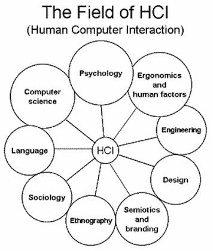

### ¿Qué vamos a estudiar?

* Cuál es el proceso y los métodos que son efectivos a la hora de garantizar la creación de sistemas interactivos que tienen un __buen diseño__ desde el punto de vista de la interacción. 

* Se darán algunas directrices y principios para evitar realizar __malos diseños__ ya que hay errores que pueden ser fácilmente evitables teniendo en cuenta ciertas pautas.

* Vamos a aprender técnicas para conocer a los **usuarios** de los sistemas interactivos que desarrollemos:

    * Quién va a usar el sistema.
    * Cómo se va a usar.
    * Cuándo y en qué contexto se va a usar.

### ¿Qué vamos a estudiar?

A grandes rasgos, los principales temas que se impartirán en la asignatura serán los siguientes:

* Principios básicos de diseño de sistemas interactivos
* Metodología de diseño de sistemas interactivos
* Prototipado de sistemas interactivos
* Métodos de evaluación de sistemas interactivos

## Buenos diseños frente a malos diseños

La pincipal forma con la que aprenderemos en esta asignatura es teniendo los ojos bien abiertos y observando lo que nos rodea con [ojos de principiante](http://www.redmindfulness.org/646033/).

De esta forma podremos aprender comparando *buenos diseños* con *malos diseños*

### Malos diseños

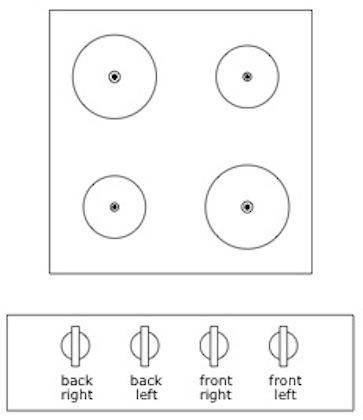

### Malos diseños

### Malos diseños

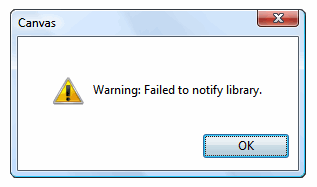

### ¿Que caracteriza a un mal diseño?

* Es confuso
* Te resulta molesto, te enfada usarlo
* Es ineficiente, te obliga a realizar muchos pasos para completar una tarea sencilla
* Es difícil de usar
* No es _obvio_

Un mal diseño cuesta vidas, dinero y tiempo.

### Vidas

### Vidas

<!-- Durante los primeros años de la Segunda Guerra Mundial los aviones B-17, B-25 y P-47 sufrieron muchos accidentes debidos a "errores del piloto": aterrizaban en tierra con el tren de aterrizaje subido. 

El problema era realmente un **error de diseño** debido a que los mandos para manipular los flaps (necesarios durante el aterrizaje) y el tren de aterrizaje eran idénticos y estaban muy próximos. La solución inicial (que luego fue estandarizada) fue la de que los mandos que manipulaban las ruedas y los flaps tuviesen una forma distinta. Así los pilotos los pueden identificar incluso solo al tacto. -->

### Dinero

[idearapida.com](http://idearapida.com/) 
<!-- es una plataforma de crowdfounding. El crowdfounding consiste en financiar de manera colectiva un proyecto. Las plataformas de crowdfounding dan publicidad de estos proyectos y proporcionan el soporte para que cualquiera pueda aportar dinero a estos proyectos (a cambio de un porcentaje del dinero recaudado). Otras plataformas como esta son [Kickstarter](http://www.kickstarter.com/) o [Lanzanos](http://www.lanzanos.com/) (entre otras muchas)

Si entramos en la página de [uno de los proyectos](http://idearapida.com/proyectos/16/a16.php) (Calm Night of Snowfall es uno de los videojuegos desarrollados en el Master de Desarrollo de Videojuegos de este pasado curso) veremos que a la derecha aparecen botones para contribuir: -->

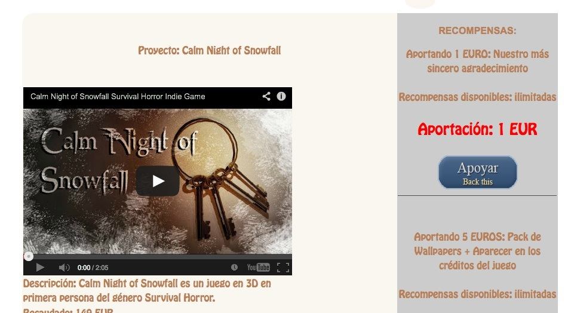

### Dinero

[idearapida.com](http://idearapida.com/) 
<!-- Pero al pulsar sobre él... ¡¡sale una lista interminable con todas las opciones de nuevo!! Y el método de pago aparece en medio de la lista por lo que tienes que buscarlo. -->

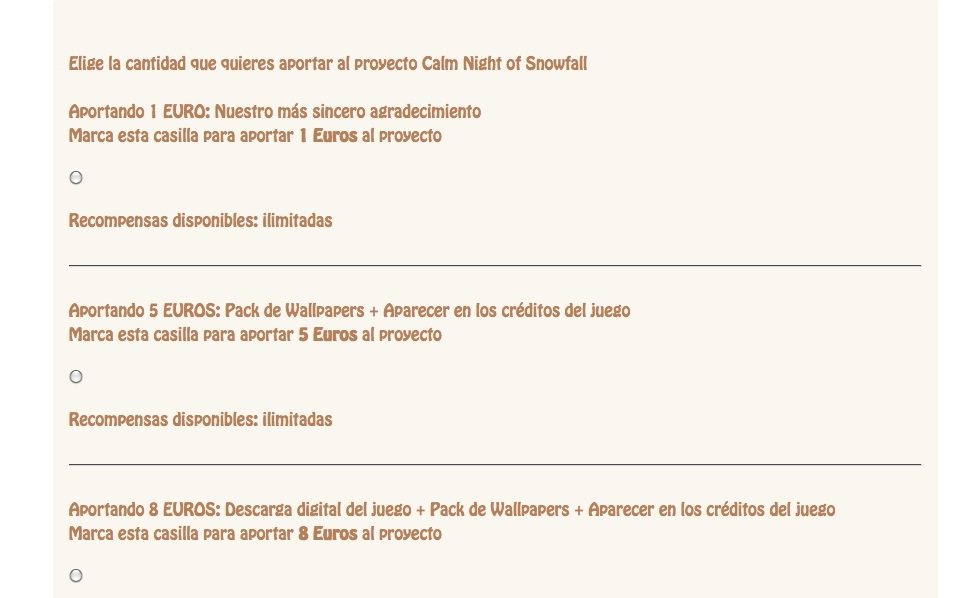

<!-- ¿Te da confianza esta página (a pesar de que su aspecto ha mejorado con respecto [a su antiguo aspecto](http://web.archive.org/web/20130515195705/http://idearapida.com))? ¿No te molesta llegado ese punto pagar dinero? -->

### Dinero

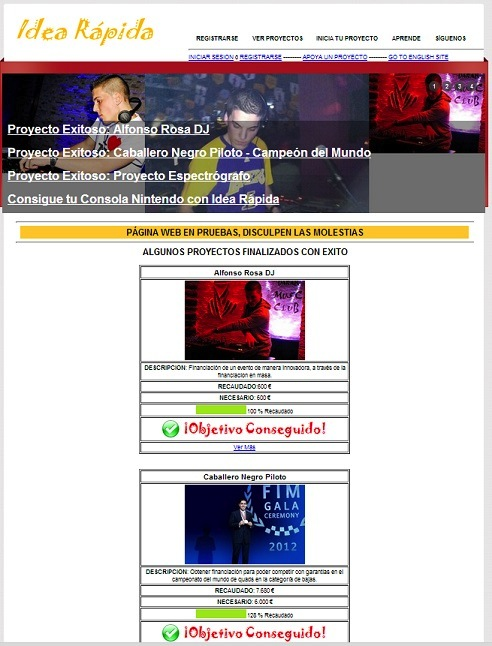

### Dinero

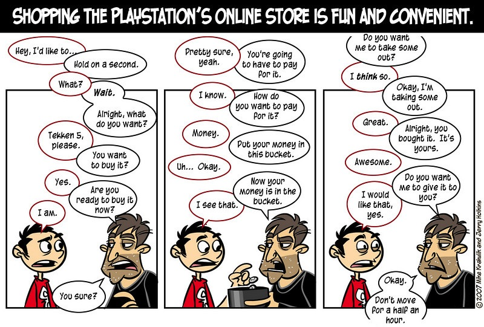

### Tiempo

<!-- [The Palm Beach County Ballot](http://en.wikipedia.org/wiki/United_States_presidential_election_in_Florida,_2000): El incidente con las papeletas que hicieron que George Bush posiblemente se llevase el estado de Florida en las elecciones de 2000. Se produjo una gran cantidad de votos para un tercer candidato (Pat Buchanan) que ocupaba, de acuerdo a la papeleta, el segundo puesto de la misma. Se supone que muchos de los votantes se confundieron al votar por Al Gore. El caso terminó en el tribunal supremo y retrasó en más de un mes la elección del nuevo presidente de los EEUU. --> 

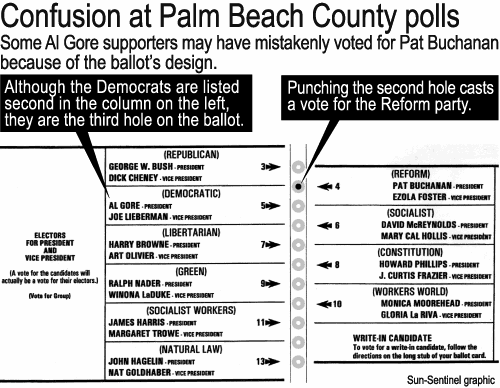

### Tiempo

Resultados de Pat Buchanan:

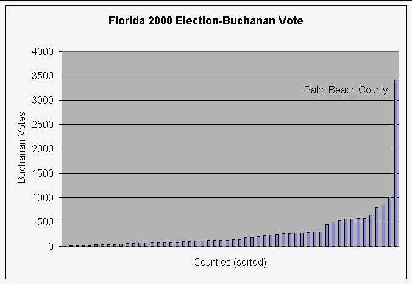

### Buenos diseños

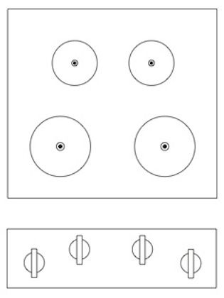

### Buenos diseños

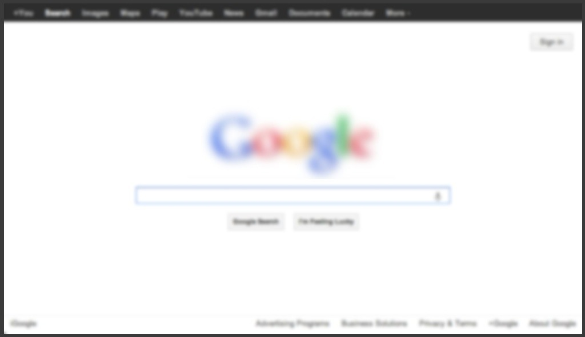

### ¿Qué tiene un buen diseño?

<!-- Las interfaces bien diseñadas tienen la particularidad de que suelen ser invisibles para nosotros. No nos fijamos en ellas porque nos ayudan a completar la tarea que neceesitamos realizar. -->

* Reconocible: Un interfaz bonito o inteligente no implica que sea usable.
* Simple y elegante
* El propósito de cada uno de sus elementos es claro
* Es fácil aprender a usarlo
* Seguro y robusto
* Es flexible, se adapta tanto a usuarios novatos como a los más avanzados
* Utiliza metáforas adecuadas
* Lo más importante: se han diseñado **pensando en el usuario** por lo que satisfacen sus necesidades  y proporcionan una agradable experiencia de usuario.

### Diseño centrado en el usuario

Vamos a aprender una metodología de diseño, el **diseño centrado en objetivos**, que ayuda en el desarrollo de sistemas interactivos. A grandes rasgos, este proceso consiste en:

1. Conocer al usuario
2. Crear diseños alternativos
3. Crear prototipos de estos diseños
3. Evaluar los diseños creados con los usuarios

### Conocer al usuario

Entender a la gente en el contexto en el que vive, trabaja y utiliza un producto ayuda a saber cómo diseñar productos interactivos que encajen en ese contexto y que les ayuden a mejorar la forma en la que trabajan, se comunican e interactúan.

Estudiaremos técnicas para obtener ese conocimiento del usuario así como a modelar usuarios prototípicos.

### Diseñar y crear prototipos 

<!-- La metodología de diseño centrada en el usuario define que es importante que el usuario pueda interactuar (o simular que interactúa) con el sistema. Por este motivo veremos que una parte importante de la asignatura será la realización de prototipos con distinto nivel de detalle. -->

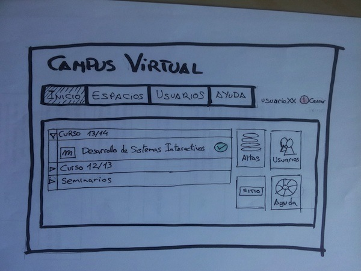

<!-- Lo importante de los prototipos no serán los prototipos en sí mismo sino el _feedback_ que obtengamos del usuario que interaccione con ellos. Será nuestro medio para comunicarnos con los usuarios del sistema así como con otras personas relacionadas con la creación del sistema. -->

### Diseñar y crear prototipos 

<!-- Un ejemplo: [Palm Pilot](http://en.wikipedia.org/wiki/Palm_%28PDA%29). Su inventor, Jeff Hawkins, se dedicó durante un tiempo a hacer su vida normal llevando un bloque de madera con el tamaño del dispositivo y sobre el que simulaba que hacía anotaciones, apuntaba citas, etc.  -->

<!-- También aprenderemos a realizar prototipos simples pero funcionales. En particular, usaremos [Balsamiq Mockup](http://balsamiq.com/products/mockups/) para trabajar en el desarrollo algunos prototipos como [este ejemplo](https://uxapprentice.mybalsamiq.com/projects/zen/naked/Landing). -->

### Diseñar y crear prototipos 

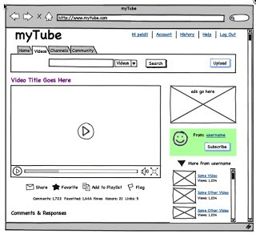

### Evaluación de diseños

<!-- Vamos a conocer técnicas de evaluación de diseños que se realizan con usuarios (no más test de unidad, bancos de prueba...) ya que no podemos determinar cómo de buena es una interfaz de usuario hasta que no lo probemos con los usuarios reales del sistema. No siempre los programadores del sistema conocen exactamente cómo el usuario final va a usar _realmente_ el sistema. -->

<!-- Vamos a aprender distintos métodos de evaluación para alcanzar distintos objetivos: -->

* Estudios de usabilidad
* Feedback de expertos (evaluación heurística)
* Experimentos comparativos
* Observación del usuario
* ...

### Conceptos avanzados de sistemas de interacción

<!-- Para completar el curso hablaremos sobre:  -->

* Accesibilidad 
* Interfaces inteligentes
* Interfaces para sistemas de propósito específico

## Evaluación de la asignatura

La evaluación final del curso se compone de tres partes:

### Participación (10%)

Este 10% se consigue mediante:

* La participación activa en el aula 
* Pequeñas actividades entregables en el laboratorio
* Participación en actividades en los foros (discusiones, búsquedas de buenos-malos diseño...)

### Prácticas (30%)

Las prácticas son **obligatorias** y es necesario que estén **aprobadas** para que sean tenidas en cuenta en la nota final:

* Entregadas en plazo
* Satisfaciendo los requisitos del enunciado
* Obteniendo una nota entre 5 y 10

Habrá 4-5 prácticas que se realizarán en grupos (2-4 personas).

Las prácticas no entregadas o suspensas se tendrán que volver a entregar en septiembre.

### Proyecto o examen final (60%)

En diciembre se comenzará con un **proyecto final** que consistirá en el diseño de un sistema interactivo de acuerdo a las metodologías y técnicas explicadas en clase.

El tema final del proyecto deberá ser aprobado previamente por el profesor. 

El trabajo será presentado en defensa pública a finales de enero. 

En caso de superar la defensa los miembros del grupo quedarán exentos de realizar el examen final.

Al igual que con las prácticas, es necesario **aprobar** el proyecto para que su nota sea tenida en cuenta en la nota final.

### Proyecto o examen final (60%)

En caso de no presentar el proyecto o no superar la defensa habrá un **examen final** sobre los contenidos teórico-prácticos de la asignatura.

Este examen podrá realizarse tanto en la convocatoria de febrero como septiembre.

Será necesario **aprobar** el examen para que su nota sea tenida en cuenta en la nota final.

## Bibliografía

### Principal 

* [About Face 3 : The essentials of interaction design](http://0-proquest.safaribooksonline.com.cisne.sim.ucm.es/9780470084113). Alan Cooper, Robert Reimann, and Dave Cronin. Wiley, cop. 2007
* Interaction Design: Beyond Human-Computer Interaction. Helen Sharp, Yvonne Rogers, Jenny Preece. John Wiley & Sons, 2007.
* Usability Engineering. Jakob Nielsen. AP Professional, 1993.

### Complementaria

* [Designing Interfaces. Patterns for Effective Interaction Design](http://zv4fy5pr5l.search.serialssolutions.com/?ctx_ver=Z39.88-2004&ctx_enc=info%3Aofi%2Fenc%3AUTF-8&rfr_id=info:sid/summon.serialssolutions.com&rft_val_fmt=info:ofi/fmt:kev:mtx:book&rft.genre=book&rft.title=Designing+Interfaces+%3A+Patterns+for+Effective+Interaction+Design&rft.au=Tidwell%2C+Jenifer&rft.date=2009-02-09&rft.pub=O%27Reilly+Media&rft.isbn=9780596008031&rft.externalDBID=n%2Fa&rft.externalDocID=443495&paramdict=es-es) (Second Edition). Jennifer Tidwell. O'Reilly. 2010.
* [Handbook of usability testing.](http://zv4fy5pr5l.search.serialssolutions.com/?ctx_ver=Z39.88-2004&ctx_enc=info%3Aofi%2Fenc%3AUTF-8&rfr_id=info:sid/summon.serialssolutions.com&rft_val_fmt=info:ofi/fmt:kev:mtx:book&rft.genre=book&rft.title=Handbook+of+usability+testing&rft.au=Rubin%2C+Jeffrey&rft.au=Chisnell%2C+Dana&rft.date=2008-01-01&rft.pub=Wiley+Pub&rft.isbn=9780470185483&rft.externalDocID=bks00025203&paramdict=es-es) Jeff Rubin, Dana Chisnell. Wiley Publishing. 2008.
* [Sketching User Experiences: Getting the Design Right and the Right Design.](http://0-proquest.safaribooksonline.com.cisne.sim.ucm.es/book/web-development/usability/9780123740373) Bill Buxton. Morgan Kauffman. 2007.
    *  [Sketching User Experiences: The Workbook.](http://zv4fy5pr5l.search.serialssolutions.com/?ctx_ver=Z39.88-2004&ctx_enc=info%3Aofi%2Fenc%3AUTF-8&rfr_id=info:sid/summon.serialssolutions.com&rft_val_fmt=info:ofi/fmt:kev:mtx:book&rft.genre=book&rft.title=Sketching+User+Experiences%3A+The+Workbook&rft.au=Greenberg%2C+Saul&rft.au=Carpendale%2C+Sheelagh&rft.au=Marquardt%2C+Nicolai&rft.au=Buxton%2C+Bill&rft.date=2011-11-14&rft.pub=Morgan+Kaufmann&rft.isbn=9780123819598&rft.externalDBID=n%2Fa&rft.externalDocID=809159&paramdict=es-es) Saul Greenberg; Sheelagh Carpendale; Nicolai Marquardt; Bill Buxton. Morgan Kauffman. 2010.

