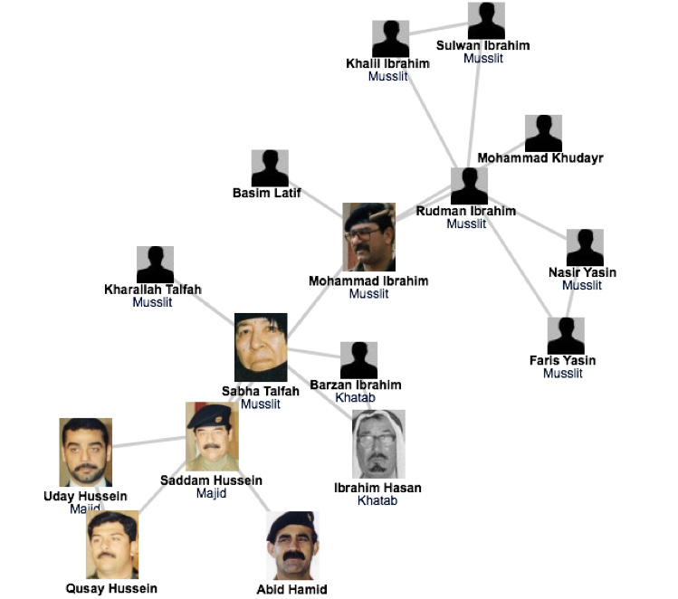
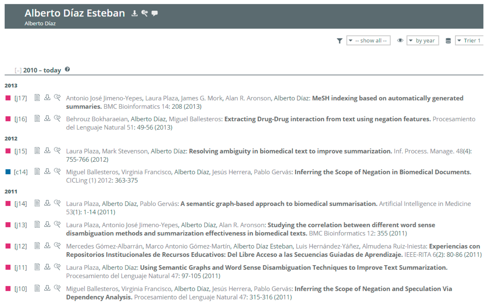
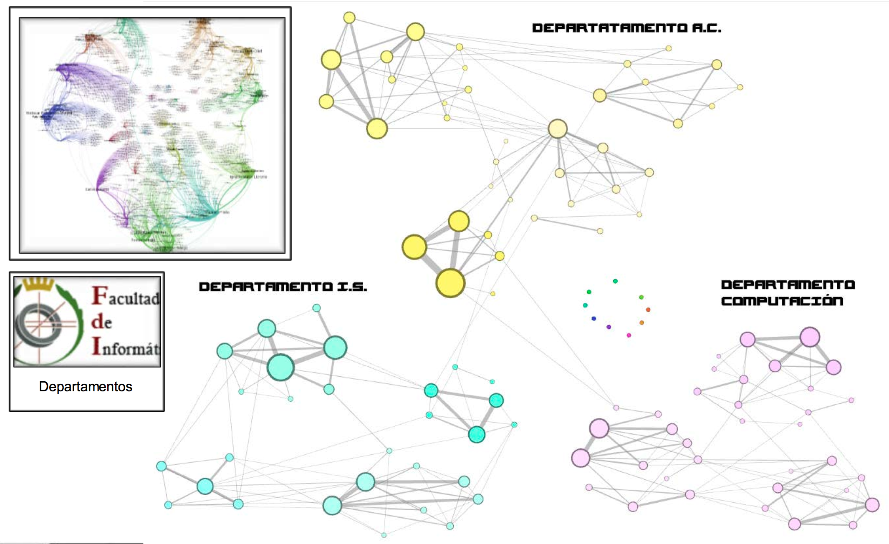
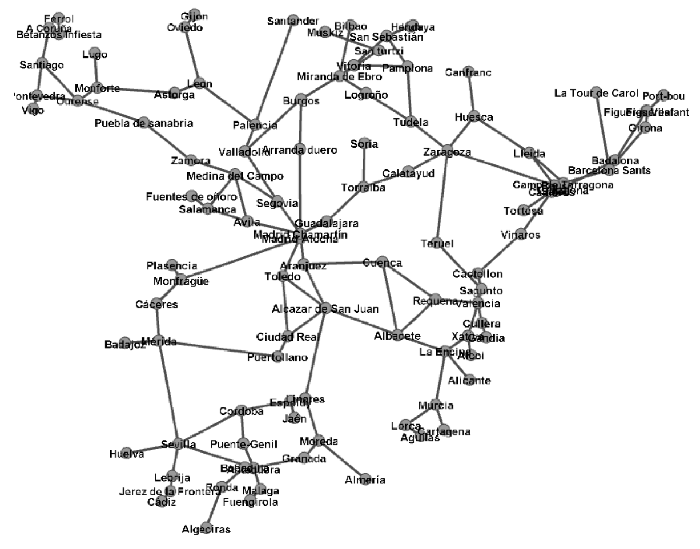
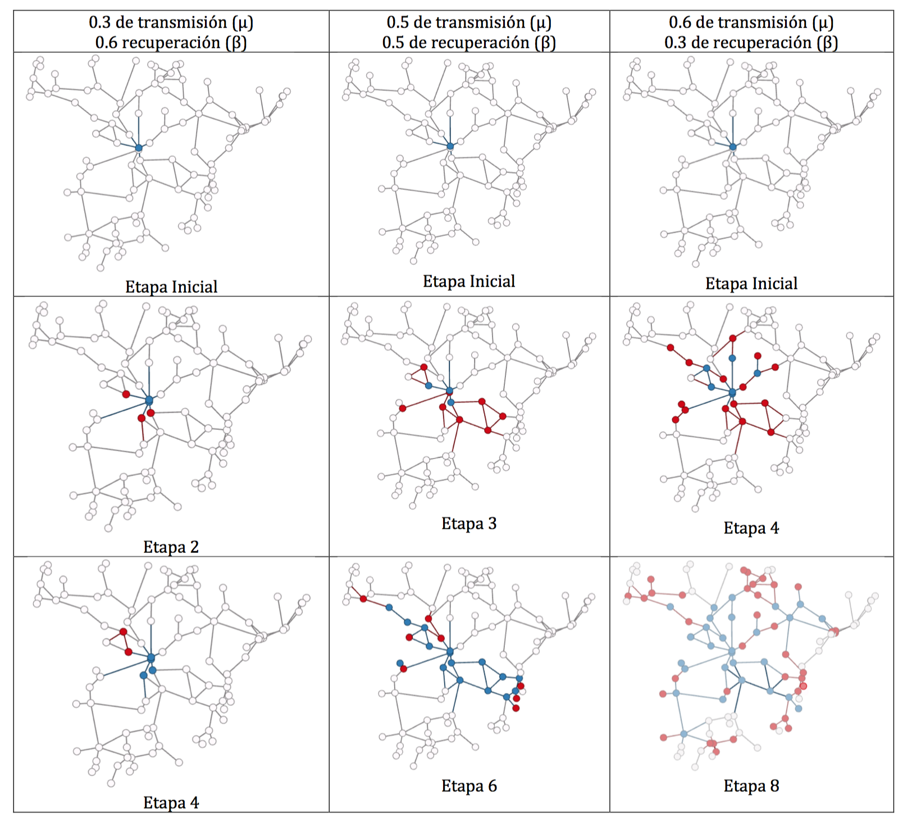
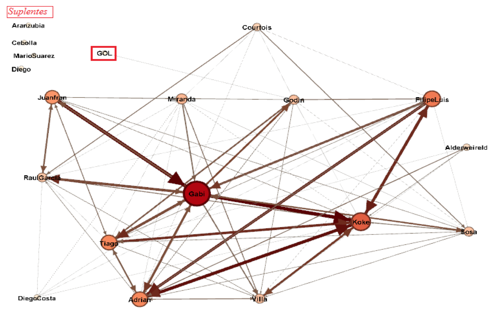

% Análisis de Redes Sociales
% Guillermo Jiménez Díaz (gjimenez@ucm.es); Alberto Díaz (albertodiaz@fdi.ucm.es)
% 30 de septiembre de 2015

# Tema 0: Presentación de la asignatura {-}

## Ejemplos motivadores

### Las redes y la captura de Sadam Husseim

### Las redes y la captura de Sadam Husseim

La captura de Saddam Hussein ilustra algunos de los aspectos claves de las redes que estudiaremos en esta asignatura:

* Muestra el **poder predictivo de las redes**, que permite extraer información clave incluso a los no expertos (los soldados en este caso)
* Resalta la necesidad de **diseñar mapas precisos de las redes a estudiar** (en muchos casos, el proceso de diseño es muy complicado y costoso)
* Ejemplifica el hecho de que **la elección de la red a emplear marca la diferencia** (los militares americanos tardaron meses en darse cuenta que la red jerárquica que representaba la organización oficial iraquí era inútil para encontrar a Saddam)
* Destaca la **estabilidad de algunas redes de confianza** (la captura de Hussein no se basó en las técnicas clásicas de Inteligencia sino en sus conexiones sociales antes de la invasión, extraídas de viejas fotos de su álbum familiar)

### Predicción de la epidemia de la gripe aviar (H1N1) en 2009

.](../images/tema00/gripeAviar.jpg)

### Predicción de la epidemia de la gripe aviar (H1N1) en 2009

La gripe aviar de 2009 es la primera pandemia cuya evolución fue predicha meses antes de que alcanzara su punto álgido:

* Haciendo uso de las **redes de transporte a nivel mundial**, se determinó correctamente que alcanzaría su pico en Octubre de 2009, en lugar de en Enero-Febrero (picos habituales de la gripe estándar).
* Se demostró que la vacunación masiva realizada en Noviembre de 2009 fue inútil por ser demasiado tardía, hecho comprobado a posteriori.
* El cambio fundamental consistió en considerar el **rol de las redes en la propagación de los virus**, en contraste con los modelos epidémicos clásicos.
* Hoy en día, la predicción de epidemias es una de las aplicaciones más activas del Análisis de Redes. No sólo se centra en virus biológicos sino también electrónicos (ej: predicción de la infección de 300.000 teléfonos móviles en China en 2010).

### El apagón de la costa noroeste de EEUU el 14/08/2003

### El apagón de la costa noroeste de EEUU el 14/08/2003

* Este apagón es un ejemplo típico de un **fallo en cascada**: cuando una red actúa como sistema de transporte, un fallo local en un nodo provoca una transferencia de carga a otros nodos. Si la carga extra es excesiva para los nodos vecinos, éstos pueden fallar y redistribuirla a otros nodos a su vez (cayeron 256 plantas y 508 unidades generadoras).
* La magnitud del fallo depende de **la posición en la red y la capacidad de los nodos afectados** (eliminados) en el primer momento y en los siguientes.
* Los fallos en cascada son habituales en los Sistemas Complejos (ej: tráfico en Internet). La actual crisis financiera mundial es un ejemplo provocado por la crisis de crédito en los EEUU.
* También pueden tener efectos positivos. Ej: tratamientos del cáncer.
* **La estructura de la red afecta a la robustez del sistema**. Se pueden establecer herramientas cuantitativas que evalúen la relación entre la estructura de la red y los procesos dinámicos que se producen en ella, así como su impacto en los fallos.
* Esos fallos no son caóticos e impredecibles, siguen una serie de **leyes reproducibles**.

## Sistemas complejos

### Sistemas complejos

* Difíciles de comprender y analizar.
* Detrás de cada sistema complejo estudiado siempre hay una red
* Define las interacciones entre sus componentes
* No seremos capaces de entender los sistemas complejos a menos que podamos mapear y comprender las redes que los soportan.

> A pesar de las diferencias aparentes en componentes e interacciones, las redes que regulan los distintos sistemas complejos existentes son similares, siguen unas leyes comunes y presentan mecanismos reproducibles.

### Sistemas complejos

Ejemplos de sistemas complejos:

* El **cerebro humano** es una red de neuronas
* La **sociedad** es una red de conexiones familiares, profesionales y de amistad entre individuos.
* Un **sistema de comunicación** es un conjunto de dispositivos de comunicación que interaccionan a través de Internet o de enlaces wireless.
* La **red eléctrica** se compone de generadores y líneas de transmisión entre ellos.
* El **comercio y la economía** se puede representar como una red de intercambio de bienes y servicios entre personas, empresas y países.
* **Internet** es una red de páginas enlazadas entre sí.
* El **genoma humano** se puede representar como una red de interacción entre los genes que lo conforman.
* ...

## La emergencia de las redes y los sistemas complejos

### La ciencia del siglo XXI

> El análisis de las redes sociales es la ciencia del siglo XXI debido a su auge en investigación y desarrollo.

### La ciencia del siglo XXI: Motivos

* **Necesidad (urgente) de entender la complejidad**

> No podemos permitirnos no entender el comportamiento de los sistemas complejos.
 
### La ciencia del siglo XXI: Motivos

* **Disponibilidad de Datos**
    * Red de Actores de Cine, 1998
    * La World Wide Web, 1999
    * Red Neuronal del gusano C.Elegans, 1990
    * Redes de Citas de Artículos Científicos, 1998
    * Genoma Humano, 2001
    * Red de Interacciones entre Proteínas, 2001
    * APIS en redes sociales (Facebook, Twitter...), actualidad.

### La ciencia del siglo XXI: Motivos

* **Universalidad** 

> La arquitectura de las distintas redes que están apareciendo en distintos dominios es más similar de lo que podría esperarse.

## ¿Para qué sirve el Análisis de Redes Sociales?

### Usos

* Entender la estructura y el comportamiento de un sistema complejo.
* Extraer información y realizar predicciones.
* Visualización de información (en forma de red).
* Detección de nodos de especial relevancia en la dinámica de la red (influenciadores y concentradores).
* Detección de vulnerabilidades y posibles fallos en cascada debido a las interconexiones entre nodos (por ejemplo, en una red eléctrica por sobrecarga de una central o en internet, debido a un ataque por denegación de servicio en un router).
* Entender cómo la estructura de la red afecta a la robustez de la misma.
* Detección de grupos y comunidades dentro de la misma.
* Conocer los procesos dinámicos que aparecen en ella: difusión de información, contagio emocional...

### Multidisciplinar

El Análisis de Redes Sociales (ARS), ciencia de redes (Network Science) o análisis de sistemas complejos es multidisciplinar, ya que usa herramientas:

* teoría de grafos
* física
* estadística
* informática
* biología
* Teoría de redes sociales
* ...

### El Análisis de Redes Sociales y la Teoría de Grafos

ARS y la teoría de grafos matemática:

* El ARS es más empírico que la teoría de grafos.
* El ARS se centra en los datos y en la utilidad de los mismos.
* Usa, al igual que la teoría de grafos, conceptos y modelos matemáticos para describir las propiedades de la red.
* Trabaja con grandes cantidades de información por lo que genera grafos enormes.
 
### Aplicaciones del Análisis de Redes Sociales

* **Salud**: Medicina y genómica, redes de enfermedades humanas y genes y proteínas implicados, investigación sobre el cerebro humano y redes neuronales, predicción de epidemias.
* Lucha contra el **terrorismo**
* **Economía y Marketing**: predicción económica; recomendaciones y anuncios. Detección de influenciadores, personas con una importante conexión con otras personas, como foco para la propagación de campañas.
* **Gestión**: estructura de organizaciones, identificación de líderes de opinión, grupos óptimos...

## Objetivo general del curso {-}

### Objetivo

> En esta asignatura se pretende enseñar a identificar las principales **propiedades** de una red, los métodos y **modelos** que se utilizan para identificarlas y caracterizarlas a partir de datos reales, la **detección de grupos y comunidades**  así como de **nodos de especial relevancia**, y los **modelos de propagación** relacionados con el flujo de información a través de una red social.

### Contenidos del curso

1. Introducción.
2. Propiedades básicas de las redes
3. Centralidad
4. Modularidad y detección de comunidades
5. Visualización y poda de redes
6. Modelos de redes: aleatorias, libres de escala y pequeños mundos.
7. Dinámica de las redes: Propagación y difusión.
8. Robustez.

### Organización

* Clases teóricas se impartirán en el aula 12 los viernes
* Clases prácticas en el laboratorio 11 los miércoles.
* En algunas sesiones prácticas se impartirán seminarios para facilitar la realización de las prácticas.
* **Asistencia obligatoria**, tenida en cuenta a la hora de la evaluación

## Evaluación de la asignatura

La evaluación final del curso se compone de dos partes:

### Prácticas (30%)

> Las prácticas son **obligatorias** y han de estar **aprobadas** 

1. Entregadas en plazo
2. Satisfaciendo los requisitos del enunciado
3. Obteniendo una nota entre 5 y 10

* Grupos de 3 o 4 alumnos, 2-3 prácticas
* Las prácticas no entregadas o suspensas se tendrán que volver a entregar **en septiembre**.

### Proyecto (70%)

> El proyecto final es **obligatorio** y consistirá en el análisis de un conjunto de datos real elegido por el grupo de alumnos.

* Mismos grupos que las prácticas
* Presentado en defensa pública
* Debe cumplir los mismos requisitos que las prácticas
* Los proyectos no entregados o suspensos se tendrán que volver a entregar **en septiembre**.

## Proyectos del curso pasado

### Análisis de la red de coautorías de profesores de la Facultad de Informática

### Análisis de la red de coautorías de profesores de la Facultad de Informática

### Estudio de los modelos de contagio sobre la red de trenes de ADIF

### Estudio de los modelos de contagio sobre la red de trenes de ADIF

### Análisis de la red de pases de la final de la Champions de 2014

### Análisis de la red de pases de la final de la Champions de 2014

### Análisis de la red de pases de la final de la Champions de 2014

### Simulador temporal del comportamiento de los nodos de una red

 <video width="640" height="480" controls>
  <source src="../video/airport.mp4" type="video/mp4">
Your browser does not support the video tag. <a href="https://youtu.be/RNRWRmGFnyY" >Youtube link</a>
</video> 

### Análisis de enlaces y hashtags de Twitter

## Bibliografía

### Bibliografía 

> Principal

* [Network Science](http://barabasilab.neu.edu/networksciencebook/). Laszlo Barabasi.
* [Networks, Crowds and Markets](http://www.cs.cornell.edu/home/kleinber/networks-book/). David Easley and Jon Kleinberg, Cambridge University Press. 2010.
* Social and Economic Networks. Matthew O. Jackson. Princeton University Press. 2008.
* [Apuntes del curso pasado en GitHub](https://github.com/GuilleUCM/SOC/releases)

### Bibliografía 

> Complementaria

* The Structure and Dynamics of Networks. Mark Newman, Albert-László Barabási, and Duncan J. Watts. 2006.
* [Linked: The New Science of Networks](http://barabasilab.com/LinkedBook/index.html). Albert-Laszlo Barabasi, Jennifer Frangos.

