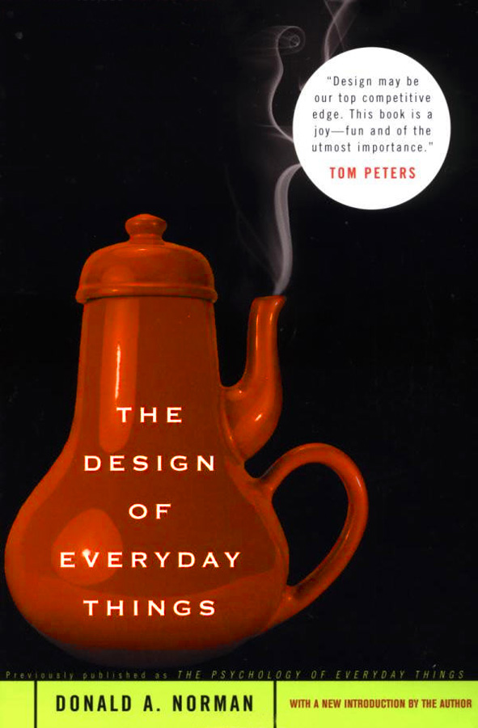

% Introducción a la Interacción Persona-Ordenador
% Pablo Moreno Ger (pablom@ucm.es); Guillermo Jiménez Díaz (gjimenez@ucm.es)
% Curso 2013/2014

<!-- # Prefacio

Estos son los apuntes de la asignatura Desarrollo de Sistemas Interactivos, impartida en la Facultad de Informática de la Universidad Complutense de Madrid por los profesores Guillermo Jiménez Díaz y Pablo Moreno Ger, del Departamento de Ingeniería del Software e Inteligencia Artificial.

Este material ha sido desarrollado a partir de distintas fuertes, destacando como referencia principal las notas de la asignatura _Human Computer Interaction_ del Prof. Keith Andrews de la  Universidad Tecnológica de Graz, el material de la asignatura _Human Computer Interaction_ impartido por Scott Klemmer a través de Coursera y los libro _About Face 3: The Essentials of Interaction Design_ de Alan Cooper y _Interaction Design. Beyond Human Computer Interaction_ de Rogers, Sharp y Preece. -->

# Tema 1: Introducción a la Interacción Persona-Ordenador

En este tema introduciremos algunos de los conceptos de los que vamos a discutir a lo largo del curso y veremos una breve historia sobre algunos de los hitos más relevantes en la interacción persona-ordenador. Por último, haremos una breve introducción al diseño guiado por objetivos.

### Introducción

> * Interacción persona-ordenador
> * Breve historia de HCI
> * Usabilidad y experiencia de usuario
> * Ingeniería de la usabilidad
> * Diseño guiado por objetivos

## Interacción Persona-Ordenador

### Definición

> _Human-Computer Interaction (HCI) es la disciplina que se encarga del diseño, evaluación e implementación de sistemas interactivos computerizados usados por humanos y que estudia los fenómenos que se desarrollan alrededor de dicho uso._

### ¿Sistemas interactivos computerizados?

>- Teléfonos móviles / Tablets
>- Ordenador (obviamente)
>- Controles de aviones
>- Instalaciones eléctricas
>- ...

### Humanos

- Las famosas "personas normales"

- Usuarios individuales, pero también colectivos específicos (pilotos), corporaciones, o grupos de usuarios que trabajan colaborativamente.

### Visión general de HCI

<!-- Human-Computer Interaction (HCI) es la disciplina que se encarga del diseño, evaluación e implementación de sistemas interactivos computerizados usados por humanos y que estudia los fenómenos que se desarrollan alrededor de dicho uso.

Hay que tener en cuenta que cuando nos referimos a sistemas interactivos computerizados no solo nos referimos a un computador/ordenador sino a otros muchos sistemas: teléfonos móviles, tablets, consolas de mandos de aviones, instalaciones eléctricas... Así mismo, cuando nos referimos a los humanos nos referimos a uno o varios ya que podemos pensar en aplicaciones unipersonales, distribuidas o colaborativas. 

Es un área multidisciplinar que engloba tanto la ingeniería informática como otras disciplinas más sociales como la etnología, la psicología

Como se puede ver en la imagen, la interacción persona-ordenador tiene múltiples intereses y actividades:

* Por un lado (parte superior de la figura), se centra en el estudio del usuario, de su contexto, de las tareas que realiza y de las necesidades que tiene. 
* Por otro lado estudia la manera en la que se puede producir la interacción entre el usuario y la máquina. Define y estudia modelos y teorías relacionadas con la interacción. Por un lado se centra en conocer cuál es el proceso mental de los usuarios (Bloque _Human_ en la figura), cómo procesa la información y cuáles son su objetivos para poder proporcionarle experiencias de uso positivas. Así mismo, el HCI se centra (Bloque _Computer_ en la figura ) en las técnicas ya probadas y que se conoce que han sido efectivas que sirven para implementar interfaces y que nos conducen a _buenos diseños_.
* Por último, el HCI estudia metodologías y procesos de desarrollo software (parte inferior de la figura) centrados en conocer al usuario, el desarrollo de prototipos y una constante evaluación empírica por parte del usuario del sistema. Por este motivo, el HCI también se centra en técnicas que sirvan para evaluar y comparar interfaces desde el punto de vista de su uso con usuarios.  -->

## Historia sobre la Interacción Persona-Ordenador

### Orígenes

El interés por la interacción Persona-Ordenador nace a consecuencia de los errores que se producían al interactuar con ciertos dispositivos. 

La mente humana se ve superada:

- Revolución industrial

- Revolución tecnológica (Segunda Guerra Mundial)

<!-- Desgraciadamente, el interés por la interacción Persona-Ordenador nace a consecuencia de los errores que se producían al interactuar con ciertos dispositivos. Más concretamente, este interés crece durante la Segunda Guerra Mundial en el contexto del diseño de aparatos militares que han de ser operados por humanos (principalmente pantallas y controles de aviones y otra maquinaria bélica).

Tras la Segunda Guerra mundial, estas son las figuras e hitos más destacados en el dominio de la interacción Persona-Ordenador. -->

### Vannevar Bush

<!-- Aunque también es conocido por ser el jefe de la comunidad de científicos responsables de la bomba atómica, la aportación más interesante de Vannevar Bush es su artículo ["As we may think" (1945)](http://biblioweb.sindominio.net/pensamiento/vbush-es.html), en el que Bush insta a los científicos que tanto trabajaron en ayudar a sus respectivas facciones durante la guerra, a investigar y desarrollar nuevos dispositivos que puedan ayudar al resto de las personas en los futuros tiempos de paz. En este artículo  aparecen ideas tan novedosas para la época como las calculadoras personales, minicámaras y "cámaras digitales" que llevaríamos siempre encima (¿no llevamos todos un móvil con cámara actualmente?), la interfaz por voz (dictar el contenido de un documento a una máquina), los sistemas de información y bases de datos, el hipertexto, la interfaz cerebro-computador, etc... Un ejemplo de estas profecías:  -->

### "As we think" (1945)

> ... el personal administrativo de una empresa puede colocar en el interior de una máquina de selección varios miles de tarjetas perforadas que contienen los datos de los empleados, establecer un código según una convención acordada y, tras un breve periodo de tiempo, recibir una lista de todos los empleados que, por ejemplo, viven en Trenton y hablan español.

> ... En ocasiones será de gran utilidad disparar el obturador de la cámara y ver la fotografía inmediatamente después...

> ...podemos preguntarnos "¿dejará el autor del futuro de escribir a mano a máquina para hablar directamente con el archivo?"

- Calculadoras portátiles
- Cámaras digitales (!)
- Interfaces por voz
- Bases de datos relacionales (!)
- Hypertexto

### Memex

<!-- Otra de las príncipales aportaciones de Bush en ese artículo es el [escritorio Memex](http://es.wikipedia.org/wiki/Memex). Aunque nunca fue construído Memex es la idea de un escritorio en el que el usuario almacena todos sus libros y documentos, en forma de microfilm, y que posee una interfaz (palancas y botones) con la que el usuario puede recuperar fácilmente los documentos almacenados. Hay unas pantallas en las que el usuario puede ver el material recuperado y una superficie transparente sobre la que el usuario puede colocar nuevos documentos para ser fotografiados y almacenados en el escritorio. Así mismo puede anotar a mano los documentos que lee. El acceso a los documentos almacenados podría ser mediante índices o por mnemotécnicos (asociativo). Por último, Memex permitiría enlazar dos elementos distintos, dos documentos: el hipertexto. -->

### ENIAC

* Eckert y Mauchly en 1946
* 167m^2^ 
* Cálculo de trayectorias balísticas.
* La interfaz de usuario del ENIAC consistía en operar manualmente con unos 6000 interruptores (lo que hacía una modificación pudiese tardar semanas en realizarse).  

### Compiladores

* El primer compilador: el **A0** 
* Grace Murray Hopper (1952)
* la aparición de los lenguajes de alto nivel y de los compiladores suponen una revolución
    * _Interfaz_ sobre los recursos de los que el computador dispone.
    * Podemos dar órdenes de alto nivel al computador
    * Sin necesitar conocer los detalles específicos de la máquina en la que se va a ejecutar

<!-- Grace Murray Hopper desarrolló en 1952  el primer compilador: el **A0**.  Desde el punto de vista de interacción con el computador, la aparición de los lenguajes de alto nivel y de los compiladores suponen una revolución ya que hacen de _interfaz_ sobre los recursos de los que el computador dispone. Como programadores, podemos dar órdenes de alto nivel al computador sin necesitar conocer los detalles específicos de la máquina en la que se va a ejecutar. -->

### Grace Murray Hopper

> Nota anecdótica: Trabajó durante varios años en el Mark II y algunos le atribuyen la invención del término _bug_ para hablar de un error de programación. 

### Ivan Sutherland

<!-- En sus inicios, el trabajo con los ordenadores consistía en el **procesamiento por lotes**. -->

* [Sketchpad](http://youtu.be/USyoT_Ha_bA?t=3m52s) (MIT, 1963)
* La primera interfaz gráfica de usuario (_graphical user interface_ o _GUI_)
* Con un lápiz óptico (!)
* Desdibuja la frontera entre _entrada_ y _salida_ por primera vez.

<!-- Durante su doctorado (¡[en Filosofía](http://www.cl.cam.ac.uk/techreports/UCAM-CL-TR-574.pdf)!) en el MIT (1963) desarrolló [Sketchpad](http://youtu.be/USyoT_Ha_bA?t=3m52s), la primera interfaz gráfica de usuario (_graphical user interface_ o _GUI_). La gran novedad es que la comunicación con el computador se realiza mediante manipulación directa: hay una pantalla en la que se muestra lo que dibujamos y hay un "lápiz óptico" con el que realizamos dibujos sobre la pantalla. La entrada o _input_ se realiza directamente sobre la salida o _output_, lo que hace que la interacción sea realmente interactiva. Desdibuja la frontera entre _entrada_ y _salida_ por primera vez. -->

### Douglas Engelbart 

* Es el inventor del ratón 
* Falleció el 2 de julio de 2013). 
* La [presentación pública](http://youtu.be/61oMy7Tr-bM?t=8m18s) del mismo fue en el año 1968. 
* Es el primer dispositivo "apuntador" (_device pointer_)

### Douglas Engelbart 

[NLS](http://en.wikipedia.org/wiki/NLS_%28computer_system%29) (oN-Line System):

- Primer dispositivo apuntador externo.
- Hypertexto / hypermedia
- Procesadores de texto
- Videoconferencia y compartición de pantalla.
- Enlazado dinámico de archivos
- Control de versiones (!)
- Editor colaborativo en tiempo real (!!!)

### Alan Kay

<!-- Alan Kay comenzó trabajando con Ivan Sutherland en el MIT. Tal vez inspirado por la charla de Engelbart a la que asistió, Alan Kay comienza a trabajar en Dynabook, el primer prototipo de computador personal (1968), muy similar a las tabletas que usamos en la actualidad. Era un prototipo que pretendía ser un ordenador para niños. El software  asociado a este computador era SmallTalk. -->

### Alan Kay

* [Xerox Star Office Information System](http://www.youtube.com/watch?v=Cn4vC80Pv6Q). (1973)
* Primer Interfaz WIMP

<!-- Este sistema operativo tiene un entorno de ventanas muy similar a los que estamos acostumbrados a ver en la actualidad e introdujo los principales elementos de los interfaces WIMP: -->

### Interface WIMP

* **W**indows

    Cada aplicación o documento aparece y se ejecuta de manera independiente en una ventana.

* **I**cons

    Los iconos son representaciones de acciones y recursos del computador.

* **M**enus

    Son una manera alternativa al teclado de indicar las acciones que queremos ejecutar en el computador.

* **P**ointer

    El puntero es una representación en pantalla del dispositivo que el usuario utiliza para seleccionar documentos y realizar acciones.

### Xerox, Apple y Windows

> [Nota anecdótica](http://youtu.be/KhjVidOFqBo): En el año 1979 un tal Steve Jobs fue invitado a visitar las instalaciones del PARC de Xerox y quedó impresionado con la GUI que allí vio ("en diez minutos supe que todos los computadores funcionarían de ese modo"). Asistió con su equipo de desarrollo a varias demos y unos años más tarde copió y mejoró esta interfaz, creando Lisa (aunque el éxito les llegó un poco después con el Apple II, el primer Macintosh).

> Nota anecdótica: Años después, Apple acusaría a Microsoft de copiar su sistema de ventanas, Microsoft hablaría de su vecino rico Xerox...

### Don Norman

* Vicepresidente del Grupo de Tecnologías Avanzadas
* Cofundador del [Nielsen Norman Group](http://www.nngroup.com/) 
* Profesor emérito en la Universidad de California. 

### Don Norman

### The Design of Everyday Things

* **Experiencia de usuario** 
* **Diseño centrado en el usuario**

    * Simplificar la estructura de las tareas.
    * Hacer las cosas visibles.
    * Hacer "mapeos" comprensibles
    * Utilizar el poder de las restricciones
    * Diseñar aprendiendo de los errores
    * ...

### Ben Shneiderman

* Interfaces de [_manipulación directa_](http://en.wikipedia.org/wiki/Direct_manipulation_interface)

> Nota anecdótica: Ben Shneiderman también se ha destacado en el campo de la visualización de la información, entre otras cosas, por la visualización basada en __tree-maps__.

### Manipulación directa

* Existe una representación visual contínua y permanente de los objetos de datos del sistema.
* El usuario interactúa con la representación visual
    * usando acciones físicas (click, arrastrar, mover, usar anclas para redimensionar...)
    * pulsando botones asociados a acciones (pulsar un botón para poner texto en negrita).
* El efecto de las acciones es rápido, incremental, reversible y se muestra en todo momento el estado de los objetos y un continuo feedback de lo que ocurre.
* El usuario comete menos errores y que puede realizar las tareas más rápidamente
    * Ve el estado en el que va a quedar el sistema antes de completar la acción que está realizando.

### Manipulación directa: Ejemplos 

* En un editor gráfico, a medida que arrastramos la esquina de una figura ésta se va estirando para cambiar de tamaño.
* En un sistema operativo de ventanas, generalmente vemos en todo momento el estado de una ventana a medida que la vamos arrastrando por el escritorio.
* En una aplicación de modelado 3D, las rotaciones se realizan generalmente arrastrando circunferencias que se dibujan de manera ortogonal al eje sobre el que queremos girar. 

### Jakob Nielsen

* Cofundador, junto con Don Norman, del [Nielsen Norman Group](http://www.nngroup.com/).
* Es uno de los mayores expertos en usabilidad
* Evaluación heurística de interfaces

### Alan Cooper

* Aunque es arquitecto, [Alan Cooper](http://en.wikipedia.org/wiki/Alan_Cooper) ha sido conocido como un gran diseñador de software y programador. 
* Es el padre del Visual Basic
* **Diseño dirigido por objetivos**
* Uso de **personas**
* **diseño de interacciones** (_interaction design_).

<!-- ### Era Post-WIMP

Con la llegada de las PDAs y los smartphones aparecieron ciertas restricciones (restricciones de espacio, dispositivos de entrada...) que obligaron a hacer evolucionar a las técnicas de interacción. Por ejemplo, las pantallas táctiles son interfaces de _manipulación directa_ pero no pueden seguir el modelo descrito anteriomente ya que no hay ventanas, ni punteros...

Un ejemplo de nueva técnica de interacción que fue revolucionaria en su momento fue la rueda del iPod. La rueda disponía de vaios botones para realizar diversas acciones sobre los archivos y, además, nos permitía navegar por las listas de archivos haciéndola girar.

Posteriormente podemos hablar de todas las técnicas de interacción que nacieron con las pantallas táctiles, en las que el usuario es capaz de manipular los objetos tocando la pantalla y realizando gestos con uno o varios dedos (como las rotaciones o acercar/alejar los dedos o _pinching_).

Aunque se hablará de algunas de estas técnicas de interacción en el último capítulo podemos destacar, entre otras, las siguientes:

* Sistemas de realidad virtual
* Interfaces gestuales (Ej. Kinect)
* Interfaces por voz (Ej. Siri)
* Interfaces cerebro-computador... -->

### Era Post-WIMP

Nuevas restricciones por tamaño y potencia de dispositivos portátiles

### Era Post-WIMP

- Nuevo formato de _manipulación directa_: Las pantallas táctiles
- Pero no es WIMP!
    * No hay ventanas
    * No hay punteros

### Más allá de la pantalla táctil

* Sistemas de realidad 
* Interfaces gestuales (Ej. Kinect)
* Interfaces por voz (Ej. Siri)
* Interfaces cerebro-computador...
* 10-foot interfaces
    * Interfaces de usuario para utilizar en pantallas de televisión)

## Usabilidad

### Definición

[Según el estándar ISO 9241 (parte 11: Orientaciones sobre Usabilidad)](http://www.userfocus.co.uk/resources/iso9241/part11.html)

> la cualidad por la que un producto puede ser usado por un __usuario específico__ para conseguir unos __objetivos específicos__
con eficiencia, efectividad y satisfacción en un __contexto de uso específico__.

<!-- Como se puede ver, no es un término que pueda ser usado de manera general para un producto sino que ha de ser entendido dentro de una serie de condiciones: tipo de usuario, objetivos del usuario y contexto del usuario. -->

### Atributos de usabilidad (ISO 9241)

> * **Efectividad**: Es la precisión y el grado de completitud con la que el usuario es capaz de satisfacer sus objetivos.

> * **Eficiencia**: Los recursos y el tiempo empleados en relación con el grado de precisión y completitud con el que se han satisfecho los objetivos.

> * **Satisfacción**: Actitud positiva hacia el uso del producto, ausencia de frustración o incomodidad al usarlo.

### Usabilidad en contexto

* La usabilidad no existe de manera aislada ni implica la aceptación general de un sistema

* Otros atributos pueden ser más importantes 
    
> Un astronauta valora que su sistema de navegación sea fiable más que que sea usable)

### Usabilidad en contexto

### [5 atributos para la usabilidad](http://www.nngroup.com/articles/usability-101-introduction-to-usability/) (Nielsen)

> * **Facilidad de aprendizaje (_learnability_)**: Cómo de fácil es para un usuario novato realizar una tarea en el sistema.

> * **Eficiencia (_Efficiency_)**: Cómo de rápido puede realizar una tarea un usuario experto.

>* **Memorabilidad (_Memorability_)**: Cómo de fácil es recordar cómo se usa un sistema tras haber pasado un tiempo sin usarlo.

>* **Errores (_Errors_)**: Cuántos errores comete el usuario, cómo de graves son y cómo de fácil es recuperarse de ellos.

>* **Satisfacción (_Satisfaction_)**: Cómo de agradable es usar el sistema desde el punto de vista del usuario.

>* Efectividad (_effectiveness_): Cómo de bueno es sistema haciendo lo que se supone para lo que está diseñado.

<!-- En posteriores temas desarrollaremos más estos atributos, los transformaremos en heurísticas  y definiremos metodologías de evaluación de la usabilidad de un sistema.
 -->

### Usabilidad

* La usabilidad está relacionada con los _buenos diseños_ 
* No tener en cuenta los conceptos de usabilidad tiene consecuencias: tiempo, dinero e, incluso, vidas.
* La usabilidad afecta a cómo un usuario percibe un sistema
    * un sistema _usable_ "vende"
    * un sistema _no usable_ hace que el usario lo deseche.

*  Depende del tipo de usuario al que va dirigido. 
    * Los usuarios novatos valoran la facilidad de aprendizaje.
    * Los usuarios esporádicos valoran la memorabilidad.
    * Los usuarios expertos valoran la eficiencia.

## Experiencia de usuario

### Definición

> User Experience (UX) es el conjunto de todas las interacciones que un usuario tiene con un producto.

* No solo se centra en los aspectos objetivos del sistema (su funcionalidad)
* Todos los demás aspectos relacionados con los sentimientos que genera la interacción con el sistema. 
* Acuñado por Don Norman

    el término _usabilidad_ no cubría ciertos aspectos relacionados con las emociones que el usuario podía experimentar al interactuar con un producto.

### Diseño centrado en la experiencia del usuario

)](../images/tema01/uxelements.jpg)

<!-- * El lenguaje de los contenidos
* El diseño gráfico (colores, símbolos, iconos, texturas...)
* El sonido
* El movimiento (animaciones, ritmo, cambios...)
* El diseño de la información (tipografía, estructura de la información, relación y comprensión por parte del usuario)
* El diseño de la interfaz (elementos gráficos para la manipulación de los datos)
* El diseño de las interacciones (comportamiento y comprensión por parte del usuario) -->

### Experiencias

* La experiencia de usuario habla de hacer que el usuario
    * se sienta agusto con el sistema
    * le divierta
    * la experiencia de interactuar con él sea excitante. 

* Inducir el estado de _fluir_ (o [flow](http://en.wikipedia.org/wiki/Flow_%28psychology%29)) 

> Es un estado mental muy intenso en el que el usuario se encuentra completamente concentrado en la tarea en la que está realizando y disfrutando.

### UX vs. Usabilidad

* La experiencia de usuario puede ser opuesta e incluso incompatible con la usabilidad 

    La mayoría jugadores _hardcore_ de videojuegos disfrutan más con la experiencia de un mando de PlayStation o XBox que con las acciones intuitivas que se pueden realizar con el mando de la Wii o con una Kinect.

### UX y Apple

.](../images/tema01/iPhone.jpg)

### UX y Apple

El _culto de Apple_ es consecuencia del mimo por la UX

- Aspecto físico de las tiendas
- Materiales de los productos
- Envoltorios
- Formato de los Keynotes
- _Deseabilidad_

## Ingeniería de usabilidad

### Problemas de uso

* Abres un documento de Word
* trabajabas sobre él
* lo guardas
* lo imprimes
* al intentar cerrar el documento Word te pregunta si lo querías guardar

> ¿qué cambios ha realizado el proceso de imprimir para que me pida volver a guardar?). 

### Problemas de uso

 * Ignorancia sobre el usuario.

<!--   
    Se conocía cuál era el segmento de usuario a los que el producto iba dirigido pero se ignoraba cómo iba a usar el producto o por qué el usuario iba a preferir nuestro producto al de la competencia. -->
 
* Conflicto de intereses entre cubrir las necesidades del usuario y las prioridades de desarrollo.

<!--     Generalmente el programador y el diseñador de una aplicación eran la misma persona. Un programador puede ser muy bueno haciendo que un código sea eficiente pero es muy probable que no sea la persona más adecuada para tener en cuanta las necesidades del usuario o los temas de negocio relacionados con el producto.
 -->

 * Falta de un proceso para comprender las necesidades del usuario.

<!--     Los procesos de desarrollo software (que estudiamos en _Ingeniería del Software_) son procesos ingenieriles que se centran en la viabilidad y la calidad de la tecnología desarrollada pero en la que dejan de lado el conocimiento del usuario. Describen **qué** tareas se han de realizar (casos de uso) y desarrollan procesos para completarlas. Pero no solían tener en cuenta **cómo** se realizan las tareas ni **quién** las realiza ni existían procesos para convertir estas preguntas en conceptos de diseño.
 -->

### Definición

> La ingeniería de la usabilidad (o _usability engineering_) es la disciplina que trata de responder a cómo crear software __usable__ (de acuerdo a los criterios de usabilidad que hemos hablado en otro momento)

* Define un proceso que nos permite conprender a los usuarios y a diseñar sistemas interactivos teniendo en cuenta este conocimiento.
* Proceso de diseño **iterativo** 
* **Centrado en el usuario**. 

### Ciclo de diseño

### Conocer al usuario

* Comprender al usuario
* Los requisitos de la tarea que realiza

El diseño centrado en el usuario parte de las siguientes tres preguntas:

* Quién va a usar el sistema interactivo
* Con qué objetivo va a ser usado
* Cuándo y en qué contexto se va a usar

Conocer al usuario implica:

* En qué somos buenos/malos los humanos (que serán los usuarios de nuestro sistema) 
* Cómo podemos ayudarles a hacer una tarea _en la forma en la que actualmente la realizan_
* Qué puede producirles experiencias de calidad

### Tareas para conocer al usuario

* Emplear distintas técnicas para conocer al usuario (como la observación o las entrevistas).
* Definir distintas clases de usuarios y esbozar un perfil de cada uno de ellos.
* Identificar los objetivos del usuario.
* Analizar el contexto en el que el usuario trabajará con el sistema así como el software con el que actualmente trabaja, cómo lo usa y para qué se usa.
* Definir escenarios de usuario.

### Diseño iterativo

<!-- Este es uno de los procesos más importantes de la ingeniería de la usabilidad y consiste en iterar sobre tres fases: _diseño, implementación y evaluación_.
 -->

* Inicialmente diseñamos la interfaz con la que el usuario interactúa con el sistema
* Posteriormente realizamos una implementación / prototipo de nuestra interfaz
* A continuación evaluamos (generalmente **con usuarios**) nuestra interfaz
* Los resultados serán utilizados para rediseñar y volver a iterar

### Modelo en espiral 

* la dimensión radial de la espiral se corresponde con el coste de cada paso de iteración, es decir, está relacionado con la fidelidad y precisión de los prototipos desarrollados con el resultado final.
* Comenzaremos con prototipos baratos y desechables

    * Prototipos en papel 
    * Mockups
    
* A medida que realicemos más iteraciones, los prototipos serán más fieles al resultado final

    * Prototipos funcionales 
    * Implementados en la tecnología final 

### Evaluaciones

* En cada iteración
* Sobre cada modelo 
* Pueden ser distintas en cada iteración
* Con usuarios

    * Experimentos formales
    * Test A/B
    * "Pensar en alto"
    * ...

* Métodos heurísticos

### Estudios de seguimiento

Se realizan una vez lanzado el producto y nos ayudan a poder mejorar futuras versiones del producto

* Cuestionarios
* Estudios de márketing
* Reportes de errores (_Bug reports_)
* Ficheros de logging
* ...

## Diseño guiado por objetivos: Visión general

### Definición

<!-- El [Diseño Guiado por Objetivos](http://www.uie.com/articles/goal_directed_design/) (DGO o _Goal-Directed Desing_) es un modelo o aproximación que permite implementar la ingeniería de usabilidad. Existen otros modelos, como el [UE Lifecycle](http://drdeb.vineyard.net/djmacasestudy.pdf) de Deborah Mayhew o el Modelo de IBM de proceso de diseño centrado en usuario (User-Centred Design-Process Model of IBM). Nos centraremos en la primera ya que es una de las más modernas y utilizadas en la actualidad. -->

> El [Diseño Guiado por Objetivos](http://www.uie.com/articles/goal_directed_design/) (DGO o _Goal-Directed Desing_)  es una metodología propuesta por Alan Cooper que se basa en diseñar software a partir del conocimiento de los **objetivos** que un usuario persigue al utilizar un sistema. 

### Objetivos vs Tareas

* El **objetivo** de un sistema es el propósito por el que lo usamos.
* Las **tareas** son las distintas formas en las que conseguimos objetivos.

<!-- Las tareas **no** son objetivos. Las tareas son un medio para alcanzar un fin y los objetivos son el fin en sí mismo. Las primeras suelen cambiar con la tecnología. Un ejemplo.  -->

El _objetivo_ de venir a la facultad a clase se alcanzaba:

* Realizando la tarea de venir a caballo hace unos siglos.
* Realizando la tarea de tomar el transporte público en la actualidad.
* Realizando la tarea de usar el teletransportador en el futuro.

### Tipos de objetivos

<!-- Como veremos en posteriores lecciones hay distintos tipos de objetivos de usuario:
 -->

* De experiencia

    Expresan qué quiere sentir el usuario con un producto.

* Finales

    Expresan cuál es la motivación que conduce a un usuario a realizar una tarea con un producto.

* Vitales

    Expresan aspiraciones del usuario, sus deseos y motivaciones. Son objetivos que van más allá del producto y que pretenden explicar la relación a largo plazo entre el usuario y el producto.

### Personas

> Usuarios arquetípicos, una representación de un grupo de usuarios de nuestro sistema. Es un modelo de comportamiento de un usuario imaginario, no real, de un usuario pero que tiene unas características muy concretas. 

Los atributos de la _persona_ se extraen de los datos de entrevistas y la observación de usuarios reales. 

<!-- A pesar de ser un modelo de diseño se suelen representar como individuos.

Una [_persona_](http://www.interaction-design.org/encyclopedia/personas.html#heading_An_example_persona_html_pages_12414) se caracteriza por sus objetivos y los patrones de comportamiento que siguen al usar un producto.
 -->
### Personas

)](../images/tema01/persona.jpg)

### Escenarios y requisitos

> Los **escenarios** son las narraciones que explican cómo  una _persona_ interactúa con el sistema para alcanzar un objetivo. Los escenarios, junto con las personas, sirven para validar los diseños intermedios a medida que avanza el diseño del sistema.

> Los **requisitos** de diseño son las necesidades de la persona en un escenario, qué información y qué capacidades requiere nuestra interfaz para que una _persona_ alcance un objetivo. 

<!-- En Cooper se ha definido un proceso que detalla unos pasos concretos para definir los requisitos y que estudiaremos en próximos temas.
 -->

### Framework de diseño

> Son una serie de directrices que, unidas a los requisitos y escenarios definidos en las fases anteriores, sirven para definir un boceto de los diseños de interfaces. 

* El **framework de interacción**

    Define el flujo, el comportamiento y la organización de la información en el producto. 

* El **framework visual**

    Define el lenguaje visual del sistema. Está basado en estudios del lenguaje visual.

* El **framework de diseño industrial**

    Definen el diseño físico del sistema. Está relacionado con el hardware sobre el que se va a ejecutar el sistema y las restricciones que éste impone (un móvil, un dispositivo médico, de un avión...)

### Refinamiento y validaciones

> La fase de **refinamiento** consiste en crear una interfaz concreta a partir de los bocetos desarrollados en la fase anterior utilizando una serie de patrones y principios de diseño conocidos. 

<!-- Se utilizan los mismos procesos descritos en la fase anterior pero esta vez yendo a un nivel de detalle mucho más concreto. -->

> Las **validaciones** : los diseños realizados son constantemente validados usando las _personas_ y escenarios definidos inicialmente y con los test de usabilidad sirven para que usuarios reales interactúen y validen el sistema.
