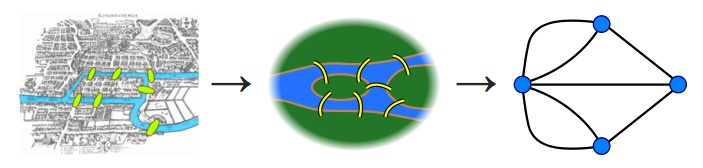

% Análisis de Redes Sociales
% Guillermo Jiménez Díaz (gjimenez@ucm.es); Alberto Díaz (albertodiaz@fdi.ucm.es)
% 2 de octubre de 2014

# Prefacio {-}

Estos son los apuntes de la asignatura Análisis de Redes Sociales, impartida en la Facultad de Informática de la Universidad Complutense de Madrid por los profesores Guillermo Jiménez Díaz y Alberto Díaz, del Departamento de Ingeniería del Software e Inteligencia Artificial.

Este material ha sido desarrollado a partir de distintas fuertes, destacando como referencia principal el libro _Network Science_ de Laszlo Barabasi y el material de la asignatura _Social Network Analysis_ impartido por Lada Adamic a través de Coursera.

\setcounter{section}{1}

# Tema 1: Teoría de Grafos {-}

En este tema haremos un repaso de los principales conceptos de teoría de grafos necesarios para introducirnos en el análisis de las redes sociales. 

## Introducción

### Intro

Podemos decir que los inicios de la teoría de grafos se remontan a 1736, en el momento en el que Euler resolvió el problema de los [puentes de Könnigsberg](http://es.wikipedia.org/wiki/Problema_de_los_puentes_de_K%C3%B6nigsberg):

> Dado el mapa de Königsberg, con el río Pregolya dividiendo el plano en cuatro regiones distintas que están unidas a través de los siete puentes, ¿es posible dar un paseo comenzando desde cualquiera de estas regiones, pasando por todos los puentes, recorriendo sólo una vez cada uno, y regresando al mismo punto de partida?
 
Aunque el problema se puede resolver por fuerza bruta, Euler construyó un grafo para representar y resolver el problema.

### Intro

Esta se puede considerar como la primera representación conocida de un grafo como medio para resolver un problema. De este hecho se pueden sacar dos conclusiones:

### Intro

* Algunos problemas son más simples de resolver si se representan mediante un grafo.
* Los grafos presentan ciertas propiedades que limitan su comportamiento.

## Redes o grafos

### Grafos

Las redes o grafos se componen de:

* Un conjunto de nodos o vértices.
* Un conjunto de aristas o enlaces que los unen.

### Grafos

Los enlaces pueden ser de dos tipos:

* *Dirigidos*: Tienen una dirección. Si todos los enlaces de un grafo son dirigidos entonces este grafo se conoce como _grafo dirigido o digrafo_. Por ejemplo, un enlace de una página web se representaría como un grafo dirigido.
* *No dirigidos*: Representan relaciones bidireccionales. Si todos los enlaces de un grafo son no dirigidos entonces se le llama _grafo no dirigido_. Pro ejemplo, la relación de estar casados entre dos personas es un enlace no dirigido.

### Grafos

Una arista o enlace puede tener atributos:

* Un peso, el cual puede representar información como la frecuencia de llamadas entre dos individuos. El peso puede tener un valor negativo, por ejemplo si lo usamos para representar la confianza-desconfianza entre dos individuos.
* Un tipo, el cual puede representar el tipo de relación entre dos individuos (familiares, amigos, ...)
* Otras propiedades que dependen del resto de la estructura del grafo, como el grado de intermediación (_betweeness_).

Un sistema se puede representar de diferentes formas dependiendo del conjunto de nodos usados y, sobre todo, de los enlaces que se definan. Un mismo conjunto de nodos puede definir distintos grafos.

## Propiedades básicas de los grafos

### Número de vértices y aristas

El número de nodos o vértices de un grafo ($N$) representa el tamaño de la red mientras que el número de aristas o enlaces ($L$) representa en número de interacciones entre los nodos.

El número máximo o total de enlaces ($L_{max}$) es el número de enlaces supuesto que todos los nodos están conectados con todos. En un grafo no dirigido se calcula como:

$$L_{max} = \binom{N}{2} = \frac{N(N-1)}{2}$$

Mientras que en un grafo dirigido el número máximo de aristas es simplemente:

$$L_{max} = N \cdot (N-1)$$

### Densidad

La densidad del grafo describe cómo de conectado está el grafo. Se calcula como la proporción de aristas que hay en el grafo con respecto al número de posibles aristas ($\frac{L}{L_{max}}$). En la mayoría de las redes reales se cumple que $L \ll L_{max}$ por lo que se suele decir que estas redes son *dispersas* (_sparse_).

Otra propiedad básica pero bastante importante de los grafos (y que usaremos a menudo a lo largo de la asignatura) es el grado de un nodo $i$ ($k_i$), que es el número de enlaces que tiene $i$ con otros nodos.

En un _grafo no dirigido_, si conocemos el grado de cada uno de sus nodos entonces podemos calcular el número de aristas ($L$) de la siguiente forma:

$$L = \frac{1}{2} \sum_{i=1}^{N}k_i$$

El grado medio ($\langle k \rangle$)de un grafo no dirigido se calcula como:

$$ \langle k \rangle = \frac{1}{n} \sum_{i=1}^{N} k_i = \frac{2L}{N}$$

En un _grafo dirigido_ distinguimos entre grado de entrada ($k_i^{in}$) y grado de salida ($k_i^{out}$). El primero representa el número de enlaces que llegan al nodo mientras que el segundo representa el número de enlaces que salen del nodo. El grado total es la suma de ambos grados ($k_i = k_i^{in}$ + $k_i^{out}$). En este caso, el número de aristas del grafo se puede calcular como:

$$L = \sum_{i=1}^{N}k_i^{in} = \sum_{i=1}^{N}k_i^{out}$$

Y el grado medio ($\langle k \rangle$) será el siguiente:

$$ \langle k^{in} \rangle = \frac{1}{N} \sum_{i=1}^{N}k_i^{in} = \langle k^{out} \rangle = \frac{1}{N} \sum_{i=1}^{N}k_i^{out} = \frac{L}{N}$$

Para un grafo de tamaño conocido $N$ podemos calcular la **distribución de los grados del grafo**, es decir, cuál es el porcentaje de nodos que tienen un determinado grado en dicho grafo. Esta distribución se puede representar mediante un histograma, donde en el eje X representamos los distintos grados presentes en el grafo ($k$), mientras que en el eje Y representamos la proporción de nodos con grado k ($p_k$):

$$ p_k = \frac{N_k}{N} $$

donde $N_k$ representa el número de nodos de grado $k$ presentes en el grafo. $p_k$ representa la probabilidad de que el grado de un nodo seleccionado aleatoriamente sea $k$ y se cumple que:

$$ \sum_{k=1}^{\infty} p_k = 1 $$

Como veremos más adelante, la distribución de los grados será una propiedad importante que nos servirá para derivar otras propiedades de la red. Por ejemplo, a partir de $p_k$ podemos calcular el grado medio del grafo:

$$ \langle k \rangle = \sum_{k=1}^{\infty} k \cdot p_k $$

## Representación de un grafo

Existen distintas formas de representar un grafo. Las más comunes son las siguientes:

TODO: ejemplos de mismo grafo con distintas representaciones

* **Listas de enlaces**. Consiste en reopresentar un grafo como una lista de $L$ pares $(i, j)$ que representan los enlaces de la red:

> $G = \{ (i_1, i_2), (i_1, i_n), \ldots , (i_m, i_n)\}$

* **Listas de adyacencia**. Es una forma reducida de la anterior. Para cada nodo escribimos una lista con cada uno de sus nodos adyacentes:

> $1 \;\{2,\ldots n\}$
> 
> $2 \;\{1,\ldots\}$
> 
> $\vdots$
> 
> $n \;\{1, \ldots m\}$

* **Matriz de adyacencia**. Es una matriz de tamaño $N$x$N$ de 0s y 1s. Si el elemento $A_{ij}=1$ entonces implica que hay un enlace que va de $j$ hacia $i$. Si el elemento $A_{ij}=0$ entonces no existe tal enlace. En un grafo no dirigido se cumple que elemento $A_{ij}=A_{ji}$ por lo que la matriz es simétrica. Si las aristas tienen un peso entonces $A_{ij} = w_{ij}$.

Las matrices de adyacencia nos ayudan a calcular fácilmente el grado de cada uno de los nodos:

* En un grafo no dirigido $k_i = \sum_{j=1}^{N}A_{ij} = \sum_{i=1}^{N}A_{ij}$. Es decir, si sumamos todos los valores de la fila o la columna $i$ obtenemos el grado de dicho nodo. En esta matriz se cumple también que el número de elementos que no son 0 es $2L$.
* En un grafo dirigido $k_i^{in} = \sum_{j=1}^{N}A_{ij}$ y $k_i^{out} = \sum_{i=1}^{N}A_{ij}$. Es decir, el grado de entrada es la suma de la fila $i$, mientras que el grado de salida es la suma de los elementos de la columna $i$.

Como las redes reales en general son dispersas la matriz de adyacencia sería también dispersa por lo que para procesar una red real en un computador es recomendable usar una de las dos representaciones primeras en lugar de utilizar una matriz de adyacencia.

## Grafos bipartitos

Un grafo bipartito es aquel en el que sus nodos se pueden dividir en dos conjuntos disjuntos de nodos $U$ y $V$, de modo que los enlaces solo conectan nodos del conjunto $U$ con nodos del conjunto $V$.

> Ejemplo: Un grafo de actores ($U$) y películas ($V$) donde un enlace representa que un determinado actor ha participado en una determinada película.

: Un grafo bipartito entre jugadores de fútbol y el lugar desde el que más se ha hablado de ellos](../images/tema01/bipartito.png)

Es posible generar _proyecciones_ de un grafo bipartito, es decir, simplificar el conjunto de nodos $U + V$ a uno de ellos:

* Si nos quedamos solo con los nodos de $U$ entonces dos nodos de $U$ están conectados si ambos estaban conectados al mismo nodo de $V$.
* Si nos quedamos solo con los nodos de $V$ entonces dos nodos de $V$ están conectados si ambos estaban conectados al mismo nodo de $U$.

> Siguiendo con el ejemplo, la proyección teniendo en cuenta los actores sería un grafo en el que dos actores están conectados si han participado en la misma película. Por otro lado, la proyección teniendo en cuenta las películas es un grafo en el que dos películas están conectadas si tienen al menos un actor en común.

Las proyecciones pueden crearse utilizando pesos, indicando el número de nodos comunes a los que están conectados. Además, existen grafos tripartitos y multipartitos, en general.

## Caminos

Un **camino** (_path_) es una ruta que une dos nodos a través de los enlaces de un grafo. La longitud de un camino es el número de enlaces que componen el camino.

El **camino más corto** o camino _geodésico_ es el camino con menor número de enlaces que hay entre dos nodos. El camino más corto nunca tiene bucles y se le conoce como distancia entre dos nodos $i$ y $j$ ($d_{ij}$).

En un grafo no dirigido se cumple que $d_{ij} = d_{ji}$. Sin embargo, esto no tiene por qué cumplirse para un grafo dirigido. De hecho, que exista un camino entre los nodos $i$ y $j$ en un grafo dirigido _no garantiza_ la existencia de un camino entre $j$ e $i$.

Usando la matriz de adyacencia podemos calcular el número de caminos de una determinada longitud $d$ entre $i$ y $j$ ($N_{ij}^{(d)}$):

* Si $A_{ij}=1$ entonces $N_{ij}=1$ y, por tanto, $d_{ij}=1$. Es decir, solo hay un camino de longitud 1 entre $i$ y $j$.
* Si $A_{ik} \cdot A_{kj} = 1$ entonces $N_{ij}^{(2)}=[ A^2]_{ij}$. Es decir, el elemento $ij$ de la matriz $A^2$ contiene el número de caminos de distancia 2 entre $i$ y $j$.
* En general, si $A_{ik} \cdot \ldots \cdot A_{mj} = 1$ entonces $N_{ij}^{(d)}=[A^d]_{ij}$.

De esta manera, la distancia mínima $d_{ij}$ entre dos nodos es el $d$ más pequeño para el que $N_{ij}^{(d)}>0$.

Este método de cálculo de la distancia más corta es bastante ineficiente para redes reales en la que los grafos son grandes. En este caso, lo que se suele emplear es un algoritmo de **búsqueda en anchura** (_Breadth-first Search_ o BFS)[^1]. Para calcular la distancia $d_{ij}$ entre los nodos $i$ y $j$ hacemos lo siguiente: 

[^1]: La complejidad del algoritmo es $O(N+L)$. En redes con pesos positivos se usará en su lugar el algoritmo de Dijkstra.

> 1. Comenzamos en el nodo $i$.
> 2. Metemos en una cola todos los nodos adyacentes a $i$ y los etiquetamos con $d=1$
> 3. Sacamos el primer nodo de la cola.
>    
>     1. Si es $j$ entonces $d_{ij} = d$ (la etiqueta que tiene el nodo $j$)
>     2. En otro caso, metemos en la cola todos los nodos adyacentes al que hemos sacado y los etiquetamos con $d+1$
>     
> 4. Repetimos 3 hasta encontrar $j$ o hasta que la cola esté vacía. Si se produce este caso, entonces $d_{ij}= \infty$.

### Diámetro de un grafo

El diámetro ($d_{max}$) de un grafo es el camino más corto maximal, es decir, la distancia más larga a recorrer entre un par de nodos. 

$$d_{max} = \operatorname*{max}_{i,j} d_{ij}$$

### Longitud media de los caminos

La longitud media ($\langle d \rangle$) es la distancia media entre todos los pares de nodos de una red.

* Para un grafo dirigido

    $$ \langle d \rangle = \frac{1}{N(N-1)} \sum_{i, j \neq i} d_{i,j} = \frac{1}{2 \cdot L_{max}} \sum_{i, j \neq i}d_{i,j} $$

* Para un grafo no dirigido

    $$ \langle d \rangle = \frac{2}{N(N-1)} \sum_{i \geq j} d_{i,j} = \frac{1}{L_{max}} \sum_{i \geq j}d_{i,j} $$

## Conectividad

Dos nodos están conectados en un grafo si hay un camino que los une. Un grafo se considera **conexo** si todo par de nodos de la red están conectados.

Un **puente** (_bridge_) es un enlace que hace que un grafo deje de ser conexo.

Un **concentrador** (_hub_) es un nodo que tiene un grado mucho mayor que el resto de nodos de la red. Veremos que estos nodos son de especial importancia en el análisis de redes sociales.

### Componentes

Un **componente** es un conjunto de nodos del grafo en el que todos sus nodos están conectados y al que no se pueden añadir más nodos que cumplen esa propiedad. Para conocer cuáles son los componentes de un grafo podemos volver a utilizar el algoritmo BFS:

> 1. Seleccionamos un nodo al azar $i$ y lo etiquetamos con $M$.
> 2. Metemos en una cola todos los nodos adyacentes a $i$ y los etiquetamos con $M$
> 3. Sacamos el primer nodo de la cola y metemos en la cola todos los nodos adyacentes al que hemos sacado.
>     
> 4. Repetimos 3 hasta que la cola esté vacía. Todos los nodos ya procesados forman un componente. Si hemos procesado $N$ nodos entonces el grafo es conexo.
> 5. Si quedan nodos entonces repetimos 1 etiquetándolo con $M+1$.

En un grafo dirigido podemos hablar de **componentes fuertemente conectados**: componentes en los que cada nodo del componente puede alcanzarse desde cualquier otro nodo del componente siguiendo los enlaces dirigido. Sin embargo, un **componente débilmente conectado** es aquél que cumple lo anterior pero siguiendo los enlaces en cualquier dirección (como si los enlaces fuesen no dirigidos).

Un **componente gigante** es aquel componente que ocupa una fracción significativa del grafo.

### Coeficiente de agrupamiento

El **coeficiente de agrupamiento local** (_clustering coefficient_ o $C_i$) es una medida del grado con el que los vecinos de un nodo $i$ están enlazados entre sí. Se calcula de la siguiente forma:

$$ C_i = \frac{2 \cdot L_i}{k_i (k_{i-1})} \;\;\; C_i \in [0,1]$$ 

donde $k_i$ representa el grado del nodo $i$ y $L_i$ es el número de enlaces entre los $k_i$ vecinos entre sí. Como se puede ver, representa la probabilidad con la que dos vecinos de un nodo $i$ se unen el uno con el otro. Es una medida de la densidad local de la red. Si $C_i = 0$ entonces ninguno de los vecinos de $i$ tienen relación entre ellos. Sin embargo, si $C_i=1$ entonces todos los nodos están unidos con todos (es un grafo completo).

El **grado medio de agrupamiento** ($\langle C \rangle$) es la probabilidad con la que 2 vecinos de un nodo seleccionado aleatoriamente se unen el uno con el otro:

$$ \langle C \rangle = \frac{1}{N} \sum_{i=1}^{N}C_i$$

El **coeficiente de agrupamiento global** ($C$) es el número de triángulos cerrados que hay en un grafo. Se calcula teniendo en cuenta los triángulos y los tripletes conectados --3 nodos conectados por 2 (triplete abierto) o 3 (triplete cerrado o triángulo) enlaces no dirigidos.

$$ C = \frac{3 \cdot \# \, Triángulos}{\# \, Tripletes\; Conectados}$$
