% Apuntes de Desarrollo de Sistemas Interactivos
% Pablo Moreno Ger (pablom@ucm.es); Guillermo Jiménez Díaz (gjimenez@ucm.es)
% Curso 2013/2014

# Tema 1: Introducción a la Interacción Persona-Ordenador

###  Contenidos del tema
- Introducción al campo de la Interacción Persona-Ordenador

- Hitos históricos

- Introducción al diseño guiado por objetivos

## Interacción Persona-Ordenador

### Definición

> _Human-Computer Interaction (HCI) es la disciplina que se encarga del diseño, evaluación e implementación de sistemas interactivos computerizados usados por humanos y que estudia los fenómenos que se desarrollan alrededor de dicho uso._

### ¿Sistemas interactivos computerizados?

>- Teléfonos móviles / Tablets

>- Ordenador (obviamente)
>- Controles de aviones

>- Instalaciones eléctricas

### Humanos

- Las famosas "personas normales"

- Usuarios individuales, pero también colectivos específicos (pilotos), corporaciones, o grupos de usuarios que trabajan colaborativamente.

### Visión general de HCI

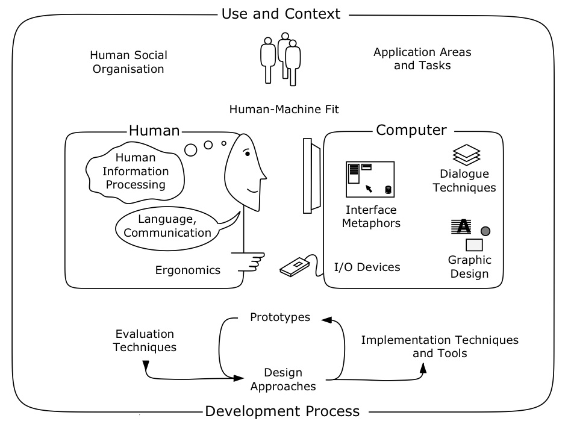

### Orígenes

El interés por la interacción Persona-Ordenador nace a consecuencia de los errores que se producían al interactuar con ciertos dispositivos. 

La mente humana se ve superada:

- Revolución industrial

- Revolución tecnológica (Segunda Guerra Mundial)

## Historia de la Interacción Persona-Ordenador

### Vannevar Bush

### Vannevar Bush

Conocido por:

- Liderar la comunidad de científicos responsables de la bomba atómica

- Revolucionar para siempre el diseño industrial

### Vannevar Bush

Autor de ["As we may think" (1945)](http://biblioweb.sindominio.net/pensamiento/vbush-es.html)

Insta a los científicos de la posguerra a investigar nuevos dispositivos no bélicos para ayudar a las personas en tiempos de paz:

- Calculadoras portátiles
- Cámaras digitales (!)
- Interfaces por voz
- Bases de datos relacionales (!)
- Hypertexto

### Vannevar Bush

> ... el personal administrativo de una empresa puede colocar en el interior de una máquina de selección varios miles de tarjetas perforadas que contienen los datos de los empleados, establecer un código según una convención acordada y, tras un breve periodo de tiempo, recibir una lista de todos los empleados que, por ejemplo, viven en Trenton y hablan español.

### Vannevar Bush

El [escritorio Memex](http://es.wikipedia.org/wiki/Memex). 

### ENIAC

Eckert y Mauchly en el año 1946.

- 167m^2^ 
- Cálculo de trayectorias balísticas.

La interfaz de usuario del ENIAC consistía en operar manualmente con unos 6000 interruptores (lo que hacía una modificación pudiese tardar semanas en realizarse).

### ENIAC

### Compiladores

1952 - Primer compilador (Grace Murray Hopper): **A0**

Los compiladores fueron las primeras interfaces de usuario: hacen de _interfaz_ sobre los recursos de los que el computador dispone.

El programador puede dar órdenes _sin saber nada de electricidad_.

### Compiladores
> Anécdota: Trabajó durante varios años en el Mark II y algunos le atribuyen la invención del término _bug_ para hablar de un error de programación. 

### Ivan Sutherland

Desarrollador de (1963) de [Sketchpad](http://youtu.be/USyoT_Ha_bA?t=3m52s).

La primera interfaz gráfica de usuario

- Con un lápiz óptico (!)

- Desdibuja la frontera entre _entrada_ y _salida_ por primera vez.

### Ivan Sutherland

### Douglas Engelbart 

Es el inventor del ratón (falleció el 2 de julio de 2013). 

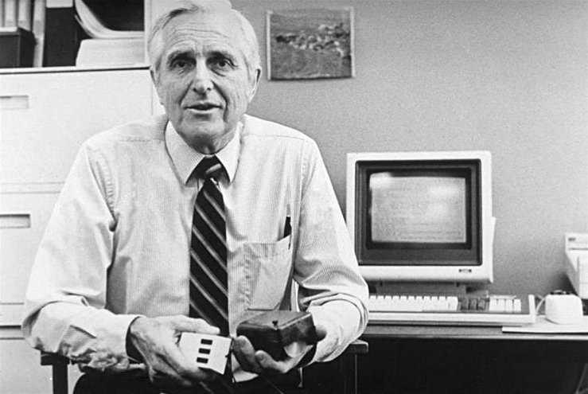

### Douglas Engelbart

La [madre de todas las demos](http://youtu.be/61oMy7Tr-bM?t=8m18s) (1968)

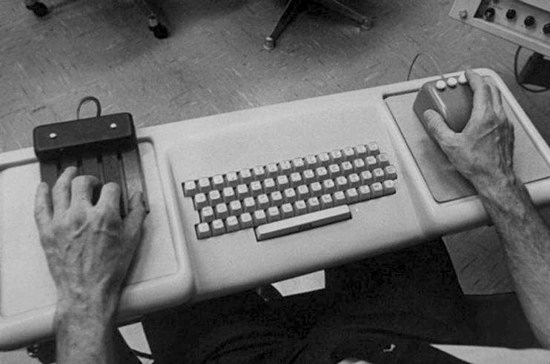

### La madre de todas las demos

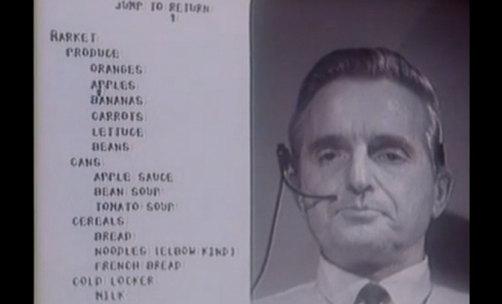

### La madre de todas las demos

Sistema NLS (oN-Line System):

- Primer dispositivo apuntador externo.

- Videoconferencia

- Hypertexto / hypermedia

- Procesadores de texto

- Enlazado dinámico de archivos

- Control de versiones (!)

- Editor colaborativo en tiempo real (!!!)

### Douglas Engelbart

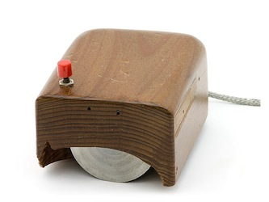

### Alan Kay

Lo mejor de dos mundos:

- Comenzó trabajando con Ivan Sutherland en el MIT. 

- Inspirado por la demo de Engelbart

Primer prototipo de computador personal: Dynabook(1968)

### Alan Kay

### ¡Y eso no es nada!

Tras el Dynabook, se traslada a PARC (Palo Alto Research Center) de Xerox para revolucionar la informática:
> [Xerox Star Office Information System](http://www.youtube.com/watch?v=Cn4vC80Pv6Q).

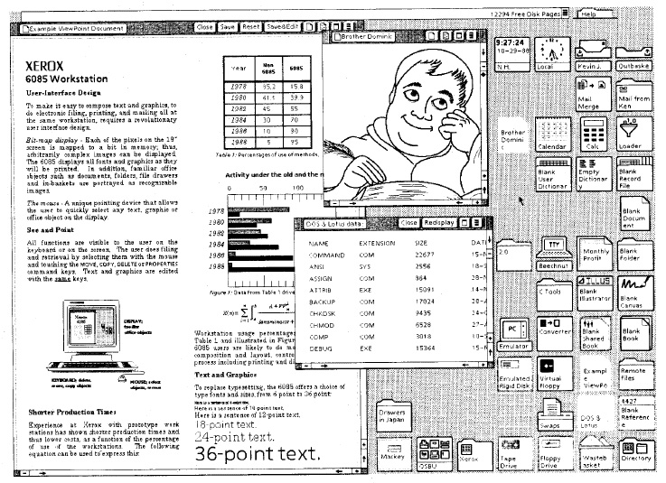

### Nace un nuevo concepto...

Interfaces WIMP:

* **W**indows

* **I**cons

* **M**enus

* **P**ointer

### El mundo WIMP

> [Ánécdota](http://youtu.be/KhjVidOFqBo): En el año 1979 un tal Steve Jobs fue invitado a visitar las instalaciones del PARC de Xerox y quedó impresionado con la GUI que allí vio ("en diez minutos supe que todos los computadores funcionarían de ese modo").

> Anécdota: Años después, Apple acusaría a Microsoft de copiar su sistema de ventanas, Microsoft hablaría de su vecino rico Xerox...

### Ben Shneiderman

Uno de los primeros _investigadores_ en HCI.

Acuñó el término de _interfaces de manipulación directa_

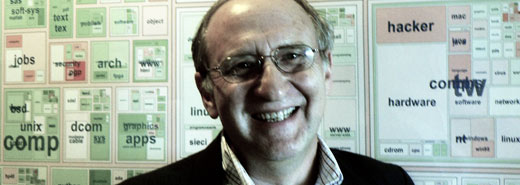

### Manipulación directa

> * Existe una representación visual contínua y permanente de los objetos de datos del sistema.

> * El usuario interactúa con la representación visual usando acciones físicas (click, arrastrar, mover, usar anclas para redimensionar...) o pulsando botones asociados a acciones (pulsar un botón para poner texto en negrita).

> * El efecto de las acciones es rápido, incremental, reversible y se muestra en todo momento el estado de los objetos y un continuo feedback de lo que ocurre.

### Manipulación directa

> * En un editor gráfico, a medida que arrastramos la esquina de una figura ésta se va estirando para cambiar de tamaño.

> * En un sistema operativo de ventanas, movemos archivos arrastrando su representación.

> * En un sistema operativo de ventanas moderno, movemos las propias ventanas (viendo su contenido).

> * En una aplicación de modelado 3D, las rotaciones se realizan generalmente arrastrando circunferencias que se dibujan de manera ortogonal al eje sobre el que queremos girar. 

### Don Norman

Estuvo trabajando en Apple como Vicepresidente del Grupo de Tecnologías Avanzadas, es cofundador del [Nielsen Norman Group](http://www.nngroup.com/) y actualmente es profesor emérito en la Universidad de California. 

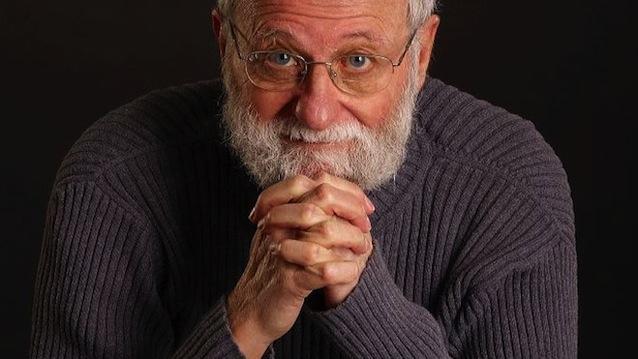

### Don Norman
Autor de uno de los libros más influyentes en el campo del diseño y la usabilidad: [The Design of Everyday Things](http://zv4fy5pr5l.search.serialssolutions.com/?ctx_ver=Z39.88-2004&ctx_enc=info%3Aofi%2Fenc%3AUTF-8&rfr_id=info:sid/summon.serialssolutions.com&rft_val_fmt=info:ofi/fmt:kev:mtx:book&rft.genre=book&rft.title=The+Design+of+Everyday+Things&rft.au=Norman%2C+Don&rft.date=2002-09-19&rft.pub=Basic+Books&rft.isbn=0465067107&rft.externalDBID=n%2Fa&rft.externalDocID=904427&paramdict=es-es). 

Autor del concepto de **diseño centrado en el usuario**:

 * Simplificar la estructura de las tareas.
 * Hacer las cosas visibles.
 * Hacer "mapeos" comprensibles
 * Utilizar el poder de las restricciones
 * Diseñar aprendiendo de los errores
 

### Jakob Nielsen

Una de las personas más respetadas en el ámbito de la usabilidad y cofundador, junto con Don Norman, del [Nielsen Norman Group](http://www.nngroup.com/). 

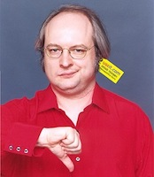

### Jakob Nielsen

- Es uno de los mayores expertos en _usabilidad web_

- Creador de la evaluación heurística

### Alan Cooper

Arquitecto de formación, diseñador de software y programador.

### Alan Cooper

- Creador de Visual Basic

- Gran crítico del mal software que no se pregunta _cómo va a interactuar el usuario con el software_

    - Irónicamente, mucho de ese software está programado en Visual Basic

### Alan Cooper

Abandona Microsoft para fundar una empresa de diseño de software más centrado en el usuario.

> - Propone la metodología del **diseño dirigido por objetivos**

> - Propone el uso de **personas** como herramientas de diseño. 

. . . 

> Dedicaremos mucho temario a hablar de ambas cosas

### Era Post-WIMP

Nuevas restricciones por tamaño y potencia de dispositivos portátiles

### Era Post-WIMP

- Nuevo formato de _manipulación directa_: Las pantallas táctiles

. . . 

- Pero no es WIMP!
    * No hay ventanas
    *  No hay punteros

### Era Post-WIMP

Además de pantallas táctiles, otro paradigma emergente es la manipulación a través de la TV. Son las denominadas interfaces de tres metros (_10-foot interfaces_).

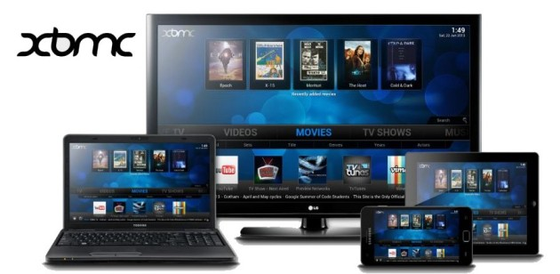

### Ejemplos de interfaces para TV

* Wiimote

* XBMC

* Front Row (OSX)

* SmartTV (Samsung)

* Steam Big Picture

### Más allá de la pantalla táctil

* Sistemas de realidad virtual

* Interfaces gestuales (Ej. Kinect)

* Interfaces por voz (Ej. Siri)

* Interfaces cerebro-computador...

## Usabilidad

### Definición
[Según el estándar ISO 9241 (parte 11: Orientaciones sobre Usabilidad)](http://www.userfocus.co.uk/resources/iso9241/part11.html), este término se puede definir como:

> la cualidad por la que un producto puede ser usado por un _usuario específico_ para conseguir unos _objetivos específicos_
con eficiencia, efectividad y satisfacción en un _contexto de uso específico_.

### Atributos de la usabilidad:

> * **Efectividad**: Es la precisión y el grado de completitud con la que el usuario es capaz de satisfacer sus objetivos.

> *  **Eficiencia**: Los recursos y el tiempo empleados en relación con el grado de precisión y completitud con el que se han satisfecho los objetivos.

> *  **Satisfacción**: Actitud positiva hacia el uso del producto, ausencia de frustración o incomodidad al usarlo.

### ¿Vale con ser usable para ser aceptable?
La usabilidad no implica la aceptación general de un sistema. 

> _Un astronauta valorará que su sistema de navegación sea fiable más que fácil de usar._

### Usabilidad en contexto

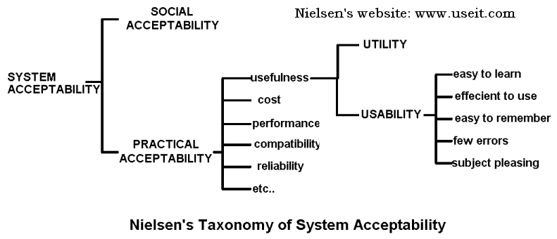

### Los cinco atributos de Nielsen
Jakob Nielsen define hasta [5 atributos para la usabilidad](http://www.nngroup.com/articles/usability-101-introduction-to-usability/):

* Facilidad de aprendizaje (_learnability_)

* Eficiencia (_Efficiency_)

* Memorabilidad (_Memorability_)

* Errores (_Errors_)

* Satisfacción (_Satisfaction_)

Y uno más, no contemplado por Nielsen:

* Eficacia (_Effectiveness_)

### Usabilidad y buenos diseños

Los buenos diseños que no tienen en cuenta la usabilidad cuestan:

- Tiempo

- Dinero

- Vidas

### ¿Es fácil?

La usabilidad afecta a cómo un usuario percibe un sistema: un sistema _usable_ "vende"; un sistema _no usable_ hace que el usario lo deseche. 

> El sistema sigue teniendo que ser bueno

### ¿Es fácil?

La usabilidad es un criterio subjetivo. Distintos usuarios valorarán más unos atributos que otros:

* Los usuarios novatos valoran la facilidad de aprendizaje.

* Los usuarios esporádicos valoran la memorabilidad.

* Los usuarios expertos valoran la eficiencia.

## Experiencia de usuario

### Definición
> _User Experience_ (UX) es el conjunto de todas las interacciones que un usuario tiene con un producto.

Más allá de la usabilidad: no se centra únicamente en el sistema (su funcionalidad) sino también con todos los demás aspectos relacionados con los _sentimientos_ que genera la interacción con el sistema.

### User Experience
El diseño centrado en la experiencia del usuario va más allá de la usabilidad y tiene en cuenta otros elementos:

* El lenguaje de los contenidos
* El diseño gráfico (colores, símbolos, iconos, texturas...)
* El sonido
* El movimiento (animaciones, ritmo, cambios...)
* El diseño de la información (tipografía, estructura de la información, relación y comprensión por parte del usuario)
* El diseño de la interfaz (elementos gráficos para la manipulación de los datos)
* El diseño de las interacciones (comportamiento y comprensión por parte del usuario)

-------
### User Experience
)](../images/tema01/uxelements.jpg)

### UX y Apple
El término fue acuñado por Don Norman cuando era el Vicepresidente del Grupo de Tecnologías Avanzadas de Apple ya que consideraba que el término _usabilidad_ no cubría ciertos aspectos relacionados con las emociones que el usuario podía experimentar al interactuar con un producto.

### UX y Apple

El _culto de Apple_ es consecuencia del mimo por la User Experience:

- Aspecto físico de las tiendas

- Materiales de los productos

- Envoltorios

- Formato de los Keynotes

- _Deseabilidad_

### UX y Apple

.](../images/tema01/iPhone.jpg)

### UX y Psicología
La experiencia de usuario habla de hacer que el usuario se sienta agusto con el sistema, que le divierta y que la experiencia de interactuar con él sea excitante.

> El _fluir_ (o [flow](http://en.wikipedia.org/wiki/Flow_%28psychology%29)) es un concepto de psicología que se está volviendo popular dentro del HCI.

### Conflicto entre _fluir_ y usabilidad

La mala usabilidad o las barreras en general puede romper el flujo, pero también son parte del mecanismo que genera estados de flujo.

> ¿Qué significa usabilidad en un videojuego?

## Ingeniería de usabilidad

### Problemas de uso

* Abres un documento de Word
* trabajabas sobre él
* lo guardas
* lo imprimes
* al intentar cerrar el documento Word te pregunta si lo querías guardar

> ¿qué cambios ha realizado el proceso de imprimir para que me pida volver a guardar?. 

### Problemas de uso

 * Ignorancia sobre el usuario.

<!--   
    Se conocía cuál era el segmento de usuario a los que el producto iba dirigido pero se ignoraba cómo iba a usar el producto o por qué el usuario iba a preferir nuestro producto al de la competencia. -->
 
* Conflicto de intereses entre cubrir las necesidades del usuario y las prioridades de desarrollo.

<!--     Generalmente el programador y el diseñador de una aplicación eran la misma persona. Un programador puede ser muy bueno haciendo que un código sea eficiente pero es muy probable que no sea la persona más adecuada para tener en cuanta las necesidades del usuario o los temas de negocio relacionados con el producto.
 -->

 * Falta de un proceso para comprender las necesidades del usuario.

<!--     Los procesos de desarrollo software (que estudiamos en _Ingeniería del Software_) son procesos ingenieriles que se centran en la viabilidad y la calidad de la tecnología desarrollada pero en la que dejan de lado el conocimiento del usuario. Describen **qué** tareas se han de realizar (casos de uso) y desarrollan procesos para completarlas. Pero no solían tener en cuenta **cómo** se realizan las tareas ni **quién** las realiza ni existían procesos para convertir estas preguntas en conceptos de diseño.
 -->

### Definición

> La ingeniería de la usabilidad (o _usability engineering_) es la disciplina que trata de responder a cómo crear software __usable__ (de acuerdo a los criterios de usabilidad que mencionado anteriormente)

* Define un proceso que nos permite conprender a los usuarios y diseñar sistemas interactivos teniendo en cuenta este conocimiento.
* Proceso de diseño **iterativo** 
* **Centrado en el usuario**. 

### Ciclo de diseño

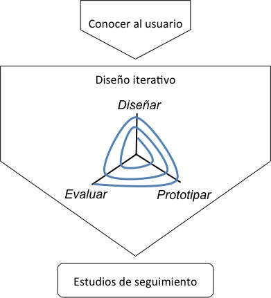

### Conocer al usuario
La base de todo es:

* Comprender al usuario
* Los requisitos de la tarea que realiza

El diseño centrado en el usuario parte de las siguientes tres preguntas:

* Quién va a usar el sistema interactivo
* Con qué objetivo va a ser usado
* Cuándo y en qué contexto se va a usar

### Conocer al usuario

Conocer al usuario implica saber:

* En qué somos buenos/malos los humanos (que serán los usuarios de nuestro sistema) 
* Cómo podemos ayudarles a hacer una tarea _en la forma en la que actualmente la realizan_
* Qué puede producirles experiencias de calidad

### Tareas para conocer al usuario

* Emplear distintas técnicas para conocer al usuario (como la observación o las entrevistas).
* Definir distintas clases de usuarios y esbozar un perfil de cada uno de ellos.
* Identificar los objetivos del usuario.
* Analizar el contexto en el que el usuario trabajará con el sistema así como el software con el que actualmente trabaja, cómo lo usa y para qué se usa.
* Definir escenarios de usuario.

### Diseño iterativo

<!-- Este es uno de los procesos más importantes de la ingeniería de la usabilidad y consiste en iterar sobre tres fases: _diseño, implementación y evaluación_.
 -->

* Inicialmente diseñamos la interfaz con la que el usuario interactúa con el sistema
* Posteriormente realizamos una implementación / prototipo de nuestra interfaz
* A continuación evaluamos (generalmente **con usuarios**) nuestra interfaz
* Los resultados serán utilizados para rediseñar y volver a iterar

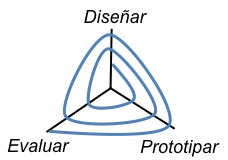

### Modelo en espiral 

La dimensión radial de la espiral se corresponde con el coste de cada paso de iteración, es decir, está relacionado con la fidelidad y precisión de los prototipos desarrollados con el resultado final.

Comenzaremos con prototipos baratos y desechables

* Prototipos en papel 

* Mockups

### Modelo en espiral     
A medida que realicemos más iteraciones, los prototipos serán más fieles al resultado final

* Prototipos funcionales 

* Implementados en la tecnología final 

### Evaluaciones

* En cada iteración
* Sobre cada modelo 
* Pueden ser distintas en cada iteración
* Con usuarios

    * Experimentos formales
    * Test A/B
    * "Pensar en alto"
    * ...

* Métodos heurísticos

### Estudios de seguimiento

Se realizan una vez lanzado el producto y nos ayudan a poder mejorar futuras versiones del producto

* Cuestionarios
* Estudios de márketing
* Reportes de errores (_Bug reports_)
* Ficheros de logging
* ...

## Diseño guiado por objetivos: Visión general

### Definición

<!-- El [Diseño Guiado por Objetivos](http://www.uie.com/articles/goal_directed_design/) (DGO o _Goal-Directed Desing_) es un modelo o aproximación que permite implementar la ingeniería de usabilidad. Existen otros modelos, como el [UE Lifecycle](http://drdeb.vineyard.net/djmacasestudy.pdf) de Deborah Mayhew o el Modelo de IBM de proceso de diseño centrado en usuario (User-Centred Design-Process Model of IBM). Nos centraremos en la primera ya que es una de las más modernas y utilizadas en la actualidad. -->

> El [Diseño Guiado por Objetivos](http://www.uie.com/articles/goal_directed_design/) (DGO o _Goal-Directed Design_)  es una metodología propuesta por Alan Cooper que se basa en diseñar software a partir del conocimiento de los **objetivos** que un usuario persigue al utilizar un sistema. 

### Objetivos vs. Tareas

* El **objetivo** de un sistema es el propósito por el que lo usamos.
* Las **tareas** son las distintas formas en las que conseguimos objetivos.

<!-- Las tareas **no** son objetivos. Las tareas son un medio para alcanzar un fin y los objetivos son el fin en sí mismo. Las primeras suelen cambiar con la tecnología. Un ejemplo.  -->

### Objetivos vs. Tareas
El _objetivo_ de venir a la facultad a clase se alcanzaba:

* Realizando la tarea de venir a caballo hace unos siglos.
* Realizando la tarea de tomar el transporte público en la actualidad.
* Realizando la tarea de usar el teletransportador en el futuro.

### Tipos de objetivos

<!-- Como veremos en posteriores lecciones hay distintos tipos de objetivos de usuario:
 -->

* De experiencia

    Expresan qué quiere sentir el usuario con un producto.

* Finales

    Expresan cuál es la motivación que conduce a un usuario a realizar una tarea con un producto.

* Vitales

Expresan aspiraciones del usuario, sus deseos y motivaciones. Son objetivos que van más allá del producto y que pretenden explicar la relación a largo plazo entre el usuario y el producto.

### Personas

> Usuarios arquetípicos, una representación de un grupo de usuarios de nuestro sistema. Es un modelo de comportamiento de un usuario imaginario, no real, de un usuario pero que tiene unas características muy concretas. 

Los atributos de la _persona_ se extraen de los datos de entrevistas y la observación de usuarios reales. 

<!-- A pesar de ser un modelo de diseño se suelen representar como individuos.

Una [_persona_](http://www.interaction-design.org/encyclopedia/personas.html#heading_An_example_persona_html_pages_12414) se caracteriza por sus objetivos y los patrones de comportamiento que siguen al usar un producto.
 -->

### Personas

)](../images/tema01/persona.jpg)

### Escenarios y requisitos

> Los **escenarios** son las narraciones que explican cómo  una _persona_ interactúa con el sistema para alcanzar un objetivo. Los escenarios, junto con las personas, sirven para validar los diseños intermedios a medida que avanza el diseño del sistema.

> Los **requisitos** de diseño son las necesidades de la persona en un escenario, qué información y qué capacidades requiere nuestra interfaz para que una _persona_ alcance un objetivo. 

<!-- En Cooper se ha definido un proceso que detalla unos pasos concretos para definir los requisitos y que estudiaremos en próximos temas.
 -->

### Framework de diseño

> Son una serie de directrices que, unidas a los requisitos y escenarios definidos en las fases anteriores, sirven para definir un boceto de los diseños de interfaces. 

* El **framework de interacción**

    Define el flujo, el comportamiento y la organización de la información en el producto. 

* El **framework visual**

    Define el lenguaje visual del sistema. Está basado en estudios del lenguaje visual.

* El **framework de diseño industrial**

    Definen el diseño físico del sistema. Está relacionado con el hardware sobre el que se va a ejecutar el sistema y las restricciones que éste impone (un móvil, un dispositivo médico, de un avión...)

### Refinamiento y validaciones

> La fase de **refinamiento** consiste en crear una interfaz concreta a partir de los bocetos desarrollados en la fase anterior utilizando una serie de patrones y principios de diseño conocidos. 

<!-- Se utilizan los mismos procesos descritos en la fase anterior pero esta vez yendo a un nivel de detalle mucho más concreto. -->

> Las **validaciones** : los diseños realizados son constantemente validados usando las _personas_ y escenarios definidos inicialmente y con los test de usabilidad sirven para que usuarios reales interactúen y validen el sistema.
