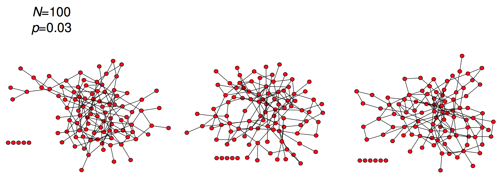
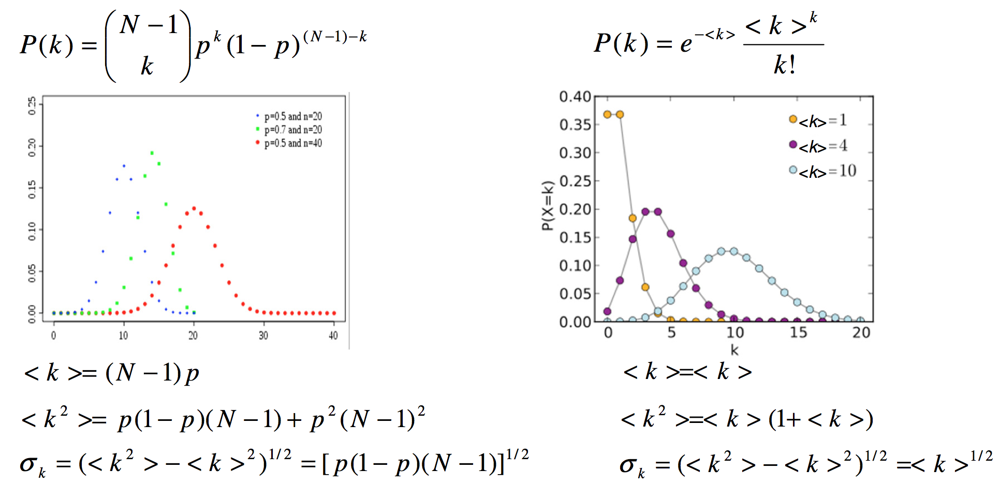
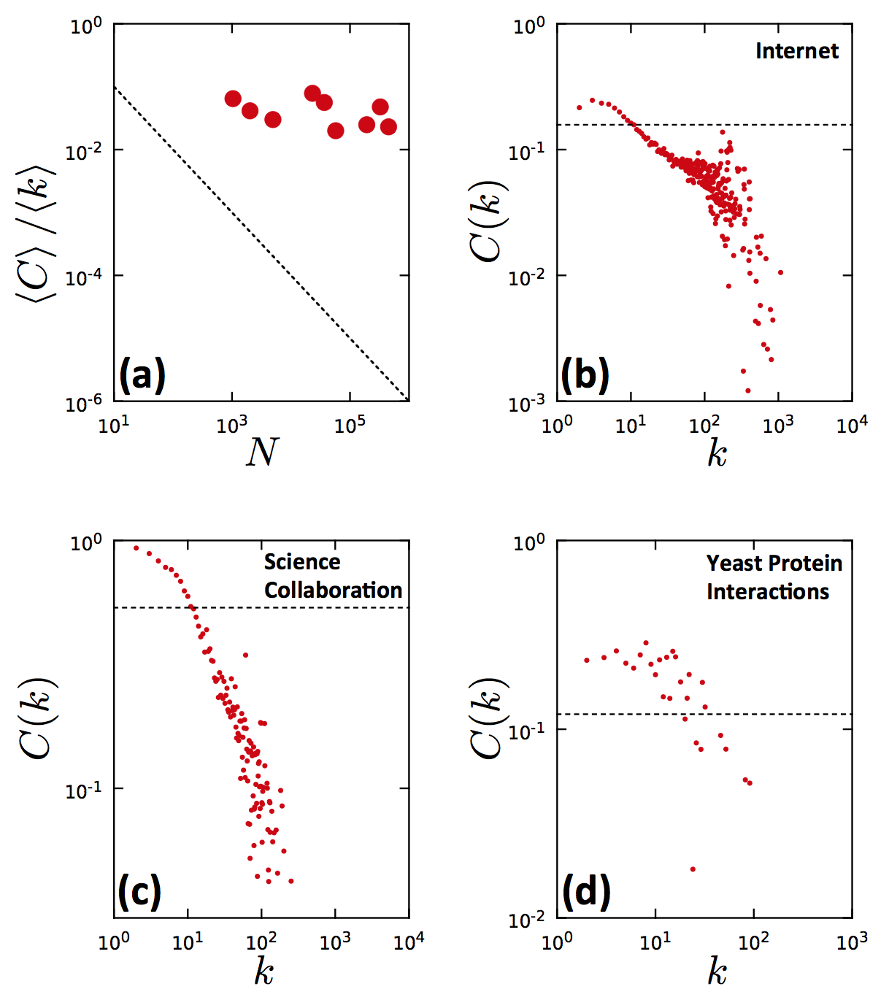

% Análisis de Redes Sociales
% Guillermo Jiménez Díaz (gjimenez@ucm.es); Alberto Díaz (albertodiaz@fdi.ucm.es)
% 10 de octubre de 2014

# Tema 2: Modelos de redes:  El modelo de red aleatoria

## Modelos

### Modelos

* Un **modelo** es una _representación simple_ de un sistema complejo del que podemos _extraer y derivar propiedades_ matemáticamente.
* Los modelos nos ayudan a entender cómo y por qué se han formado las redes tal y como son ahora.
* Mediante un modelo que se aproxime a una red real podremos _predecir propiedades y resultados_ de la misma. 

> En este y en sucesivos capítulos estudiaremos algunos de los modelos más conocidos de redes sociales. El primero de ellos es el **modelo de red aleatoria**.

## Modelo de red aleatoria

### Ejemplo motivante

### Modelo de red aleatoria

* Una __red aleatoria__ es una red en la que cada uno de los enlaces entre dos nodos se ha creado siguiendo un proceso completamente aleatorio.
* Matemáticamente es una red que tiene __$N$ nodos__ donde cada nodo puede estar conectado con otro con una __probabilidad $p$__. Se representa como __$G(N,p)$__

### Modelo de red aleatoria

* Modelo de Erdös-Renyi (1960)

### Construcción

> 1. Crear N nodos aislados
> 2. Seleccionar un par de nodos y generar un número aleatorio entre 0 y 1. Si es menor o igual que $p$ entonces añadimos un enlace entre ellos. En otro caso, los dejamos desconectados.
> 3. Repetir el paso 2 para los $\frac{N(N-1)}{2}$ pares de nodos de la red.

### Alternativa

* El modelo de red aleatoria también puede caracterizarse como __$G(N, L)$__, donde $L$ es el número de enlaces de la red.
* La red se forma seleccionando aleatoriamente 2 nodos y, si no existe un enlace entre ellos, se añade.
* Este proceso se repite hasta conseguir un total de $L$ enlaces.
* Forma menos usada.

## Número de enlaces

### Igual parámetros, distintas redes

* Si la red se representa como $G(L,p)$ entonces ya sabemos el número exacto de enlaces.

### Número variable de enlaces

* Las redes aleatorias $G(N, p)$ tienen un número variable de enlaces ($L$). 
* Podemos calcular la probabilidad de que la red tenga exactamente $L$ enlaces.

* __Distribución binomial__: el número de éxitos ($x$) que se pueden conseguir en la realización de $n$ experimentos independientes donde la probabilidad de acierto es $p$ y la de fracaso, $1-p$.

$$ B(n, x, p) \to p_x = \binom{n}{x}p^x(1-p)^{n-x}$$ 

### Propiedades de la distribución binomial

$$ B(n, x, p) \to p_x = \binom{n}{x}p^x(1-p)^{n-x}$$ 

* Media de la distribución: $\langle x \rangle = \sum_{x=1}^{N}x \cdot p_x = n \cdot p$
* Varianza de la distribución: $\sigma _x ^2= p \cdot (1-p) \cdot n$
* Desviación estándar de la distribución: $\sigma _x = [p \cdot (1-p) \cdot n]^{\frac{1}{2}}$

### Probabilidad de L

* La probabilidad de una red $G(N, p)$ de tener exactamente $L$ enlaces es:

$$ p_L = B(L_{max}, L, p) \to p_L = \binom{L_{max}}{L} p^L(1-p)^{L_{max}-L} $$

* Número medio de enlaces esperados en $G(N,p)$ como:

$$ \langle L \rangle = p \cdot L_{max} = p \cdot \binom{N}{2} = p \cdot \frac{N(N-1)}{2}$$

### Grado medio 

Si la red se representa como $G(L,p)$

$$\langle k \rangle = \frac{2L}{N}$$

En otro caso:

$$ \langle k \rangle = \frac{2 \langle L \rangle }{N}  = p \cdot (N-1)$$ 

> __Conclusión__: cuanto mayor sea $p$, mayor es el grado medio y, por tanto, más densa se vuelve la red.

## Distribución del grado de los nodos

### Distribución del grado de los nodos

Podemos representarla como una binomial.

$$ p_k = B(N-1, k, p) \to p_k = \binom{N-1}{k} p^k(1-p)^{N-1-k}$$

* El **grado medio**: $\langle k \rangle = (N-1) \cdot p$
* La **varianza** de $k$ será: $\sigma _k ^2 = p \cdot (1-p) \cdot (N-1)$
* La **desviación estándar** de $k$ será: $\sigma _k = [p \cdot (1-p) \cdot (N-1)]^{\frac{1}{2}}$

### Aproximación para redes reales

* La mayoría de las redes reales son __dispersas: $\langle k \rangle \ll N$__

* La distribución de grados de los nodos se aproxima mejor usando una _distribución de Poisson_:

$$ P(x, \lambda) \to p_x = e^{-\lambda} \cdot \frac{\lambda ^x}{x!}$$

### Propiedades de la distribución de Poisson

$$ P(x, \lambda) \to p_x = e^{-\lambda} \cdot \frac{\lambda ^x}{x!}$$

* Media de la distribución: $\langle x \rangle = \lambda$
* Varianza de la distribución: $\sigma _x ^2= \lambda$
* Desviación estándar: $\sigma _x = \lambda ^{\frac{1}{2}}$

### Comparativa entre la distribución binomial y la Poisson

### Comparativa entre la distribución binomial y la Poisson

Propiedades comunes:

* Tienen un pico en $\langle x \rangle$ de modo que si modificamos $p$ entonces el pico se desplaza hacia la derecha.
* Cuanto más densa es la distribución entonces más ancha es la distribución.

Ventaja de la Poisson frente a la binomial

* Las principales propiedades tienen una forma más simple
* La Poisson no depende de $N$

### Distribución de grados cuando $N\gg k$

Aproximamos mediante una Poisson:

$$p_k = P(k, \langle k \rangle) \to p_k = e^{-\langle k \rangle}\cdot \frac{\langle k \rangle ^k}{k!}$$

* Varianza de $k$: $\sigma _x ^2= \langle k \rangle $
* Desviación estándar de $k$: $\sigma _x = \langle k \rangle ^{\frac{1}{2}}$

### Resumen

### Propiedades derivables de la distribución de grados

> __Conclusión: La distribución de grados no depende de $N$__ 
> 
> Dos redes con igual $\langle k \rangle$ y distinto tamaño $N$ tienen funciones de distribución de grado indistinguibles.

### Propiedades derivables de la distribución de grados

> __Conclusión: La mayoría de los nodos tienen un grado entorno a la media ($\langle k \rangle$)__ 
> 
> Los nodos de mayor grado tienen solo unos pocos más que la media

### Propiedades derivables de la distribución de grados

> __Conclusión: Las redes aleatorias no tienen **concentradores o hubs**__
> 
>  Nodos con conectividad o grado muy alto: la probabilidad de tener nodos con grado muy alto es extremadamente baja

### Ejemplo

* $\langle k \rangle = 1000$ 
* $\sigma _x = 31,62$
* Los nodos tienen entre 970 y 1030 enlaces.
* $k_{max}=1185$ y $k_{min}=816$.

> Más adelante veremos que este modelo de red aleatoria no se ajusta correctamente muchas de las redes reales

## Evolución de una red aleatoria

### Evolución

* La creación de una red aleatoria parte de un conjunto de nodos aislados que se van uniendo aleatoriamente. 
* Una simulación del algoritmo de creación permite ver:

    * cómo varía el grado medio de la red
    * cómo aparece un componente gigante cuyo tamaño va variando a medida que se modifica dicho grado medio.
     
### Evolución

### Evolución

* Partimos de nodos aislados
* A partir de $\langle k \rangle = 1$ el valor de $\frac{N_G}{N}$ comienza a crecer rápidamente
* Comienza la aparición de un componente gigante.
* A partir de otro punto desaparecen los nodos aislados

### Evolución

Con respecto a la probabilidad $p$:

* Si $p=0$ entonces $\langle k \rangle = 0$, $N_G = 1$ y $\frac{N_G}{N} \sim 0$.
* Si $p=1$ entonces $\langle k \rangle = N-1$, $N_G = N$ y $\frac{N_G}{N} = 1$.
* La aparición del componente gigante aparece cuando $\langle k \rangle=1$
* Cuantos más nodos $N$ tenga la red, menor $p$ es necesario para crear un componente gigante.

### Etapas

* Etapa o regimen subcrítico
* Regimen o punto crítico
* Etapa o regimen supercrítico
* Etapa o regimen conectado

### Etapa subcrítica

* $0 < \langle k \rangle < 1 \to p < \frac{1}{N}$
* Durante esta etapa se crean pares de enlaces
* Según incrementa el grado medio se crean pequeños grupos (no componentes gigantes ya que $\frac{N_G}{N} \sim 0$)
* El tamaño del grupo más grande es $N_G \sim ln N$.

### Punto crítico

* $\langle k \rangle = 1 \to p= \frac{1}{N}$.
* Hay un gran número de componentes de pequeño tamaño
* Apaerce un componente gigante
* El tamaño del componente más grande es $N_G \sim N^{\frac{2}{3}}$.

### Etapa supercrítica

* $\langle k \rangle > 1 \to p > \frac{1}{N}$.
* El componente gigante crece según nos alejamos del punto crítico.
* $\frac{N_G}{N} \sim \langle k \rangle -1 \to N_G \sim (p-p_c)\cdot N$, donde $p_c = \frac{1}{N}$.
* Siguen existiendo componentes aislados que conviven con el componente gigante.

### Etapa conectada

* $\langle k \rangle \ge ln N \to p \ge \frac{ln N}{N}$.
* Cuando $p$ es lo suficientemente grande el componente gigante absorbe todos los nodos y componentes de la red
* $N_G \sim N$. En este momento toda la red es conexa.
* La rede sigue siendo relativamente dispersa

### Resultados

> __Conclusión:__ Si $\langle k \rangle > 1$ entonces la red puede comenzar a considerarse como tal (existe un componente gigante)

> __Conclusión:__ Si $\langle k \rangle \sim ln N$ entonces todos los componentes son absorbidos, creando una red global conectada.

### Redes reales frente a redes aleatorias

Si suponemos que las redes reales siguen el modelo de red aleatoria entonces se cumplirán las propiedades vistas anteriormente. 

### Redes reales frente a redes aleatorias

* todas estas redes cumplen que $\langle k \rangle > 1$ por lo que tienen un componente gigante.
* No se cumple que $\langle k \rangle \sim ln N$

    * Deberíamos suponer que se encuentran en la fase supercrítica
    * Existen nodos y componentes aislados.

> Si las redes reales se modelan de acuerdo al modelo de Erdös-Renyi entonces deberían existir nodos desconectados del componente gigante.

### Redes reales frente a redes aleatorias

> **Internet**
> 
> Existen subredes que no están conectados a la red global.
> 
> Si esto fuese así, ¿cómo los alcanzaríamos?. 

> Estamos ante la evidencia de que tal vez este modelo no es del todo válido para algunas redes reales.

## Propiedades de los caminos en redes aleatorias

En una red aleatoria de grado $\langle k \rangle$ se cumple que cualquier nodo de la red tiene, _en media_:

* $\langle k \rangle$ nodos a distancia 1 ($d=1$)
* $\langle k \rangle^2$ nodos a distancia 2 ($d=2$)
* ...
* $\langle k \rangle^d$ nodos a distancia d 

Según eso, el número de nodos a distancia $d$ ($N(d)$) se puede calcular como:

$$N(d) =1+\langle k \rangle+\langle k \rangle^2+\dots=\frac{\langle k \rangle^{d+1}-1}{\langle k \rangle-1}$$

Si suponemos que $\langle k \rangle \gg 1$ entonces podemos estimar que el diámetro ($d_{max}$) de la red es:

$$d_{max} \propto \frac{log N}{log \langle k \rangle}$$

En la mayoría de los casos se puede considerar que esta misma fórmula aproxima la _longitud media de los caminos_ de la red ($\langle d \rangle$) es:

$$\langle d \rangle \propto \frac{log N}{log \langle k \rangle}$$

Esto implica que:
* La longitud media de los caminos de la red va a ser varios órdenes de magnitud más pequeño que $N$.
* Cuanto más densa sea la red, menor es la distancia entre los nodos.

Gráficamente se puede ver en la siguiente figura:

Estas conclusiones son lo que se conoce como la propiedad de **los pequeños mundos** o _small worlds_: la distancia entre dos nodos cualquiera de la red es sorprendentemente corta. Este fenómeno también se conoce como el de _los 6 grados de separación_. Indica que si eligiésemos al azar dos personas del planeta, por muy lejos que estuviesen, estarían a 6 "conocidos" de distancia entre sí. En posteriores temas hablaremos más en detalle de este fenómeno y de su importancia en el análisis de redes sociales.

En las redes reales este número "6" se reduce drásticamente. Por ejemplo, si calculamos la longitud media en Facebook que, de acuerdo a los datos de mayo de 2011, tenía 721 millones de usuarios y 68.000 millones de relaciones (simétricas) de amistad:

$$
\langle d \rangle = \frac{log N}{log \langle k \rangle} \simeq 3.90
$$

## Coeficiente de agrupamiento

Para calcular el coeficiente local de agrupamiento $C_i$ necesitamos estimar cuál es el número de enlaces entre los vecinos de un nodo. Recordemos que la probabilidad de que haya un enlace entre dos nodos en una red aleatoria es $p$ y que, para un nodo $i$, hay $\frac{k_i(k_i-1)}{2}$ posibles enlaces entre sus $k_i$ vecinos. Según esto, el valor estimado de enlaces de los vecinos $L_i$ es:

$$ \langle L_i \rangle = p \cdot \frac{k_i(k_i-1)}{2}$$

De acuerdo a esto, el coeficiente $C_i$ se calcula como:

$$
C_i = \langle C \rangle = \frac{2 \cdot \langle L_i \rangle }{k_i(k_i-1)} = p = \frac{\langle k \rangle}{N}
$$

De este cálculo se pueden extraer dos predicciones:

* Para un $\langle k \rangle$ fijo, el coeficiente de agrupamiento decrece cuanto mayor es el tamaño de la red ($N$). Este coeficiente decrecerá a razón de $\frac{1}{N}$.
* El coeficiente de agrupamiento de un nodo es independiente de su grado.

Sin embargo, si usamos los datos conocidos de las redes reales nos encontramos con que para muchas de ellas no se cumplen ninguna de las dos predicciones, tal y como podemos ver en la siguiente Figura:

En la gráfica (a) se puede ver que, aunque tenemos redes con distinto tamaño, $C_i$ no decrece a razón de $\frac{1}{N}$ (línea punteada). Así mismo, las gráficas (b, c, d) muestran que $C_i$ _sí_ depende del grado de los nodos. De nuevo nos encontramos con propiedades que las redes reales incumplen, lo que nos hacen plantearnos si realmente son redes aleatorias.

## Resumen

En resumen, aunque parecía que el modelo de redes aleatorias podía ser válido para modelar las redes reales vemos que, en realidad, las redes reales incumplen algunas de sus propiedades. En realidad, esta afirmación tiene cierto sentido ya que nos hace pensar que hay algún tipo de regla u orden que afecta a la estructura de algunas redes reales.

A modo de resumen, estas son las propiedades violadas por las redes aleatorias:

* **Distribución de grados**

    Aunque la distribución de grados se puede aproximar a una función de Poisson (cuando $k \ll N$) en una red aleatoria, esta distribución no explica la existencia del gran número de nodos altamente conectados que aparecen en las redes reales.

* **Conectividad**
    
    El modelo de redes aleatorias predice que si $1 < \langle k \rangle < ln N$ entonces la red presenta grupos aislados. Sin embargo, muchas redes como Internet no cumplen que $\langle k \rangle > ln N$ y, sin embargo, no están fragmentadas.
    
* **Coeficiente de agrupamiento**

    Según el modelo de red aleatoria, el coeficiente local de agrupamiento es independiente del grado del nodo sobre el que se calcula. Además, el coeficiente de agrupamiento depende del tamaño de la red en relación $\frac{1}{N}$. Sin embargo hemos visto que las redes reales no cumplen ninguna de estas dos propiedades.

Lo que sí que han demostrado que cumplen las redes reales de acuerdo a lo predicho por el modelo de red aleatoria es la **propiedad de los pequeños mundos**:

> En un sistema complejo hay un camino de longitud _corta_  entre cualquier par de nodos de la red que lo modela.

