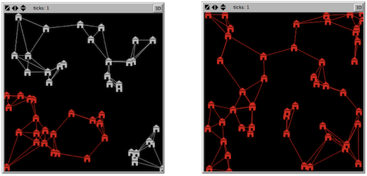
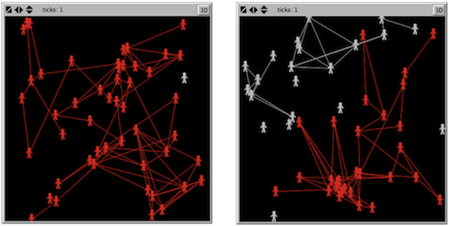
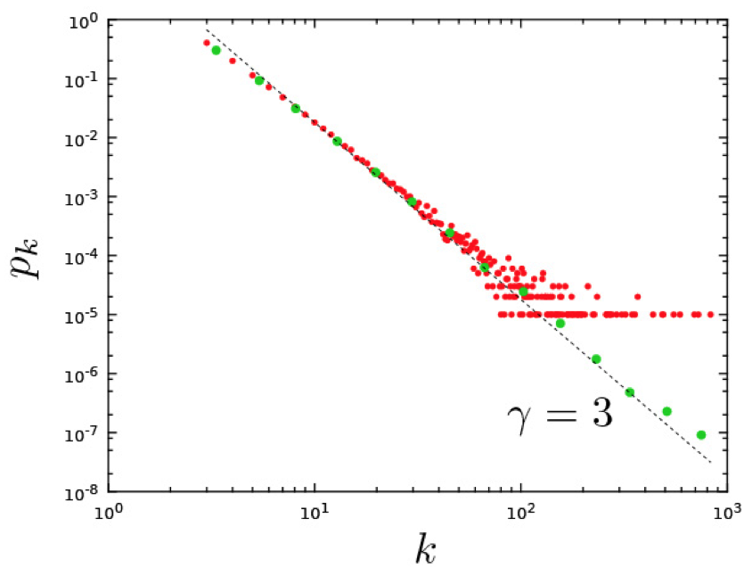
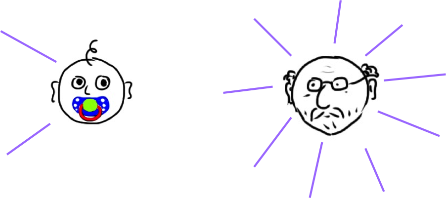

% Análisis de Redes Sociales
% Guillermo Jiménez Díaz (gjimenez@ucm.es); Alberto Díaz (albertodiaz@fdi.ucm.es)
% 24 de octubre de 2014

# Tema 4: Modelos de crecimiento

### Preguntas pendientes

* ¿Por qué el modelo aleatorio no reproduce hubs ni sigue una distribución de ley potencial?
* ¿Por qué la mayoría de los sistema reales complejos convergen a una topología de red libre de escala?

> Para entender esta información estructural es necesario entender el mecanismo responsable de que aparezca la propiedad libre de escala
> 
>  Nos centraremos en los **modelos de crecimiento y evolución de los sistemas complejos**

## Los modelos de evolución influyen en la topología de la red

### Evolución de una red aleatoria

* Partimos de un conjunto fijo de nodos $N$.
* Creamos aleatoriamente enlaces entre los nodos.

### Modelo de presentación

* La probabilidad de que me presenten (y me enlace) a un amigo de un amigo es mayor que la probabilidad de que me presenten a un desconocido.

### Modelo geográfico estático

* Cada nodo se conectará directamente a los $k$ nodos más cercanos.

### Modelo de encuentros aleatorios

Los nodos se mueven aleatoriamente y dos nodos se unen si chocan. Cada nodo tiene un número máximo de enlaces.

## Ingredientes para la creación de una red libre de escala

### Ingredientes para la creación de una red libre de escala

En 1999, los investigadores Barabasi y Albert destacaron dos supuestos que no eran tenidos en cuenta en el modelo de red aleatoria pero que existían en las redes reales:

* **La red crece a lo largo del tiempo.**
* **Los nodos nuevos prefieren conectarse a los nodos más conectados.**

### La red crece a lo largo del tiempo

* Las redes reales se expanden mediante la adición de nuevos nodos y nuevos enlaces
* El número de nodos no es fijo sino que crece con el tiempo
* El modelo de red aleatoria supone un número fijo de nodos $N$ inicial y  crea enlaces nuevos pero no modifica el número de nodos existentes.

### Los nodos nuevos prefieren conectarse a los nodos más conectados

### Los nodos nuevos prefieren conectarse a los nodos más conectados

* Cuando un nuevo nodo llega a la red decide a quién conectarse en función del número de enlaces que otro nodo ya tiene
* El modelo de red aleatoria asume que la probabilidad de conectarse a otro nodo es la misma para todos los nodos (es completamente aleatoria)
* Esta preferencia existente en las redes reales de conectarse con los nodos con más conexiones se conoce como **conexión preferencial** o _preferential attachment_

### Conexión preferencial

* Un matemático húngaro lo referencia por primera vez en 1923 y lo llama el _proceso Polya_
* En estadística es conocido como el _proceso Yule_
* En 1923, Gibrart lo denomina _crecimiento proporcional_
* En 1955, Simon lo usa para demostrar la naturaleza de la cola ancha de algunas distribuciones como el tamaño de las ciudades o el número de citas
* En 1965, Price, basándose en el anterior trabajo, lo denomina _ventaja acumulativa_
* En sociología se conoce como el _efecto Matthew_
* El término de _conexión preferencial_ es acuñado por Barabasi y Albert en 1999

## Modelo de Price

### Modelo de Price

### Modelo de Price

* Price (1965): usado para explicar la cola ancha que presenta la distribución de citas de los artículos de investigación
* Pasos

> * Cada artículo nuevo tiene $m$ citas (tendrá $m$ enlaces a otros nodos ya existentes en la red)

> * Un artículo nuevo cita a otro ya publicado con un probabilidad proporcional al número de citas que este último tiene.

> * Todos los artículos tienen al menos una cita: la probabilidad de enlazarse a un nodo no va a ser proporcional a $k$ sino a $k+1$.

### Modelo de Price

> El estudio y la simulación de este modelo demostró que las redes generadas siguiendo este modelo tienen una distribución de grados que sigue una ley potencial con exponente $\gamma = 2 + \frac{1}{m}$.

## Modelo de Barabasi-Albert

### Modelo de Barabasi-Albert

* Modelo usado para modelar la distribución de los nodos de la WWW
* Etapas

> * Inicialmente $m_0$ nodos y todos los nodos tienen al menos un enlace.

> 1. En cada momento de tiempo $t$ se añade un nuevo nodo a la red con $m \leq m_0$ enlaces que se conectarán a $m$ nodos ya existentes en la red.

> 2. La probabilidad de que uno de los enlaces del nuevo nodo se conecte a un nodo ya existente $i$ depende del grado de dicho nodo $k_i$ 
    $$ \pi (k) = \frac{k_i}{\sum_{j=1}^{N(t)}k_j}$$

### Modelo de Barabasi-Albert

* $N=m_0+t$
* $L=m_0+mt$

> A este modelo se le conoce también como modelo libre de escala ya que genera redes cuya distribución de grados sigue una ley potencial con exponente $\gamma = 3$.

### Modelo de Barabasi-Albert

### Limitaciones del modelo

Este modelo no especifica:

- Cuál es la configuración inicial de los $m_0$ nodos
- Si los $m$ enlaces se unen uno a uno (procesos independientes) o simultáneamente
- No contempla la existencia de ciclos (enlaces sobre sí mismo)

> Hay variantes de este modelo (como el _linearized chord diagram_) que intentan tener en cuenta algunas de estas limitaciones

### Limitaciones del modelo

* El modelo de Barabasi-Albert estima un exponente $\gamma = 3$. En la mayoría de las redes reales este exponente oscila entre 2 y 5
* El modelo genera redes no dirigidas aunque algunas de las redes reales que modela son dirigidas
* El modelo no permite enlaces entre nodos ya presentes en la red
* El modelo no tiene en cuenta la desaparición de nodos
* El modelo no tiene en cuenta que algunas características intrínsecas de algunos nodos pueden hacer que la conexión preferencial varíe

## Evolución de los grados de los nodos

### Evolución de los grados de los nodos

* El grado $k_i$ de un nodo $i$ es dependiente del tiempo, es decir, depende del momento en el que $i$ entró en la red
* El número de nodos es dependiente del tiempo: $N(t)$

* La tasa a la que un nodo adquiere nuevos enlaces (velocidad a la que aumenta su grado):

$$\frac{dk_i}{dt}=m \cdot \pi (k_i) = m \cdot \frac{k_i}{\sum_{j}^{k_j}}$$

* Como $\sum_{j}^{k_j} = 2mt - m$:

$$\frac{dk_i}{dt}=m \cdot \pi (k_i) = m \cdot \frac{k_i}{2mt - m} = \frac{k_i}{2t-1}$$

* Para valores de $t$ muy grandes:

$$\frac{dk_i}{dt} = \frac{1}{2} \cdot \frac{k_i}{t}$$

### Evolución de los grados de los nodos

* Número de enlaces que tiene un nodo desde su nacimiento hasta el tiempo $t$
* Integramos la anterior función (teniendo en cuenta que $k_i (t_i) = m$):

$$k_i(t) = m \cdot \Big( \frac{t}{t_i}\Big)^\beta \text{  donde }\beta = \frac{1}{2}$$

* $\beta$ es el exponente de la dinámica de la red

### Evolución de los grados de los nodos

> **Conclusión:** El grado de cada nodo de la red crece siguiendo una ley potencial de acuerdo al exponente de la dinámica de la red

>  **Conclusión:** El crecimiento del grado de los nodos es sublineal ya que cada nuevo nodo tiene un mayor número de nodos a los que conectarse y, por lo tanto, cada nodo tiene que competir con un mayor número de nodos para conseguir enlaces

### Evolución de los grados de los nodos

> **Conclusión:** Los hubs aparecen debido al efecto _"rich get richer"_: los nuevos nodos prefieren a los nodos con mayor grado

> **Conclusión:** Los hubs no son más grandes porque crezcan más rápidamente sino porque aparecieron antes (fenómeno _"first-mover advantage"_)

### Evolución de los grados de los nodos

* La tasa de crecimiento de un nodo es:

    $$k_i(t) =\frac{m}{2} \cdot \frac{1}{\sqrt{t_i t}}$$

### Evolución de los grados de los nodos

## Distribución de grados

### Distribución de grados

* La probabilidad de que un nodo tenga un grado menor que $k$

$$P(k_i(t) < k) = P(t_i > \frac{m^{\frac{t}{\beta}}\cdot t}{k^{\frac{1}{\beta}}})$$

* La probabilidad de que un nodo llegue en el tiempo $t_i$:

$$p(t_i) = \frac{1}{m_0+t}$$

* Sustituimos

$$P(k) = P(t_ \leq \frac{m^{\frac{t}{\beta}}}{k^{\frac{1}{\beta}}}) = 1 - \frac{m^{\frac{t}{\beta}}\cdot t}{k^{\frac{1}{\beta}}(m_0+t)}$$

### Distribución de grados

* Derivada de la función de distribución acumulada

$$p(k) = \frac{\partial P(k_i(t)<k)}{\partial k} = \frac{2m^{\frac{1}{\beta}\cdot t}}{m_0 + t} \cdot \frac{1}{k^{\frac{t}{\beta}+1}}$$

* Cuando $t \gg m_0$

$$p(k) \sim 2\cdot m^{\frac{1}{\beta}}\cdot k^{-\frac{1}{\beta} +1}$$
 
$$p(k)\sim 2\cdot m^{\frac{1}{\beta}}\cdot k^{-\gamma} \text{   donde } \gamma = \frac{1}{\beta} +1$$

### Distribución de grados

> Las redes creadas siguiendo el modelo de Barabasi-Albert tienen una distribución de grados que siguen una ley potencial con un exponente $\gamma =3$

* Probabilidad de tener grado $k$

$$p_k = \frac{2m(m+1)}{k(k+1)(k+2)}$$

### Distribución de grados

> **Conclusión:** La distribución de grados es independiente del tiempo

> **Conclusión:** El modelo de Barabasi-Albert genera una distribución de grados de ley potencial prediciendo $\gamma =3$

> **Conclusión:** Este exponente es independiente de $m$ y de $m_0$

## ¿Son los dos ingredientes imprescindibles?

### Sin enlace preferencial

El modelo de Barabasi-Albert sin enlace preferencial

> * Comenzamos con $m_0$ nodos

> * Añadimos un nuevo nodo a la red con $m$ enlaces

> * La probabilidad de que el nuevo nodo se una otro es aleatoria:
>       $$\pi(k_i) = \frac{1}{m_0 +t-1}$$

### Sin enlace preferencial

* Para este modelo se cumple

$$k(t) = m \cdot ln \Big( e \frac{m_0+t+1}{m_0+t_i+1}\Big)$$

$$p_k = \frac{e}{m}\cdot exp \Big(-\frac{k}{m}\Big)$$

* $k(t)$ crece de manera logarítmica, mucho más lenta que una ley potencial
* $p_k$ sigue una exponencial por lo que no permite la existencia de hubs

### Sin crecimiento

El modelo de Barabasi-Albert sin crecimiento

> * Empezamos con $N$ nodos.

> * En cada momento $t$ seleccionamos un nodo aleatoriamente y decidimos que se conecta al nodo $i$ presente en la red con probabilidad:
>   $$ \pi (k) = \frac{k_i}{\sum_{j=1}^{N(t)}k_j}$$

### Sin crecimiento

* $N$ permanece constante y $L$ crece linealmente

$$k_i(t) \approx \frac{2}{N}t$$

* Al principio la red se parece a la generada por el modelo de Barabasi-Albert
* A medida que crece, el grado $k_i(t)$ converge a $\langle k \rangle$
* Con el tiempo, la red se satura y se convierte en un grafo completo con $\langle k \rangle = N-1$

## Diámetro

### Diámetro

$$d_{max} = \frac{logN}{log\;log N}$$

* Podemos estimar la misma fórmula para la distancia media ($\langle d \rangle$) de la red

> **Conclusión:** Las distancias en el modelo de Barabasi-Albert crecen más lentamente que $logN$ por lo que crecen más lentamente que en el modelo aleatorio
> 
> Esto es especialmente notable en redes grandes ($N\gg10^4$).

### Diámetro

## Coeficiente de agrupamiento

### Coeficiente de agrupamiento

$$C = \frac{m-1}{8}\cdot \frac{(lnN)^2}{N}$$

* Dependencia del tamaño de la red muy diferente al $\frac{1}{N}$ obtenido con el modelo de red aleatoria

> **Conclusión:** En este caso, el coeficiente de agrupamiento decae más lentamente
> 
> Mayor agrupamiento local que la red aleatoria equivalente

### Coeficiente de agrupamiento

## Resumen

### Resumen

> Para entender la topología de la red es necesario describir cómo se ha formado la red

* Los modelos de crecimiento de Price y de Barabasi-Albert generan redes que cumplen la propiedad de ser libres de escala
* Estos modelos se caracterizan por tener
    1. Crecimiento: el número de nodos crece con el tiempo
    2. Conexiones preferenciales: los nodos con mayor grado son preferidos a los nodos de menor grado

### Resumen

> Las redes cuya distribución de grados sigue una ley potencial y que presentan hubs son consecuencia de un proceso de crecimiento y de conexión preferencial

### Resumen

