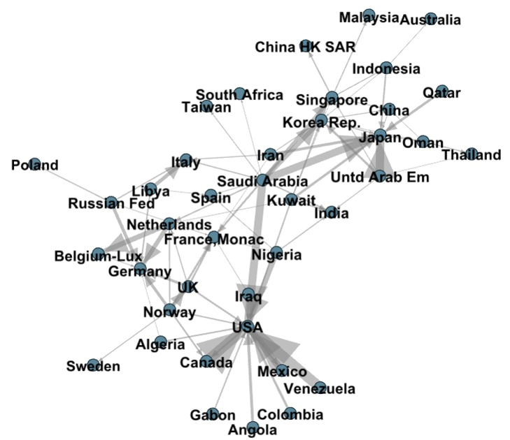
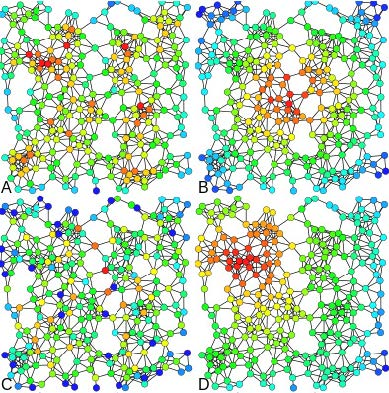
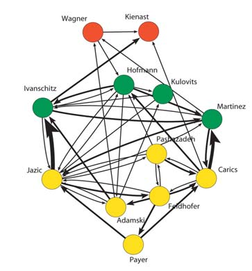
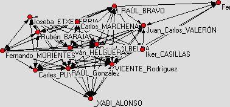
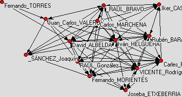
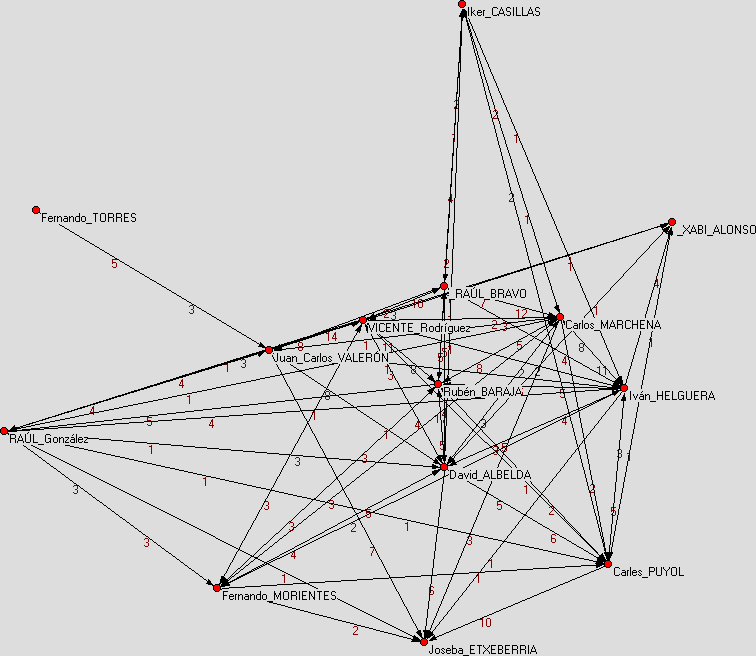
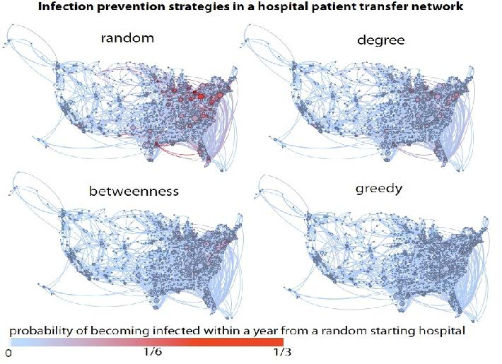
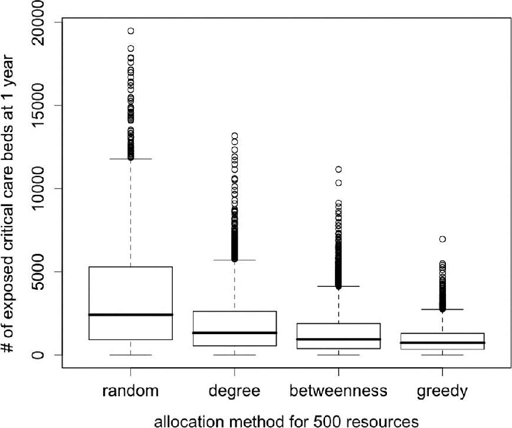

% Análisis de Redes Sociales
% Guillermo Jiménez Díaz (gjimenez@ucm.es); Alberto Díaz (albertodiaz@fdi.ucm.es)
% 31 de octubre de 2014

# Tema 5: Centralidad {-}

### Concepto de centralidad

Los nodos con una "posición más central" (una mayor centralidad) tienen un acceso más fácil y rápido a los demás nodos de la red y una mayor capacidad para ejercer un control del flujo entre ellos.

### Ejemplos de grafos de actores en películas

En los siguientes grafos se representan relaciones entre los actores que aparecen en distintas películas analizando los guiones. Se incluye una arista entre dos actores si un actor interacciona con otro actor en un punto concreto de la película.

### Ejemplos de grafos de actores en películas

<!-- PONER FIGURAS -->
[Wikipedia: El Fugitivo (1993). Actores principales: Dr. Kimble, Gerard](http://es.wikipedia.org/wiki/El_fugitivo_(pel%C3%ADcula_de_1993))

### Ejemplos de grafos de actores en películas

[Wikipedia: Memento (2000). Actor principal: Leonard](http://es.wikipedia.org/wiki/Memento)

### Ejemplos de grafos de actores en películas

Han sido extraídas de la web [moviegalaxies.com](http://moviegalaxies.com)

## Medidas

### Medidas

Para analizar la estructura de las redes sociales existen 2 tipos de medidas: Medidas locales (a nivel de nodos) y medidas globales (a nivel de red).

### Medidas locales (a nivel de nodos).

* Todas estas medidas están basadas en el concepto general de centralidad (redes no dirigidas) o prestigio (redes dirigidas).
* La centralidad es una medida general de la posición de un nodo en la estructura global de la red social.
* Estas medidas se usan para identificar los nodos claves de una red.
* Muestran como las relaciones se concentran en unos pocos nodos (individuos), dando una idea de su poder social.

<!-- DUDA: Ejemplos Nada? -->

### Medidas globales (a nivel de red)

* Proporcionan información más compacta que permite evaluar la estructura global de la red.
* Proporcionan información sobre propiedades importantes de los fenónemos sociales subyacentes.
* Algunas de estas medidas las hemos utilizado en temas anteriores: diámetro, distancia media, grado medio, densidad.

## Medidas locales de centralidad

### Medidas locales de centralidad

Existen varias medidas distintas de centralidad:

* Grado
* Intermediación (betweenness)
* Cercanía (closeness)
* Excentricidad
* Centralidad de vector propio
* Coeficiente local de clustering

## Centralidad de grado

### Centralidad de grado

Mide el número de enlaces con otros nodos.
Hay que distinguir entre grafos dirigidos y no dirigidos.

### Grafos no dirigidos.

Centralidad de grado de un nodo: número de enlaces que lo conectan con otros.

$$C_D(N) = k_N$$

$C_D(N)$ se define en el intervalo {0, g-1}, siendo g el número de nodos de la componenente conexa donde está el nodo N.

<!-- PINTAR GRAFO CON EJEMPLO -->

### Grafos no dirigidos.

Interpretación:

* Los nodos con más enlaces son más centrales.
* En una red social de personas con relaciones de amistad, los individuos con más amigos son más centrales.
* Sin embargo, sólo mide la importancia con respecto a los vecinos más cercanos.
* Se asume que las conexiones de los vecinos no importan, sólo importa lo que se pueda hacer directamente con los vecinos. 

### Grafos dirigidos.

En grafos dirigidos, se define el prestigio de entrada (in-degree), denominado Soporte, y el prestigio de salida (out-degree), denominado Influencia:

$$Soporte = P_D^{in} = k_N^{in}$$

$$Influencia = P_D^{out} = k_N^{out}$$

Ambos se definen en el intervalo {0, g-1} 

<!-- PINTAR GRAFO CON EJEMPLO -->

### Grafos dirigidos.

Interpretación Soporte:

* Los nodos con muchos enlaces de entrada son prominentes.
* La idea básica es que muchos nodos procuran tener enlaces directos a ellos, por lo que se puede considerar como una medida de su importancia.

Interpretación Influencia:

* Los nodos que tienen muchas conexiones directas de salida con otros son influyentes.
* Pueden transferir información rápidamente a muchos otros nodos.

### Grafos dirigidos.

Preguntas sobre Figura 3:

Pregunta sobre Soporte: ¿Qué países importan de muchos otros?: ¿Arabía Saudí, Japón, Iraq, USA, Venezuela?
<!-- Respuesta: Japan y USA -->

Pregunta sobre Influencia: ¿Qué país exporta a pocos países pero lo hace en gran cantidad?: ¿Arabía Saudí, Japón, Iraq, USA, Venezuela?
<!-- Respuesta: Venezuela -->

### Normalización del grado

Es habitual normalizar los valores de las centralidades de grado ($C_D(N)$, $P_D^{in}$, $P_D^{out}$) diviéndolas por su valor máximo g-1 (siendo g el número de nodos de la componente conexa donde está el nodo).

<!-- PINTAR EJEMPLOS UGR O LADA -->

<!-- ¿FREEMAN FORMULA FOR CENTRALIZATION DE LADA? NO -->

### Problemas del grado como medida de centralidad

El grado es una medida adecuada para evaluar la centralidad de un nodo en una red social pero desde una perspectiva muy local:

* mide la importancia y la influencia del nodo con respecto a sus vecinos más cercanos,
* pero tiene una limitación importante: no tiene en cuenta la estructura global de la red.

<!-- EXPLICAR SOBRE EJEMPLOS ANTERIORES -->

<!-- ¿DISCUSIÓN SOBRE INTERMEDIACIÓN DE LADA? NO -->

## Intermediación

### Intermediación

La intermediación es una medida pensada para capturar como de central es un nodo desde el punto de vista de cuantos caminos mínimos que conectan nodos lo atraviesan

$$C_B(i) = \sum_{j<k}\frac{g_{jk}(i)}{g_{jk}}$$

donde $g_{jk}$ es el número de caminos mínimos que conectan los nodos j y k (normalmente 1), y $g_{jk}(i)$ es el número de esos caminos que incluyen al nodo i en medio del camino.

$C_B(i)$ se define en el intervalo {0, (g-1)(g-2)} en redes dirigidas y en {0, (g-1)(g-2)/2} en no dirigidas.

### Intermediación

Interpretación:

* Un nodo tiene una posición más favorable (mayor intermediación) en la medida en que dicho nodo esté situado en los caminos geodésicos (caminos más cortos) de todos los demás.
* En otras palabras, cuanto más caminos geodésicos pasen por un nodo más central será.
* En la perspectiva de las redes sociales, las interacciones entre dos actores no adyacentes puede depender de otros actores del conjunto, especialmente de aquellos situados en los caminos entre ambos.
* Los nodos con una intermediación alta ocupan roles críticos en la estructura de una red, puesto que suelen ocupar una posición que les permite trabajar como interfaces entre subgrupos de nodos fuertemente unidos.
* Son elementos vitales en la conexión entre distintas regiones de una red.

### Intermediación

Es habitual considerar la medida normalizada:

$$C_B^{'}(i) = \frac{C_B(i)}{(g-1)(g-2)/2}$$

donde el denominador representa el número de pares de nodos excluyendo el propio nodo i.

y cuando trabajamos con redes dirigidas:

$$C_B^{'}(i) = \frac{C_B(i)}{(g-1)(g-2)}$$

### Cercanía

Esta medida da importancia a la facilidad de acceso al resto de la red, a que se pueda llegar al resto de los nodos de la red con pocos saltos, o dicho de otra forma que la distancia al resto de los nodos de la red sea pequeña.

En esta medida no se tiene en cuenta ni tener muchos vecinos directos ni estar situado entre otros nodos. Se le da importancia a estar "en medio" de la red.

La suma de las distancias geodésicas (distancias de los caminos mínimos) de un nodo de la red a todos los demás es la lejanía de un nodo al resto.
La inversa de dicha suma es la medida de cercanía.

Centralidad de cercanía:

$$C_C(i) = 1 / \sum_{j=1}^{g}d(i,j)$$

### Centralidad de cercanía normalizada:

$$C_C^{'}(i) = 1 / (\frac{\sum_{j=1}^{g}d(i,j)}{g-1})$$

<!-- Si hay varias componentes conexas puede haber distancias infinitas, se puede calcular la centralidad de cercanía como la suma de las inversas de las distancias. -->

<!-- PINTAR EJEMPLOS NADA -->

<!-- 

* Encontrar un nodo con grado relativamente alto pero con un valor de cercanía bajo -->

#### Cercanía en redes dirigidas

Se pueden definir dos medidas de cercanía distintas considerando sólo los enlaces de entrada o de salida:

* Cercanía de entrada (p.ej.: prestigio en redes de citación)

* Cercanía de salida (alcance de la influencia de un nodo)

### Excentricidad

Otra medida local basada en distancias es la centralidad de excentricidad $C_E(i)$. Se define como la inversa de la excentricidad (la máxima distancia geodésica) entre un nodo y el resto de nodos de la red.

Los nodos con mayor valor de excentricidad se denominan nodos periféricos, los de menor valor forman el centro de la red. Inversamente, los nodos con mayor valor de centralidad de excentricidad forman el centro de la red, los de menor valor son periféricos.

Excentricidad:

$$ E(i) = \max_{jinV(G)/i}d(i,j)$$

Centralidad de excentricidad:

$$C_E(i) = 1 / \max_{jinV(G)/i}d(i,j)$$

También podémos definir medidas equivalentes para redes dirigidas teniendo en cuenta la dirección en la máxima distancia geodésica.

### Centralidad de vector propio (eigenvector centrality)

<!-- 

En redes reales, los nodos con alta cercanía están cerca de otros nodos con alta cercanía. -->

La Centralidad de vector propio se basa en que la centralidad de un nodo concreto depende de cómo de centrales sean sus vecinos (prominencia). La idea básica es que el poder y el status de un actor (ego) se define recursivamente a partir del poder y el status de sus vecinos (alters).

La medida es válida para redes dirigidas(Prestigio de rango) y no dirigidas.

### Centralidad de vector propio (eigenvector centrality)

Es una versión más elaborada de la Centralidad de grado al asumir que no todas las conexiones tienen la misma importancia. No se tiene en cuenta la cantidad sino la calidad de las mismas.

### Centralidad de vector propio (eigenvector centrality)

La medida de Centralidad de vector propio, CVP, se define como una combinación
lineal (o una suma, si los enlaces ponderados no están ponderados) de los valores de todos los actores que apunten a i:

$$C_{VP}(i) = a_{1i}C_{VP}(1) + a_{2i}C_{VP}(2) + ... + a_{ni}C_{VP}(n)$$

Para calcular los valores de $C_{VP}$ para los n actores se construye un sistema de n ecuaciones con n incógnitas que se representa de forma matricial.

Si $C=(C_{VP}(1), …, C_{VP}(n))^T$ es el vector transpuesto que almacena los n valores de $C_{VP}$ (C es un vector columna) y A es la matriz de adyacencia, entonces:

$$C = A^TC$$

Esta ecuación coincide con la ecuación característica para encontrar los vectores y valores propios de la matriz $A^T$. C es un vector propio de $A^T$.

Es habitual considerar la medida normalizada:

$$c_i = \frac{1}{\lambda}\sum_{j=1}^na_{ij} \cdot c_j$$
$$C = \frac{1}{\lambda}A^T \cdot C$$
$$\lambda \cdot C = A^T \cdot C$$

donde $\lambda$ es una constante que equivale al mayor valor absoulto del vector propio dominante en A.

### Centralidad de vector propio (eigenvector centrality)

Existen distintos algoritmos para calcular este vector propio C, como el método de las potencias, método iterativo que se basa en el cálculo del autovector del mayor autovalor. Sin embargo, se deben cumplir algunas condiciones específicas para poder aplicarlo.

Referencias en Wikipedia: [Wikipedia: Método de las potencias](http://es.wikipedia.org/wiki/Método\_de\_las_potencias), [Wikipedia: Power iteration](http://en.wikipedia.org/wiki/Power_iteration)

Este método es el que sigue Gephi para calcular la Eigenvector Centrality.

### Centralidad de vector propio (eigenvector centrality)

Otra medida de Centralidad de vector propio muy extendida es la
Centralidad de Bonacich:

$$c_i(\beta) = \sum_j(\alpha + \beta c_j)A_{ij}$$

$$C(\beta) = \alpha(I - \beta A)^{-1}A1$$

* $\alpha$ es una constante de normalización
* $\beta$ determina la importancia de la centralidad de los vecinos de i para calcular la centralidad de dicho nodo
* A es la matriz de adyacencia (binaria o ponderada)
* I es la matriz identidad
* 1 es una matriz con todas las componentes a 1

### Centralidad de vector propio (eigenvector centrality)

El parámetro $\beta$ es un factor de atenuación que determina qué actores
de la red influyen en el cálculo de la centralidad del nodo i:

* Si $\beta$ es pequeño -> atenuación alta: sólo los amigos cercanos
influyen y su importancia es muy puntual
* Si $\beta$ es grande -> atenuación baja: la estructura global de la red
tiene importancia (tus amigos, los amigos de tus amigos, etc.)
* Si $\beta=0$ -> la fórmula coincide directamente con la Centralidad de
grado:

$$c_i(\beta) = \sum_j(\alpha)A_{ij}$$

### Centralidad de vector propio (eigenvector centrality)

Además, el signo de $\beta$ determina el comportamiento de la medida:

* Si $\beta > 0$ -> los actores tienen una mayor centralidad cuando están
conectados a otros actores centrales
* Si $\beta < 0$ -> los actores tienen una mayor centralidad cuando están
conectados a actores poco centrales

### Page Rank.

El algoritmo PageRank se basa en una variante del cálculo de centralidad propia. Brin & Page (fundadores de Google) lo introdujeron en 1998 en su buscador como un indicador de la relevancia de una página Web. 

Page Rank ordena la web en el sentido de que tiene en cuenta no sólo las páginas que te apuntan a ti, sino que también tiene en cuenta cuantas páginas apuntan a esas páginas, etc. La idea es que es más difícil aumentar artificialmente una medida de centralidad con una definición recursiva.

### Cálculo de Page Rank mediante un camino aleatorio

Cuando se calcula el vector propio en PageRank se usa un camino aleatorio. Un caminante aleatorio siguiendo enlaces durante mucho tiempo pasará un tiempo en cada nodo. Y este tiempo se puede utilizar como una medida de la importancia de este nodo en la red donde se encuentra.

Para evitar que un camino aleatorio quede atrapado en un ciclo se incluye una probabilidad de teletransporte a otra parte del grafo. Esto es, el camino aleatorio sigue uno de los enlaces posible con probabilidad p y puede teletransportarse a otro nodo aleatorio en el grafo con probabilidad 1-p.

Este cambio evita los ciclos pero sigue teniendo en cuenta que las páginas importantes son las que están unidas a páginas importantes.

<!-- Ejemplo Lada. -->

Este es el método que sigue Gephi para calcular el valor de PageRank asociado a cada nodo.

### Comparativa medidas locales de centralidad

### HITS

El algoritmo HITS (acrónimo del inglés Hypertext Induced Topic Selection) es un algoritmo diseñado por Jon Kleinberg EN 1998 para valorar, y de paso clasificar, la importancia de una página web. Esta  medida se puede aplicar a grafos generalizando la idea de la web como grafo.

HITS usa dos indicadores para cada nodo del grafo para hacer esta valoración (hub y authority), definiendo recursivamente cada uno a partir del otro. 

* el authority, que valora cuán buena es la página como recurso de información; para su cálculo se usa una suma ponderada de valores hub de los enlaces que apuntan hacia esta página.
* el hub, que dice cuán buena es la información que se consigue siguiendo los enlaces que tiene a otras páginas; se calcula como una suma ponderada de valores authority de las páginas a las que apunta ésta.
*  Algunas implementaciones del algoritmo también consideran cuánta es la relevancia de las páginas enlazadas.

Entonces un buen hub apunta a buenas authorities y una buena authority es apuntada por buenos hubs.

### HITS

Matricialmente se pueden representar los valores de hub y authority 

$$h=A \cdot a$$
$$a=A^T \cdot h$$

siendo A la matriz de adyacencia del grafo.

Si reemplazamos en ambas ecuaciones para obtener definiciones recursivas:

$$h=A \cdot A^T \cdot h$$
$$h=A^T \cdot A \cdot a$$

Las relaciones anteriores se parecen a las relaciones de vectores propios usadas en Pagerank, pero para poder utilizar el método de las potencias hay que normalizar los vectores h y a tal que la suma de sus elementos sume 1 en cada iteración.

### Coeficiente Local de clustering

Transitividad: Las redes sociales son transitivas por naturaleza, es decir, los
amigos de un actor dado también suelen ser amigos entre sí.

La propiedad de transitividad de una red se cuantifica por el Coeficiente de
Clustering que puede ser global, a nivel de toda la red, o local, a nivel de cada nodo individual:

$$ C_{CLC}(i) = \frac{2L_i}{k_i(k_i-1)}$$

* Nodo $i$ con grado $k_i$
* $L_i$ = número de enlaces entre los vecinos del nodo i
* $C_i \epsilon [0,1]$. $C_i=0$ indica que ninguno de los vecinos de i están conectados entre sí, $C_i = 1$ indica que todos están conectados.
* A mayor valor, más central se considera el nodo.

## Medidas globales de centralización

Existen varias medidas globales en SNA. La mayoría son las mismas empleadas para analizar cualquier otro tipo de red, que ya hemos estudiado: distancia media, densidad, grado medio, coeficiente de clustering global

### Diámetro

Longitud del camino mínimo más largo de la red.

En redes grandes, se puede determinar con el algoritmo de búsqueda primero en
anchura.

Equivale al valor máximo de excentricidad para todos los nodos de la red:

$$ d_{max} = \max \{E(i):i \epsilon V(G)\}$$

Esta métrica da una idea de la proximidad entre pares de nodos en la red, indicando cómo de lejos están en el peor de los casos.

Las redes más dispersas suelen tener un mayor diámetro que las más densas al
existir menos caminos entre cada par de nodos.

### Radio

Valor mínimo de excentricidad para toda la red:

$$ r = \min \{E(i):i \epsilon V(G)\}$$

### Medidas de centralización

Indican la variabilidad de los valores de centralidad entre los nodos de la red.
Miden el grado en que un nodo tiene una centralidad alta mientras que el resto la tiene baja.

Existen distintas formas de construir una medida de este tipo, como la
formulación de Freeman (1979):

$$C_A = \frac{\sum_{i=1}^g[C_A(n^*)-C_A(i)]}{max \sum_{i=1}^g[C_A(n^*)-C_A(i)]}$$

* $C_A$ es una medida de centralidad y $C_A(i)$ su valor para el nodo i.
* $C_A(n^*)$ es el valor máximo de esa medida para los g nodos de la red
$(C_A(n^*) = max_j C_A(j))$
* $max \sum_{i=1}^g[C_A(n^*)-C_A(i)]$ es el máximo teórico del numerador.

El índice $C_A$ se define en [0,1]. Toma valor 0 cuando todos los nodos tienen
exactamente el mismo valor de Centralidad $(C_A(n^*))$ y 1 cuando un nodo
domina totalmente (eclipsa) al resto.

### Medidas de centralización

Un ejemplo sería la medida de Centralización de grado $C_D$ donde el máximo teórico es $(g-1)(g-2)$:

$$C_D = \frac{\sum_{i=1}^g[C_D(n^*)-C_D(i)]}{(g-1)(g-2)}$$

$C_D$ toma valor máximo 1 cuando un solo nodo está conectado al resto que no
tienen conexiones entre sí (grafo en estrella). El valor mínimo 0 corresponde
a un grafo regular donde todos los nodos tienen el mismo grado.

<!-- Ejemplo Grafos -->

En redes dirigidas, una red con alta centralización de soporte (grado de entrada) sería aquella en la cual hay un nodo con un grado de entrada muy alto mientras que el resto la tiene baja. Por otro lado, una red con baja centralización de soporte sería aquella en la que todos los nodos tuvieran un grado de entrada similar.

### Medidas de centralización

La medida de Centralización de intermediación $C_B$ sería:

$$C_B = \frac{\sum_{i=1}^g[C_{B}^{'}(n^*) - C_{B}^{'}(i)]}{(g-1)}$$

Se calcula a partir de la intermediación normalizada $C^'_B$. Toma el valor máximo 1 en un grafo en estrella y el valor mínimo 0 en un grafo en el que todos los valores de intermediación sean iguales.

### Medidas de centralización

La medida de Centralización de intermediación $C_C$ sería:

$$C_C = \frac{\sum_{i=1}^g[C_C(n^*)-C_C(i)]}{[(g-1)(g-2)/(2g-3)]}$$

$C_C$ toma valor 1 en un grafo en estrella y el valor mínimo 0 en un grafo en el
que todas las distancias sean iguales (p.ej. un grafo completo o circular).

El problema de estas medidas es el máximo teórico, que no es calculable
para algunas Centralidades de prestigio en redes dirigidas (aunque si para la
Centralidad de grado).

## Algunas aplicaciones del análisis de redes sociales

### Análisis de juego en equipos de fútbol

Una posible aplicación es el análisis del juego de un equipo de fútbol en un partido. En la figura se pueden observar los pases realizados por los jugadores del equipo de fútbol Rapid de Viena en los últimos 15 minutos del partido que jugaron contra el equipo Sturm Graz el 7 de Diciembre de 2003. Los colores de los nodos indican la posición dej jugador (rojo=atacante, verde=centrocampista, amarillo=defensa). 

Posibles factores de análisis del grafo con los pases realizados:

* ¿Qué jugador ha iniciado más pases (grado ponderado de salida)? Jazic
* ¿Qué jugador ha recibido más pases (grado ponderado de entrada)? Jazic
* ¿Quién ha controlado el juego del Rapid (centralidad)? Jazic y Hoffman
* ¿Qué jugadores han estado implicados en jugadas con el mayor número de pases (caminos)? Jazic, Hofmann, Feldhofer, Martinez y Carics
* ¿Quién ha jugado con quién y quién no (análisis de los enlaces)? Ni un solo pase de Ivanschitz a Wagner
* ¿Qué jugadores han tenido un rol similar (análisis de enlaces)? Por ejemplo, Ivanschitz / Martinez

### Análisis de juego en equipos de fútbol

A partir de los [datos de los pases realizados en los partidos de la Eurocopa](http://revista-redes.rediris.es/webredes/eurocopa/datos.htm) de Portugal 2004 se pueden obtener grafos con los pases realizados en los distintos partidos y estudiar las redes asociadas.

J.J. Merelo. Redes contra redes: el fútbol es así. [(http://atalaya.blogalia.com/historias/19642)](http://atalaya.blogalia.com/historias/19642)]

### Análisis de juego en equipos de fútbol

El jugador con más centralidad es Iker Casillas, cuando debería haber sido Baraja.

### Análisis de juego en equipos de fútbol

La situación no cambió mucho en el segundo partido (Grecia 1 – España 1) salvo que, en este caso, Albelda, Baraja y Helguera organizaron un poco más el juego.
Es curioso ver también que la "autoridad" de la red es Vicente, un extremo. Lo lógico sería que las autoridades fueran los delanteros, pero Morientes y Raúl se hallan ahí perdidos, en la maraña de la red.

### Análisis de juego en equipos de fútbol

Casi el 90% de los pases fueron los mismos.

### Hospitales

Infecciones en hospitales de EEUU por transferencia de pacientes

También se han utilizado las medidas de centralidad en el control de infecciones con organismos resistentes teniendo en cuenta la red de traslados de pacientes en Estados Unidos. La conclusión es que es más eficiente concentrar recursos en los hospitales estratégicamente situados en la red, donde la estrategia de selección está relacionada con las medidas de centralidad de la red.

### Hospitales

U.H. Karkada, L.A. Adamic LA, J.M. Kahn, T.J. Iwashyna. Limiting the spread of highly resistant hospital-acquired microorganisms via critical care transfers: a simulation study. Intensive Care Med. 2011 37(10): 1633-40

PURPOSE:
Hospital-acquired infections with highly resistant organisms are an important problem among critically ill patients. Control of these organisms has largely focused within individual hospitals. We examine the extent to which transfers of critically ill patients could be a vector for the wide spread of highly resistant organisms, and compare the efficiency of different approaches to targeting infection control resources

METHODS:
We analyzed the network of interhospital transfers of intensive care unit patients in 2005 US Medicare data and 2004-2006 Pennsylvania all-payer data. We simulated the spread of highly resistant hospital-acquired infections by randomly choosing a single hospital to develop a highly resistant organism and following the spread of infection or colonization throughout the network under varying strategies of infection control and varying levels of infectivity.

RESULTS:
Critical care transfers could spread a highly resistant organism between any two US hospitals in a median of 3 years. Hospitals varied substantially in their importance to limiting potential spread. Targeting resources to a small subset of hospitals on the basis of their position in the transfer network was 16 times more efficient than distributing infection control resources uniformly. Within any set of targeted hospitals, the best strategy for infection control heavily concentrated resources at a few particularly important hospitals, regardless of level of infectivity.

CONCLUSIONS:
Critical care transfers provide a plausible vector for widespread dissemination of highly resistant hospital-acquired microorganisms. Infection control efforts can be made more efficient by selectively targeting hospitals most important for transmission.

### Hospitales

### Hospitales

### Hospitales

