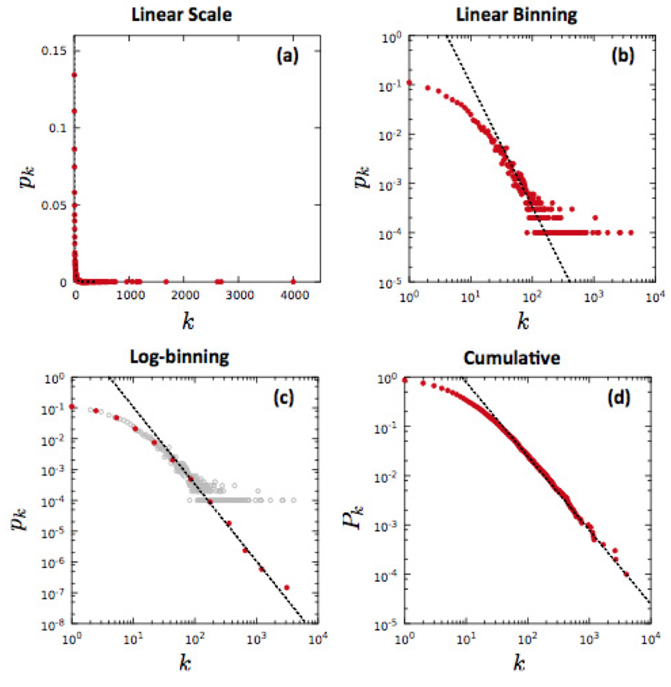
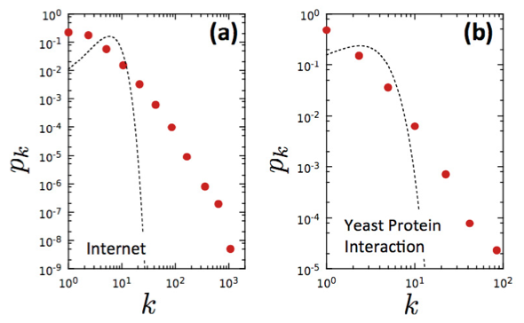
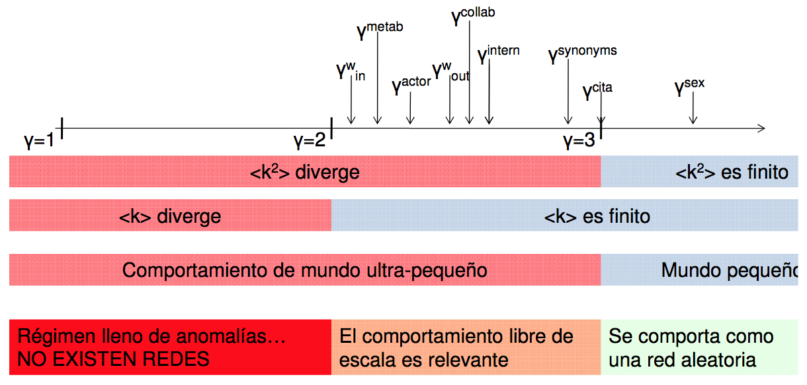

% Análisis de Redes Sociales
% Guillermo Jiménez Díaz (gjimenez@ucm.es); Alberto Díaz (albertodiaz@fdi.ucm.es)
% 20 de noviembre de 2015

# Tema 6: Redes libres de escala

## WWW

### Mapa de la WWW

* Primer mapa de una porción de la WWW (1999)
* **Objetivo**: Verificar las propiedades de los modelos de red aleatoria en este sistema complejo de páginas y enlaces
* Suponían que esta red seguía el modelo de red aleatoria
* Mapa del dominio `nd.edu`

    - 300000 documentos
    - 1,5 millones de enlaces.

### Mapa de la WWW

### Mapa de la WWW

* A primera vista cumple la aleatoriedad predicha por el modelo
* Si nos detenemos a observar hay un gran número de nodos de grado pequeño...
* ... y existen nodos con un número excepcional de enlaces: los hubs o concentradores.
* Estos nodos son extremadamente improbables en las redes aleatorias
 
> **Conclusión:** ¿sirve una red aleatoria para modelar la WWW?

### Análisis de datos de la WWW

* Distribución de grados

### Análisis de datos de la WWW

* La distribución de grados no se asemeja a la Poisson
* La distribución de grados se asemeja a una **ley potencial** o _power law_. 

    * Se caracteriza por tener una cola mucho más ancha que una exponencial. 
    * La diferencia mucho más clara si las representamos en una escala logarítmica.

### Ley potencial

### Ley potencial

Distribución de grados en la WWW

$$p_k \sim k^{-\gamma}$$

$$log\: p_k \sim -\gamma \cdot log\: k$$

Como la WWW es una red dirigida:

$$p_{k_{in}} \sim k^{-\gamma_{in}}$$

$$p_{k_{out}} \sim k^{-\gamma_{out}}$$

### Conclusiones del estudio de la WWW

* Se pudo estimar que $\gamma_{in} \approx 2,1$ mientras que $\gamma_{in} \approx 2,45$.
* Lo realmente interesante fue la gran diferencia entre la distribución esperada (una Poisson) y la distribución final obtenida (una ley potencial). 

> La WWW no se comportaba de acuerdo al modelo de red aleatoria sino que era "otro tipo de red"

## Redes libres de escala

### Redes libres de escala

> Una **red libre de escala** es una red cuya distribución de grados sigue una ley potencial.

> Esta distribución se caracteriza por tener una larga cola.

* El primer informe relacionado con una función de ley potencial fue realizado por Pareto (s. XIX)
    
    * El 80% del dinero en Italia estaba en manos de solo un 20% de la población.

### Formalismo discreto

* El grado de un nodo es siempre un entero positivo ($K=0,1,2\dots$).

$$p_k = C \cdot k^{-\gamma}$$

* La constante C se calcula teniendo en cuenta que $\sum_{k=1}^{\infty}{p_k} = 1$

$$C = \frac{1}{\sum_{k=1}^{\infty}{k^{-\gamma}}} = \frac{1}{\varsigma(\gamma)}$$

donde $\varsigma(\gamma)$ es la función Zeta de Riemann.

### Formalismo discreto

* Para valores de $k>0$, la función de distribución es:

$$p_k = \frac{k^{-\gamma}}{\varsigma(\gamma)}$$

* Los nodos aislado ($k=0$) tienen que tratarse de manera independiente.

### Formalismo continuo

* Consideramos que $k$ puede tomar cualquier valor real positivo.

$$p(k) = C \cdot k^{-\gamma}$$

* La constante C se calcula teniendo en cuenta que $\int_{k_{min}}^{\infty}{p(k)dk} = 1$:

$$C = \frac{1}{\int_{k_{min}}^{\infty}{k^{-\gamma}dk}} = (\gamma -1)\cdot k_{min}^{\gamma -1}$$

### Formalismo contínuo

* La función de distribución según el formalismo continuo es:

$$p(k)= (\gamma -1)\cdot k_{min}^{\gamma -1}\cdot k^{\gamma -1}$$

Donde $k_{min}$ es el menor grado de la red (o función de distribución)

La función de distribución se ha de interpretar como la probabilidad de que un nodo tenga un grado entre dos valores $k_1$ y $k_2$:

$$\int_{k_1}^{k_2}{p(k)dk}$$

## Hubs en las redes libres de escala

### Distribuciones de grados en redes aleatorias frente a libres de escala

### Distribuciones de grados en redes aleatorias frente a libres de escala

* La red libre de escala presenta una probabilidad de nodos con $k$ pequeño mayor que en una red aleatoria
* La red aleatoria tiene una mayor probabilidad de tener nodos con un grado $k \sim \langle k \rangle$ que la red libre de escala
* La red libre de escala presenta una mayor probabilidad de que existan nodos con $k$ muy alto.
* La probabilidad de que existan hubs en una red libre de escala es varios órdenes  de magnitud mayor que en una red aleatoria 

### Distribuciones de grados en redes aleatorias frente a libres de escala

> Ejemplo: Datos de la WWW ($\langle k \rangle = 4,6$)

* **Red aleatoria**: $p_{aleatoria}(100)=10^{-30}$.
* **Red libre de escala**: $p_{libre-escala}(100)=10^{-4}$.

### Grado del mayor hub

* $k_{max}$: grado del mayor hub existente en la red

* Red aleatoria con una distribución de grados $p_k$ exponencial:

$$p_k = C \cdot e^{-\lambda k}: \;\; k_{max}= k_{min} + \frac{lnN}{\lambda}$$

> $k_{max}$ depende de $lnN$
> 
> Muy poca diferencia entre $k_{min}$ y $k_{max}$
> 
> No hay hubs.

### Grado del mayor hub

* Red aleatoria con una distribución de grados $p_k$ Poisson

> $k_{max}$ depende más suavemente de $lnN$
> 
> Aún menor diferencia entre $k_{min}$ y $k_{max}$
> 
> No hay hubs.

### Grado del mayor hub

* Red libre de escala con una distribución de grados $p_k$ de ley potencial

$$p(k) = C \cdot k^{-\gamma}:\;\; k_{max}\sim k_{min} \cdot N^{\frac{1}{\gamma -1}}$$

> $k_{max}$ depende de $N$
> 
> Puede haber (y se espera que haya) hubs.
> 
> **Conclusión**: Cuanto mayor es la red, mayor es el grado del hub más grande.

### Grado del mayor hub

### Grado del mayor hub

> Ejemplo: Datos de la WWW ($N=3\cdot10^5$)

* **Red aleatoria**: $$k_{max}\approx 13$$

* **Red libre de escala**: $$k_{max}\approx 85000$$

### Resumen gráfico

<!-- ## ¿Qué significa "libre de escala"?

### Momentos de la distribución de grados

$$\langle k^n \rangle = \sum_{k_{min}}^{\infty}{k^np_k}=\int_{k_{min}}^{\infty}{k^np(k)dk}$$

* n=1: Grado medio ($\langle k \rangle$).

* n=2: Varianza ($\sigma^2 = \langle k^2 \rangle - \langle k \rangle^2$)

    Mide la dispersión de los grados. Su raíz cuadrada es la desviación típica ($\sigma$)

* n=3: Asimetría ($\langle k^3 \rangle$)

    Cómo de simétrica es p_k alrededor de la  media (si la función es simétrica entonces $\langle k^3 \rangle=0$)

### Momento de la distribución de grados

* Momento n-ésimo en una red libre de escala

$$\langle k^n \rangle = \int_{k_{min}}^{k_{max}}{k^np(k)dk} = C \frac{k_{max}^{n-\gamma+1} - k_{min}^{n-\gamma+1}}{n-\gamma + 1}$$

* Como $k_{max}$ crece con el tamaño de la red  analizamos $k_{max} \to \infty$:

$$\langle k^n \rangle = \frac{(\gamma -1)}{(n-\gamma- 1)} k_{min}^{\gamma-1} \Big[ k^{n-\gamma+1}\Big]_{k_{min}}^\infty$$

### Momento de la distribución de grados

* $n-\gamma+1 \leq 0$

    * El momento está acotado
    * Todos los momentos en los que $n \leq \gamma+1$ son finitos

* $n-\gamma+1 > 0$

    * El momento tiende a infinito según la red crece
    * Todos los momentos en los que $n > \gamma+1$ divergen 

### Libre de escala

* El exponente del grado $\gamma$ tiene un valor entre 2 y 3
* El primer momento ($\langle k \rangle$) es finito
* La varianza (segundo momento o $\langle k^2 \rangle$) y el resto de momentos tienden a infinito

> Si esto es así entonces resulta que los valores medios no tienen realmente sentido ya que hay fluctuaciones demasiado grandes. **La escala interna (la media) no tiene sentido por lo que es una red "libre de escala"**
-->
## Universalidad

### Universalidad

> ¿Son, en general, las redes reales libres de escala?

* Estudios de redes libres de escala
    
    * Price (1965): Redes científicas (el término aún no se conoce)
    * Barabasi (1999): WWW (acuña el término)
    * 1999: Internet (la red física de routers) y red de actores de Hollywood
    * ...: estudio en múltiples redes biológicas, tecnológicas y sociales: redes de interacción entre proteínas, comunidades virtuales, redes metabólicas, circuitos eléctricos, etc.
    * 2010: Twitter
    * 2011: Facebook

### Universalidad

### Universalidad

### Universalidad

* En todas hay diferencias de varios órdenes de magnitud entre los nodos con menor y mayor grado. 
* Los exponentes $\gamma$ de las funciones de distribución de grados son similares independientemente del dominio de la red.
* La mayoría de los exponentes varían entre 2 y 3.
* Las redes estudiadas muestran características comunes

### No todas las redes reales son libres de escala

* **No todas las redes son libres de escala**
* Contraejemplo: la red eléctrica (_Power grid_) no cumplen la propiedad de ser libre de escala.
* Contraejemplo: las redes existentes en materiales (enlaces atómicos que conforman estructuras cristalinas y amorfas)
* Contraejemplo: red neuronal del gusano _C.elegans_.
* Generalmente no aparece en redes en las que existe una limitación en el número de enlaces que un nodo puede tener (como la red eléctrica o la estructura atómica).

## Identificación de las redes libres de escala

### Identificación de las redes libres de escala

* No podemos suponer que todas las redes reales son libres de escala
* Se proponen unas pautas para detectar la propiedad de ser libre de escala

1. Representar gráficamente la distribución de grados
2. Comprobar que la distribución sigue realmente una ley potencial
3. Estimar el valor del exponente de la función

### Representar gráficamente la distribución de grados

* Dada una red real de $N$ nodos tendremos que calcular el grado de cada nodo
* Calcular  $p_k = \frac{N_k}{N}$ para todos los valores de $k$ que encontremos en la red ($N_k$ es el número de nodos con grado $k$)
* Representar gráficamente $p_k$/$k$

### Representar gráficamente la distribución de grados

* La representación lineal puede que comprima el grafo 
* Usar escala logarítmica: log $p_k$ en función de log $k$
* Difícil de entender: Usar escala logarítmico-aritmética con potencias de 10
    
    * Si $log(1000)=3$ entonces en el eje escribimos $10^3$.

### Representar gráficamente la distribución de grados

* _Linear binning_
* Problema: aparecen mesetas (_plateau_) para los valores de $k$ grandes.
* $N_k=0 \to p_k=0$: No se representan.
* $N_k=1 \to p_k = \frac{1}{N}$: Meseta
* Esto puede hacer que no se pueda estimar correctamente el exponente.

### Representar gráficamente la distribución de grados

* _Logarithmic binning_
* Agrupamos $k$ por cubos (o _bins_) de tamaño variable:

    * $b_0 = 1$: contiene los nodos con $k=1$
    * $b_1 = 2$: contiene los nodos con $k \in \{2, 3\}$
    * $b_2 = 4$: contiene los nodos con $k \in \{4, 5, 6, 7\}$
    * En general, $b_n = 2^n$ y contiene los nodos con $k \in \{2^n, 2^n+1, \dots, 2^{n+1}-1\}$

* Representaremos $p_{\langle k_n \rangle} = \frac{N_n}{b_n}$

    * $\langle k_n \rangle$ es el grado medio del cubo n-ésimo
    * $N_n$ es el número de nodos en el cubo n-ésimo
    * $b_n$ es el tamaño del cubo.

### Representar gráficamente la distribución de grados

* Suaviza las mesetas
* Perdemos información

### Representar gráficamente la distribución de grados

* Distribución acumulada: cuántos nodos tienen al menos grado k

$$p_x = \sum_{q=k}^{\infty}P_q$$

* Distribución acumulada sigue siendo un ley potencial

$$p_x \sim k^{-\gamma+1}$$

* No existen mesetas

### Representar gráficamente la distribución de grados

### Comprobar que la distribución sigue realmente una ley potencial

* Comprobar que realmente sigue una ley potencial
* Dibujar distribuciones de Poisson o exponenciales equivalentes (usando el valor $\langle k \rangle$ de la red) para ver que realmente son distintas.

### Comprobar que la distribución sigue realmente una ley potencial

* Algunas distribuciones solo presentan la propiedad de ley potencial en la cola
* Estimar $k_{min}$ a partir del cual se exhibe ley potencial
* $k_{min}>0$ ya que $k^{-\gamma} = \infty$ para $k=0$

### Calcular el valor del exponente de la función

* Aproximar el valor del exponente es buscando la línea recta que se ajusta al gráfico logarítmico
* Puede introducir cierto error
* Existen otras técnicas más precisas que quedan fuera de los objetivos de este curso (pero que se pueden consultar en el anexo 4.C del capítulo 4 del libro de Barabasi).

## Propiedad de los mundos ultra-pequeños

### Hubs y reducción de distancias

* La existencia de hubs en las redes libres de escala modifica las distancias dentro de la red con respecto al modelo aleatorio
* Intuición: Ejemplo de red de transportes
    
    * Si vamos por carretera de una ciudad a otra pasaremos por muchas ciudades (red aleatoria)
    * La red aeroportuaria crea hubs (como el aeropuerto de Chicago) que reducen el número de saltos que tenemos que dar entre aeropuertos para ir de una ciudad a otra.

* Demostración: probar que las distancias en una red libre de escala es menor que las distancias en una red aleatoria.

### Distancia media en función del exponente

* Estudiar $\langle d \rangle$ en función del valor del exponente $\gamma$
 
$$k_{max}\sim k_{min} \cdot N^{\frac{1}{\gamma -1}}$$

* 4 regímenes

### Distancia media en función del exponente

1. $\langle d \rangle \sim const \text{ si }\gamma=2$

* $k_{max}\sim N$.
* La mayoría de los nodos están conectados al hub por lo que la distancia media es independiente del tamaño de la red.

### Distancia media en función del exponente

2. $\langle d \rangle \sim \frac{lnlnN}{ln(\gamma-1)} \text{ si }2<\gamma <3$

* **Mundo ultra-pequeño**: la distancia media se incrementa en un orden menor que el logaritmo cuando el tamaño de la red aumenta.
* La distancia media en una red aleatoria aumenta en orden logarítmico cuando el tamaño de la red aumenta. 
* La gran mayoría de los caminos pasan a través de unos pocos hubs, lo que reduce la distancia entre nodos.

### Distancia media en función del exponente

2. **Mundo ultrapequeño**

* Ejemplo:

> $N \approx 7\cdot 10^9$
> 
> Si la red es aleatoria: $lnN = 22.6$. 
> 
> Si la red es libre de escala: $lnlnN=3.12$.

### Distancia media en función del exponente

3. $\langle d \rangle \sim \frac{lnN}{lnlnN} \text{ si }\gamma =3$

<!-- * Punto crítico: $\langle k^2 \rangle$ no diverge -->
* Las distancias vuelven a tener una dependencia logarítmica, similar a las de una red aleatoria
* Aunque levemente suavizadas.

### Distancia media en función del exponente

4. $\langle d \rangle \sim lnN \text{ si }\gamma >3$

<!-- * ($\langle k^2 \rangle$) es finito -->
* La red se comporta como una red aleatoria
* Siguen existiendo hubs pero no influyen significativamente en las distancias.

### Distancia media en función del exponente

### Distancia media en función del exponente

> **Conclusión:** Las redes libres de escala en general reducen la distancia media de la red.
> 
>  Modifican la dependencia de $\langle d \rangle$ con respecto al tamaño de la red

>  **Conclusión:** Cuando menor es $\gamma$ menor es la distancia entre nodos
>  
>  Si $2<\gamma <3$ menor es la dependencia de $N$

## Regímenes de las redes libres de escala

### Regímenes de las redes libres de escala

* El valor del exponente $\gamma$ influye en algunas propiedades de las redes libres de escala
* Distinguimos 3 regímenes

### Régimen anómalo {-}

* $\gamma \leq 2$
<!-- * Primer y segundo momento divergen -->
* Casi no se da en redes
* Propiedades son bastante anómalas
* Ej: Tamaño del mayor hub es mayor que el tamaño de la red $N$

    * Los hubs tienen ciclos o hay múltiples enlaces entre nodos.

### Régimen libre de escala {-}

* $2<\gamma <3$
<!-- * El primer momento es finito pero el segundo momento diverge -->
* Se manifiesta la propiedad libre de escala
* El tamaño de los hubs crece con el tamaño de la red
* Mundo ultra-pequeño

### Régimen  de red aleatoria {-}

* $\gamma \geq 3$
* Las redes libres de escala que se encuentran en este régimen son prácticamente indistinguibles de las aleatorias de igual tamaño
* Cuanto mayor es el exponente, más pequeños y menos numerosos son los hubs
* $k_{max}$ ha de ser entre $10^2 - 10^3$ veces mayor que $k_{min}$ por lo que $N$ ha de ser enorme

> Ejemplo: $\gamma=5$ y $k_{max} \approx 10^3 \cdot k_{min}$
> 
> $$k_{max}\sim k_{min} \cdot N^{\frac{1}{\gamma -1}};\;N=\Big(\frac{k_{max}}{k_{min}}\Big)^{5-1} \approx 10^{12}$$

## Propiedades adicionales de las redes libres de escala

### Robustas a fallos aleatorios

### Robustas a fallos aleatorios

* Las redes libres de escala son mucho más tolerantes a fallos accidentales (o aleatorios) que las redes aleatorias
* Sin embargo, las redes libres de escala son extremadamente vulnerables si se eliminan sus hubs, ya que en ese caso sí se produce la fractura del sistema.

### Propagación de virus

* En una red libre de escala (como puede ser la WWW) es prácticamente imposible erradicar un virus ya que las distancias cortas permiten la rápida propagación del mismo, evitando el aislamiento
* Inmunizar a los hubs reducen su propagación

> Ejemplo: Vacunación de la gripe de los profesores de Universidad

## Resumen

### Resumen

* Las redes "acotadas" son las que su distribución de grados decrece exponencialmente (o más rápido) a medida que crece $k$
* Exponencial, la gaussiana o la de Poisson, entre otras
* Las redes aleatorias son un ejemplo de estas redes
* Carecen de hubs y de nodos con grado muy bajo por lo que todos los nodos tienen un grado más o menos similar
* Ejemplos: redes de carreteras, las redes eléctricas y las redes atómicas, entre otras.

### Resumen

* Las redes "no acotadas" o libres de escala son aquellas cuya distribución de grados sigue una ley potencial
* En estas redes existen (y se espera que existan) nodos de grado muy alto (hubs), conviviendo con nodos de grado varios órdenes de magnitud menor
* El grado de los nodos no está acotado por el grado medio
* Ejemplos: la WWW, las redes de interacción de proteínas, las redes de investigación, etc.
* Los hubs afectan significativamente a las propiedades de la red: mundos ultra-pequeños

### Resumen

### Resumen

Las redes reales cumplen otra nueva ley que es la **propiedad libre de escala**:

> Muchas redes reales presentan distribuciones de cola ancha. Esto implica que nodos de grado bajo conviven con nodos con un grado excepcionalmente grande: los hubs.