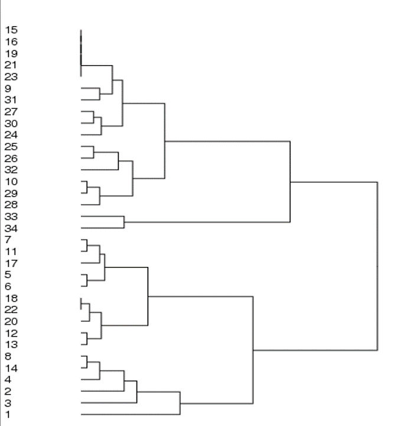

% Análisis de Redes Sociales
% Guillermo Jiménez Díaz (gjimenez@ucm.es); Alberto Díaz (albertodiaz@fdi.ucm.es)
% 21 de noviembre de 2014

# Tema 6: Estructura de comunidades {-}

## Introducción

### Concepto de comunidad

Las redes complejas tienden a mostrar una estructura de comunidades.

A menudo encontramos una alta concentración de enlaces en ciertas regiones
del grafo, denominadas comunidades, y una baja concentración de enlaces entre
esas regiones.

Esta propiedad suele darse como consecuencia de la heterogeneidad global y local de la distribución de los enlaces en un grafo.

Las comunidades, también conocidas como módulos o clusters, se definen como grupos de nodos similares.

A partir del concepto de densidad de la red, las comunidades pueden definirse como grupos de nodos densamente conectados que presentan conexiones dispersas entre sí.

### Caso ideal

En esta red hay 3 comunidades: $C_1, C_2, C_3$.

Cada comunidad está formada por un grafo completo (un clique) de tamaño variable $(C_1 = K_6, C_2 = K_3, C_3 = K_7)$.

La densidad de enlaces entre comunidades es muy baja. Los pocos enlaces que existen son puentes.

<!-- Traspas UGR?

Clustering y mundos pequeños
El clustering implica modularidad.
La funcionalidad requiere modularidad.
La propiedad de mundos pequeños tiende a eliminar la modularidad.

Clustering y hubs
Los hubs tienden a eliminar la modularidad.

¿Cuando es modular una red?
El clustering sólo debe estar en la periferia.
Los nodos de grado bajo suelen pertenecer a un único módulo.
Los hubs hacen de puente entre distintos módulos. -->

### Indice

El tema va a estar dividido en 3 partes:

* ¿Porqué detectar comunidades es interesante?
* ¿Qué es una comunidad? ¿Cuando se dice que un conjunto de nodos forma una comunidad?
* ¿Cómo detectar comunidades?

## ¿Por qué detectar comunidades?

### ¿Por qué detectar comunidades?

En la vida real existen muchos ejemplos de grupos que forman comunidades en redes complejas:

* Sociedades: las personas tienen una tendencia natural a formar grupos (familias, círculos de amigos, grupos profesionales o religiosos, ciudades, naciones, etc.)
* Empresariales/Económicas: compañías, clientes, etc.
* Biología: p.ej. redes metabólicas. En redes de interacción de proteínas
encontramos grupos de proteínas con funciones similares dentro de la célula.
* Internet: comunidades virtuales (Facebook, Twitter, etc.), grupos de páginas web relacionadas, etc. (útiles para sistemas de recomendaciones)
* y muchos ámbitos más… 

### Ejemplo email spectroscopy

En la Figura aparece un grafo con las conexiones entre las personas de una empresa (HP) según los correos electrónicos que intercambian.

En gris aparecen los enlaces debidos a los correos y en negro aparecen las conexiones debidas a la estructuración de la empresa desde el punto de vista de la comunicación entre personas (reporting structure).  

Detectar comunidades en este grafo nos da la estructura de colaboración entre las personas que trabajan en la empresa.

En este estudio, se obtuvieron las comunidades presentes en el grafo de correos y se compararon con la estructura de comunicación de la empresa.

### Ejemplo email spectroscopy

Se encontró que en la mayoría de los casos los grupos de personas coincidían. Esto es, las personas que trabajan en el mismo departamento, con los mismos objetivos y tareas, tienden a comunicarse más entre ellos que con el resto.

Esto supone una validación de que dicha estructura es útil, de tal forma que si no hubiese salido de forma similar la empresa podría replantearse algún tipo de re-organización de sus departamentos y personas.

De hecho, si la empresa no tuviera una estructura organizativa, las comunidades obtenidas en el análisis de la red de correos podrían ser una sugerencia sobre una posible estructura organizativa de la que partir.

### Ejemplo email spectroscopy

Otra cosa que fue detectada en este estudio es que había unas pocas comunidades que incluían personas de varias unidades organizativas de la empresa.

Cuando los autores del estudio entrevistaron a las personas incluidas en estas comunidades resultó que dichas personas realizaban tareas que estaban relacionadas con varias partes de la organización.

Por ejemplo, en el trabajo asociado con impresoras con funcionalidad de impresión en red es necesario la gente que trabaja en hardware de impresoras y gente que trabaja en manejo de la red, que pertenecen a 2 unidades organizativas distintas.

De esta forma, las comunidades detectadas dan una visión más real de la estructura de colaboración dentro de la gente que trabaja en la empresa, más allá del simple hecho de trabajar en diferentes unidades organizativas.

### Ejemplo: El club de karate de Zachary

Fuente: Zachary. An information flow model for conflict and fission in small groups. J. Anthropol. Res. 33: 452-473 (1977)

Zachary, un sociólogo, estudió las interacciones entre las personas de un club de karate universitario. Creó una red social donde enlazaba a las personas que hablaban regularmente y a quien le gustaba cada persona.

Mientras estaba estudiando las interacciones en el club, hubo un problema interno y el club se dividió en 2 clubs.

La pregunta es, dada la información de la red (quien habla con quien y a quien le gusta cada persona), se puede predecir como se va a dividir el club?

Esto es un tipo de test de prueba de si el algoritmo de detección de comunidades es bueno o no.

Este tipo de información podría ser útil para el análisis de este tipo de casos en cualquier red social.

### Ejemplo: Red del aserradero

Fuente: Exploratory Social Network Analysis with Pajek

En esta red aparecen los trabajadores de un aserradero.

Los trabajadores se pueden clasificar en varias categorías:

* E = ingleses, H = hispanos
* P = planificación, M = corte, Y = patio 

La dirección del aserradero estaba teniendo dificultades para persuadir a los
trabajadores para que adoptaran un nuevo plan que redundaría en un
beneficio para todos los empleados. En concreto, los trabajadores hispanos eran los más reticentes a aceptar.

La dirección contrató a un sociólogo que diseñó una red que reflejaba con
qué compañeros hablaba cada persona habitualmente.

### Ejemplo: Red del aserradero

El sociólogo recomendó a la dirección que hablaran con Juan y que le pidieran que hablara con el resto de trabajadores hispanos. Fue un éxito, rápidamente todos estaban de acuerdo con el nuevo plan.

### Formación de opiniones y estructura de comunidades

En este ejemplo vamos a ver como afecta la estructura de comunidades en una red a la formación de opiniones.

[http://www.ladamic.com/netlearn/NetLogo502/OpinionFormationModelToy.html](http://www.ladamic.com/netlearn/NetLogo502/OpinionFormationModelToy.html)

<!-- ALBERTO:EJECUTAR NETLOGO -->

Ejecución en NetLogo

* Se pueden crear 2 tipos de redes: una aleatoria y otra con estructura de 2 comunidades (comunnity? on/off).
* Con Update Opinion cada nodo adopta la opinión mayoritaria de sus vecinos (una opinión aleatoria, en caso de empate).
* Si la mayoría de los vecinos de un nodo tienen opinión roja, entonces el nodo cambia a opinión roja, si no la tenía antes.
* Si hay igual número de rojos que de azules entonces elige aleatoriamente si cambia o no.
* Si cambia de opinión cambia de circulo a cuadrado.

<!-- At each time step a node wakes up and decides to update its opinion. If most of its neighbors are blue, it will turn blue, if most of its neighbors are red, it will turn red. If its neighbors are split, it will flip a coin and decide in that way.
 -->

### Formación de opiniones y estructura de comunidades

[http://www.ladamic.com/netlearn/NetLogo502/OpinionFormationModelToy.html](http://www.ladamic.com/netlearn/NetLogo502/OpinionFormationModelToy.html)

PREGUNTA:
Ejecutar alternativamente la configuración de dos comunidades y la de
Erdos-Renyi. ¿Cuál puede mantener opiniones divergentes cuando se itera
la actualización de opiniones?

a) Sólo la de Erdos-Renyi

b) Sólo la de dos comunidades

c) Ambas

### Formación de opiniones y estructura de comunidades

Podemos repetir la actualización de opiniones muchas veces y entonces, al final siempre ocurre que todas las partes de la red mantendrán la misma opinión.

### Formación de opiniones y estructura de comunidades

Podemos repetir la actualización de opiniones muchas veces y entonces, algunas veces, aunque no siempre, diferentes partes de la red mantendrán una opinión diferente.

Si tenemos dos comunidades separadas, una de las comunidades puede mantener su opinión aunque el resto de la red piense otra cosa.

Esto es porque los individuos de la comunidad tienen más enlaces entre ellos que con el resto de individuos de fuera de la comunidad.

Si cada nodo adopta la opinión de la mayoría de sus vecinos, es posible
formar opiniones distintas en subgrupos cohesivos distintos. Hay más uniformidad dentro de un grupo cohesivo.

### Mapa de la ciencia de citaciones de 6000 revistas

Fuente: Rosvall y Bergstrom. Maps of random walks on complex networks reveal community structure. Proc. Natl. Acad. Sci. USA 105: 1118-1123 (2008)

En esta investigación se buscaban patrones de acceso a repositorios online de artículos científicos, por ejemplo, JSTOR.

En este primer mapa se muestra los enlaces entre distintas áreas de investigación. De tal forma que si uno accede a un artículo en un área, los enlaces muestran qué otras áreas de investigación es probable que uno explore en la misma sesión.

Posteriormente se han agrupado en comunidades.

<!-- Clustering para comprimir la información de random walks que siguen el flujo de las citas de un campo científico a otro, de modo que las áreas emergen de forma natural? traspas ugr? -->

### Mapa de la ciencia de citaciones de 6000 revistas

En el segundo mapa se puede ver con más detalle, por ejemplo, plant biology está relacionado con ecology, biodiversity y environmental science.

### Mapa de la ciencia de citaciones de 6000 revistas

Además si se colapsan las diferentes comunidades en metanodos, se puede ver que metanodos están relacionados con otros.

## ¿Qué es una comunidad? ¿Cuando se dice que un conjunto de nodos forma una comunidad?

### Criterios estructurales que identifican una comunidad en una red

En este apartado vamos a ver distintas formas de considerar un conjunto de nodos como una comunidad.

Se pueden utilizar distintos criterios:

* Mutualidad completa (cliques): El grupo es un subgrafo completo (todo el mundo conoce a todo el mundo en el grupo).
* Frecuencia de enlaces entre los miembros (k-cores): Todos los miembros del grupo tiene enlaces al menos a otros k miembros. Cada miembro conoce al menos k miembros dentro de su comunidad.
* Alcanzabilidad/cercanía entre los miembros (n-cliques): Los individuos del grupo están separados por un máximo de n saltos. Se puede llegar de un miembro a otro del grupo en un número pequeño de saltos. 
* Comparación de la cohesión interna y externa del grupo (p-cliques): frecuencia relativa de enlaces entre los miembros del grupo en comparación
con la de los no miembros. Es suficiente con conocer una cierta proporción de individuos dentro de la comunidad.

Fuente: Wasserman y Faust. Social Network Analysis. Cambridge University Press; 1994

<!-- Affiliation networks Lada: NO -->

### Identificación de cliques

Todos los miembros del grupo tienen enlaces al resto dentro de la misma comunidad.
Todo el mundo conoce a todo el mundo en la misma comunidad.
Un clique es un subgrafo completo

Los triángulos son los cliques más básicos, los de mayor dimensión son menos frecuentes.

Los cliques pueden estar solapados.

### Identificación de cliques

En la Figura hay 2 cliques, cada uno con 3 miembros cada uno. Estos 2 cliques están solapados. Por otro lado, hay un clique con 4 miembros. 

### Identificación de cliques

En este ejemplo en netlogo se pueden observar los cliques obtenidos con distintos tipos de redes.

Modelo Netlogo: [http://www.ladamic.com/netlearn/nw/Cliques.html](http://www.ladamic.com/netlearn/nw/Cliques.html).

* setup con community on/off, layout para visualizar mejor la red.
* al pulsar en biggest maximal clique se obtiene el clique de mayor tamaño.

Comparar la configuración de red aleatoria ER con la de estructura de
comunidades (son las mismas que en el modelo de formación de opiniones).

### Identificación de cliques

PREGUNTA: ¿Cuál de los dos redes tiene un clique máximo de mayor tamaño?

La red con 2 comunidades tiene un clique de tamaño 5. En la red aleatoria depende de la ejecución, el clique mayor suele tener tamaño 4, pero puede tener tamaño 3 o 5 en algunos casos.

En general, las redes con estructura de comunidades tienden a tener cliques de mayor tamaño que las redes aleatorias equivalentes.

### Problemas en la identificación de cliques

Es un problema NP-completo.

No son robustos.

* Un solo enlace faltante puede descalificar un clique, haciendo que el grupo no sea considerado una comunidad.
* Demasiado restrictivo.

No son interesantes.

* Todo el mundo está conectado entre sí.
* No hay estructura central densamente conectada y un conjunto de individuos más periféricos. Sólo hay una estructura central totalmente conectada.
* Las medidas de centralidad no dan información. Todos los individuos tienen el mismo valor en dichas medidas.

Por otro lado, el solapamiento de cliques puede ser más relevante que su propia existencia.

Volveremos sobre esto al final del tema.

### Identificación de k-cores

Cada nodo de un grupo está conectado con otros k nodos de dicho grupo. No hacen falta conexiones con todos.

Pregunta:

* ¿Cuál es el valor de k para el k-core marcado en rojo?
* ¿y para el azul?

### Identificación de k-cores

Cada nodo de un grupo está conectado con otros k nodos de dicho grupo:

* rojo: 3-core. Cada nodo está conectado con al menos otros 3 nodos distintos dentro del mismo grupo.
* azul: 4-core. Cada nodo conectado con al menos otros 4 nodos del mismo grupo.

### Problemas

Aun así, es una estructura demasiado restrictiva como requisito para
identificar comunidades naturales.

En la siguiente Figura se observa un una red con un nodo que debería pertenecer al grupo del 4 core, pero como sólo tiene 2 aristas no puede pertenecer al grupo, necesitaría tener al menos 4 aristas.

En realidad habría un 2-core que englobaría a todos los nodos y por tanto no detectaría 2 comunidades.

### Identificación de n-cliques basada en alcanzabilidad y diámetro

En este caso lo que se tiene en cuenta es el flujo de información en la red, es decir, lo importante es que se puede llegar de un nodo a otro con un número pequeño de saltos.

Por ejemplo, si se puede llegar con 2 saltos de un miembro a todos los demás miembros de un grupo entonces ese grupo es un 2-clique.

Dicho de otra forma, la máxima distancia entre cualesquiera dos nodos del grupo es n.

En la Figura aparecen dos 2-cliques. En cada 2-clique la máxima distancia entre cualesquiera dos nodos del grupo es 2.

### Problemas

El n-clique puede estar desconectado (los caminos pueden pasar por nodos que no estén en el grupo).

En la Figura se puede observar que el nodo rojo estaría fuera del 2-clique, pero sin embargo el camino rojo uniría 2 nodos del 2-clique.

Esto está asociado a que el diámetro (camino más largo entre cualesquiera 2 nodos) es igual a 3, que es mayor que n, igual a 2.

### Identificación de p-cliques

Particionamiento de la red en clusters en los que los nodos tienen como
mínimo una proporción pÎ[0,1] de vecinos dentro del grupo.

Tiene en cuenta la cohesión de enlaces en el grupo.

### Cohesión en redes dirigidas y ponderadas

Se aplica obteniendo componentes fuertemente conexas.

Es un proceso costoso.

Es conveniente podar enlaces antes de aplicarlo.

Se podrían podar enlaces de 2 formas:

* Teniendo en cuenta reprocidades.
* Podar enlaces basándose en un umbral sobre los pesos asignados a las aristas.

### Cohesión en redes dirigidas y ponderadas

Teniendo en cuenta reciprocidades.

En el ejemplo de la cena de las 26 chicas se podrían eliminar los enlaces que no correspondieran a elecciones recíprocas.

Esto reduciría la red y permitiría ver comunidades más coherentes.

### Cohesión en redes dirigidas y ponderadas

Podar enlaces basándose en un umbral sobre los pesos asignados a las aristas.

Si la red representara frecuencia de cuanto habla una persona con otra, podría ser más significativo eliminar enlaces a partir de un cierto umbral de tiempo a la hora de detectar comunidades.

### Ejemplo blogs políticos

Ejemplo: Blogs políticos (29 Ago-15 Nov 2004)

A. Todas las citas entre blogs en los dos meses anteriores a la elección de 2004
B. Citas entre blogs con al menos 5 citas en ambas direcciones
C. Poda más restrictiva incluyendo enlaces con al menos 25 citas combinadas

Sólo un 15% de las citas construyen comunidades.

Fuente: Adamic y Glance. The Political Blogosphere and the 2004 U.S. Election: Divided They Blog. Proc. LinkKDD2005

## ¿Cómo detectar comunidades?

### Enfoques para detección de comunidades

Según Newman y Girvan (2004), existen dos líneas de investigación principales para el descubrimiento de comunidades en redes complejas:

1. Particionamiento de grafos: tiene su origen en Informática, en el campo de la computación distribuida. Busca la mejor forma de asignar tareas a procesadores para minimizar las comunicaciones entre ellos.

2. Modelado de bloques (también llamado clustering jerárquico o detección de la
estructura de comunidades): se origina en Sociología. Está motivado por el
descubrimiento de grupos en una sociedad para facilitar el análisis de
fenómenos sociales.

En cualquier caso, el procedimiento implica dividir el grafo original en un
conjunto de subgrafos disjuntos mediante la optimización de una función
objetivo (p.ej. la modularidad)

Newman y Girvan. Finding and evaluating community structure in networks. Phys Rev E 69:026113 (2004)

### Enfoques para detección de comunidades

El propósito de los dos enfoques es descubrir grupos de nodos relacionados en la red y, si es posible, la estructura jerárquica correspondiente, a partir de la información proporcionada por la topología de la red

* Una de las heurísticas más extendidas es eliminar iterativamente los puentes entre grupos de nodos (Girvan y Newman, 2002)
* Estos métodos devuelven particiones disjuntas del conjunto de nodos, cada nodo pertenece a una única comunidad (no permiten el solapamiento de comunidades).
* Existen algunos que consideran dicho solapamiento, como el clique percolation
method de Palla y otros (2005). Son especialmente útiles en Ciencias Sociales

Fuentes: Girvan y Newman. Community structure in social and biological networks.Proc Natl Acad Sci USA 99:7821–7826 (2002).

Palla y otros. Uncovering the overlapping community structure of complex networks in nature and society. Nature 435:814–818 (2005)

### Clustering jerárquico

Este algoritmo empieza con todos los nodos en comunidades diferentes, todos los nodos desconectados.

Se van agrupando los nodos por pares eligiendo en cada paso aquel par que tenga mayor similitud o menor distancia, dependiendo del criterio que se utilice. Este par forma un cluster y será considerardo como un individuo en la siguiente iteración del algoritmo.

El proceso de agrupamiento se va realizando hasta que todos los nodos de la red están en la misma componente o comunidad. 

Finalmente lo que se obtiene es un conjunto de componentes anidados formando un dendograma. 

Posteriormente se puede decidir a que nivel de detalle se realizan las particiones en comunidades. Se pueden obtener comunidades muy refinidas o se puede obtener una estructura de comunidades de muy alto nivel.

Este tipo de algoritmos maximiza la similitud "intra-cluster" y minimiza la similitud entre los clusters. Si usamos la distancia, se minimizaría la distancia "intra-cluster" y se maximizaría la distancia entre clusters. 

### Clustering jerárquico

La similitud o distancia puede considerar distintos aspectos: número de vecinos comunes o frecuencia de comunicación entre los individuos asociados a los nodos, si tenemos una red con pesos.

Hay distintas opciones en el algoritmo de clustering que hay que considerar, por ejemplo, cuando considero distancias de un nodo con respecto a un cluster existente, tengo en cuenta como criterio la mínima distancia con respecto a todos los individuos del cluster o considero la media.

Por otro lado, no existe un criterio que nos diga cual es el nivel de detalle óptimo. No existe un criterio de parada del algoritmo, se van agrupando los clusters hasta tener sólo 1.

### Clustering jerárquico

Ejemplo algoritmo. Vecino más próximo.

El punto de partida del algoritmo es una matriz de similitudes o distancias donde se almacenan las distancias entre todos los pares de nodos. 

FASE 1: Crear Matriz de Distancias

FASE 2: Agrupación de Individuos (técnica jerárquica aglomerativa)

1. Partición inicial ${P_0}$: Cada objeto es un cluster.
 
2. Partición siguiente, usando Matriz de Distancias: 
 
    Elegir los dos objetos más cercanos (parecidos) {{i},{j}} => {{i,j}}:    Mínimo en la matriz D
    
    Agrupar los dos en un cluster (objeto nuevo). Definir la distancia de cualquier objeto {l} al nuevo como la mínima distancia a los elementos del cluster.

    Eliminar los dos originales.
    
    Recalcular la Matriz de Distancias con los objetos actuales.

3. Repetir paso 2 hasta tener solo un cluster con todos los individuos

	Formar clases a diferentes niveles: Dendograma o Árbol de Clasificiación

	El índice de hetereogeneidad se puede calcular en cada iteración y nos da la distancia a la que se unen los dos clusters de la iteración.

### Ejemplo clustering jerárquico

Supongamos que tenemos una matriz con 5 nodos y que su matriz de distancias es la siguiente:

El algoritmo crearía la siguiente jerarquía aglomerativa:

### Ejemplo clustering jerárquico

y el dendograma asociado sería:

según a qué altura se corte en horizontal se producen grupos diferentes.

### Ejemplo club de karate de Zachary

Podemos aplicar el algoritmo de clustering jerárquico de detección de comunidades y comparar el resultado obtenido con la partición real en 2 clubes que se produjo.

### Ejemplo club de karate de Zachary

Antes de ver el resultado del algoritmo vamos a examinar una visualización de la matriz de adayacencia generada por Pajek. En esta visualización aparecen en negro las casillas de la matriz de adyacencia que corresponden a aristas existentes en la red. 

Por ejemplo, el 20 está unido con el 1, el 2 y el 34. 

Esta visualización revela una cierta estructura en la red por como están agrupadas las aristas. Pero no se va claramente cuantas comunidades hay.

### Ejemplo club de karate de Zachary

Si realizamos una permutación aleatoria de la matriz se obtiene la figura siguiente:

En ella no se puede observar ningún tipo de estructura de comunidades. 

### Ejemplo club de karate de Zachary

Por otro lado, podemos generar otra visualización si permutamos la matriz de tal forma que ponemos contiguos los nodos que pertenezcan al mismo cluster.

En este caso, se puede observar claramente que hay 2 comunidades, cada una de ellas con un individuo muy central.

### Ejemplo club de karate de Zachary

Vamos a aplicar el algoritmo a una parte de la red del club de Karate de Zachary.

ALBERTO: HACER ALGORTIMO EN CLASE

### Ejemplo club de karate de Zachary

Otra forma de visualización es el dendograma, que nos detalla como se han ido agrupando los grupos de nodos.

### Ejemplo club de karate de Zachary
Podemos parar el proceso cuando tenemos 2 clusters y comparar con el resultado real obtenido.

Resultado clustering:

Cluster 1: 
10,15,16,19,21,23,24,25,26,27,28,29,30,31,32,33,34

Cluster 2: 
1,2,3,4,5,6,7,8,9,11,12,13,14,17,18,20,22

### Método de Girvan-Newman

Este método comienza con la red completa y va eliminando aristas en cada iteración de tal forma que cada vez van quedando grupos de nodos más desconectados de tal forma que se van generando comunidades cada vez más pequeñas.

La medida de similitud que se utiliza para decidir que arista se elimina en cada paso se basa en la topología de la red, es la intermediación de los enlaces o aristas.

La intermediación de un enlace o arista es similar a la intermediación de un nodo, esto es, cuenta el número de caminos mínimos que pasan a través de la arista.
Si una arista tiene intermediación alta significa que está entre conjuntos de nodos diferentes.
Por tanto, eliminando una arista de intermediación alta pueden formarse grupos de nodos que constituyen comunidades por sí mismas.

### Método de Girvan-Newman

Algoritmo (técnica de clustering jerárquico divisiva)

Divide la red original en partes conectadas más pequeñas de forma progresiva. El algoritmo puede seguir hasta que no haya más enlaces que eliminar y entonces cada nodo representa una comunidad por sí sólo o se puede decidir un umbral a partir del cual se deja de dividir y los grupos de nodos obtenidos son las comunidades detectadas.

1. Calcular el valor de intermediación de todas las aristas de la red.

2. Eliminar el enlace de mayor intermediación. Este paso puede provocar que la red se divida en partes desconectadas, formando el primer nivel de regiones en la división de la red.

3. Repertir los pasos anteriores hasta que no haya enlaces que eliminar en la red o hasta que el valor máximo de intermediación sea menor que un umbral.

### Método de Girvan-Newman. Ejemplo

En este ejemplo las aristas situadas en medio son las que tienen mayor intermediación y son eliminadas iterativamente.

Aunque en cada paso hay que recalcular la intermediación de todas las aristas, lo cual es muy costoso.

### Método de Girvan-Newman. Otro Ejemplo

En la figura se puede observar como se va dividiendo la red en componentes separados después de eliminar en cada paso las aristas con mayor intermediación (los puentes o puentes locales).

En un primer paso se obtienen 2 componetes y en sucesivos pasos se obtendrían 4 componentes de 3 nodos más 2 nodos aislados.

### Método de Girvan-Newman. Ejemplo Zachary club.

Este es el resultado que se obtendría para el club de karate de Zachary.

Si comparamos con la división real, sólo hay un nodo mal categorizado, el 3.

### Método de Girvan-Newman

Este método de descubrimiento de comunidades es muy popular y existen un gran
número de implementaciones. P.ej. la biblioteca igraph de R incorpora la función edge.betwenness.community

Su problema es que es necesario recalcular la intermediación en cada paso:

* La eliminación de un enlace puede impactar en la intermediación del resto

* Calcular los caminos geodésicos para todos los nodos es muy costoso, O(N3)

* Puede ser necesario recalcularlos muchas veces

* El método no escala bien para redes con más de unos cientos de nodos, incluso
en las implementaciones más rápidas

### Medida de modularidad

El problema con los algoritmos de clustering jerárquico y de divisón basada en intermediación es que no tienen un criterio claro de parada.

Se pueden elegir diferentes resoluciones como resultado final, pero no sabemos cual es la óptima, cual es la que refleja la verdadera estructura en forma de comunidades en la red.

Para solucionar este problema Germin y Newman introdujeron una medida de modularidad que medía, para una partición concreta en comunidades, cual era la diferencia en la distribución de aristas de la partición real con respecto a una red aleatoria.

### Medida de modularidad

La modularidad Q es una función que mide la calidad de una partición concreta de una red de comunidades.

Se define como la diferencia entre el número de enlaces existentes entre los grupos de nodos que forman una comunidad y el número de enlaces esperado en una red aleatoria equivalente.

$$Q=\frac{1}{2L}\sum_{ij}[A_{ij}-\frac{k_ik_j}{2L}]\delta(c_i,c_j)$$

donde

* El vértice $i$ pertenece a la comunidad $c_i$ y el vértice $j$ pertenece a la comunidad $c_j$. 
* L es el número de enlaces de la red.
* $A_{ij}$ es la matriz de adyacencia.
* La probabilidad de un enlace entre 2 nodos es proporcional a sus grados.
$\frac{k_{i}k_{j}}{2L}$
* $\delta(c_i,c_j)$ vale 1 si los nodos son de la misma comunidad y 0 en caso contrario.
* $Q\epsilon[-1,1]$

Fuente: Clauset, Newman, Moore. Finding community structure in very large networks. Phys Rev E 70: 066111 (2004)

### Medida de modularidad

$$Q=\frac{1}{2L}\sum_{ij}[A_{ij}-\frac{k_ik_j}{2L}]\delta(c_i,c_j)$$

La idea básica es que una red muestra una estructura modular coherente si el número de enlaces entre comunidades es menor que el esperado en una red aleatoria.

Cuanto mayor es el valor de Q, mejor es la partición, es decir, las comunidades encontradas están densamente conectadas internamente (hay más enlaces de los que cabría esperar aleatoriamente) y dispersamente conectadas entre sí.

En una red aleatoria, Q=0. En la práctica, una modularidad de 0.3 es un buen valor.

Esta medida se usa tanto para comparar la calidad de distintas particiones como para diseñar métodos de descubrimiento de comunidades que traten de maximizar su valor.

La medida es independiente del algoritmo empleado, se puede usar con clustering jerárquico o con el clustering divisivo de Girvan-Newman.

### Clustering jerárquico basado en la optimización de la modularidad

Algoritmo

En vez de tener en cuenta ninguna medida de similitud o cercanía lo que hace el algoritmo es tener en cuenta que agrupamiento produce un mayor aumento de la modularidad.

1. Empezar con todos los vértices sin conexiones.
2. Seguir la siguiente estrategia voraz.
	unir clusters que impliquen un mayor incremento en modularidad 
	parar cuando no se produzca un aumento de modularidad, es decir, cuando dicho incremento sea menor que 0.

Este algoritmo es escalable y se puede utilizar para grafos muy grandes.
Se ha utilizado para encontrar comunidades en grafos con más de 400000 nodos y más de 2 millones de aristas.

Este es el algoritmo que usa Gephi para detectar comunidades.

Fuente: Blondel y otros. Fast unfoldin g of communities in large networks. J Stat Mech: Theory Exp: P10008 (2008)

Existen mejoras de este algoritmo basadas en técnicas de enfriamento simulado.

Fuente: Guimera y Amaral. Functional cartography of complex metabolic networks. Nature 433:895–900 (2005)

Ambos algoritmos se utilizan en Amazon.

### Ejemplo de detección de comunidades

En esta figura se muestran distintas visualizaciones de las colaboraciones científicas en el instituto de Santa Fe.

La red a) muestra colaboraciones entre investigadores, una gran red con gente trabajando y colaborando.
La red b) muestra los grupos de investigadores que trabajan en el mismo tema.
La red c) muestra metanodos que agrupan a toda la gente de la misma comunidad y se puede observar cuando colaboran investigadores de distintas comunidades.

### Métodos que consideran solapamiento de comunidades

Los algoritmos que hemos visto hasta ahora sólo permiten que un nodo pertenezca a una única comunidad. Esta limitación en demasiado restrictiva en muchos casos.

Investigaciones recientes han mostrado que en redes muy grandes es prácticamente imposible encontrar comunidades con esta restricción.
Por ejemplo, en comunidades virtuales como Orkut y FlickR los métodos de descubrimiento de comunidades no son capaces de determinar grupos de más de 100 nodos que puedan ser separados del resto.

Fuente: Leskovec, Lang, Dasgupta, Mahoney. Statistical Properties of Community Structure in Large Social and Information Networks. Intl World Wide Web Conference, 2008.

### Métodos que consideran solapamiento de comunidades

Para evitar esta limitación se han desarrollado algoritmos de detección de comunidades que permiten solapamiento.

Un software que implementa este algoritmo es [Clique Finder: http://www.cfinder.org](http://www.cfinder.org)

Fuente: Palla y otros. Uncovering the overlapping community structure of complex networks in nature and society. Nature 435:814–818 (2005)

La imagen muestra comunidades identificadas por 4-cliques adyacentes. Los nodos solapados están marcados en rojo.

### Métodos que consideran solapamiento de comunidades. Ejemplo

Estructura de comunidades en una red de interacción entre proteínas.

Interacciones entre las proteínas de las células cancerosas de una rata detectadas con el método Clique Percolation.

Cada comunidad se representa de un color diferente. Los nodos y aristas que pertenecen a varias comunidades aparecen en rojo. El tamaño de cada nodo (y arista) es proporcional al número de comunidades al que pertenece.

Fuente: Jonsson y otros. Cluster analysis of networks generated through homology: automatic identification of important protein communities involved in cancer metastasis. BMC Bioinf. 7: 2 (2006)

### Resumen

Es interesante buscar estructuras de comunidades para ver como interaccionan los distintos individuos dentro de una red.

Una forma de hacerlo es tratar de encontrar estructuras específicas como cliques o K-cores, pero si la red no muestra realmente ese tipo de estructura ese enfoque puede ser demasiado rígido.

Es más interesante utilizar métodos más naturales que nos muestren la estructura de la red según estén relacionados los nodos entre sí, bien dividiendo el grafo en subgrafos o bien agrupando los nodos en subgrafos.

Por último, es interesante utilizar métricas como la modularidad para guiar los algoritmos de detección de comunidades.

### Referencias

Clauset, Newman, Moore. Finding community structure in very large networks. Phys Rev E 70: 066111 (2004)

Zachary. An information flow model for conflict and fission in small groups. J. Anthropol. Res. 33: 452-473 (1977)

Exploratory Social Network Analysis with Pajek
 
Rosvall y Bergstrom. Maps of random walks on complex networks reveal community structure. Proc. Natl. Acad. Sci. USA 105: 1118-1123 (2008)

Girvan y Newman. Community structure in social and biological networks.Proc Natl Acad Sci USA 99:7821–7826 (2002).

Palla y otros. Uncovering the overlapping community structure of complex networks in nature and society. Nature 435:814–818 (2005)

Wasserman y Faust. Social Network Analysis. Cambridge University Press; 1994

Blondel y otros. Fast unfolding of communities in large networks. J Stat Mech: Theory Exp: P10008 (2008)

Guimera y Amaral. Functional cartography of complex metabolic networks. Nature 433:895–900 (2005)

Jonsson y otros. Cluster analysis of networks generated through homology: automatic identification of important protein communities involved in cancer metastasis. BMC Bioinf. 7: 2 (2006)

Leskovec, Lang, Dasgupta, Mahoney. Statistical Properties of Community Structure in Large Social and Information Networks. Intl World Wide Web Conference, 2008. [Video](http://videolectures.net/ilpmlgsrl09_leskovec_lnckp/)