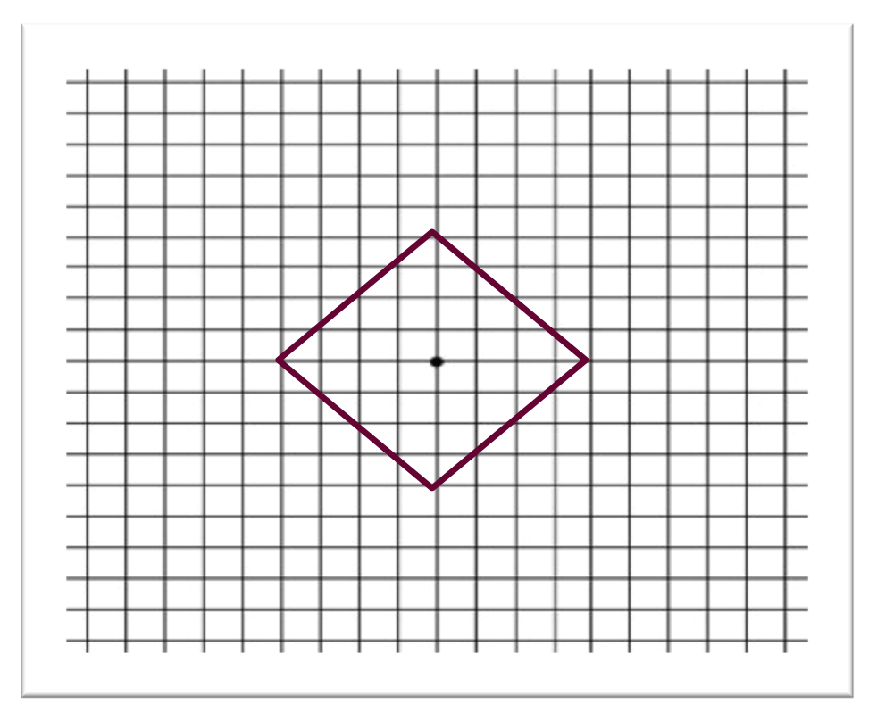

% Análisis de Redes Sociales
% Guillermo Jiménez Díaz (gjimenez@ucm.es); Alberto Díaz (albertodiaz@fdi.ucm.es)
% 28 de noviembre de 2014

# Tema 7: Mundos Pequeños {-}

## Mundos pequeños

### Mundos pequeños

> La propiedad de **los pequeños mundos** o _small worlds_: la distancia entre dos nodos cualquiera de la red es sorprendentemente corta.

### Mundos pequeños

> **Observado en las prácticas con vuestras propias redes sociales**: en general, las redes sociales reales tienen un coeficiente de agrupamiento mucho mayor que las redes aleatorias (y que las libres de escala) a pesar de que la distancia media sigue siendo especialmente corta. 

> Tendemos a agruparnos (los amigos de mis amigos son también mis amigos). 

### Mundos pequeños

## Estructura y aleatoriedad

### Experimento de Milgram

Recordemos

* Stanley Milgram (1967) propuso un experimento para demostrarlo
* Experimento: hacer llegar una carta a un par de personas de Boston y Sharon, a base de que una persona cualquiera (desde cualquier punto de Estado Unidos) fuese enviando la carta a aquellos familiares, amigos o conocidos que más se "acercaran" a la persona objetivo.

### Experimento de Milgram

* Resultado final: 64 cartas con un máximo de 12 intermediarios.
* La mediana de intermediarios fueron entre 5,5 y 6

> ¿Es 6 un resultado sorprendente? 
> ¿En los 60? ¿Hoy en día? ¿Por qué?

### Red estructurada exponencial

### Red estructurada exponencial

* Suponer que tenemos una red en el que el número de conocidos de cada individuo es constante
* Según Pool y Kochen este número puede variar entre 500 y 1500. Si seleccionamos 500:
    - Un individuo tiene 500 vecinos potenciales de primer grado
    - $500^2$ = 250.000 vecinos potenciales para el segundo grado
    - $500^3$ = 125.000.000 vecinos potenciales para el tercer grado

### Red estructurada exponencial

* Existe un **crecimiento exponencial** de la red
* El número de vecinos que tendríamos a distancia $d$ 

$$N(d) =1+\langle k \rangle+\langle k \rangle^2+\dots=\frac{\langle k \rangle^{d+1}-1}{\langle k \rangle-1} \sim \langle k \rangle^d$$

> Alcanzaríamos a toda la población mundial con menos de 4 pasos.

### Red estructurada exponencial

* Distancia media $\langle k \rangle$ es la predicha por una red aleatoria

$$d_{max} \propto \frac{log N}{log \langle k \rangle}$$

### Red localmente conexa

* En las redes reales abundan los triángulos o **tripletes conectados** (_tradic closure_)
* algunos de los enlaces no conectan con nuevas personas sino que conectan con amigos de mis amigos
* Reducen el número de personas a las que se puede alcanzar en cada paso,  alargando los caminos mínimos.

### Red localmente conexa

### Red localmente conexa extrema

* El caso extremo sería una red completamente _cliquish_
* Todos los subgrafos completamente conectados
* Todos los amigos de mis amigos serían mis amigos y la distancia con ellos sería 1
* Como no se permite ningún enlace fuera del clique la distancia con cualquier otro individuo de la red sería infinito.

### Red localmente conexa 

### Red localmente conexa 

* Cuadrícula bidimensional: coeficiente de agrupamiento alto 
* El número de nodos a distancia $d$ es polinomial:

$$N(d) = \sum_{x=1}^{d}4x = 2d(d+1)\sim d^2$$

* Distancias entre nodos sería, en general, muy grande.

### Pregunta

> ¿Puede una red con una estructura local muy fuerte ser a la vez un mundo pequeño?

- **La respuesta es claramente sí**: es la forma en la que se comportan las redes sociales.
- Las redes reales están en un punto intermedio entre una red aleatoria y una red localmente estructurada. 

## Modelo de Watts-Strogatz

### Modelo de Watts-Strogatz

- Duncan Watts y Steve Strogatz (1998) proponen un modelo basado en dos ideas básicas de las redes sociales:
- La **homofilia** o tendencia a conectarnos con otros que son como nosotros. 
    - Si dos personas en una red social tienen una persona en común, es muy probable que estas dos personas se conviertan en comunes o amigos (cerramos el triángulo).
- Los **lazos débiles** o _weak ties_
    - Los enlaces a conocidos que nos conectan con partes de la red que, de otra forma, estarían muy lejos para nosotros.

### Modelo de Watts-Strogatz

> 1. Construimos una red en forma de retículo en anillo con $N$ nodos, cada uno con $\langle k \rangle$ vecinos y con $L=N \cdot \langle k \rangle /2$ enlaces.
> 2. Reasignamos cada uno de los enlaces con probabilidad $p$ de modo que no se pueden crear auntoenlaces ni enlaces múltiples.

<http://www.ladamic.com/netlearn/NetLogo4/SmallWorldWS.html>.

### Modelo de Watts-Strogatz

* Paso 2: Siguiendo el sentido horario, reasignar los $\langle k \rangle /2$ enlaces que hay a la derecha de cada nodo para los $N$ nodos.

### Modelo de Watts-Strogatz

* **Variación**: añadir enlaces aleatorios con probabilidad p, manteniendo el retículo inicial
* Los resultados que describiremos a continuación son similares para ambas variantes.

### Modelo de Watts-Strogatz

> $p$ afecta a la estructura de la red

- Redes localmente estructuradas **(p=0)**: Un mundo fuertemente agrupado y con distancias largas.
$$ \langle d \rangle =\frac{N}{2 \langle k \rangle}\text{;  } \langle C \rangle = \frac{3}{4}$$

- Redes completamente aleatorias **(p=1)**. Mundo pequeño (distancias cortas) y con débil agrupamiento.

$$ \langle d \rangle =\frac{lnN}{ln \langle k \rangle}\text{;  } \langle C \rangle = \frac{\langle k \rangle}{N}$$

> ¿Qué pasa en medio?

### Estudio del modelo

### Estudio del modelo

* Reducción muy rápida de la distancia media debida a la aparición de esos enlaces aleatorios, que hacen de atajos dentro de la red.
* El coeficiente de agrupamiento se reduce mucho más suavemente a medida que aparecen estos enlaces aleatorios.

### Estudio del modelo

> **Conclusión**: solo unos pocos enlaces aleatorios bastan para reducir la distancia media, conservando la estructura local prácticamente intacta.

* p=0.01 es suficiente para reducir drásticamente la distancia media
* El coeficiente de agrupamiento comienza a decrecer en torno a p=0.1

### Debilidades del modelo

- No presenta una distribución realista de los grados ya que, como las redes aleatorias, no tiene en cuenta la existencia de hubs.
- Los enlaces largos (los atajos) son menos frecuentes que los cortos. En el mundo real esto no tiene por qué ser así. Podemos pensar, por ejemplo, en las redes aeroportuarias.
- No se tiene en cuenta otras propiedades de las redes reales como las estructuras jerárquicas o los grupos.

### Modelos alternativos

* Probabilidad por la que se unen dos nodos dependen de la distancia entre dichos nodos
* Probabilidad dependiente de la estructura organizativa
* Enlaces como resultado de la optimización de características de la red (como la distancia media frente a la distancia física entre los nodos)
* Estos modelos generan redes que siguen cumpliendo la propiedad de los pequeños mundos y de la estructura local y, en algunos casos, generan redes más parecidas a las reales ya que presentan hubs.

### Modelos alternativos

- Kleinberg, J. (2000, May). [The small-world phenomenon: An algorithmic perspective](http://www.google.es/url?sa=t&rct=j&q=&esrc=s&source=web&cd=1&cad=rja&uact=8&ved=0CDYQFjAA&url=http%3A%2F%2Fwww.cs.cornell.edu%2Fhome%2Fkleinber%2Fswn.pdf&ei=K0h3VMjlC8rZas2egegC&usg=AFQjCNFUVXfxJsFEFh-rpDV9cklRbm6UiA&sig2=2J5Tjfps_piM9y5OOFdSeA&bvm=bv.80642063,d.d2s). In Proceedings of the thirty-second annual ACM symposium on Theory of computing (pp. 163-170). ACM.
- Kleinberg, J. (2002). [Small-world phenomena and the dynamics of information](https://www.google.es/url?sa=t&rct=j&q=&esrc=s&source=web&cd=1&cad=rja&uact=8&ved=0CCgQFjAA&url=https%3A%2F%2Fwww.cs.cornell.edu%2Fhome%2Fkleinber%2Fnips14.pdf&ei=VUh3VPXqCsrZas2egegC&usg=AFQjCNFmiN7cLoDO7gS3OIKGlCZ-wTbpPg&sig2=t4rmeLjx3yB2LclF0PVN-g&bvm=bv.80642063,d.d2s). Advances in neural information processing systems, 1, 431-438.
- Watts, D. J., Dodds, P. S., & Newman, M. E. (2002). Identity and search in social networks. science, 296(5571), 1302-1305.
- Mathias, N., & Gopal, V. (2001). [Small worlds: How and why](http://journals.aps.org/pre/abstract/10.1103/PhysRevE.63.021117). Physical Review E, 63(2), 021117.
- Gastner, M. T., & Newman, M. E. (2006). [The spatial structure of networks](http://www.google.es/url?sa=t&rct=j&q=&esrc=s&source=web&cd=1&cad=rja&uact=8&ved=0CCgQFjAA&url=http%3A%2F%2Fwww.stat.berkeley.edu%2F~aldous%2F206-SNET%2FPapers%2Fgaster_newman_2004.pdf&ei=i0l3VPv5Fc_TaMr7gogB&usg=AFQjCNHAD90sancHiM4m8sitHIS0anA0bg&sig2=7cDXRbyaL2UqHStnlymtXw&bvm=bv.80642063,d.d2s). The European Physical Journal B-Condensed Matter and Complex Systems, 49(2), 247-252.