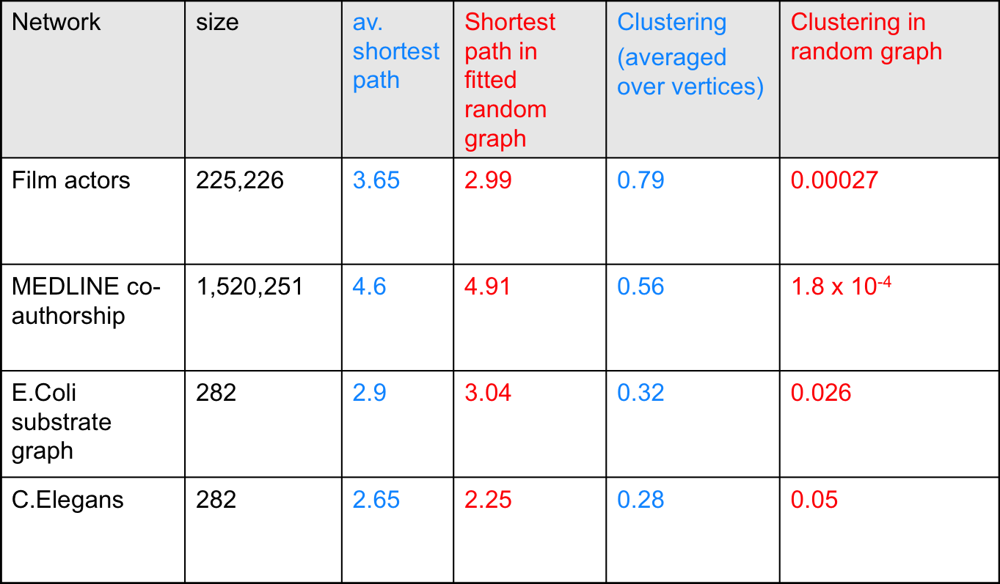
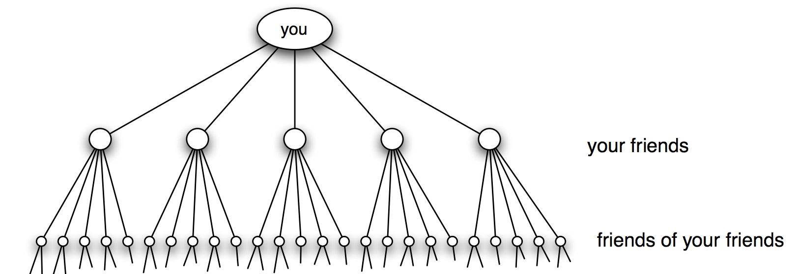
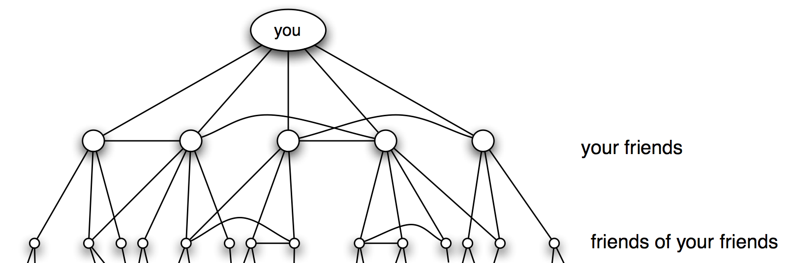

% Análisis de Redes Sociales
% Guillermo Jiménez Díaz (gjimenez@ucm.es); Alberto Díaz (albertodiaz@fdi.ucm.es)

# Tema 8: Mundos Pequeños {-}

## Mundos pequeños

### Mundos pequeños

> La propiedad de **los pequeños mundos** o _small worlds_: la distancia entre dos nodos cualquiera de la red es sorprendentemente corta.

### Mundos pequeños

> En general, las redes sociales reales tienen un **coeficiente de agrupamiento mucho mayor que las redes aleatorias** (y que las libres de escala) a pesar de que la distancia media sigue siendo especialmente corta. 

> Tendemos a agruparnos (los amigos de mis amigos son también mis amigos). 

### Mundos pequeños

## Los 6 grados de separación

### Los 6 grados de separación

> Los mundos pequeños se sugirió por primera vez en una historia de un escritor y periodista húngaro, Frigyes Karinthy, en 1929, en el que explicaba cómo era capaz de unir a un premio Nobel con él mismo contando los "apretones de manos" (_handshakes_) entre personas

### Los 6 grados de separación

> Look, Selma Lagerlöf just won the Nobel Prize for Literature, thus she is bound to know King Gustav of Sweden. After all he is the one who handed her the Prize, as required by tradition. King Gustav, to be sure, is a passionate tennis player, who always participates in international tournaments. He is known to have played Mr. Kehrling, whom he must therefore know for sure, and as it happens I myself know Mr. Kehrling quite well.

### Los 6 grados de separación

> The worker knows the manager in the shop, who knows Ford; Ford is on friendly terms with the general director of Hearst Publications, who last year became good friends with Arpad Pasztor, someone I not only know, but to the best of my knowledge a good friend of mine. So I could easily ask him to send a telegram via the general director telling Ford that he should talk to the manager and have the worker in the shop quickly hammer together a car for me, as I happen to need one.

### Los 6 grados de separación

> __Los 6 grados de separación__: si eligiésemos al azar dos personas del planeta, por muy lejos que estuviesen, estarían a 6 "conocidos" de distancia entre sí
 
* Estudio realizado por Stanley Milgram (1967).
* Hacer llegar una carta a un par de personas de Boston y Sharon (Massachusetts)
* Una persona cualquiera (desde cualquier punto de Estado Unidos) va enviando la carta a aquellos familiares, amigos o conocidos que más se "acercaran" a la persona objetivo. 

### Experimento de Milgram

> HOW TO TAKE PART IN THIS STUDY
> 
> 1. ADD YOUR NAME TO THE ROSTER AT THE BOTTOM OF THIS SHEET, so that the next person who receives this letter will know who it came from.
> 2. DETACH ONE POSTCARD. FILL IT AND RETURN IT TO HARVARD UNIVERSITY. No stamp is needed. The postcard is very important. It allows us to keep track of the progress of the folder as it moves toward the target person.
> 3. IF YOU KNOW THE TARGET PERSON ON A PERSONAL BASIS, MAIL THIS FOLDER DIRECTLY TO HIM (HER). Do this only if you have previously met the target person and know each other on a first name basis. 
> 4. IF YOU DO NOT KNOW THE TARGET PERSON ON A PERSONAL BASIS, DO NOT TRY TO CONTACT HIM DIRECTLY. INSTEAD, MAIL THIS FOLDER (POST CARDS AND ALL) TO A PERSONAL ACQUAINTANCE WHO IS MORE LIKELY THAN YOU TO KNOW THE TARGET PERSON. You may send the folder to a friend, relative or acquaintance, but it must be someone you know on a first name basis.

### Experimento de Milgram

* Se enviaron 296 cartas
* La primera llegó en pocos días, pasando sólo por 2 enlaces
* 64 cartas con un máximo de 12 intermediarios
* La mediana de intermediarios fueron entre 5,5 y 6

### Experimento de Milgram

## Estructura y aleatoriedad

### Experimento de Milgram

> ¿Es 6 un resultado sorprendente? 
> ¿En los 60? ¿Hoy en día? ¿Por qué?

### Red estructurada exponencial

### Red estructurada exponencial

* Suponer que tenemos una red en el que el número de conocidos de cada individuo es constante
* Según Pool y Kochen este número puede variar entre 500 y 1500. Si seleccionamos 500, un individuo tiene:
    - $500$ vecinos potenciales de primer grado
    - $500^2 = 250.000$ vecinos potenciales para el segundo grado
    - $500^3 = 125.000.000$ vecinos potenciales para el tercer grado

### Red estructurada exponencial

* Existe un **crecimiento exponencial** de la red
* El número de vecinos que tendríamos a distancia $d$ 

$$N(d) =1+\langle k \rangle+\langle k \rangle^2+\dots=\frac{\langle k \rangle^{d+1}-1}{\langle k \rangle-1} \sim \langle k \rangle^d$$

> Alcanzaríamos a toda la población mundial con menos de 4 pasos.

### Red estructurada exponencial

* Distancia media $\langle k \rangle$ es la predicha por una red aleatoria

$$d_{max} \propto \frac{log N}{log \langle k \rangle}$$

### Red localmente conexa

### Red localmente conexa

* En las redes reales abundan los triángulos o **tripletes conectados** (_tradic closure_)
* Algunos de los enlaces no conectan con nuevas personas sino que conectan con amigos de mis amigos
* Reducen el número de personas a las que se puede alcanzar en cada paso,  alargando los caminos mínimos.

### Red localmente conexa extrema

* El caso extremo sería una red completamente _cliquish_ o _localmente estructurada_
    * Todos los subgrafos completamente conectados
    * Todos los amigos de mis amigos serían mis amigos y la distancia con ellos sería 1
* Como no se permite ningún enlace fuera del clique la distancia con cualquier otro individuo de la red sería infinito.

### Red localmente conexa 

### Red localmente conexa 

* Cuadrícula bidimensional: coeficiente de agrupamiento alto 
* El número de nodos a distancia $d$ es polinomial:

$$N(d) = \sum_{x=1}^{d}8x = 4d(d+1)\sim d^2$$

* Distancias entre nodos sería, en general, muy grande.

### Pregunta

> ¿Puede una red con una estructura local muy fuerte ser a la vez un mundo pequeño?

- **La respuesta es claramente sí**: es la forma en la que se comportan las redes sociales.
- Las redes reales están en un punto intermedio entre una red aleatoria y una red localmente estructurada. 

## Modelo de Watts-Strogatz

### Modelo de Watts-Strogatz

- Duncan Watts y Steve Strogatz (1998) proponen un modelo basado en dos ideas básicas de las redes sociales:
- La homofilia
- Los enlaces débiles

### Modelo de Watts-Strogatz

- La **homofilia**, _strong ties_ o tendencia a conectarnos con otros que son como nosotros. 
    - Si dos personas en una red social tienen una persona en común, es muy probable que estas dos personas se conviertan en comunes o amigos (cerramos el triángulo).

### Modelo de Watts-Strogatz

- Los **lazos débiles** o _weak ties_
    - Los enlaces a conocidos que nos conectan con partes de la red que, de otra forma, estarían muy lejos para nosotros.

### Modelo de Watts-Strogatz

> 1. Construimos una red en forma de retículo en anillo con $N$ nodos, cada uno con $\langle k \rangle$ vecinos y con $L=N \cdot \langle k \rangle /2$ enlaces.
> 2. Reasignamos cada uno de los enlaces con probabilidad $p$ de modo que no se pueden crear autoenlaces ni enlaces múltiples.

### Modelo de Watts-Strogatz

* **Paso 2**: Siguiendo el sentido horario, reasignar los $\langle k \rangle /2$ enlaces que hay a la derecha de cada nodo para los $N$ nodos.

### Modelo de Watts-Strogatz

* **Variación Paso 2**: añadir enlaces aleatorios con probabilidad p, manteniendo el retículo inicial
* Los resultados que describiremos a continuación son similares para ambas variantes.

### Modelo de Watts-Strogatz

> $p$ afecta a la estructura de la red

- Redes localmente estructuradas **(p=0)**: Un mundo fuertemente agrupado y con distancias largas.
$$ \langle d \rangle =\frac{N}{2 \langle k \rangle}\text{;  } \langle C \rangle = \frac{3}{4}$$

- Redes completamente aleatorias **(p=1)**. Mundo pequeño (distancias cortas) y con débil agrupamiento.

$$ \langle d \rangle =\frac{lnN}{ln \langle k \rangle}\text{;  } \langle C \rangle = \frac{\langle k \rangle}{N}$$

> ¿Qué pasa en medio?

### Estudio del modelo

### Estudio del modelo

* Reducción muy rápida de la distancia media debida a la aparición de esos enlaces aleatorios, que hacen de atajos dentro de la red.
* El coeficiente de agrupamiento se reduce mucho más suavemente a medida que aparecen estos enlaces aleatorios.

### Estudio del modelo

> **Conclusión**: solo unos pocos enlaces aleatorios bastan para reducir la distancia media, conservando la estructura local prácticamente intacta.

* p=0.01 es suficiente para reducir drásticamente la distancia media
* El coeficiente de agrupamiento comienza a decrecer en torno a p=0.1

### Debilidades del modelo

- No presenta una distribución realista de los grados ya que, como las redes aleatorias, no tiene en cuenta la existencia de hubs.
- Los enlaces largos (los atajos) son menos frecuentes que los cortos. En el mundo real esto no tiene por qué ser así. Podemos pensar, por ejemplo, en las redes aeroportuarias.
- No se tiene en cuenta otras propiedades de las redes reales como las estructuras jerárquicas o los grupos.

### Modelos alternativos

* Probabilidad por la que se unen dos nodos dependen de la distancia entre dichos nodos
* Probabilidad dependiente de la estructura organizativa
* Enlaces como resultado de la optimización de características de la red (como la distancia media frente a la distancia física entre los nodos)
* Estos modelos generan redes que siguen cumpliendo la propiedad de los pequeños mundos y de la estructura local y, en algunos casos, generan redes más parecidas a las reales ya que presentan hubs.

### Modelos alternativos

- Kleinberg, J. (2000, May). [The small-world phenomenon: An algorithmic perspective](http://www.google.es/url?sa=t&rct=j&q=&esrc=s&source=web&cd=1&cad=rja&uact=8&ved=0CDYQFjAA&url=http%3A%2F%2Fwww.cs.cornell.edu%2Fhome%2Fkleinber%2Fswn.pdf&ei=K0h3VMjlC8rZas2egegC&usg=AFQjCNFUVXfxJsFEFh-rpDV9cklRbm6UiA&sig2=2J5Tjfps_piM9y5OOFdSeA&bvm=bv.80642063,d.d2s). In Proceedings of the thirty-second annual ACM symposium on Theory of computing (pp. 163-170). ACM.
- Kleinberg, J. (2002). [Small-world phenomena and the dynamics of information](https://www.google.es/url?sa=t&rct=j&q=&esrc=s&source=web&cd=1&cad=rja&uact=8&ved=0CCgQFjAA&url=https%3A%2F%2Fwww.cs.cornell.edu%2Fhome%2Fkleinber%2Fnips14.pdf&ei=VUh3VPXqCsrZas2egegC&usg=AFQjCNFmiN7cLoDO7gS3OIKGlCZ-wTbpPg&sig2=t4rmeLjx3yB2LclF0PVN-g&bvm=bv.80642063,d.d2s). Advances in neural information processing systems, 1, 431-438.
- Watts, D. J., Dodds, P. S., & Newman, M. E. (2002). Identity and search in social networks. science, 296(5571), 1302-1305.
- Mathias, N., & Gopal, V. (2001). [Small worlds: How and why](http://journals.aps.org/pre/abstract/10.1103/PhysRevE.63.021117). Physical Review E, 63(2), 021117.
- Gastner, M. T., & Newman, M. E. (2006). [The spatial structure of networks](http://www.google.es/url?sa=t&rct=j&q=&esrc=s&source=web&cd=1&cad=rja&uact=8&ved=0CCgQFjAA&url=http%3A%2F%2Fwww.stat.berkeley.edu%2F~aldous%2F206-SNET%2FPapers%2Fgaster_newman_2004.pdf&ei=i0l3VPv5Fc_TaMr7gogB&usg=AFQjCNHAD90sancHiM4m8sitHIS0anA0bg&sig2=7cDXRbyaL2UqHStnlymtXw&bvm=bv.80642063,d.d2s). The European Physical Journal B-Condensed Matter and Complex Systems, 49(2), 247-252.