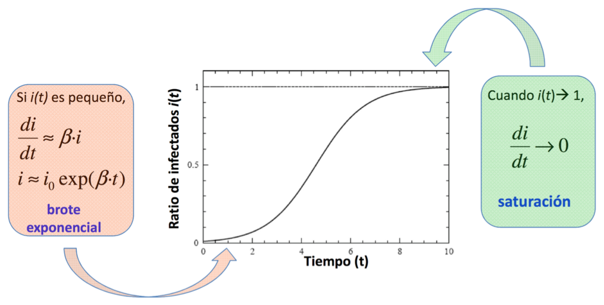
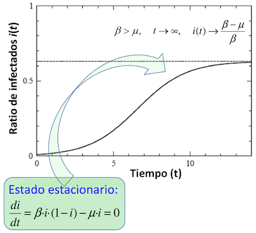
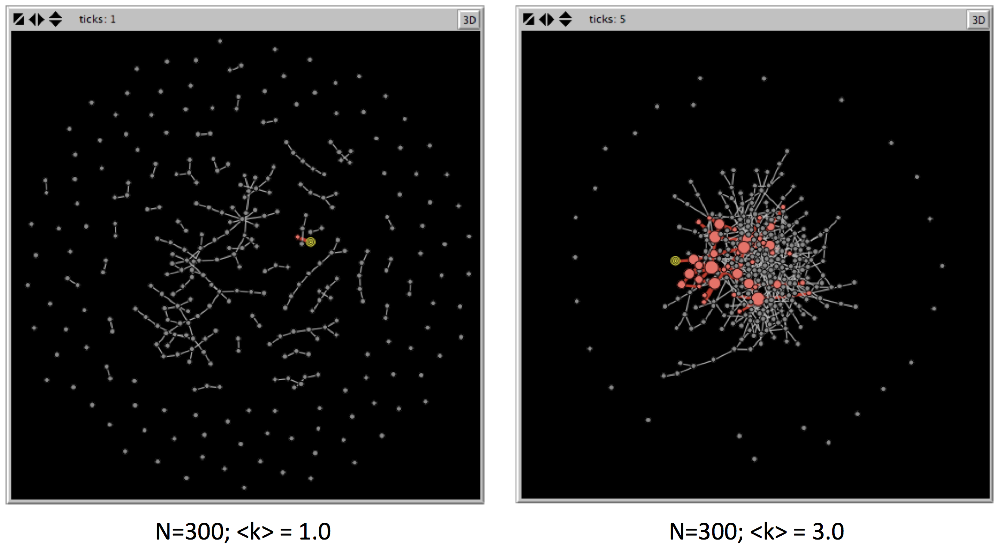
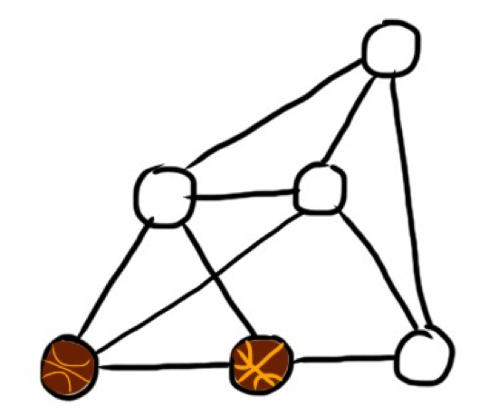
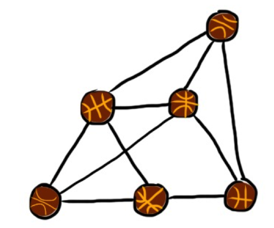
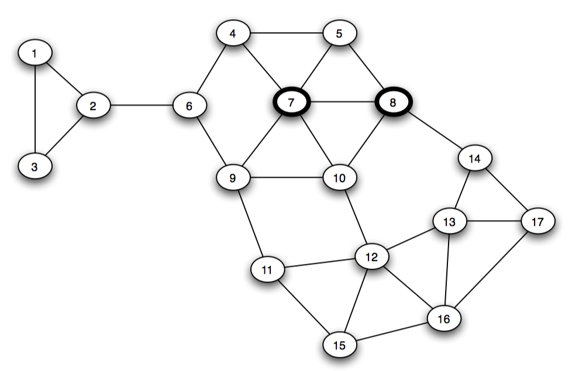
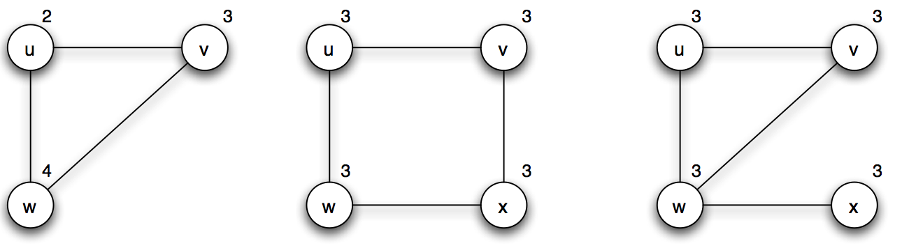

% Análisis de Redes Sociales
% Guillermo Jiménez Díaz (gjimenez@ucm.es); Alberto Díaz (albertodiaz@fdi.ucm.es)
% 5 de diciembre de 2014

# Tema 8: Propagación y Difusión en Redes {-}

### Propagación y Difusión

Modelar la propagación de elementos:

* Enfermedades
* Vídeos virales
* Rumores
* Virus informáticos
* Compra de productos
* Anuncios
* Información e innovación...

### Propagación y Difusión

> Modelos similares independientemente de lo que queramos propagar

* Basados en modelos de propagación clásicos de epidemias (1927)
* Aplicados a redes (2001)
* Estructura de la red influye en la propagación

### Propagación y Difusión

* Modelos de contagio simple
* Modelos de contagio aplicados a redes
* Modelos de contagio complejos
* Difusión de opiniones e innovación
* Aplicaciones

## Modelos de contagio simple

Lorem ipsum dolor sit amet, consectetur adipisicing elit. Voluptates asperiores nihil atque impedit, iusto quis neque eius aut quod. Eveniet asperiores blanditiis ex fugit deserunt, aliquam odio sequi laboriosam qui!

### Modelos de contagio simple

> La __epidemiología__ es la ciencia que estudia la salud y control de enfermedades en una población, así como la predicción de expansión de dichas enfermedades.

El modelo general se basa en dos hipótesis: 

- **Modelo compartimental**
- **Mezcla homogénea**

### Modelo compartimental

> Cada individuo puede estar en un determinado estado dependiendo de en qué fase se la enfermedad se encuentra.
 
- **Susceptible (S)**: El individuo está sano y puede ser infectado.
- **Infectado (I)**: El individuo está infectado y puede contagiar a otros individuos.
- **Recuperado (R)**: El individuo estuvo contagiado pero se ha recuperado y no puede volver a ser contagiado. También se utiliza para modelar los individuos que no han superado la enfermedad y que han muerto a causa de ella.

### Mezcla homogénea

> Cualquier individuo tiene la misma probabilidad de estar en contacto con un individuo infectado.

* Elimina la necesidad de conocer los contactos (la red) de individuos
* Se asume que cualquiera puede infectar a cualquiera.

### Modelos de contagio simple

> Los modelos observan los cambios de estado de los individuos a lo largo del tiempo para predecir el alcance y la velocidad de propagación de la enfermedad.

Estudiaremos la dinámica de los modelos de propagación  clásicos, que combinan las letras del modelo compartimental:

- Modelo SI
- Modelo SIS
- Modelo SIR

## Modelo SI

### Modelo SI

* Virus del VIH
* Zombies

### Modelo SI

* Cada individuo tiene $\langle k \rangle$ contactos 
* Tasa de contagio $\delta$: Probabilidad de que un individuo infectado transmita la enfermedad a uno susceptible.
* $N$ es el tamaño de la población: $N = S(t) + I(t)$
* $S(t)$: número de individuos que están en el estado susceptible en $t$
* $I(t)$: número de individuos que están en el estado infectado en $t$
* $s(t) = s = \frac{S(t)}{N}$: Proporción de susceptibles
* $i(t) = i = \frac{I(t)}{N}$: Proporción de infectados.
* $s+i=1$
* $\beta = \delta \cdot \langle k \rangle$: Tasa de transmisión

### Modelo SI

Tasa a la que varía el número de infectados

$$\frac{di}{dt} = i \cdot \beta  \cdot s = i \cdot \beta \cdot (1-i)$$

Resolviendo la ecuación:

$$i = \frac{i_0exp(\beta t)}{1-i_0+i_0exp(\beta t)}$$

### Modelo SI

### Conclusiones del modelo SI

> Inicialmente el número de infectados crece exponencialmente

> A medida que el número de infectados se hace mayor, hay menos individuos susceptibles por lo que el crecimiento de infectados se ralentiza

> La infección termina cuando todos están infectados
>  $i(t \to \infty)= 1$

## Modelo SIS

### Modelo SIS

* Resfriado común

### Modelo SIS

* Parámetros anteriores
* Tasa de recuperación $\mu$: Proporción de infectados que se recuperan y pasan al estado susceptible en cada instante de tiempo.

### Modelo SIS

Tasa a la que varía el número de infectados:

$$\frac{di}{dt} =  i \cdot \beta  \cdot s - \mu \cdot i=  i \cdot \beta \cdot (1-i) - \mu \cdot i$$

La resolución de esta ecuación:

$$i = \Big(1- \frac{\mu}{\beta}\Big) \frac{C \cdot e^{(\beta - \mu)t}}{1 + C \cdot e ^{(\beta -\mu)t}}$$

$$C= \frac{\beta \cdot i_0}{\beta - \mu - \beta \cdot i_0}$$

### Modelo SIS

### Conclusiones del Modelo SIS

- Como la recuperación es posible, el sistema alcanza un __estado endémico__ en el que la tasa de infectados es constante:

$$i(\infty) = 1 - \frac{\beta}{\mu}$$

- Sólo se produce cuando la tasa de recuperación es inferior a la tasa de transmisión ($\mu < \beta$)

- Si $\mu > \beta$ entonces, llegado a un determinado punto, la proporción de infectados comienza a decrecer exponencialmente, alcanzado un estado libre de enfermedad en la que todos los individuos se han recuperado y no hay infectados.

### Ritmo reproductivo básico

> El ritmo reproductivo básico ($R_0$) representa el número promedio de individuos susceptibles que serán infectados por un individuo infectado

$$R_0 = \frac{\beta}{\mu}$$

* Si $R_0<1$ entonces la enfermedad termina desapareciendo de la población
* Si $R_0>0$ entonces la enfermedad se propagará

### Ritmo reproductivo básico

* Cuanto mayor sea $R_0$, más rápido es el proceso de propagación de la enfermedad

> Sarampión: $R_0= 12-18$
> 
> Gripe: $R_0 = 2-3$

## Modelo SIR

### Modelo SIR

### Modelo SIR

* $\mu$ representa la tasa de recuperación: es la tasa de individuos infectados que pasan al estado __recuperado__.
* $N = S(t) + I(t) + R(t)$
* $i = 1-s-r$.
* Condiciones iniciales habituales

$$i_0 = \frac{c}{N}\text{;  }s_0 = 1- \frac{c}{N}\text{;  }r_0 = 0$$

### Modelo SIR

$$\frac{di}{dt} = i \cdot \beta \cdot s - \mu \cdot i$$
$$\frac{ds}{dt} = -i \cdot \beta \cdot s$$
$$\frac{dr}{dt} = \mu \cdot i$$

### Modelo SIR

### Conclusiones del Modelo SIR

- $\beta>\mu$: la proporción de infectados crece hasta un pico máximo y luego decrece hasta valer 0.
- $s$ decrece de forma monótona pero no llega nunca a 0
- Los individuos que se mantienen susceptibles hasta fases avanzadas pueden no llegar a infectarse nunca.

### Conclusiones del Modelo SIR

- $r$ crece de manera monótona.
- Nunca llega a valer 1
- Su valor asintótico __representa el número de individuos afectados__

$$r = 1- s_0 \cdot e^{-\beta \frac{r}{\mu}}$$

## Comportamientos importantes de los modelos epidemiológicos

### Comportamientos importantes

* __Comportamiento temprano__: patrón de comportamiento en las fases iniciales
    * Es importante para saber cuánto tiempo tenemos para el desarrollo de vacunas e intervenciones médica 
* __Comportamiento tardío__: patrón de comportamiento en las fases más avanzadas de la epidemia (cuando $t \to \infty$)
    * Permite predecir el alcance, número de infectados, etc.

### Comportamiento temprano

> En todos los modelos el número de infectados en la fase temprana es bajo pero crece exponencialmente.

> El modelo SI es el más relevante para describir este comportamiento

### Comportamiento tardío 

> Cada modelo realiza una predicción distinta

- En el modelo SI todos terminan infectados
- En el modelo SIS ($R_0>1$) se alcanza un estado endémico en el que una proporción de la población queda infectada
- En el modelo SIS ($R_0<1$) la enfermedad desaparece
- En el modelo SIR todos terminan recuperados (en el estado susceptible o recuperado, pero no infectados)

### Comportamientos de los modelos

### Modelos de contagio simple

> Estos modelos no tienen en cuenta la red de contactos ya que suponen que hay una mezcla homogénea

> Realmente, las epidemias se propagan a través de los contactos de las personas, es decir, a través de los enlaces de su red social

> La estructura de la red modificará el comportamiento de estos modelos simples

## Modelos de contagio basados en redes

### Modelos de contagio basados en redes

* Similares a los modelos de contagio simples
* Solo se tendrán en cuenta los contactos definidos por la red
* $\beta$ es el __ratio de transmisión__ y representa la probabilidad de contagio de un nodo infectado a un __vecino__ susceptible

### Simulación de modelos de contagio basados en redes

> 1. Definimos una red de $N$ nodos y $L$ enlaces. Inicialmente todos los nodos están en el estado S.
> 2. En $t_0$ ponemos una pequeña fracción $i_0$ de nodos (o solo 1), en el estado I.
> 3. En cada paso de tiempo, hacemos que cada uno de los nodos en el estado I propague la infección a cada uno de sus vecinos en estado S con probabilidad $\beta$
> 4. En caso de utilizar un modelo SIR o SIS, haremos que los nodos en estado I puedan pasar al estado R (o S, dependiendo del modelo), con una probabilidad $\mu$.

### Simulación de modelos de contagio basados en redes

* Alternativas más complejas (y más realistas), basadas en técnicas de modelado social o **modelado basado en agentes**
* Cada individuo (nodo) se modela como un agente que puede incluir sus propias características individuales
* Cada agente puede generar comportamientos emergentes
* Se pueden incluir __procesos estocásticos__: simular eventos aleatorios

### Simulación de modelos de contagio basados en redes

### Estructura de la red y procesos dinámicos

> La topología de la red va a influir en el proceso de contagio

* ¿A qué estado convergen los nodos?
* ¿Cuánto se tarda en llegar a dicho estado?
* ¿Cómo se puede inmunizar un sistema complejo con una topología de red concreta?

## Redes aleatorias

### Redes aleatorias

[Difusión en una red aleatoria](http://www.ladamic.com/netlearn/NetLogo501/ERDiffusion.html)

### Redes aleatorias

> **Conclusión**: la densidad de la red afecta a la velocidad de infección y al número de individuos infectados
> 
> A mayor densidad, mayor es el número de individuos infectados y mayor es la velocidad de propagación.

> **Conclusión**: si partimos de un único nodo, sólo se infectarán los nodos que pertenecen a la misma componente conexa. 
> 
> La epidemia se extiende en mayor o menor medida dependiendo de la localización del nodo inicial
> 
> La probabilidad de que un nodo pertenezca a la componente gigante es $\frac{N_G}{N}$.

## Redes libres de escala

### Redes libres de escala

[Difusión en una red libre de escala](http://www.ladamic.com/netlearn/NetLogo501/BADiffusion.html).

### Redes libres de escala

> **Conclusión**: el enlace preferencial favorece el contagio
> 
> Los hubs son los responsables de ayudar a difundir más rápidamente la infección 

## Redes de Watts-Strogatz

### Redes de Watts-Strogatz

[Difusión en un mundo pequeño](http://www.ladamic.com/netlearn/NetLogo4/SmallWorldDiffusionSIS.html)

### Redes de Watts-Strogatz

> **Conclusión**: los enlaces débiles (de largo alcance) provocan que aumente la velocidad de la infección 
> 
> En el mismo tiempo se aprecia un mayor número de nodos infectados cuanto mayor es la probabilidad de reenlaces

## Soluciones analíticas

### Soluciones analíticas

* __Aproximación por bloques de grados__: distintos bloques de nodos basados en el grado que tienen
* Asumimos que todos los nodos en el mismo bloque son estadísticamente equivalentes
$$i_k  = \frac{I_k}{N_k}$$
* La suma de los diferentes $i_k$ para todos los grados dan la fracción total de nodos infectados $i$

### Soluciones analíticas

## Modelo SI en redes

### Modelo SI en redes

* Tasa de infectados para cada grado $k$ por separado:

$$\frac{di_k}{dt} = \beta (1-i_k(t))k \Theta_k(t)$$

- $\Theta_k(t)$ es una función de densidad que representa la fracción de vecinos que están infectados para un nodo de grado $k$
- Necesitaremos definir $k_{max}$ ecuaciones

### Modelo SI en redes

Función de densidad

$$\Theta_k(t) \approx \Theta(t) = \frac{\sum_{k'}(k'-1)\cdot P(k') \cdot i_{k'}(t)}{\langle k \rangle}$$

Aproximación durante el comportamiento temprano

$$\frac{di_k}{dt} = \beta k i_0 \frac{\langle k \rangle-1}{\langle k \rangle} e^{t/\tau}$$

$$i_k = i_0 (1+ \frac{k \langle k \rangle -1}{\langle k^2 \rangle - \langle k \rangle}(e^{t/\tau}-1))$$

### Modelo SI en redes

Aproximación durante el comportamiento temprano

$$i = i_0 (1+ \frac{\langle k \rangle^2 - \langle k \rangle}{\langle k^2 \rangle - \langle k \rangle}(e^{t/\tau}-1))$$

* $\tau$ representa el **periodo de incubación**: cantidad de tiempo que requiere la epidemia para crecer
* Menor $\tau \to$ más rápido se propaga la enfermedad

$$\tau = \frac{\langle k \rangle}{\beta(\langle k^2 \rangle - \langle k \rangle)}$$

### Modelo SI en redes

- Cuanto mayor sea el grado de un nodo mayor es la probabilidad de que ese nodo sea infectado
- El periodo de incubación **depende de los momentos de primer y segundo orden** de la distribución de grados ($\langle k \rangle$ y $\langle k^2 \rangle$), respectivamente

### Modelo SI en redes

> **Conclusión:** En una **red aleatoria** el periodo de incubación depende de la densidad de la red
> 
> La epidemia se propaga más rápido cuanto más densa sea ésta (mayor $\langle k \rangle$).

$$\tau_{ER} = \frac{1}{\beta(\langle k \rangle)} \text{ ya que } \langle k^2 \rangle = \langle k \rangle (\langle k \rangle - 1)$$

### Modelo SI en redes

> **Conclusión:** En una red **libre de escala** los momentos dependen de $\gamma$

> $\gamma \geq 3$: ambos momentos son finitos y el contagio se comporta de manera similar a la red aleatoria

### Modelo SI en redes

> $\gamma < 3$: $\langle k^2 \rangle$ diverge y $\tau \to 0$
> 
> **El periodo de incubación característico desaparece** y la epidemia es instantánea

> Los hubs son los primeros nodos en infectarse e infectan más rápidamente a la mayoría de los nodos.

## Modelos SIS en redes

### Modelos SIS en redes

Tasa de infectados

$$\frac{di_k}{dt} = \beta (1-i_k(t))k \Theta_k(t) _ \mu \cdot i_k(t)$$

El periodo de incubación $\tau$

$$\tau^{SIS} = \frac{\langle k \rangle}{\beta \langle k^2 \rangle - \mu \langle k \rangle}$$

### Modelos SIS en redes

* Para un tamaño suficientemente grande de $\mu$ el tiempo característico se hace negativo e $i_k$ decrece exponencialmente
* Sin embargo, **depende de la topología de la red**
* **Ritmo reproductivo básico** $\lambda = \frac{\beta}{\mu}$: representativo de la enfermedad (o de lo que queremos difundir)
* Cuanto mayor es el ritmo reproductivo básico más probable es que la enfermedad se propague
* **Umbral epidemiológico** ($\lambda_C$): Mínimo valor de $\lambda$ necesario para que se propague la enfermedad
* También dependerá de la estructura de la red

### Modelos SIS en redes

- Para una **red aleatoria** 

$$\lambda_C = \frac{1}{\langle k \rangle +1}$$

- Siempre va a ser distinto de cero
- Dependiendo del valor de $\lambda$, podemos conseguir que la epidemia alcance un estado endémico (si $\lambda > \lambda_C$) o que la epidemia desaparezca (si $\lambda < \lambda_C$).

### Modelos SIS en redes

- Para una **red libre de escala**

$$\lambda_C = \frac{\langle k \rangle}{\langle k^2 \rangle}$$

- $\gamma < 3$: el umbral epidemiológico desaparece
 
> Incluso las enfermedades que son difíciles de transmitir se pueden propagar en una red libre de escala
> 
> Consecuencia de los hubs: en el momento en el que la enfermedad infecta un hub puede pasar a un número muy grande de nodos, persistiendo en la población

### Modelos de contagio simple en redes

## Modelos de contagio complejo

### Modelos de contagio complejo

* **Contagio simple**: el contagio se produce uno a uno
* Basta con que un vecino de un determinado nodo esté infectado para que se pueda quedar infectado
* En algunos procesos como el contagio social o inducir a comprar un producto, no basta con que uno de mis vecinos tenga una determinada "opinión" para cambiar la mía
* **Contagio complejo o contagio basado en umbrales**: es necesario sea una fracción de mis vecinos tenga una determinada "opinión" para cambiar la mía

### Modelos de contagio complejo

Contagio basado en umbrales

1. $k$ que define el número de vecinos que han de estar infectados para que un nodo quede infectado (Modelo de contagio simple: $k=1$)
2. $p$ que define el porcentaje de vecinos que han de estar infectados para que un nodo quede infectado.

### Modelos de contagio complejo

La propagación depende principalmente de:

- La estructura de la red.
- El valor del umbral utilizado.
- La elección de los nodos inicialmente infectados.

### Modelos de contagio complejo

### Modelos de contagio complejo

- En una **red de mundo pequeño (Watts-Strogatz)** los enlaces débiles o atajos ya no funcionan como medio para aumentar la velocidad de propagación. 
- En una **red libre de escala**, los hubs pierden importancia en la velocidad de propagación ya que, aunque llegan a muchos nodos, solo ellos no son capaces de propagar la enfermedad
- En una **red aleatoria** la propagación depende muy decisivamente de los nodos inicialmente infectados

## Modelos de difusión de opinión en redes

### Modelos de difusión de opinión en redes

> Aunque el modelo de contagio complejo basado en umbrales puede ser adecuado para algunos procesos de difusión, existen otros modelos más adecuados

* Los modelos basados en _efectos de beneficio directo_ se basan en que la adopción de una opinión se ve reforzada por el beneficio que se consigue por la adopción de dicha opinión
* Estos beneficios son mayores cuantos más vecinos adopten esa misma opinión.

## Juego de coordinación en redes

### Juego de coordinación en redes

* Cada nodo tiene que elegir entre dos posibles opciones: A o B
* Existe un beneficio si dos nodos conectados eligen la misma opción
- Si dos nodos eligen la opción A entonces obtienen un beneficio de valor $a>0$.
- Si dos nodos eligen la opción B entonces obtienen un beneficio de valor $b>0$
- $p$ es la fracción de vecinos que adoptan la opción A
- $(1-p)$ es la fracción de vecinos que adoptan la opción B

### Juego de coordinación en redes

- Un nodo de grado $k$ adopta la opción A si:

$$p \cdot k \cdot a \geq (1-p) \cdot k \cdot b$$

Convertir a un modelo de difusión basado en umbrales ($q$) 

$$q = \frac{b}{a+b}$$

* Si tenemos una proporción de $q$ vecinos que han adoptado la opción A entonces elegiremos la opción A
* En otro caso, adoptar la opción B. 

### Juego de coordinación en redes

Dos estados de equilibrio posibles:

* Todos adoptan la opción A
* Todos adoptan la opción B
 
> ¿Qué pasaría si, partiendo de un estado de equilibrio, algunos nodos (adoptadores iniciales) cambian su opción de manera aleatoria?
 
> ¿Se va a producir una propagación en cascada de este comportamiento o se detendrá en algún momento y no se propagará?

### Juego de coordinación en redes

**Ejemplo:** red en la que todos los nodos han adoptado la opción B, $a=3$ y  $b=2$

* B = "jugar al fútbol"
* A = "jugar al baloncesto"
* $q = \frac{2}{3+2} = \frac{2}{5}$
* 2 nodos cambian a A por factores externos (una empresa les regala un par de zapatillas para jugar al baloncesto)

### Juego de coordinación en redes

### Juego de coordinación en redes

### Juego de coordinación en redes

### Juego de coordinación en redes

### Juego de coordinación en redes

* No podemos suponer que la cascada de adopciones va a llegar a toda la red (_cascada completa_)
* Hay ocasiones en la que la cascada se detiene aunque aún hay nodos que siguen manteniendo la opción B

### Juego de coordinación en redes

* Modelo usado para simular posibles campañas de marketing viral
* Ayuda a tomar decisiones para que se produzca una cascada de difusión aceptable: 
    * qué nodos hay que influir 
    * cuánto hay que incrementar el beneficio (por ejemplo, la calidad de un producto) para que se produzca una cascada de difusión aceptable.

### Juego de coordinación en redes

**Opción 1**: Modificar el beneficio $a$. 

* Si aumentamos $a =4$... 
* $q$ baja a $q=\frac{1}{3}$ 
 
> La adopción no solo depende de la estructura de la red sino también de las diferencias de beneficios entre A y B

### Juego de coordinación en redes

**Opción 2**: decidir a qué nodos de la red es necesario influir para hacer que la cascada de adopciones alcance al mayor número posible de nodos en la red

* Elegir el menor número de nodos posible
* Elegirlos adecuadamente para conseguir que la cascada se propague

> Elección basada intrínsecamente en su posición dentro de la red.

### Juego de coordinación en redes

* **Ejemplo**: Cambiamos de estado a los nodos 12 y 13
* **Ejemplo**: Cambiamos de estado a los nodos 11 y 14 

### Juego de coordinación en redes

> La estructura de la red también tiene una fuerte influencia en los procesos de difusión. En particular, **la existencia de comunidades** 

- Las comunidades permiten que se produzca la propagación de los modelos basados en umbrales. 
- Las comunidades sirven de barrera para la difusión
- Distintas opiniones puedan convivir en la misma red

## Otros modelos complejos de difusión

### Nodos bilingües

__Nodos bilingües__: nodos que pueden adoptar la opción A y B simultáneamente pero con una penalización $c$

> Consiguen que la opinión minoritaria persista en la red en condiciones en las que la opinión minoritaria desaparecería

### Umbrales heterogéneos

* Cada nodo $v$ tiene su propio beneficio por adoptar la opción A ($a_v$) y su propio beneficio por adoptar la opción B ($b_v$)
* La simulación de este modelo funciona de manera similar al anterior salvo porque cada nodo posee su propio umbral
* La diversidad de los umbrales juega un papel muy importante ya que interactúa de manera compleja con la estructura de la red

> Para comprender la forma en la que se produce la difusión en una red social no solo hay que tener en cuenta el poder de los influenciadores sino que también cómo de influenciables son los nodos que lo rodean

### Umbrales heterogéneos

## Acciones colectivas

### Acciones colectivas

* Modelar la manera en la que se coordinan ciertas acciones colectivas
* Ejemplo: como acudir a una manifestación contra un gobierno represivo
* No tenemos información de las intenciones del resto de la población sino que solo se tiene información de los individuos más cercanos
* _Ignorancia pluralista_: No se tiene conocimiento de la voluntad del resto (aunque realmente haya una verdadera voluntad a favor o en contra)

### Acciones colectivas

* Predecir el comportamiento coordinado de una red en el que cada individuo toma la decisión basándose solo en hablar con las personas más cercanas, es decir, teniendo un horizonte muy limitado.
* Modelo basado en umbrales heterogéneos: el umbral de cada persona significa "me manifestaré en caso de que haya al menos $k$ vecinos en la manifestación (incluyéndome a mí)"
* Cada nodo también conoce los umbrales de sus vecinos, pero no del resto
* La decisión se deberá tomar solo usando la información conocida (la suya y la de sus vecinos).

### Acciones colectivas

## Difusión de la innovación

### Difusión de la innovación

* Compartir información para la resolución de problemas y la difusión de la innovación

Alternativas 

* Cada persona trabaja de manera aislada

> Avance en la solución lento. Ideas "frescas" no sesgadas 

- Un _brainstorming_ o lluvia de ideas

> Se puede llegar a una solución de una manera mucho más rápida. Terminen convergiendo a una idea común (_groupthinking_)

### Difusión de la innovación

### Difusión de la innovación

* Un problema complejo puede quedar representado mediante su **espacio de soluciones**: el conjunto de todas las soluciones posibles a las que se puede llegar para resolver este problema
* __Función de fitness__: Calcula la bondad de la solución.
* Podemos representar el espacio de soluciones gráficamente de acuerdo a esta función.
* Este espacio de soluciones puede ser más o menos "rugoso" 

### Difusión de la innovación

### Lazer y Friedman

* Lazer y Friedman: basado en el modelo NK de Kauffman
* $N$ representa la dimensionalidad del espacio de soluciones: el número de bits necesarios para representar la solución
* $K$ es un parámetro que mide la rugosidad del espacio de soluciones

### Lazer y Friedman

> 1. Red en la que cada nodo almacena una cadena de $N$ bits que representa la solución que tiene un determinado individuo de ese problema
> 2. En cada paso de simulación, cada nodo evalúa si alguno de sus vecinos tiene una solución mejor que la suya.
> 1. En caso afirmativo, "imita" a su vecino (copia la solución de su vecino).
> 2. En caso negativo, "innova", modificando aleatoriamente uno de los bits de su solución.
> 3. La simulación termina cuando todos los nodos convergen a la misma solución.

### Lazer y Friedman

[SmallWorld Innovation](http://spark-public.s3.amazonaws.com/sna/netlearn/NetLogo502/SmallWorldInnovation.html)

> La estructura de la red tiene un fuerte impacto en la velocidad de difusión de la innovación y cuál es la bondad de la solución alcanzada

### Lazer y Friedman

> **Conclusión:** cuanto mayor es la comunicación entre los nodos más rápido se converge a una solución mejor que la media inicial. Pero esta solución no es tan buena como la que se alcanza en una red con menos conexiones
 
> **Conclusión:** con menos conexiones se alcanza una solución mejor que con más conexiones (se promueve la innovación) pero, por contra, tarda más en converger.

### Lazer y Friedman

